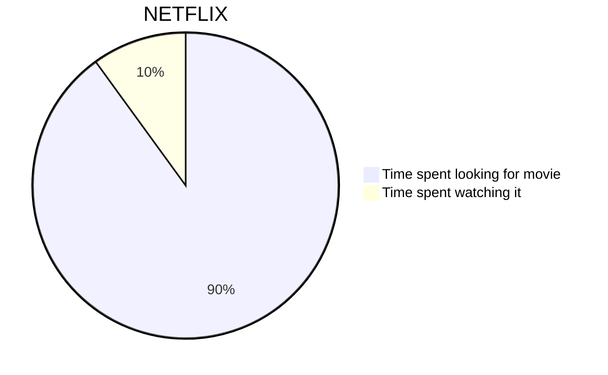
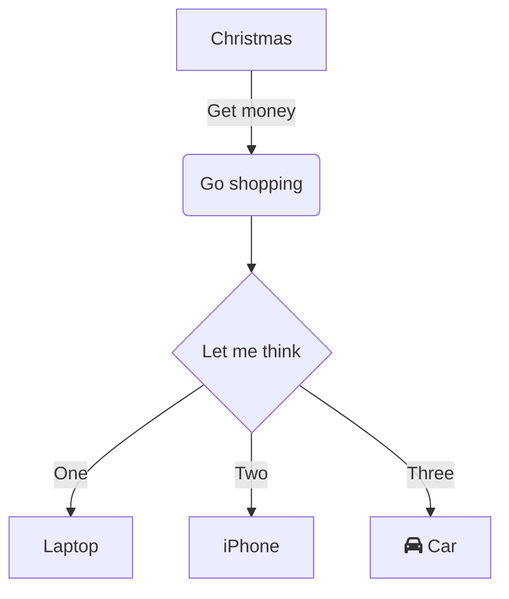

Welcome to this sample post, here we breafly describe how to use some advanced features of out templating configuration.

## Using Diagrams: [Mermaid](https://mermaid-js.github.io/mermaid/#/) <author></author>

You can create diagrams using Mermaid js. Please take look at full [documentation](https://mermaid-js.github.io/mermaid/#/) for more details

But here are some examples

You can use following code to create pichart
````

````


Or this code to create flow diagram
````

````


You can preview your diagrams [here](https://mermaid-js.github.io/mermaid-live-editor/#)

## Using Media <author></author>

You can use media by just importing it in a regular markdown fascion

1. Imgur
  - Use `` or ``
  - where `id` is last part of Imgur URL https://imgur.com/gallery/`WsUV4DK`
  - 
1. YouTube
  - ``
  - 


1. Dailymotion
  - `` or ``
  - 

1. Vimeo
  - ``
  - 

1. Spotify
  - ``
  - 

1. SoundCloud
  - ``

1. General Audio
  - ``
  - 

1. Embeding a countdown
  - 
  - Where `date` is the date in year:month:day:hour:minutes:seconds, UTC


## Using Math: [MathJax](http://mathjax.org/) <author>Dr.MagPie</author>

You can use MathJax to describe mathematical equasions and formulas. You can find full specification in [MathJax Documentation](http://docs.mathjax.org/en/latest/) but here are come samples 

This code sample `$ a * b = c ^ b $` will transform into thes formula

$ a * b = c ^ b $

You can go full in and make some like this
```MathJax
$$
\begin{aligned}
  & \phi(x,y) = \phi \left(\sum_{i=1}^n x_ie_i, \sum_{j=1}^n y_je_j \right)
  = \sum_{i=1}^n \sum_{j=1}^n x_i y_j \phi(e_i, e_j) = \\
  & (x_1, \ldots, x_n) \left( \begin{array}{ccc}
      \phi(e_1, e_1) & \cdots & \phi(e_1, e_n) \\
      \vdots & \ddots & \vdots \\
      \phi(e_n, e_1) & \cdots & \phi(e_n, e_n)
    \end{array} \right)
  \left( \begin{array}{c}
      y_1 \\
      \vdots \\
      y_n
    \end{array} \right)
\end{aligned}
$$
```
Which will look like this

$$
\begin{aligned}
  & \phi(x,y) = \phi \left(\sum_{i=1}^n x_ie_i, \sum_{j=1}^n y_je_j \right)
  = \sum_{i=1}^n \sum_{j=1}^n x_i y_j \phi(e_i, e_j) = \\
  & (x_1, \ldots, x_n) \left( \begin{array}{ccc}
      \phi(e_1, e_1) & \cdots & \phi(e_1, e_n) \\
      \vdots & \ddots & \vdots \\
      \phi(e_n, e_1) & \cdots & \phi(e_n, e_n)
    \end{array} \right)
  \left( \begin{array}{c}
      y_1 \\
      \vdots \\
      y_n
    \end{array} \right)
\end{aligned}
$$

You can preview your formulas [here](https://www.mathjax.org/#demo)


## Compare Images


