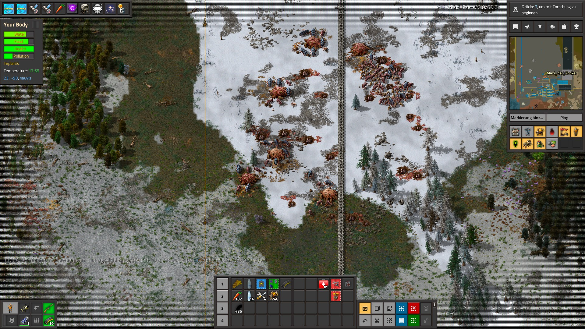
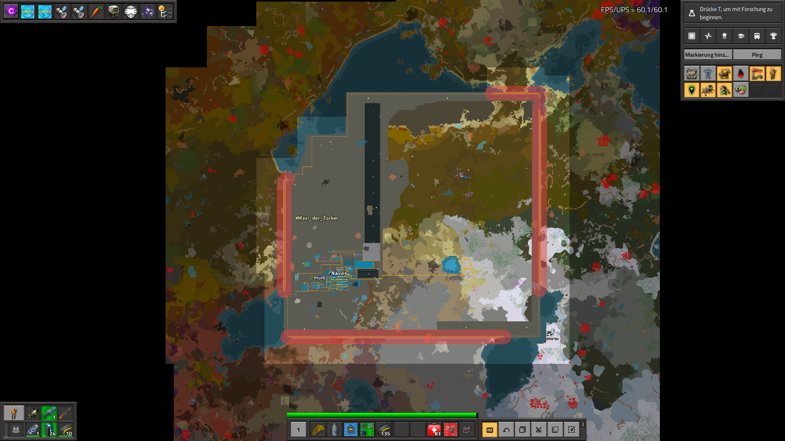
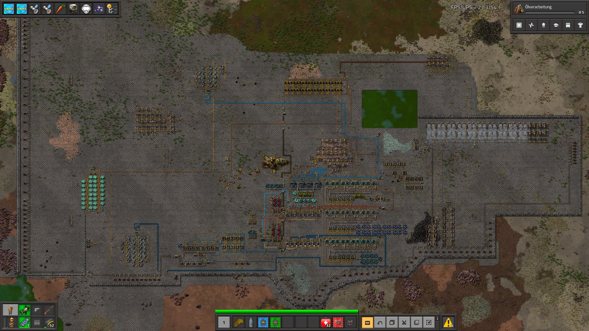
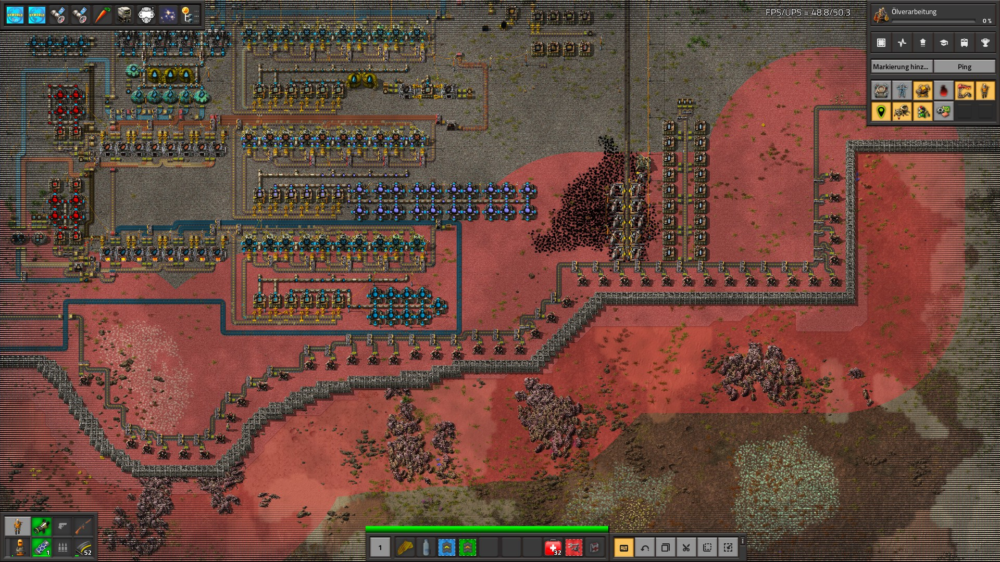
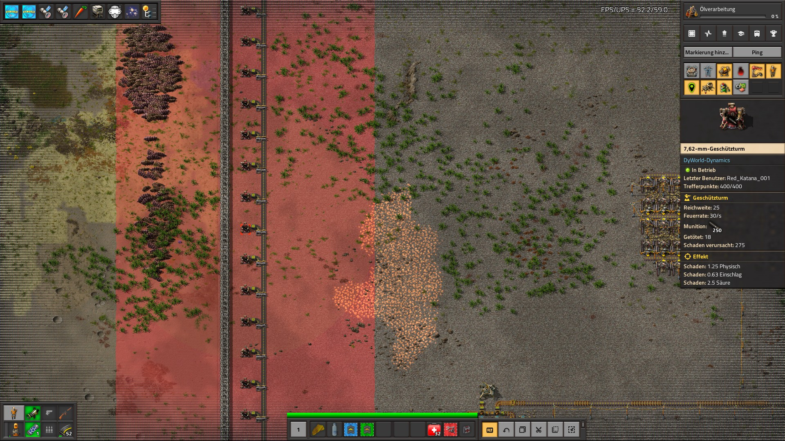
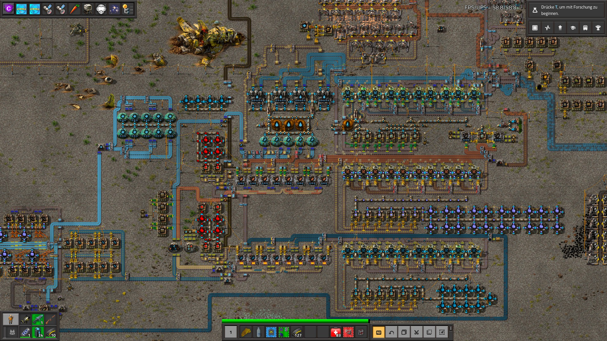
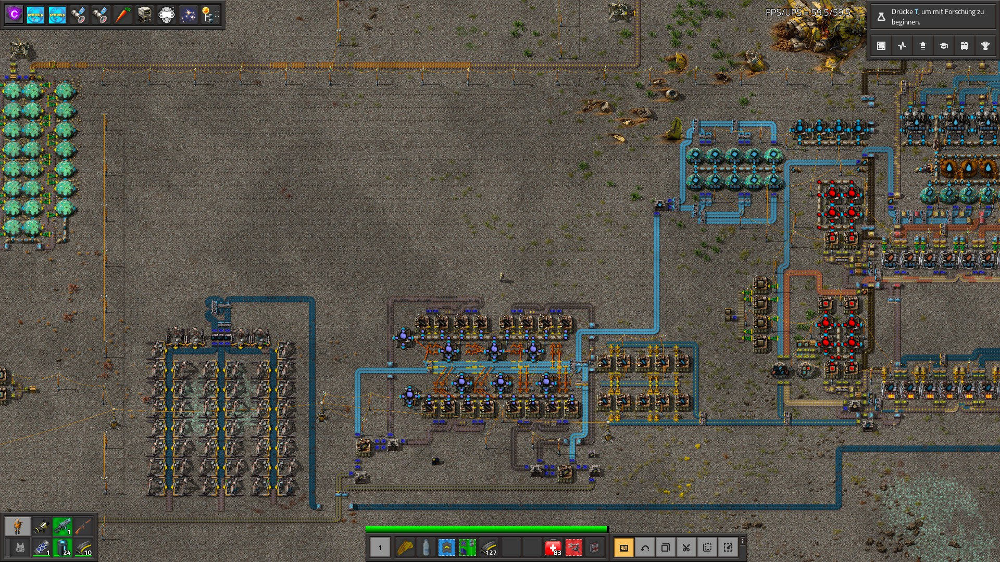
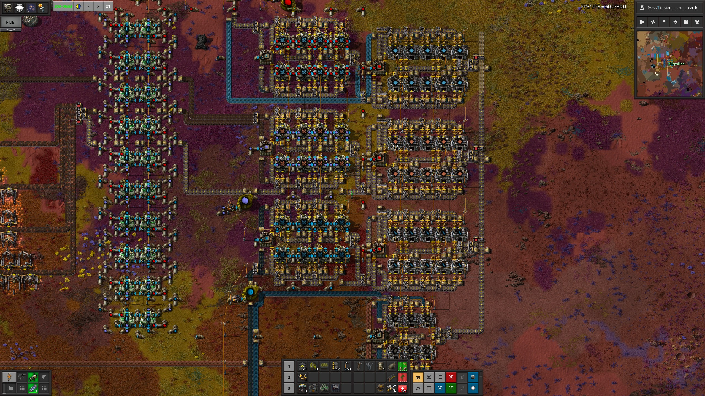
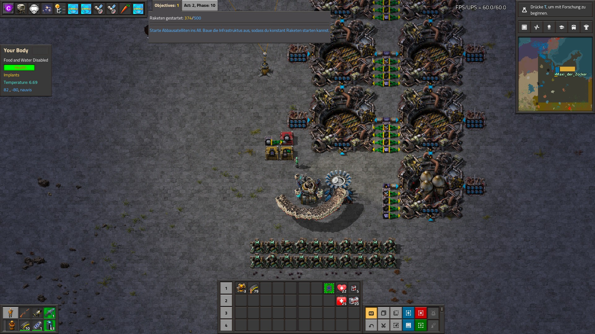
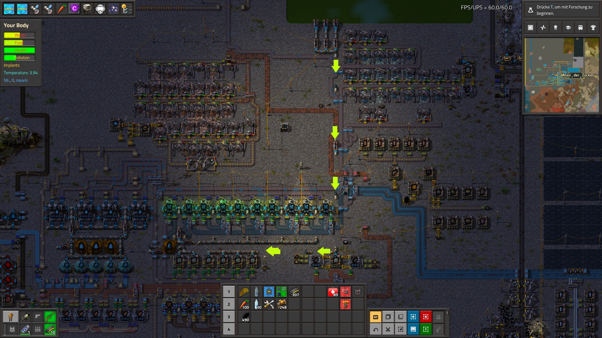

## DyWorld-Dynamics's Beta Testers Phase <author>Dysoch</author>
During the last Alt-F4 article (https://alt-f4.blog/ALTF4-43/) I talked about beta testing, KatherineOfSky's video's and release after. Well, my testers did quite a bit work since then.
More bugs have been fleshed out, a few new things were broken due to Space Exploration (and fixed thereafter), a few new features added and many more.
I created a new mod as well, DyCore which is a new core mod for all the coming DyWorld mods. Eventually everything related to the story will move there, allowing other modders to create story elements as well.

Well, now to address the elephant in the room: "When will it finally be released?" Due to the time it has taken to create this mod, and the state it is currently in, I no longer feel it should be in closed beta. So, I have decided a new route:

<<<<<<<<<< Picture coming soon (coming from RC with the release stream info) >>>>>>>>>>>>>

As you can see here, I have decided to send the last closed developer build to members of Red Circuit team, who will stream it starting from Oktober 16th.
Quite a few streamers and youtubers will attend this, as well as me in voice chat with them explaining a lot of decisions, development, roadmap etc.
<<<<<<<< need a list of comfirmed attendees for the event, then we can add that >>>>>>>>>>>>>

After this event, last few changes will be made with things found as bugs or issue's, and then it will be released on the 19th of October, for real this time!

### Thank You
This mod was made possible by several People, and I trully want to thank them all right here for the world to see.
While I (Dysoch) work on this alone, several people helped. So let us give them a small recognition!

Most of my previous and current mods are balanced by a very special person:
- Peps
His tireless work to make my mod as balanced as it is possible has helped me in many ways, and DyWorld was never a success without him.

The last months before public release I had several Beta Testers to test out the mod, find most the bugs etc.
They deserve to be put into the spotlight as well, since the mod was made as much bug free as possible because of them:
While some never played it, they provided valuable feedback based on information they got from me.
- Peps
- EthereanOne
- RedKatana
- Omega
- AnnaLaura
- Maxi_der_Zocker
- Rockman_64
- Veare the Great

This mod gained a lot attention because of a few certain individuals:
- Peps
- Members from the Alt-F4 team.

Translations and the story being proofread are/were done by:
- English: Conor_
- German: Maxi_der_Zocker
- French: Bev

And again a very special thanks to Peps.
He brought me in contact with members of the Red Circuit, who can play it soon and will stream nearly the entire weekend.
Because of this the Alt-F4 post happened and the RC team wanted to play as well.(Several streamers (and youtubers), including but not limited to, JD-Plays, Infantryman4life, boldviking and several others.)
So Peps, many thanks for you help! You have no idea how awesome this is!

And then ofcourse also thanks to the RC Team for wanting to play it a lot! They have been great supporters and very forthcoming in any help that I needed. 
I am happy my mod has attracted such attention from talented streamers and youtubers

This information will also remain up to date inside my mod's Informatron page (ingame). Want to help? Maybe you will eventually gain hall of fame status!

Now i give word to one of my testers, who has tested it quite a bit, helped in many ways:

## DyWorld-Dynamics Tester Experience <author>Maxi der Zocker</author>
Hey guys, my name is Max, or better known on the internet as Maxi der Zocker, and I am a translator and beta tester for DyWorld Dynamics. 

### Backstory
My experience with DyWorld, or DyWorld Dynamics, as it is now called, started in 2020. I was watching a small German Youtuber, who was playing the DyWorld modpack with one of his friends. I wanted to play the modpack as well, but when I looked at the mods site on the Factorio Mod Portal I soon realised, that it is deprecated and a successor was inevitable. 
I joined the discord, read through the rules, and looked at the announcements channel. 
There it was written: “The first public beta of DyWorld Dynamics will probably follow in a few months’ time.” 
I was happy waiting. Near the end of the year Dysoch asked on his Discord if someone wants to translate the Mod to any language. I offered myself to do the German translation. A few days later I send him my translations. 
A few months later, or half a year later to be more precise, Dysoch made a raffle for new beta testers. I enter it and I fortunately got picked. 
2 days later we got send the newest development build to test the mod. I also directly asked if and how I should resume translating the mod. I got told, that I should start from scratch, because so much had changed. 
I accept the challenge and translate it bit by bit. Sending a new chunk of the translation roughly every time a new development build came out. The last big thing was the Story. 3 Days of hard translating work. 
But now, the mod is nearly completely translated to German and also to French by another awesome member of the DyWorld community. 

### Playtesting
I didn’t only translate the Mod, I also play tested it. In the first week the new Beta Testers, Patreons and Dysoch all came together and did a playtesting session. 
We were 5 guys playing and an additional 3 that were only present in the voice channel. Dysoch was one of them. 
He gave us tips and also did some quick trouble shooting nearly all the time, because we found a lot of small bugs, that didn’t really impact the gameplay much. 
The next day we first waited on a quick hotfix from him and then shortly after we continued our playtesting session. This time we didn’t really encounter bugs. 
When playing, we first build our small starter base, ore the thing you build at the beginning of the game to make stuff quick. Basically, a small spaghetti base, how everyone likes it. At that time of the game where we wanted to redesign our base, a weird event took place. 
So, we began with our major redesign. It came out looking and functioning quite well and we began with the research. 
Researching was very resource heavy at that point in the game, but it worked out and we were glad, that we had redesigned our base. Soon we discovered that some recipes didn’t work and unlock properly, so Dysoch began working on yet another hotfix. 
We still played happily for another 3 hours without encountering another bug. The next day I continued developing the base alone. It was a tedious process as more and more aliens came and attacked my base. I tried to defend as long as I could, but at some point, I had to turn on the peaceful mode, because I couldn’t handle the pressure the aliens applied on me.

As I patched up a hole in my defence line the aliens made on one side of my base, they ploughed through the other side of the base. So, as I said before I switched on peaceful mode and build up my defence lines and also expanded the base at the same time. 
Around that time, I decided, that I play tested the mod for long enough.  

So, I stopped playing and returned to translating. All in all, I love this Mod. It has a great difficulty curve and is very easy to pick up. 

Furthermore, I personally think, that it isn’t as complicated as the Bob and Angles Mods, even though DyWorld Dynamics probably has more buildings than those two mods. Additionally, in other Mod pack’s you don’t really have a linear progression. 
This is different with DyWorld Dynamics because of the story. So yeah. Would definitely recommend trying out this Mod.

## The future: <author>Dysoch</author>
Currently I am working on a massive roadmap. The mod is far from done. A large part of the story from Act 3 is in the mod, with more to come. Act 4 and 5 will come eventually as well, but this requires a lot more stuff to be added to the mod.
On the current roadmap, which I will supply to the public after release of the mod, there are 15 major updates planned, with about 20 more in the back of my mind.
The amount of stuff to play with once this mod finally hits version 1.0 will be insane, and can keep you playing for months in a single playthrough.

But that is the future, and for now let us focus on what is happening now. So I will leave you with plenty of nice screenshots from my beta testers to wet your tongue a bit
### Warfare Related:

### Production Related:

