## DyWorld-Dynamics’s Beta Testers Phase <author>Dysoch</author>

In the last [Alt-F4 article](https://alt-f4.blog/ALTF4-43/), I talked about beta testing and releasing after that. Well, my testers have done quite a bit of work since then. More bugs have been fleshed out; Space Exploration broke a few new things (and fixed them after that), a few new features were added, and much more. I created a new mod, DyCore, a new core mod for all the coming DyWorld mods. Eventually, everything related to the story will move there, allowing other modders to create their own story elements.

Well, now to address the elephant in the room: "When will it finally be released?" Due to the time it took to create this mod and its current state, I no longer feel it should be in closed beta. So, I have decided on a new route:

[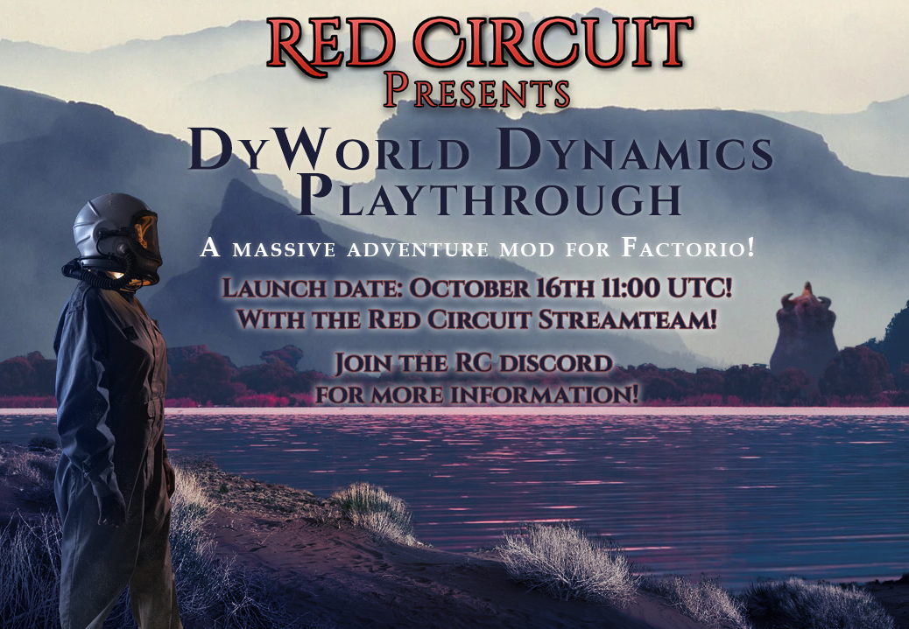](https://discord.red-circuit.org)

As you can see, I have decided to send the last closed developer build to the Red Circuit team members, who will stream it on a multiplayer server starting from the 16th of October. Quite a few streamers and YouTubers will attend this, including myself in voice chat with them, explaining many decisions, development, roadmap, etc.

[Boldviking](https://boldviking.red-circuit.org), [Haphollas](https://haphollas.red-circuit.org), [JD-Plays](https://jdplays.red-circuit.org), [LaureenLlama](https://laureenLlama.red-circuit.org), [Leamnji](https://Leamnji.red-circuit.org), [NIronwolf](https://nironwolf.red-circuit.org), Jaruvica, Peps, and Dysoch will all attend this streaming event! Pose your questions to me, hear me talk with the streamers and see us having a good time!

After the event, I will make the last few changes according to the bugs or issues that are found, and then the mod will be released on the 19th of October, for real this time!

### Thank You!

Several people made this mod possible, and I genuinely want to thank them all right here for the world to see. While I (Dysoch) worked on this alone, several people helped. So let us give them some recognition!

Most of my previous and current mods are balanced by an exceptional person: *Peps*. His tireless work to make my mod as balanced as possible has helped me in many ways, and DyWorld would never be a success without him.

The last months before public release, I had several beta testers to test out the mod, find most of the bugs, etc. They deserve to be put into the spotlight as well since the mod was made as bug-free as possible because of them. While some never played it, they provided valuable feedback based on my ideas:

- Peps
- EthereanOne
- RedKatana
- Omega
- AnnaLaura
- Maxi_der_Zocker
- Rockman_64
- Veare the Great

This mod gained a lot of attention because of a few particular individuals, most notable *Peps* and the Alt-F4 team, so thank you.

Translations and the story being proofread are/were done by:

- English: Conor_
- German: Maxi_der_Zocker
- French: bev

And again, a very special thanks to Peps. He brought me in contact with members of Red Circuit, who can play it soon and stream nearly the entire weekend. Because of this, the Alt-F4 post happened, and the RC team wanted to play as well. So Peps, many thanks for your help! You have no idea how awesome this is!

And then, of course, thanks to the RC Team for wanting to play it a lot! They have been great supporters and very forthcoming in any help that I needed. I am happy my mod has attracted such attention from talented streamers and YouTubers.

This information will also remain up to date inside my mod's Informatron page (in-game). Want to help? Maybe you will eventually gain hall of fame status!

Now I give the word to a few of my testers, who have tested it quite a bit and helped in many ways.

## Starter Game <author>Senital2011</author>

The story's writing is incredible; it gives you a sense of purpose and has ties to realism. You have to monitor your food (you need to collect fish, and they have a real benefit as you do not auto-heal) and water, treat your health via med packs and defend yourself from the locals.

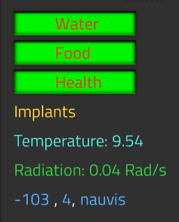

The story does what a story should do: make you feel sympathy for the character. You're the only one on this world, and your ship is in ruins. Even though you tried to approach the locals, it is clear that your presence isn't wanted.You're determined, but also aware of the threats that linger just beyond the veil of darkness. You're aware that only you can get off this rock by building and researching, because the factory must grow!

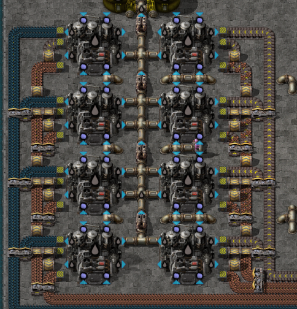

## DyWorld-Dynamics Tester Experience <author>Maxi der Zocker</author>

Hey guys, my name is Max, better known on the internet as *Maxi der Zocker*, and I am a translator and beta tester for DyWorld-Dynamics.

### Backstory

My experience with DyWorld, or DyWorld-Dynamics, as it is now called, started in 2020. I watched a small German Youtuber called [Lumatan](https://www.youtube.com/playlist?list=PLEui1S1GUHOMKnVrLjgybKRKzBNMIHTfk) playing the DyWorld modpack with one of his friends. I wanted to play the modpack, but when I looked at the mods site on the Factorio mod portal, I quickly realized that it is deprecated, and a successor was inevitable. So I joined the Discord, read through the rules, and looked at the announcements channel. There it was written: "The first public beta of DyWorld-Dynamics will probably follow in a few months' time."

I was happily waiting. Near the end of the year, Dysoch asked on his Discord if someone wanted to translate the mod to any language. I offered myself to do the German translation. A few days later, I sent him my translations. A few months later, or half a year later, to be more precise, Dysoch ran a raffle for new beta testers. I entered it, and I fortunately got picked.

Two days later, we were sent the newest development build to test the mod. I also directly asked if and how I should resume translating the mod. I got told that I should start from scratch because so much had changed. I accepted the challenge and translated it bit by bit. Sending a new chunk of the translation roughly every time a new development build came out. The last big thing was the story — three full days of hard translating work. But after that, the mod is nearly completely translated to German and French by another fantastic member of the DyWorld community.

### Playtesting

I didn't only translate the mod; I also play-tested it. In the first week, the new beta testers, Patreons, and Dysoch all came together and did a play-testing session. We were five guys playing and an additional three that were only present in the voice channel. Dysoch was one of them. He gave us tips and did some quick troubleshooting nearly all the time because we found a lot of minor bugs that didn't impact the gameplay much.

The next day we first waited on a quick hotfix from him, and then shortly after, we continued our play-testing session. This time we didn't encounter bugs. While playing, we first built our small starter base or the thing you create at the beginning of the game to make stuff quick. Basically, it was a small spaghetti base, how everyone does it, and likes it. At that time of the game, where we wanted to redesign our base, a big [REDACTED] occurred that [REDACTED] our [REDACTED].

So, we began with our major redesign. It came out looking and functioning quite well, and we started with the research. Researching was significantly resource-intensive at that point in the game, but it worked out, and we were glad that we had redesigned our base. Soon we discovered that some recipes didn't work and unlocked properly, so Dysoch began working on yet another hotfix. We still played happily for another three hours without encountering another bug.

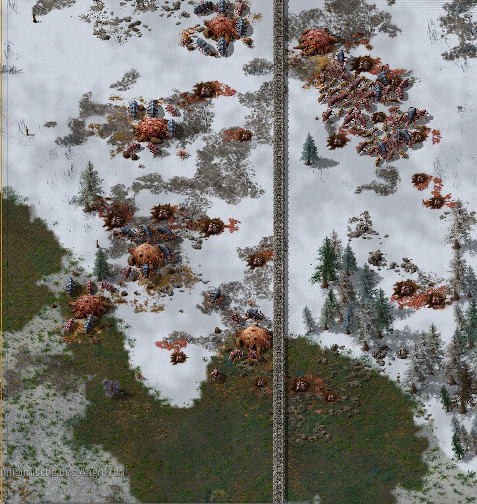

Once, I patched up a hole in my defense line the aliens created on one side of my base, only to have them plow through the other side of the base. So I rebuilt up my defense lines, and also expanded the base at the same time. Around that time, I decided that I play-tested the mod for long enough.

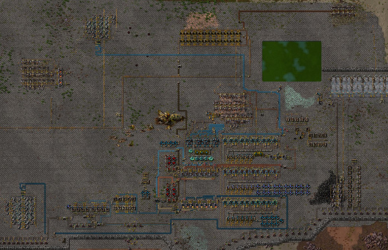

So, I stopped playing and returned to translating. All in all, I love this mod. It has a great difficulty curve and is very easy to pick up.

Furthermore, it isn't as complicated as the Bob's and Angel's mods, even though DyWorld-Dynamics probably has more buildings than those two mods. Additionally, in other mod packs, you don't have a linear progression. That is different with DyWorld-Dynamics because of the story. So yeah, I would definitely recommend trying out this mod.

## The Future <author>Dysoch</author>

Currently, I am working on a massive roadmap. The mod is far from done. A large part of the story from Act 3 is in the mod, with more to come. Act 4 and 5 will eventually come as well, but this requires a lot more content to be added to the mod. On the current roadmap, which I will supply to the public after the mod's release, there are 15 significant updates planned, with about 20 more in the back of my mind. The amount of stuff to play with once this mod finally hits version 1.0 will be insane and can keep you playing for months in a single playthrough.

But that is the future, and for now, let's focus on what is happening now. So I will leave you with plenty of nice screenshots from my beta testers to wet your tongue a bit. For further updates check out the [Dyworld discord server](https://discord.com/invite/yHJaZrq5Ww).

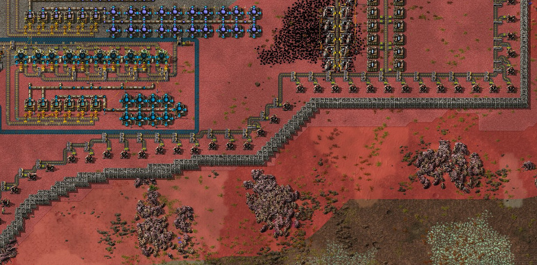
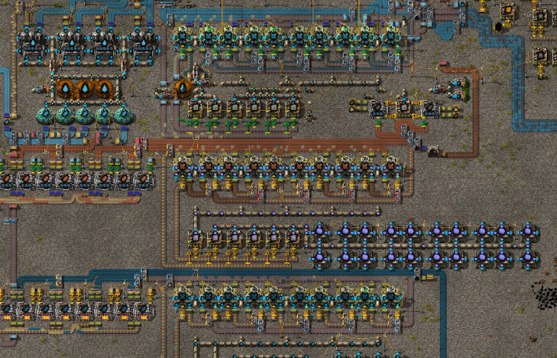
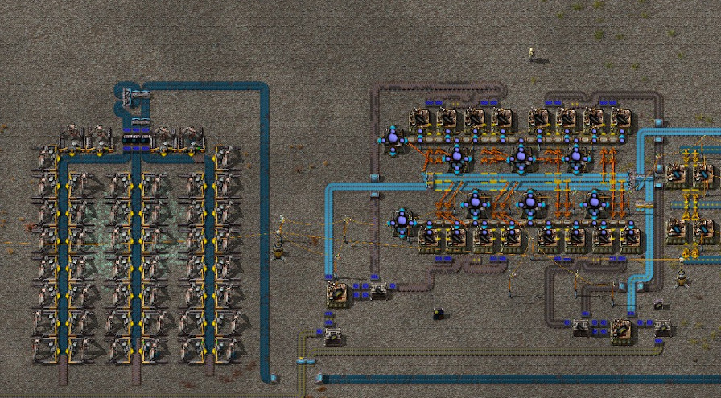
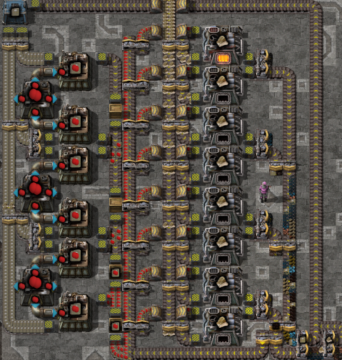
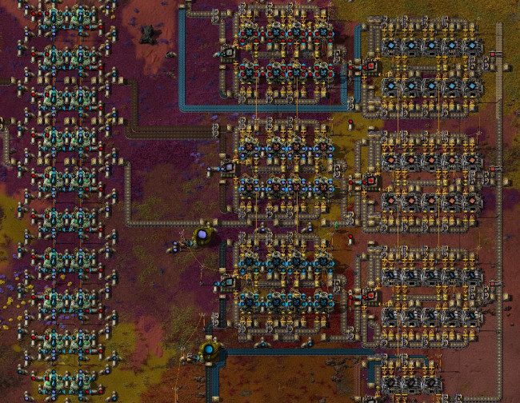
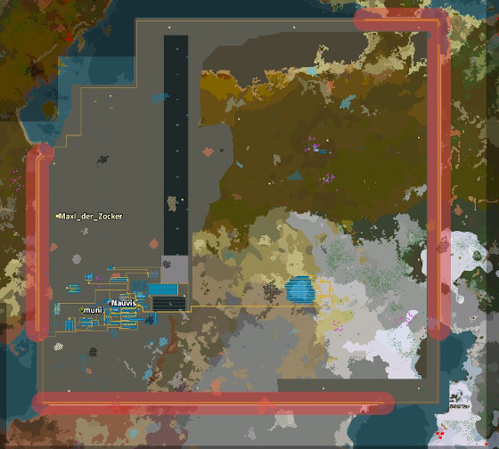
