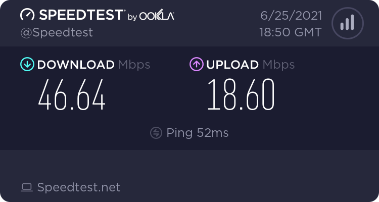
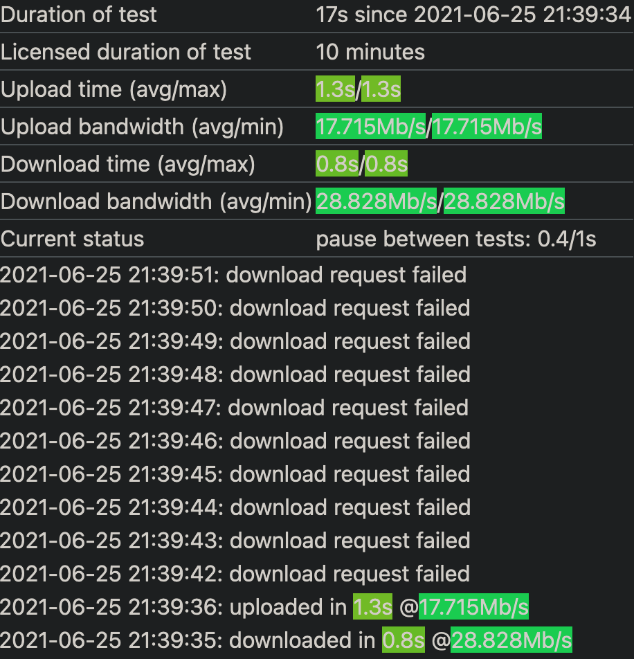

## Quick Performance Check <author>oof2win2</author>

If you don't have a state-of-the-art computer, you probably have seen a message saying that you were dropped from the game because your network or computer was not fast enough. Well, what does that actually mean? What can you do about it in the short and long term?

### Network Speed Issues

Sometimes, your network may not be the best. That can be due to many things itself, such as maintenance from your ISP or a power outage of your DNS's datacenters. There are a few utilities that can however help mitigate these sorts of issues.

To explain what Factorio requires, that is a long*er* process. However, *cube* has explained it largely in [FFF#136](https://factorio.com/blog/post/fff-136). Wube have done non-standard things to let the game work, such as re-implementing large parts of TCP in UDP (TCP and UDP are types of communication of packets. TCP makes sure that everything is confirmed and arrives properly, UDP basically "doesn't care". Common UDP uses are in torrenting, as you can get other parts of files later on. TCP is used for many day-to-day things, such as web browsing) so the player wouldn't need to have two ports opened and NAT punching would work (NAT punching is a thing that is used for your router/modem to send Factorio traffic properly, explained well in [FFF#143](https://factorio.com/blog/post/fff-143))

Firstly, you can try a quick speed test, to check if your network is fast enough, from sites such as [Ookla's Speedtest](https://speedtest.net) or [fast.com (Netflix)](https://fast.com). Both sites will measure similar data, so pick your poison. There are however 3 things that matter (referencing Ookla's Speedtest):
- Download speed
- Upload speed
- Latency


{% include image.html src="SpeedtestResult.png" alt="Speedtest.net result for reference" }

For Factorio, your download and upload speeds don't need to be very high, as the map (savefile) is sent over to you when you connect to a server. The speed of the map downloading depends on your download speed and the server's upload speed; as you can't download something faster than it is being uploaded. Generally, savefiles are within 50MB (if you don't run with seriously modded games), so on an [average connection](https://www.speedtest.net/global-index), a save would be downloaded within 15 seconds. It doesn't however matter how fast a save downloads, since it is just a file transfer in the end. The speed of your download however affects for how many [ticks](https://wiki.factorio.com/Time#Ticks) (in-game unit of time, 60 per second with 100% performance) you will however be catching up (the part of loading the map after you download it). Generally speaking, anything *should* be fine, but mileage may vary. Another thing from Ookla's speedtest is your ping (latency) to their datacenter. That is not always accurate in respect towards a Factorio server, as Factorio servers can be anywhere in the world, whilst Ookla connects you to your *closest* datacenter.

### Reliability

Your connection speed and latency is one thing. However, **network reliability can be far more important**. An analogy for poor network reliability is if someone sends you 100 messages but only 10 of them actually arrive to you (that would be considered 90% [packet loss](https://en.wikipedia.org/wiki/Packet_loss) in networking terms). Network reliability can vary, such as one day, your packets may be travelling properly, whilst another day, a [shark may be eating up your data](https://www.youtube.com/watch?v=VVJlKJi9FWU). Network reliability can be measured on the commandline with the `ping` command or using software such as [StarTrinity's Constant Speed Test](http://startrinity.com/InternetQuality/ContinuousBandwidthTester.aspx), which is much more user-friendly and can display some extra data. For example in the image below, you can see that downloading has failed multiple times and this was due to an unreliable internet connection (turned off internet can simulate that). In reality, your result could be different. In any way, StarTrinity's speed test is also a good way to find the best spot for WiFi speeds and reliability.


{% include image.html src="StarTrinity.png" alt="StarTrinity results for reference" }

A way to fix

### Hardware Bottlenecks

So far, I have focused on the "your network" part of the error message. Another part of said message however is "or computer". This means that it may also be your hardware that is blocking the game from running smoothly. There are various debug settings that you can enable to check for this, such as the `show-fps` debug option showing your FPS and UPS (FPS are frames per second (graphics), UPS are updates per second - how fast the game is updating, which is dictated by your CPU). To enable a debug setting, you'd press F4 -> select what you wish to -> press F4 again to hide the menu. The setting will be kept on from then on until you disable it.

A very important setting to see what is taking up CPU (FPS) time on your save is `show-time-usage`. This will show you a list of things that are being calculated in the game, from entity paths, fluid calculations, electric networks and robot paths. If the game is to run smoothly, you want everything to be below 16.66ms (1/60th of a second). If something is taking up a lot of time, you need to think a bit: if it's robots and you have 50 000 robots flying around somewhere, try disabling that part of your factory and see how the time usage will be after that. Fluid calculations take up notoriously large chunks of time too, which is why nuclear power is far less efficient in large quantities than solar, as solar is only 1 calculation for every panel and accumulator per tick, however with nuclear, all pipe connections, temperatures etc. must be calculated. You may think "Why doesn't the server calculate all of this"? Well, that is mostly because it is much easier to send only new parts in the data as I described in [my Multiplayer post](https://alt-f4.blog/ALTF4-26/) rather than sending all of the data every tick. In Factorio, the client runs **the same simulation as the server**, so your CPU needs to be able to run the same calculations as the CPU of everyone else.

### What to do about all of that?

There are a few causes that I mentioned in the last paragraph, such as switching from nuclear to solar, that you can do yourself. However, some things just can't be done by you and must be done with commands. So, here is a selection of the ones that I thought were the most useful for uncontrollable things, such as pollution.

If you have a lot of pollution in places and you are further into the game where biters are just an expansion nuisance, you can run this command:

```lua
/c for _, surface in pairs(game.surfaces) do
  surface.clear_pollution()
end
game.map_settings.pollution.enabled = false
```

For every surface in the game, it will remove all pollution and after that, it will disable pollution creation, which can improve performance quite a lot in some cases.

If you however believe that pollution is not the right thing for you and instead you have large amounts of biters that are just idle, you can run this command instead:

```lua
/c game.forces["enemy"].kill_all_units()
```

It will kill all biters on the `"enemy"` force (which without any modifications will be biters). It will however **only remove mobile units, such as biters and spitters, not spawners or turrets**. If you would like to remove those too, you can use this command instead:

```lua
/c local surface=game.player.surface
for key, entity in pairs(surface.find_entities_filtered({force="enemy"})) do
	entity.destroy()
end
```

If you *still* feel that biters are just annoying and your base always just deals with them without any input, you can use this command instead:

```lua
/c local surface = game.player.surface
local mgs = surface.map_gen_settings
mgs.autoplace_controls["enemy-base"].size = "none"
surface.map_gen_settings = mgs
```

It will disable biters from generating **only on your surface**, which by default is *Nauvis*, however it won't affect current biters (you will need to use previous commands for that).

If none of these work, the easiest resort to go to is reducing the game speed. Everything will run slower, but you will be able to play with your friends without them getting kicked off:

```lua
/c game.speed = 0
```

All of these have been sourced from the [Commands wiki page](https://wiki.factorio.com/Console) if you want to see more Lua magic. To run any command, simply copy it, open your chatbar and paste it in.

