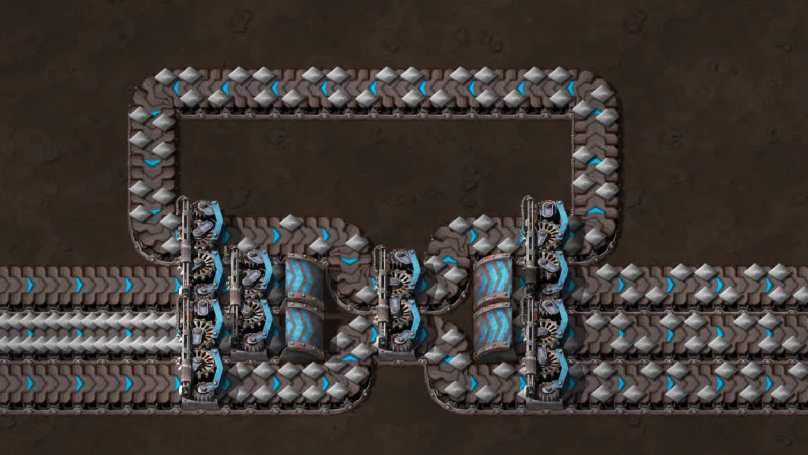
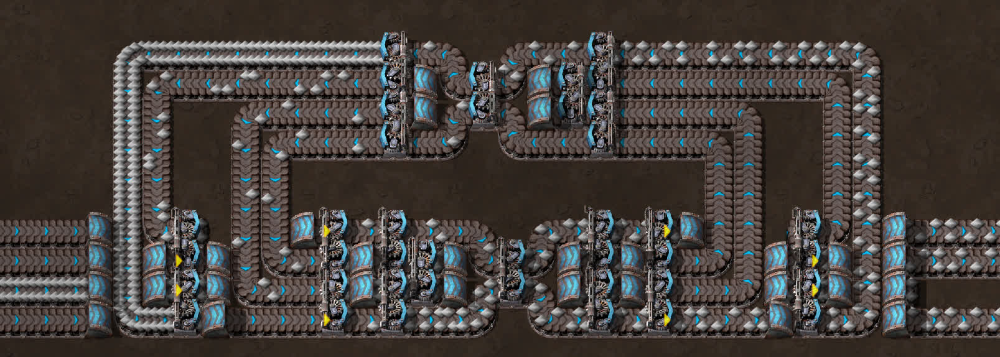
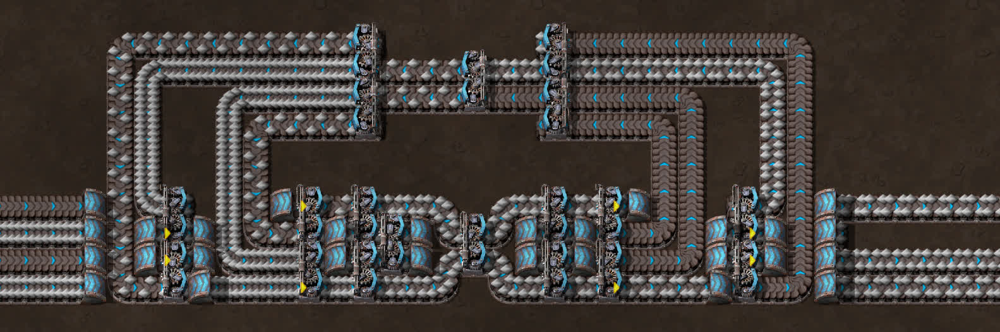
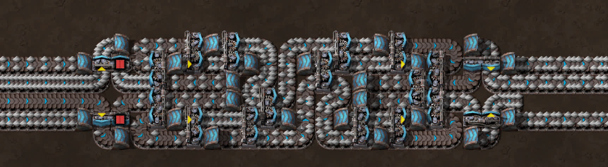
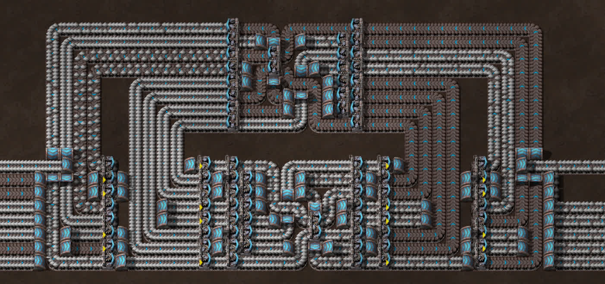
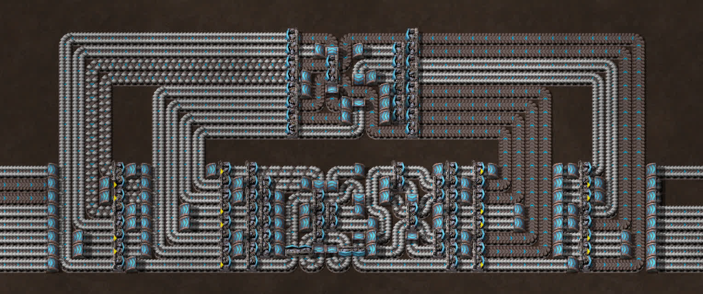
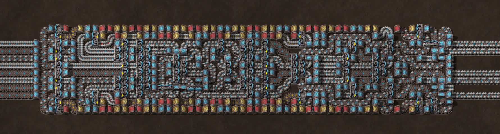
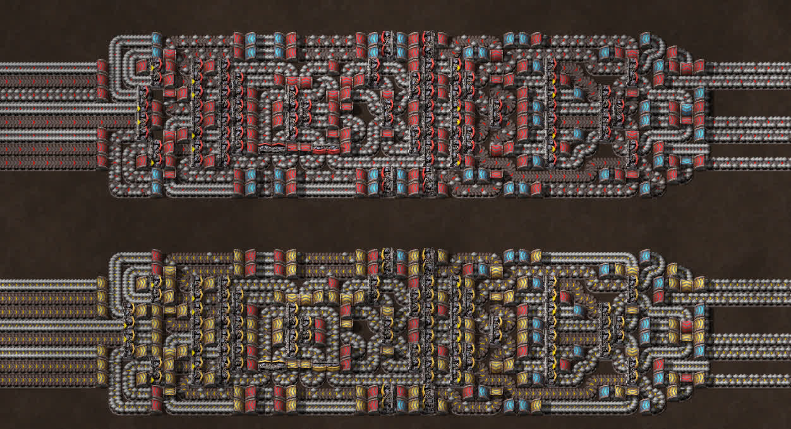

## Universal 8-8: Perfectly balanced, as all things should be

Some time ago I made a bunch of computer parts with belts and splitters. This time I will continue my unhealthy obsession with moving items around by making something that's actually at least slightly practical, that being a balancer. Now, why would I write a whole article on designing a balancer? Well that is because the one we will be making today is no average balancer. This article won't go very deep into balancer design principles, since we will be using pre-made and well-known blueprints for the most part. What you *do* need to know is some terminology:

* Input-balanced: Draws from all inputs evenly. Especially important when merging many inputs to a few outputs.
* Output-balanced: Gives to all outputs evenly. Especially important when splitting a few inputs to many outputs.
* Throughput-limited: Has internal bottlenecks. An example of a throughput-limited system would be merging two belts into one, and then splitting it back into two. Such a system has a maximum throughput of one belt, even though two belts are available both on input and output.
* Throughput-unlimited: Opposite of throughput-limited.

All blueprints from this article (and a couple extras) can be found at [this link](https://controlc.com/70909aae).

### The premise

Picture the following: you're a new player, and you've just heard about those things called "balancers" and how useful they are. You see an image of a 4-4 balancer, build it, but then only hook up 3 outputs to get 3 balanced belts. Instead you're met with a 2:1:1 ratio and disappointment:

In this article, I set myself a goal to make a balancer for which this sort of intuition works, in other words, no matter the input/output configuration, all outputs are always equal, and all inputs are drawn from evenly. This kind of balancer is known as a "universal balancer", a concept first explored and named in [this post](https://www.reddit.com/r/factorio/comments/a5ferf/i_present_to_you_the_44_universal_balancer/) by Reddit user [u/tzwaan](https://www.reddit.com/user/tzwaan), who is one of the moderators of the [Factorio subreddit](https://www.reddit.com/r/factorio).

Universal balancers can do what no balancer should be able to: no matter the configuration, they're input-balanced, output-balanced, *and* throughput-unlimited at the same time! This is a set of properties previously thought to be possessed only by a 2-2 balancer, which is just a single splitter. The drawback is that they get *big*.

### Design principles

Let's think about how to convert a 4-4 balancer into a 3-3. That is done by looping the extra output back into the first splitter. We will use this idea as our base principle:

Now, how would we make it so the balancer automatically does this when we block some outputs? Simple, we use priority splitters to auto-loop the items that can't get out. Of course, we need to merge them back with the input too; we use input priority splitters for this, so the main inputs don't slow down when there are items coming. Here is how that might look like:

After some testing, we discover a major issue. If the looping items try to enter a belt that's already full, they just back up all the way to the split-off point and block the overflow, putting us back to square one:

To remedy this, we need to make sure every item on the loop can get to every single one of the loop's exits. This can be done in many ways, but for our needs we're looking for the smallest number of splitters. It just so happens that the most splitter-economical way to do this is with another balancer. Let's add it to the loop:

We now have a fully functional universal 4-4. However, it can be improved. Because of certain balancer mechanics, we don't actually need 4 belts looping back. In general, we need 3 belts less than our balancer is made for. This means we can optimize our 4-4 by compressing the looping belts into 2, and then splitting them again:

Now we can shuffle the components around until we get something small, such as this:

This balancer, while pretty long, is only 6 wide, which means you can fit it in a standard 4 belt bus, and have just enough space to tile them next to each other. It's important to note that this is not my design, although it's based on one of mine. Sadly, I've lost the name of the designer, so I can't give proper credit.

### Advanced design

Now, let's try something bigger: a universal 8-8. We begin by doing the same steps as with our 4-4, except we use 8-8 balancers instead. This is what we get:

Unfortunately, this is an imperfect balancer. Here is one condition which makes it bottleneck:

As you can see, 6 belts of input and output are available, but less than 6 are coming through. This is a problem. The standard 8-8 balancer is throughput-limited, meaning the entire thing is as well. Luckily, this is easily fixed by simply replacing the core balancer with a throughput-unlimited one:

Notice how the secondary balancer can stay throughput-limited, because its only job is to allow items access to all belts. Now, we could try to use our loopback compressing trick, but we'd need a throughput unlimited 8-5 merger and a 5-8 splitter. While possible, this will make us use a lot more splitters, making everything more complex. Now let's shuffle the components around, and also use some belt weaving to compress 8 belts into 4 tiles:

The whole thing is unrecognizable, but that's because the secondary balancer is now inline with the main one, meaning we have to deal with up to 12 belts shoved into a 8 tile wide space, which forces the secondary balancer to be extremely spread out. When we downgrade from blue belts to red belts, we can also ditch the belt weaving entirely, and just use a couple blue undergrounds to get 8 red belts into a space of 4. This also makes it easy to downgrade to yellows, granted that we still have to use some red and blue undergrounds:

It's definitely possible to make a yellow belt design without any blue undergrounds, but that would make the whole thing much longer. It is also possible to make both the red and yellow designs without any higher-level undergrounds at all, but that would make the whole thing 33% wider and who knows how much longer.

### Final explanations

I intentionally left some mysteries in this article, as some were too awkward to explain in the process, and some I don't understand that well myself. This is the part where I (try to) clear them up, so fair warning that some technical stuff is coming.

* Why is a balancer the most splitter-efficient redistributor?

Let's prove this using induction. First, imagine that we already have the most efficient possible distributor across 2N-1 belts, we'll call it the "small distributor". Now, let's add a row of splitters to split each of its outputs into 2. We now have a 2N-1-2N distributor. To have the right number of inputs, let's clone the small distributor, and feed its outputs to the remaining inputs of the added row of splitters. We now have a 2N-2N distributor with the smallest possible amount of splitters. Now we just say that a 2-2 distributor is a single splitter, which is obviously the most efficient. This efficient redistributor generation algorithm is identical to the simplest possible balancer generation algorithm, and you can feel free to test that yourself.

* How do you guarantee input balancing?

For any N-N balancer, if no outputs are congested, then all of them have the same throughput regardless of inputs. Similarly, if no inputs are starved, all of them have the same throughput regardless of outputs. So long as the loopback has enough capacity to feed all the missing inputs, there will be input balancing.

* Why 3 less belts in the loopback?

To be honest, I don't fully understand this myself. It's an experimentally obtained result, and it has something to do with 3 being the smallest number that doesn't divide 2N, which makes 3 open outputs the worst case the loopback has to deal with. I can't explain why 1 and 2 don't need full loopback throughput, though. If anyone wants to volunteer and help me out with the math here, I'd be more than grateful.
