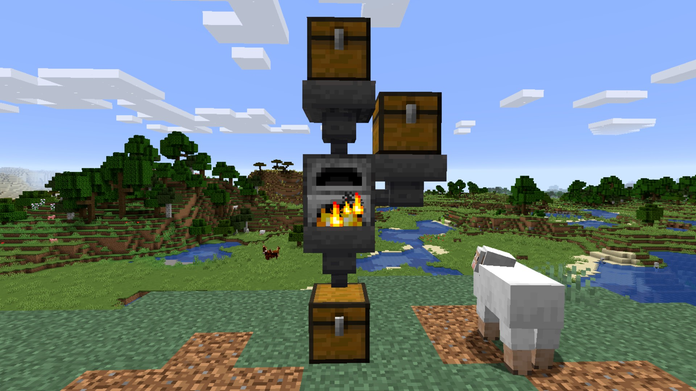
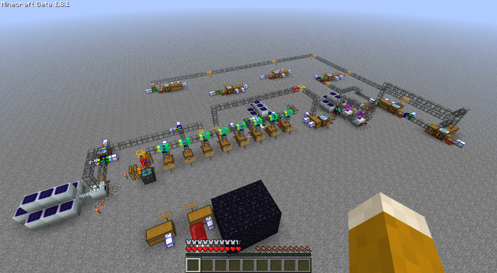

## Best of its genre – Nanogamer7

We've all heard of Factorios insanely [good ratings](https://steamdb.info/stats/gameratings/) – consistently rising to second place behind Portal 2 again and again. Obviously many others will try to imitate this success in the automation genre, but where did Factorio get inspired from? Was it the first game solely designed for automation or merely the first one to do it successfully? That's what I'll be trying to answer in this first article of hopefully a multi‐part series.

### Automation defined

The first difficult question we'll have to answer though, would be what automation even is. In Cities:Skylines for example you are building your city, which then (theoretically) functions autonomously. The difference here is, your job isn't to automate – the cars spawn out of nothing, choose their destination, and get there by themselves, once you build roads – but to manage it. In Minecraft on the other hand, you are the one to make the automation even possible – just with pistons and hoppers, instead of inserters and belts. Comparing these two examples, I think you can loosely define the automation genre as *"making stuff that makes stuff"*.

*The hopper, Minecrafts "belt". Here supplying a furnace with coal (side) and items (top), while pulling smelted resources from below.*

However that definition is still a bit vague: As someone who didn't play it, would Dwarf Fortress' gameplay of enabling dwarfs to *make stuff* would fall under my definition of automation? For the purposes of this article we'll assume it is, no matter if we are talking about electronic circuits, wheat and seeds, or wooden menacing spikes, maybe someone else will explore Dwarf Fortress further in the future. *\*wink wink\**

### There's a mod for it

I've already touch on Minecraft as an example for automation, but its vanilla capabilities don't even begin to compare to the possibilities of modded Minecraft. Its popularity boom in 2013 brought many technical players together to form one of the largest modding communities ever, which could just have made it the most popular example of automation. But that got me thinking: With mods in the likes of Buildcraft, IndustrialCraft, and Redpower featuring a very heavy focus on industrial machinery and automation, and release dates well before Factorio's development even started, could that have been an inspiration for Factorio?

So I went on a search (which definitely wasn't easy, seeing how active some of Wube's devs are across Reddit, Discord and the forum), and after sifting through a few interviews and clicking on google page 2, I finally found something: An [old forum thread](https://forums.factorio.com/viewtopic.php?f=5&t=3026) from March 2014, confirming [Buildcraft](https://sourceforge.net/projects/buildcraft/) (or [IndustrialCraft](https://www.industrial-craft.net/), according to [another interview](https://youtu.be/zdttvM3dwPk?t=77)) (Note: newer version for BC and IC can be found on [curseforge](https://www.curseforge.com/minecraft/mc-mods)) as the main inspiration to Factorio. According to *kovarex*, he saw the potential in that concept while playing the mod, and wanted more of it (in his own spin, of course).

*A simple factory from the early days of IndustrialCraft2 (Minecraft version 1.8.1 was released in 2011/09), with some similarities to modern day assembly lines in Factorio.*

While I had hoped to find an answer, I for sure wasn't expecting to find such a direct one. Having that out of the way, though, we can definitely speculate a bit more on brought Factorio to were it's at today.

### Great games design themselves

There is a principle in game design designers should follow, that goes along the lines "follow the fun", meaning you shouldn't try to force a game to be something it isn't, but rather develop on the ideas that are enjoyable (if you are interested in that concept, I'd commend [this](https://youtu.be/kMDe7_YwVKI) video by GMTK). While examples for that statement often include dramatic changes like Ape Out went through, it still applies to games that don't shift that drastically in direction. Let's take Factorio itself as an example:  Originally the game had multiple pickaxes – a wooden, which you could then craft into a better one out of stone, and then into the iron pickaxe we had for such a long time. This was clearly inspired by Minecraft (and also [confirmed](https://www.factorio.com/blog/post/fff-266) by the devs), but having so many items about manual mining in a game about automation gives the idea about the game – it draws the fun away. So they simplified it, gave you just your iron and steel pickaxe, but that's still two items specifically about manual mining. Thus they removed pickaxes completely from the game in `0.17.0`, and with it all focus on the unfun, manual labor. This is a double-edged sword however, you might know the famous quote *"Given the opportunity, players will optimize the fun out of a game."* from [GD Column 17](https://www.designer-notes.com/?p=369), often mentioned in regards to [blueprints](https://www.reddit.com/r/factorio/comments/in5d3i/developer_technicaloriented_ama/g45ay4e/), Wube takes great care of this problem though, as seen 

You might ask, why did I dive into a concept of game design now? Well I believe it is an important step on understanding how Factorio came to be. I believe, once they core gameplay concept of a game is clear – which is what Factorio started out with – it's just a manner of fitting features to it. Automation? That sounds like the industrial revolution, when they invented belts. Need something to get that thing of the belts? How about inserters, they are at least not human. You get the point. A game doesn't need inspiration from other games to develop its ideas.

### Conclusion

While I originally tried to find Factorio's "predecessor", it stemming itself with only  the core gameplay loop as an external influence makes this conclusion even more rewarding. That being said, there have probably been more automation games in the past, and Factorio definitely had a big influence on some more recent games. Maybe we can explore this further in a future article, maybe even how Factorio inspired more than just games. You'll see ;)
