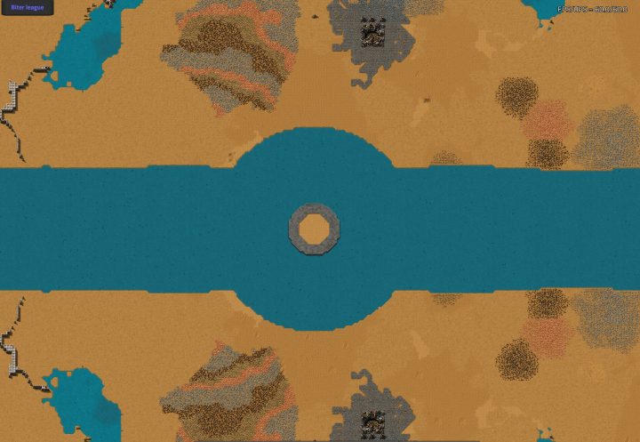
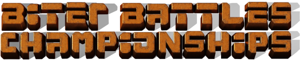
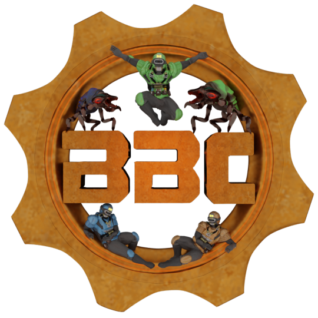

## Biter Battle Championship <author>everLord</author>

### What are Biter Battles?

Biter Battles is a scenario created by MewMew from [Comfy's Factorio](https://getcomfy.eu/discord) where two teams compete while being attacked by biters who's goal is to destroy their silo. This means there is no direct Player vs Player combat, because players are separated by a river in our custom made battle arena.

Each team has to defend their silo from groups of biters attacking every other minute. You can also strengthen your opponent's biters with by researching Logistic Science to increase their tier (small, medium, big, behemoth) and how big the biter swarms are. Researching Utility Science will yield stronger mutagenic results. This scenario is open 24/7 for anyone to join! All you need to do is search for the public game "Free BiterBattles.org". It is usually the most populated public game, using having between 20 and 50 players online.

### Then what are The Biter Battles Championships?

{
    Youtube embed
    https://youtu.be/LoXpHYFT6kI
}

After 4 successful tournaments we decided to create a persistent struggle on the Biter Battles scenario: A championship split into two leagues. The Behemoth league which will be for the pros, and the Biter league for everyone else. Matches are then 3 vs 3, with an optional 4th player acting as spy, coach, or substitute. 

It's played as a Double Round Robin: all teams in one division will fight twice against each other team of that division, once “at home”, once “away | visitor”. There are important twists to these games. The first is four novely starter packs which speeds up the early game which leads to more dynamic matches and many possible strategies. The other important aspect is **Armageddon**. After two hours the evolution of biters speed up so that match usually ends before 3 hours - to avoiding endless games. So expect Behemoths sooner than later!

 // Constrain me so that I'm not so big

Seven teams will compete in the behemoth league. It will start tonight (Friday, 29 October) with the main event being the clash between: SteelAxe versus GreenScience! You can expect some spectacular game play. It is definitly a very different show than regular Factorio! Matches will be streamed by popular streamers and we will announce all matches and streams on [Twitter](https://twitter.com/BiterBattles). 

The Biter league on the other hand will start in two weeks. Everyone are very welcome to join and show their skills! Registration is still open until Monday 8 November. Each team will be required to play once per week-end and player substitutions are allowed. There are more information about rules, players, training, and a possible prize at our website: [https://bbchampions.org/](https://bbchampions.org/). Or you're welcome to contact me at bbc.factorio@gmail.com, on Discord at everLord#4340 or at the [French Factorio Discord](https://discord.gg/XKAjTTmu).
