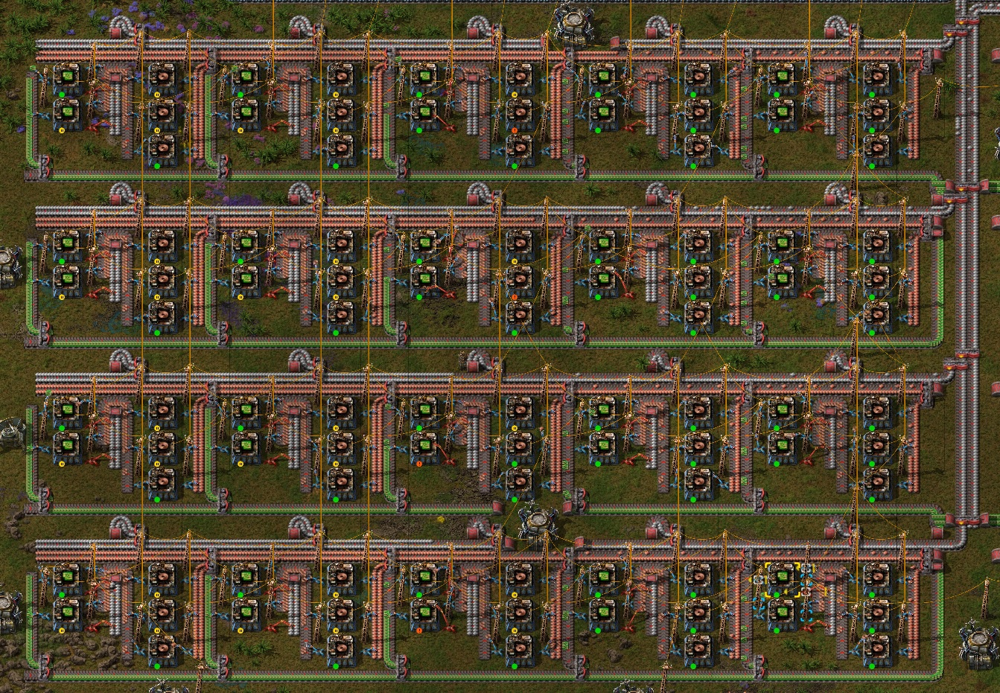
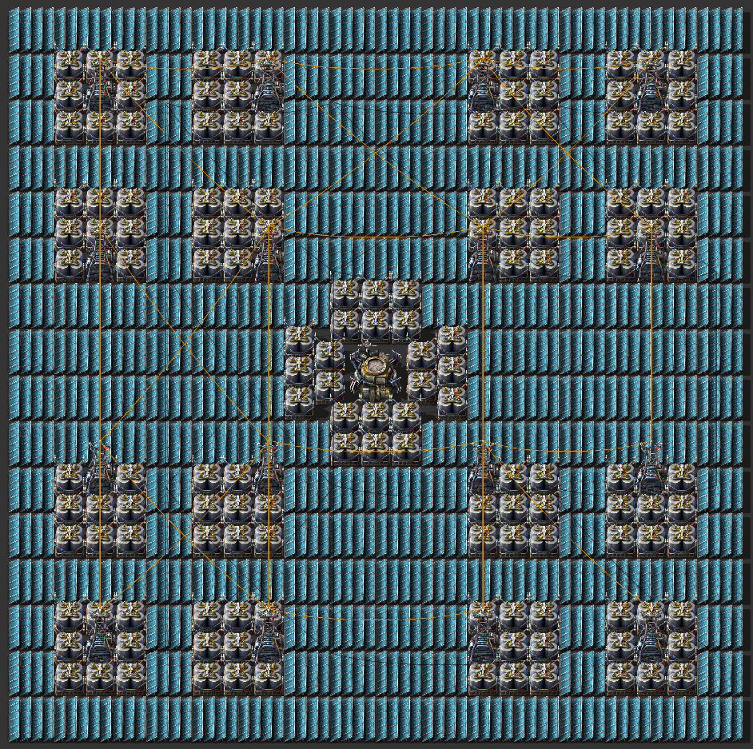
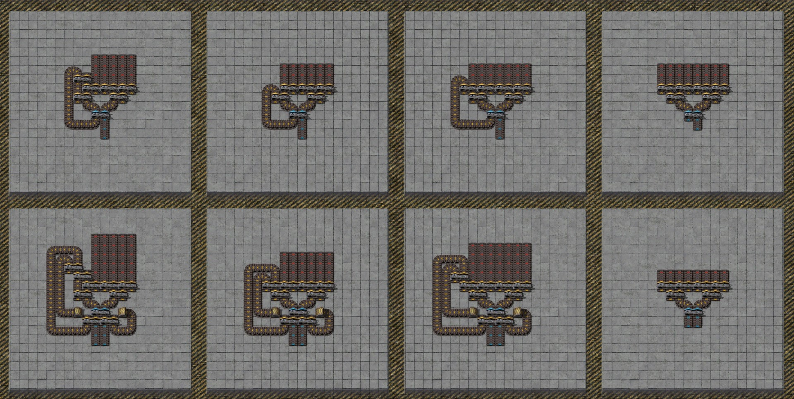
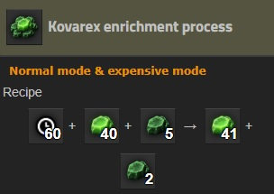
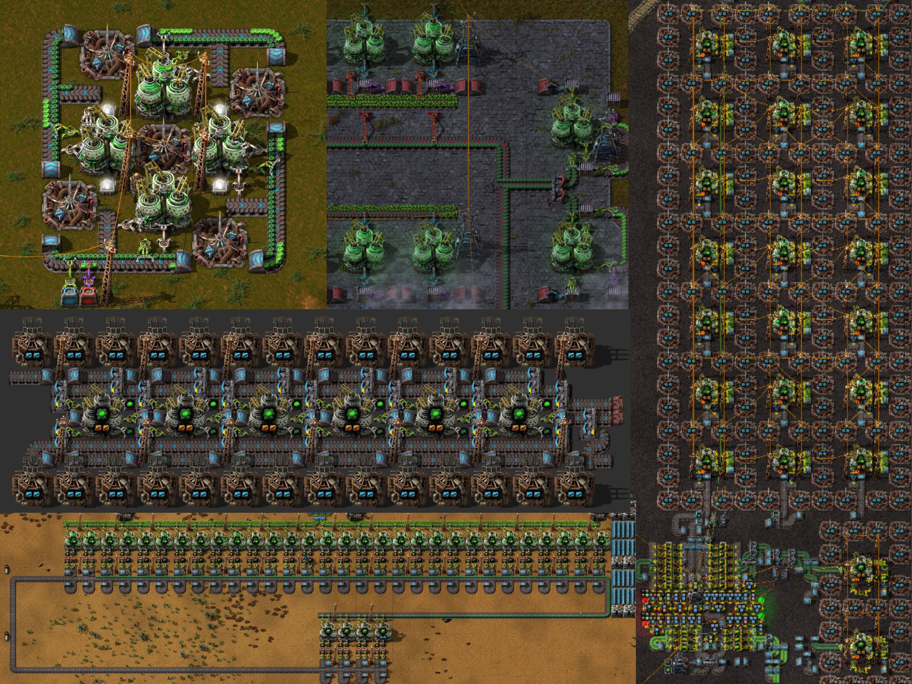

## Blueprints suck <author>Conor_</author>

***Mostly***, blueprints suck. First added in version `0.9.0`, blueprints allow us to create ghost copies of all sorts of machinery setups and place them anywhere in the rest of our sprawling factories. This 'copy and paste' functionality I have no issues with and I particularly enjoyed the direct copy and paste buttons and shortcuts added with the [quickbar overhaul](https://www.factorio.com/blog/post/fff-278) in `0.17.10`. What I cannot endorse, is the blueprint library and import string features. I think *Rseding91* said it best in his recent*ish* [AMA on Reddit](https://www.reddit.com/r/factorio/comments/in5d3i/developer_technicaloriented_ama/g45ay4e?utm_source=share&utm_medium=web2x&context=3) when he was asked what one thing he would change about Factorio with no consequences.  

> I would never have added the blueprint library :) Not a popular opinion but I've had it ruin a few multiplayer games I was enjoying; someone comes through with a 'base in a blueprint' and all the creativity and fun is now over; it's just 'build that'.
- Rseding91

### The goal of Factorio

The goal of Factorio is, *spoiler alert*, to build a factory, but it's so much more than that. It's about iteratively optimizing and improving your production setups, whether it be to produce more of the final product, make the bare minimum required in the tiniest space possible or keep that UPS up at 60 while allow you to keep building onwards. Each and every time you build, a green circuit maker for example, you get to use your experience to make it better than the last. Maybe this time you'll use productivity modules? Maybe you want to try centralized green circuit production this time round, but only have basic tiers of machines. This is the challenge of Factorio, designing within the constraints of the situation and making the best of it.

*A simple but large footprint green circuit maker I recently designed to allow the production of 2 belts of green circuits, using only low tier assemblers. Notice the unique and slightly odd design, because why not?.*

By just importing a blueprint every time you need to make something new, you aren't problem-solving and designing, you are a construction bot blinding placing racks of machines, and plumbing up the inputs and outputs. That to me really doesn't sound very fun. It sounds like you're playing the fun*ish* in-game scenario, transport belt madness rather than pursuing your own destiny in freeplay.

### Unless, blueprint importing is good?

I will concede, in some **RARE** situations, importing blueprints can be handy to avoid several minutes of monotony. The perfect example of this is solar setups, generally tiling masses containing solar panels and accumulators, in the hope of one day cleanly powering your factory. Spending 5-10 minutes faffing around, trying to perfectly fill the space around a roboport may sound like fun to some people, but this is a problem that doesn't particularly change depending on the game scenario. Whether you have just researched solar panels or are several hundred hours into maximising the SPM of a save, your solar panel setups are gonna look basically the same, with probably the main difference being the size of the blueprint placed at a single time.

*Source: [Factorio Prints](https://factorioprints.com/view/-KYeNAYQVgk2DcbuORde).*

Balancers, *the mystical creations*, are another example of something that most players want to use, with fair reason, but don't want to learn and understand the maths and mechanics behind them. Figuring out the exact combination of belts, splitters and undergrounds to make the ratios perfect make sounds like a fantastic Sunday afternoon for some people, but many would find it dull and unexciting. In both these scenarios, allowing the importing of blueprints will *likely* improve the player's enjoyment of the game as they won't get stuck making monotonous blueprints or diving into the maths of balancers.

*An assortment of balancers. Source: [u/MrMusAddict's Reddit Post](https://www.reddit.com/r/factorio/comments/bf600q/my_take_on_balancers_designed_to_help_understand/).*

Once you have built a thing once in a world, its pretty common to need to build it again later, be it miner setups, train stops, train tracks, solar setups, bus layouts et cetera. This is especially compounded in multiplayer games, where each player using their own rail standards can cause chaos and destruction. In these situations, being able to copy, paste and share blueprints using the blueprint library, allows a much smoother and less chaotic experience. I believe the key difference here is, you are recreating something you have already built in the given save, not importing something from somewhere else. As mentioned by *Rseding91* earlier, the ability to use blueprints can also so quickly ruin a multiplayer save, so the trade-off here is important to think about.

Even inside a multiplayer game, you can fall into the trap of using other people's designs blindly, without thinking about possible better ways of doing things. Maybe the green circuit maker in your current world is outdated since new modules have been unlocked? Maybe that furnace bank blueprint you've been using for the whole save could be a better size? These are the types of questions Factorio allows us to ask, to iteratively improve each thing we build and dominate on this dang planet we're stuck on.

### Creativity in Factorio - Kovarex enrichment

As a final note before my conclusion, I'd like to highlight just how much space for creativity there is in this game and the missed opportunities arising from blindly importing blueprints, using the [Kovarex enrichment process](https://wiki.factorio.com/Kovarex_enrichment_process). This late-game uranium processing method allows you to increase the quantity of useful Uranium-235 using a cyclical process. I believe that it is probably one of the more blueprinted processes in the game due to the initial complexity it appears to have.

Recently on the [r/factorio](https://www.reddit.com/r/factorio/) subreddit, there was a flood of different Kovarex enrichment setup photos, each one trying to one-up the last in creativity, efficiency and all-out weirdness. I share these to highlight the opportunity for creativity when you take the time to design something new and interesting, even if it isn't the most efficient or most compact.

*Sources: [Top left](https://www.reddit.com/r/factorio/comments/it53gn/so_i_built_a_kovarex_enrichment_process_setup/), [top middle](https://www.reddit.com/r/factorio/comments/ju509t/my_noobish_try_at_kovarex_enrichment/), [right](https://www.reddit.com/r/factorio/comments/jkmkyc/my_overkill_beaconed_buffered_uranium_processing/), [middle left](https://www.reddit.com/r/factorio/comments/hrumlj/beaconed_kovarex_processing_with_no_circuits/), [bottom left](https://www.reddit.com/r/factorio/comments/hgb8zn/the_1_million_monkeys_method_of_kovarex_enrichment/)*

*By far the most fun Kovarex enrichment setup. Source: [u/PM_ME_DELICIOUS_FOOD's Reddit Post](https://www.reddit.com/r/factorio/comments/jj4nsl/my_take_on_kovarex_circle_nuketrain_violently/)*

### Maximise your own enjoyment

The beauty of Factorio is of course how free you are to do whatever your heart desires. The ability to use these simple building blocks to build sprawling factories and compact megabases is truly fantastic. The blueprint import feature will never be removed, so instead I implore you to design your own stuff, avoiding looking at other people's designs as much as possible and ***be creative***. I'm sure that if you take the time to design something, it will be much more rewarding than searching for blueprints for 20 minutes, trying to find exactly what you want. Next time you go searching for blueprints, ask yourself, why aren't I designing this?
