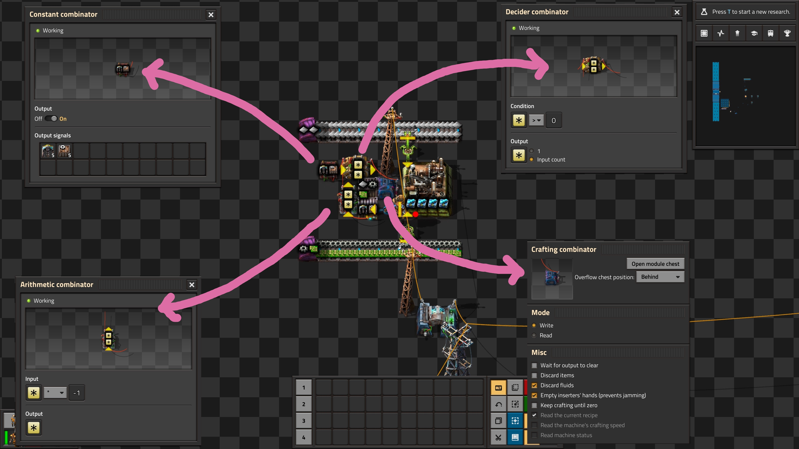
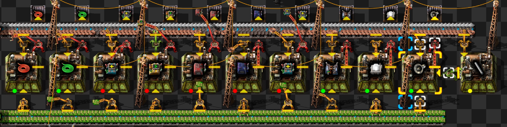
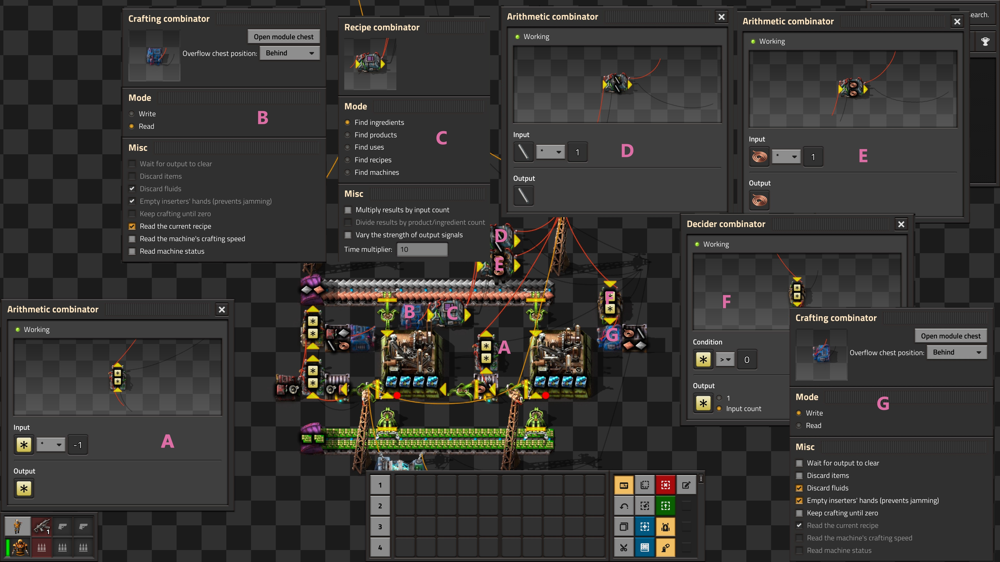
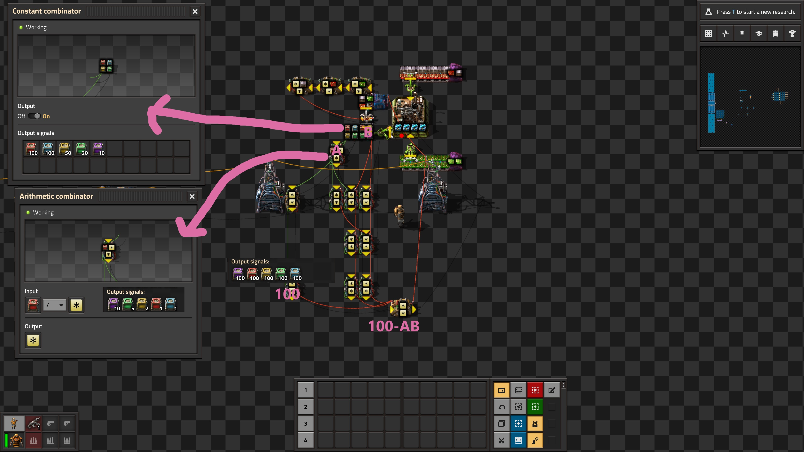

## Crafting Combinators: Filling a hole in the circuit network <author>Max Baroi</author>

The circuit network is a strange and rich subsystem. 
It's relatively early in the research tree, but is more of a hallmark of 
later and more advanced bases. 
Many players completely eschew the topic; only using a lone decider combinator 
for the most basic of fluid balancing. 
Others hear there's a Turing complete mechanic and take that as a challenge.
For readers unfamiliar with the concept, in practice Turing completeness
means one can and *will* [implement Doom](https://www.youtube.com/watch?v=28UzqVz1r24).
Though we haven't seen any attempts to port 
Doom to [belts](https://alt-f4.blog/ALTF4-23/).

The [list of entities](https://wiki.factorio.com/Circuit_network#Devices) 
which can be connected to a circuit network is comprehensive. 
A fair number of readers have probably hooked up an inserter to prevent a chest from overfilling, 
or set a train stop limit. 
But how many have *set* rail signals to squeeze as much throughput as possible from 
an unbuffered four-way intersection? 
The answer is more than zero and a trip to 
[Railway Setups](https://forums.factorio.com/viewforum.php?f=194) 
or [Train Help](https://discord.com/channels/139677590393716737/760455214049263646)
will expose you to arcana you didn't know existed. 
But notice what's conspicuously absent from the above list: assemblers, chemical plants, 
refineries, and centrifuges. 
Players can only influence these producers indirectly by manipulating what feed or empty these 
producers. 
Luckily, theRustyKnife's 
[Crafting Combinator](https://mods.factorio.com/mod/crafting_combinator) mod plugs in this gap. 
It introduces an eponymous combinator that can either read a producer's recipe or 
set it, along with a recipe combinator which conveniently provides the ingredients or recipes
associated with a given item. 

Our goal is to write the section of the 
[circuit network cookbook](https://wiki.factorio.com/Tutorial:Circuit_network_cookbook)
which would need to be added if crafting combinators were in vanilla. 
And then maybe one or two more examples which we think are cool. 
Of course, one can delve deeper and start to apply more advanced concepts 
(like those found in the wiki's 
[combinator tutorial](https://wiki.factorio.com/Tutorial:Combinator_tutorial)
or pocarski's previous 
[posts](https://alt-f4.blog/ALTF4-37/)) in conjunction with crafting combinators.
Players like gridstop have taken the idea to the extreme conclusion and launched rockets
from a 
[single-assembler factory](https://forums.factorio.com/viewtopic.php?f=193&t=42964). 
But for my purposes, we will avoid anything more complicated than an RS-latch.
Even then, I'm sure anyone on the 
[combinators channel](https://discord.com/channels/139677590393716737/783049079584063588)
or [combinator creations](https://forums.factorio.com/viewforum.php?f=193)
will explain why my circuit logic is bad, and I should feel bad.  

# A First Example

First consider a set of items which have an identical ingredient list; mining drills and basic assemblers. 
These are relatively expensive in the early game, 
but are not entities which are continuously consumed.
Let's make a single factory which makes sure a chest contains 
five mining drills and five basic assemblers.

Let's walk through the logic with the following diagram as an aid.

The constant combinator sets the demand for the items. 
We have a wire leading from the chest storing our outputs which negates the quantities. 
The idea is the result of subtracting *current supply* from *desired supply* is precisely what we have
left to manufacture. 
The new bit is the crafting combinator itself. 
It is in write mode, and under misc is the default options which we explore (and modify) later.
Given two competing signals, a default crafting combinator in write-mode will set the
producer recipe with the largest signal strength. 
The chest fills, and the signals decrement until they (ideally) reach zero when the set demand is met   
and the producer shuts down. 
We have the decider combinator to only pass positive-valued signals to the crafting combinator. 
Even in our basic example, the production run ended with six miners even though we only asked for five.
With stack inserters, fast crafting speed, and signal propagation delay we will usually over-produce by
a few items. 
In this case, the circuit will contain a miner signal with value -1. 
Negative-valued signals are still signals, and activate the crafting combinator. 
Without the decider combinator, the assembler would not stop, and we'd end up with a chest with five 
basic assemblers and 2,350 miners. 
Five is closer to six than 2,350, hence the decider combinator. 
Filtering for positive-valued signals will be an extremely common idiom in 
our crafting combinator setups. 

# The Recipe Combinator

Of course, the circuit network components themselves form a set of items with identical 
ingredient lists. 

Asides from speakers, the other ten items (we can't forget the crafting and recipe combinators) 
are all formed from electronic circuits, copper cables and iron plates. 
This feels like a perfect use-case for crafting combinators. 
But instead of just returning to our original example with a different 
demand list, we will add a complication. 
Transporting iron sticks and copper cables is a sin against throughput. 
We should directly insert these intermediaries, and only supply iron plates, 
copper plates, and electronic circuits.
We make no claims the following complex is the best way to accomplish this task, 
but we do construct a complex with two assemblers which 
can craft eleven different objects with direct insertion of low density 
intermediaries. 
And we did so without implementing pushdown automata.
All kudos to nano factory architects, but I can only cognitively handle a buffer chest or two. 

We only included constant combinators and speakers because the interesting part of the 
setup is when we switch to items with slightly different ingredients. 
So let us break down what is happening. 

The little circuit setup on the far left with the constant combinator is the
logic used in the previous example which measures current supply against 
desired supply to determine what item the assembler should craft. 
What is now different stems is the crafting combinator at position `B`.
This crafting combinator is set to *read-mode*, and passes along to the 
circuit network what the assembler is currently trying to manufacture. 
This is then fed to our new recipe combinator at `C`, which outputs 
the recipe for the input.
So when the assembler on the left is producing constant 
combinators, the output to this recipe combinator is five copper cables and two electronic.
When the assembler is producing speakers, the output is five copper cables, four 
electronic circuits, three iron plates, and four iron sticks.
We only want the ancillary assembler to manufacture either copper cables or 
iron sticks. 
The arithmetic combinators at `D` and `E` are there to filter the recipe signals
and only pass through the signals for intermediary products which we want the 
ancillary assembler to produce. 
We add an arithmetic combinator at `A` which negates the count of the intermediary
products which reside in the buffer chest.
Then the combined values of the signals from `A`, `D` and `E` are how many copper cables 
and iron sticks the ancillary assembler needs to produce. 
The decider combinator at `F` only allows positive signals for copper cables and iron sticks 
to be passed to our crafting combinator at `G`, which is set to write-mode. 

# Production Priorities 
If we want a single assembler to produce ten units of `A` and five units of `B` there 
are a few natural orders which we could desire.
I apologize if there's some industrial engineering terms which are standard but of
which I am ignorant.  

| Priority | Production Order |
| - | - |
| The Largest Deficit | AAAAAABABABABAB |
| One at a Time | AAAAAAAAAABBBBB |
| Interlaced | AABAABAABAABAAB |

So far we have only done the largest-deficit method. 
We measure the difference between 
current supply and desired supply and signal corresponding to the item with 
the highest value is passed to our assemblers. 
In this instance we produce five units `A`, at which point we alternate between the
`A` and `B`. An alternative is to produce ten units of `A`, and only once `A` is satisfied, 
we start producing `B`.
We can also interlace production, so we produce two units of `A`, then one unit `B`. 
This way the current supply of items is roughly proportional to the desired supply of 
items. 
I produce way less oil refineries than miners, but I might not want to wait to 
produce hundreds of miners before my factory starts restocking oil refineries. 

As we have seen, crafting combinators default to the largest-deficit strategy.
The "keep crafting until zero" option in the combinator interface makes 
crafting combinators adopt the one-at-a-time strategy. 
But in my experience, I usually want an interlacing strategy.
To focus on our new problem let's return to a set of items which identical 
ingredients: logistics chests. 
Suppose we want logistic chests in stock at the following quantities:

| Chest | Quantity |
| - | - |
| Passive Provider | 100 |
| Requester | 100 |
| Storage | 50 |
| Buffer | 20 |
| Active Provider | 10 |

We produce the chests at the desired quantities using an interlaced 
production strategy. 
Let's trace the logic behind this setup.

The series of combinators on top attached to the filter combinator is uninteresting. 
We include it to transfer only finished products from the overflow chest 
to our final storage chest. 
As usual, the constant combinator determines the desired supply.
The highlighted arithemtic combinator at point `A` calculates 
the ratios of all the desired items to the item in the highest demand. 
The idea is for every passive provider chest, we want to produce
one requester chest, two storage chests, five buffer chests and 
ten active provider chests. 
The output of the arithmetic combinator reflects this desire. 
The chest at `B` is our current supply of items. 
We multiply the outputs at `A` and `B` on a per-signal basis by adapting the
[multiplier](https://wiki.factorio.com/Tutorial:Combinator_tutorial#Multiplier_and_Dictionaries.2FArrays)
from the wiki. 
This accurately counts passive provider and requester chests, 
but double counts storage chests, quintuple counts buffer chests, and
dectuple(?) counts active provider chests. 
We subtract this quantity from 100 (the highest quantity demand of any chest),
and the highest resulting signal is what is passed to the
crafting combinator. 
Of course, we filter for positive signals as we always do. 

If this is a little abstract let's work through a specific example
with only two chest types. 
Suppose we have fifty passive provider chests, and twenty storage chests already. 
We have 50% of our desired passive provider chests but only 40% of our desired storage chests,
so we want to prioritize storage chests.
In this example, my `100-AB` quantity for requester chests is 100-50*1=50
and for storage chests is 100-20*2=60, so the crafting combinator will set the
assembler recipe to storage chests as desired.
When will these two `100-AB` quantities be equal?
They will be equal once we have twenty-five storage chests. 
At that point we will have 50% of our desired passive provider *and* storage chests. 
Production dynamically adjusts to maintain our desired item ratios. 

# Putting the Pieces Together
I don't want anyone to think that crafting combinators are only for 
the early or mid-game; they're just a method to save some space. 
So let's build complex worthy of a later-game mall using the all 
the concepts we've covered so far. 

We build a mini-mall stocked with the following items at the following amounts
| Item | Quantity |
| - | - |
| Mining Drills | 1000 |
| Assembling Machine 2 | 100 |
| Chemical Plant | 200 |
| Oil Refinery | 100 |
| Offshore Pump | 100 |
| Pumpjack | 100 |

Of course, in a real late-game mall, we wouldn't store assembling machine 2s but use them
as ingredients for assembly machine 3s. 
There will be a side complex to produce intermediary products on demand 
using a recipe combinator, and we will use our multiplier technique
to have an interlaced production strategy. 
Passive provider chests will be used as overflow chests, so we can recycle 
materials that would otherwise be discarded. 
Final products will be stored in single-item buffer chests to 
prevent logistic network loops or storing intermediary products.  
And look at what we have wrought together in so short of time

# The Road From Here
Crafting combinators add a new mechanism to create a dynamic factory that 
responds in real time to current supply and demand. 
This article has only scratched the surface of what is possible mainly because 
my ability is surface-deep. 
There are plenty of designs I would like to explore: 

- modules complexes which rebalance production given factory consumption
- recipes setting recipes setting recipes
- city blocks where production is set by trains
- assembler recipes dictating belt pathways

The main reason I wish Wube would bestow the 
[ultimate honor](https://alt-f4.blog/ALTF4-21/) to theRustyKnife
is I want to see what the community can do with crafting combinators. 
There's a lot of talent out there, this blog highlights it on a 
regular basis, and I want to be amazed at what the community would accomplish 
if crafting combinator were added to vanilla. 

