## Dana dev's blog: about the spaghetti in recipe graphs

### Dana ... what is that ?

[Dana](https://mods.factorio.com/mod/dana) is a mod that aims at answering a simple common question in Factorio: "how can I make *(something)* ?".

There are already quite a few mods doing this: [FNEI](https://mods.factorio.com/mod/FNEI), [Recipe Book](https://mods.factorio.com/mod/RecipeBook), [What is it really used for](https://mods.factorio.com/mod/what-is-it-really-used-for)... These mods have a common approach: let's say a new player want to know how to craft the Chemical science pack (the cyan one). This player looks for this item with these mods (or Factorio's recipe list), and see there is a single recipe, taking red circuits, sulfur, and engine units. So now the new player wonders "how do I make red circuits ?", looks for it, and sees a single recipe, requiring: plastic bars, copper wires, green circuits. Next step: "how do I make plastic bars ?", 1 recipe requiring petroleum gas. "How do I make petroleum gas ?", 4 recipes, have to inspect them one by one... That's time consuming, tedious, and the player is likely to forget some steps (like the sulfur, or steel).

Dana is born out of frustration of having to apply this process for hours on complex mod overhauls. And it takes a *slightly* different approach to answer:

("Dana, how to make *Chemical science packs* ?")

Dana is about depth: when asked how to make a Chemical science pack, it will show you all the chained steps required from the raw materials. And it does it directly in-game, by drawing you a *nice™ and understandable™* recipe graph. Players can navigate the graph with WASD, zoom in/out with mouse wheel, select nodes or links for additional info. It's also possible to draw the full crafting graph of the current game (the vanilla one will be shown further in this article), or an "usage" graph (what are all the items that can be crafted from *X*).

Dana is designed to work out of the box with any combination of mods adding/modifying/removing recipes or items. There is no hard-coded configuration provided by the player, the modders, or shipped directly in Dana. In this video, placing the "Copper block" between the "Iron block" and the "Refinery block", the "Heavy oil" above the "Light oil", how lines should be drawn/merged/bended, each X-Y coordinates... All that Dana had to work with was the full list of items, recipes, and what are the available natural resources. This is done by a graph layout algorithm (the piece of code that takes a bunch of recipes/items and decides where to place them on screen and how to link them) specifically designed for Factorio, which will be the subject of this article.

### Dev's blog: drawing the graph's spaghetti

Today's post will present some (hopefully interesting) details about the inner working of Dana's *nice™ and understandable™* graph generator. To give a general introduction, Dana's graphs are a variant of [layered graphs](https://en.wikipedia.org/wiki/Layered_graph_drawing). This means that items & recipes are placed in *node layers*, separated by *link layers*.

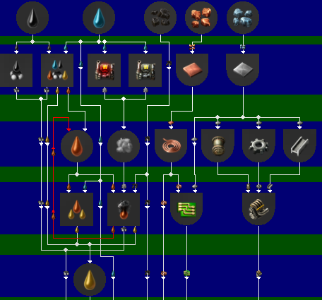
(Layered graph structure: node layers (blue background), link layers (green background))

The first thing Dana does is deciding how many node layers are needed, and in which layer each item/recipe will be placed. The second step is to decide the horizontal coordinate of each item/recipe. The third step is building the link layers. The final step is to assign a vertical coordinate to each element in the graph, now that the number of layers and their height is known.

The full layout algorithm is way too big and technical for an Alt-F4 post, so the rest of this article will focus on the third step. Here's the problem: given 2 consecutive *node layers*, trace the required links in the *link layer*, in order to get a *nice™ and understandable™* graph:

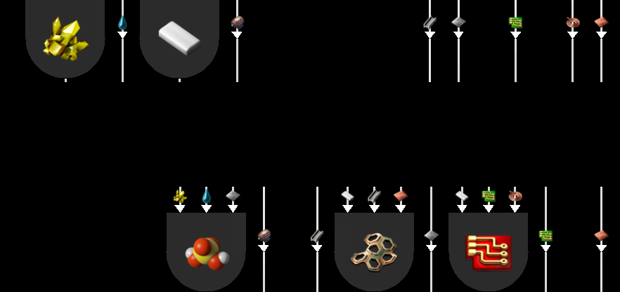
(Input data of the problem)
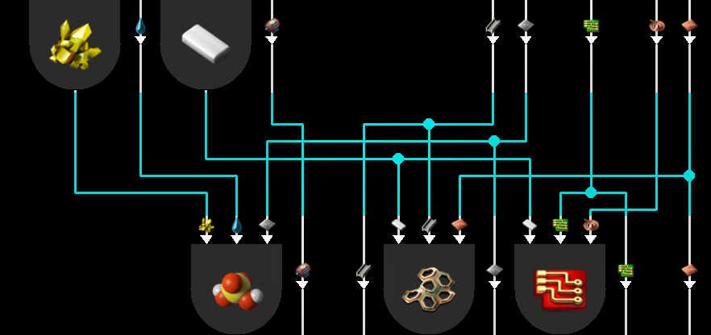
(Possible result)

Conveniently, this is more or less a variant of kindergarten exercises:

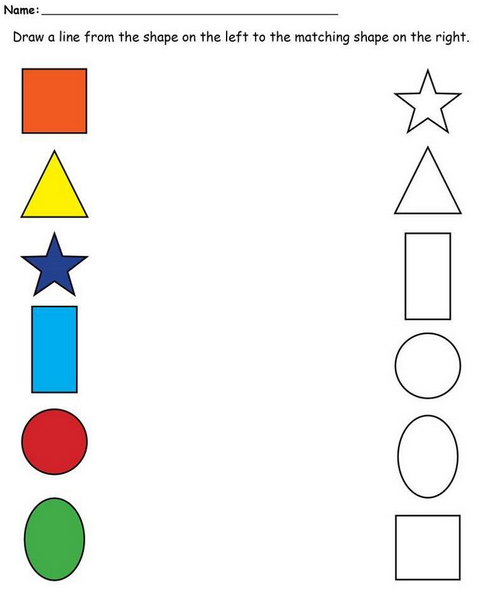

Since 5 years old kids do that, it shouldn't be hard to program, right ?

### Design part: "Nice™" and "understandable™" graph ?

First, let's take a paper and a pencil (or your favorite image editor) and answer a first question: what should the links look like ? As one can imagine, what makes a graph nice™ and understandable™ is pretty hard to define.

Maybe simple straight lines, like most graph renderers ?

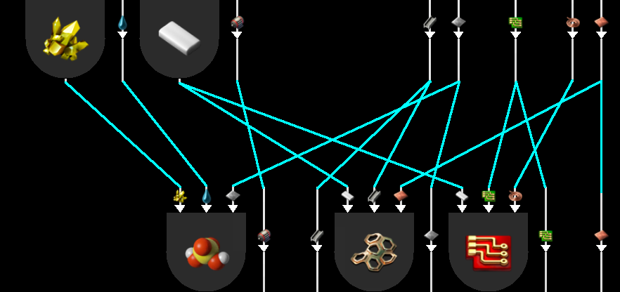
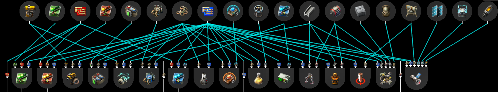

This might get the job done on small graphs, but fails to be nice™ and understandable™ with wide graphs. Nearly parallel lines crossing each other are hard to follow, and areas with a high line density become full white. The good old straight line isn't even enough for Vanilla Factorio crafting graphs, let alone modded !

So, back to the drawing board for a nicer™ and more understandable™ solution. Let's remind the general guidelines for user friendliness of graph links:
* Minimise line crossings, especially between almost parallel lines.
* Minimise the bends on a link.
* Minimise the length of links.

On top of that, there are general UI design rules:
* the user experience plummets if they have to scroll horizontally/vertically to cross-check information from different parts of the interface. To avoid that, the graphs must be as compact as possible.
* less is more: if the same amount of information can be conveyed with 4 lines instead of 20, that's probably a good thing to do.

So now, it's time to *search* for better ideas. And the best way to research for anything, as we all know,  is ~~google~~ by pressing T in Factorio:

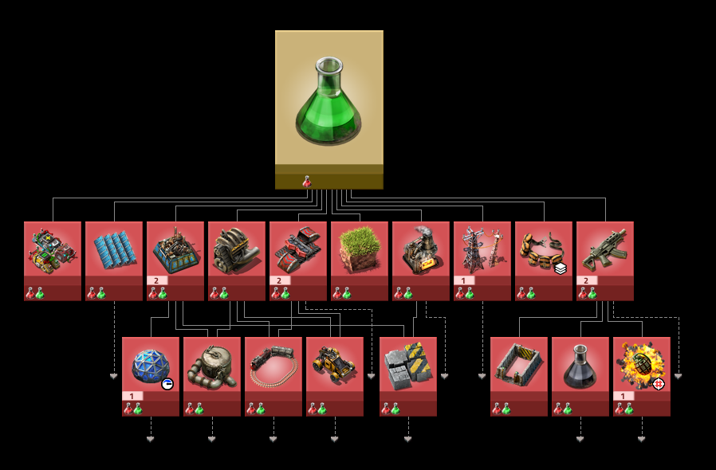

Factorio's graph renderer has a more subtle way of rendering links. Each link is decomposed in 3 segments: 2 verticals, 1 horizontal. This approach scales much better with wider graphs, because:
* there's never crossing of nearly parallel lines. All crossings are at right angle, which is optimal to prevent users from following the wrong line.
* the density of links is kept under control: there's always enough gap between parallel lines to distinguish them from each other.

The price for this readability is vertical space: there need to be enough room between the 2 rows of technologies to add all the horizontal segments without collisions:

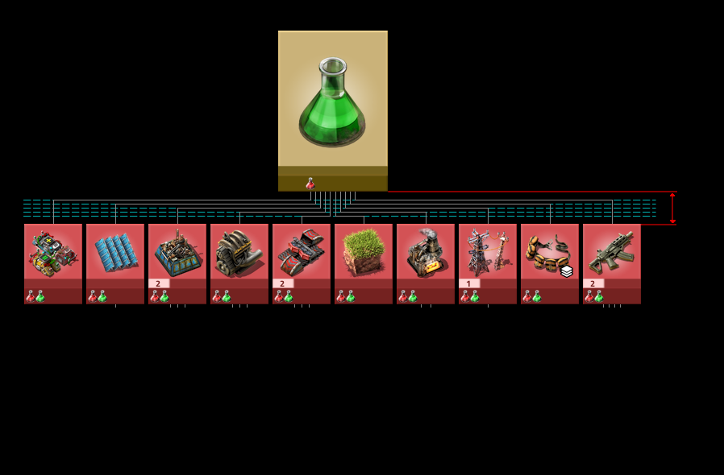

To minimise this cost, there's a simple yet huge optimisation: what if lines didn't link just 2 elements, but any number of elements ? Just draw a single wide horizontal line for each item/technology, then add as many vertical lines as necessary to connect to the nodes.

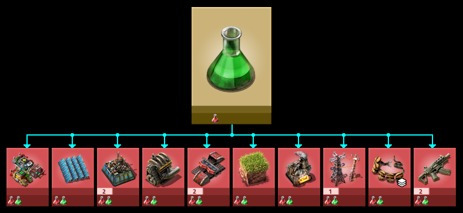

Much more compact, less clutter, definitely nice™ and understandable™. This gives a "main bus" vibe to these graph sections that'll hopefully feel natural to a Factorio player, while hitting a good compromise between the general guidelines. This is also technically possible with Factorio's in-game rendering API, as links are just a bunch of lines, triangles and circles. This almost gets Dana to fit Factorio's full crafting graph on a single screen:

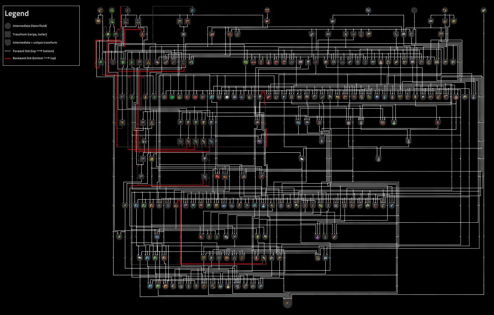

### Coding part

So that's all for the drawing board, time to throw some code at the problem to get the job done ! But here comes new problems:
* Factorio Mods are made in a language called Lua, and Lua has an ridiculously barren ecosystem. No success in finding a library that can do this kind of link routing.
* Porting from other languages ? Sadly there are plenty of libraries to draw conventional graphs, but Dana is now dealing with links between any number of nodes. That's not a graph anymore, but an hypergraph. While the word sounds definitely cooler, there isn't many software libraries to draw them, and in general much less scientific litterature on the topic. No success in finding clues to do routing the Dana way.

So Dana has a router "almost" made from scratch. "Almost" because there was a lot of inspiration to be found elsewhere, it just required looking into some unexpected places...

#### Inspiration from PCB design.

It happens that there are some people whose daily job requires to link points on a 2D plane: printed circuit board (PCB) designers. And for problems almost identical to Dana's link routing, they have a decade-old family of well documented algorithms: [channel routers](https://en.wikipedia.org/wiki/Channel_router).

Before looking at solution, the first things Dana got from that is a proper way to modelise the problem. The goal of our link router is to determine 2 things:
* determine a number of *channels* between the rows of nodes.
* assign a *channel* for each horizontal segment of the links.

Where each horizontal line starts and ends is simply determined by which nodes they must be linked to, and the vertical segments are simple projections from the nodes to the horizontal lines.

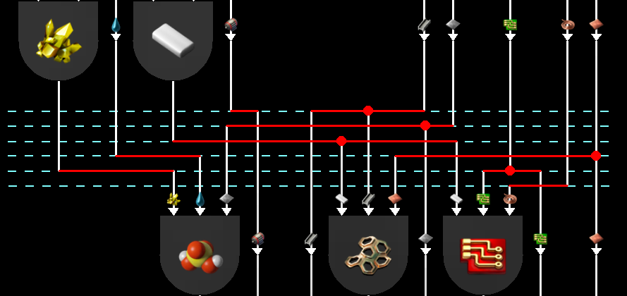
(here the router decided to make 6 channels in cyan, then choose a channel for each red horizontal segments).

So maybe Dana could also just copy/paste the solution ! Let's just place the links like tracks were placed on PCBs in the 80s !

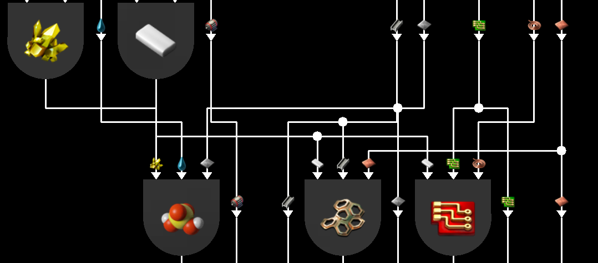
(Dana with a classic PCB router)

Well that's not exactly satisfying. These algorithms were designed with constraints of the PCB industry in mind, where link crossings are usually not a problem: only making the final PCB as small as possible really matters. But when it comes to nice™ graphs, all these tangled spaghettis are really bad. In order to fix that, Dana has to provide the router with a **partial order** on the horizontal lines: something telling that line `A` must be placed over line `B` to minimise crossings.

#### Inspiration from sport tournaments

To find a good vertical order, let's start from a simple idea. For each pair (`A`,`B`) of horizontal lines, we compute the number of crossings if we place `A` over `B`, same with `B` over `A`. We can deduce that placing `A` over `B` will save (or cost) a certain amount of crossings, or possibly that it doesn't change anything.

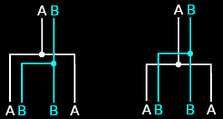
(here placing `A` above `B` saves 2 crossings)

Sadly the above trick may result in contradictions: `A` must be placed above `B`, `B` must be placed above `C`, and `C` must be placed above `A`. To get a proper order, Dana has to sacrifice some of the generated constraints, but in a way that adds as few crossings as possible.

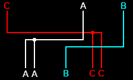
(`C` over `A` saves 1 crossing, `A` over `B` saves 2 crossings, `B` over `C` saves 1 crossing)

And now is the perfect time to start randomly talking about sports. Let's rephrase the previous paragraph, but using sports terms instead. `A` has won against `B`, `B` has won against `C`, and `C` has won against `A`. To get a proper ranking, Dana has to ignore some of the matches' results, but in a way that ignores as few score differences as possible.

The fundamental problem is the same. But luckily the sports version is as old as round-robin tournaments. And the good thing about old mainstream problems like that: there are a lot of smart people who have done research on it !

A generic way to solve the issue is to use graph theory, where our sport problem is equivalent to the [Minimum feedback arc set](https://en.wikipedia.org/wiki/Feedback_arc_set) problem. The bad news: it's a [NP-hard](https://en.wikipedia.org/wiki/NP-hardness) optimisation problem. In layman's terms: finding the best solution can be **ridiculously** time consuming even with just a few dozen of players. The good news: there is a nice pile of research articles proposing *heuristics*. Those algorithms solutions that might not be optimal, but "close enough" to optimal in a "good enough" time. Various heuristics exists depending on how much computation time one is willing to pay in order to get stronger guarantees of optimality, or can be tailored to specific types of graphs.

Dana uses the heuristic from [Eades, P., Lin, X. and Smyth, W.F. (1993)](https://researchrepository.murdoch.edu.au/id/eprint/27510/1/effective_heuristic.pdf), with trivial modifications for weighted graphs. This is an extremely fast & hopefully "not too bad" algorithm to compute a partial order (these full Pyanodon graphs have to come out before the end of time, after all). It's enough to get a much more satisfying result on the last crafting graph:

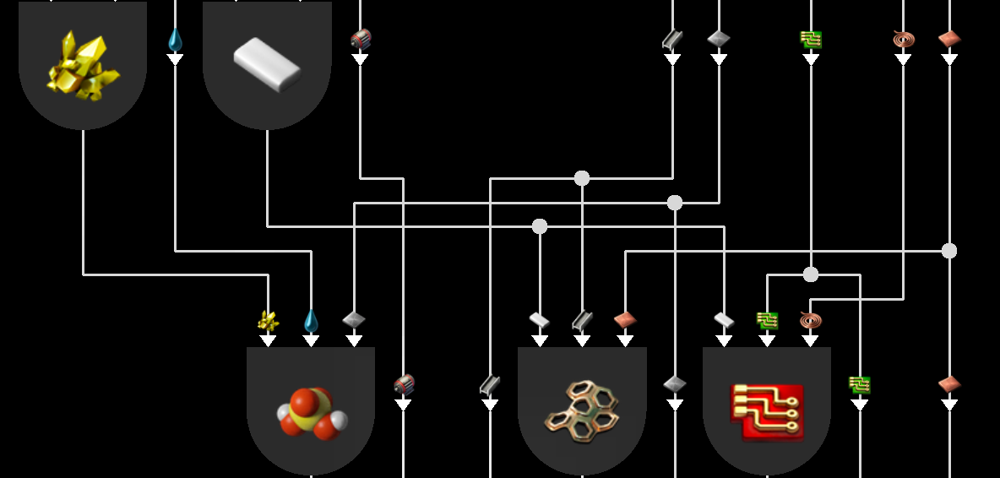
(same graph as the end of the PCB section, with the improved router)

### Conclusion

Dana runs a sports competition between Factorio items. Their rankings is then used to connect some resistors, capacitors and coils on an imaginary PCB in a fashionable manner. This enables Dana to generate nice™ and understandable™ crafting graphs.

Trust me, I'm an engineer.
