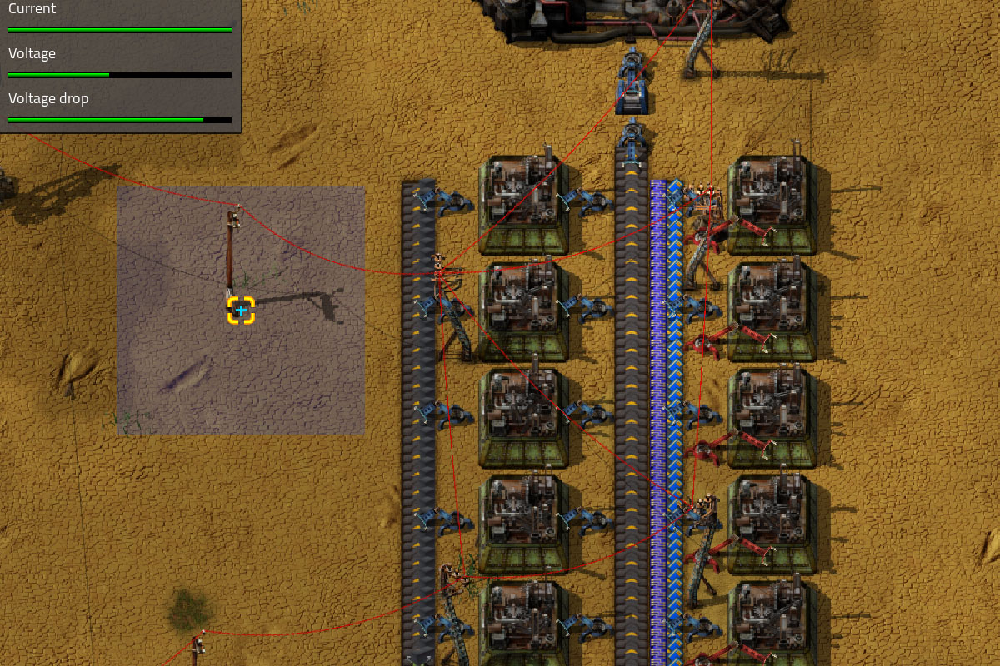
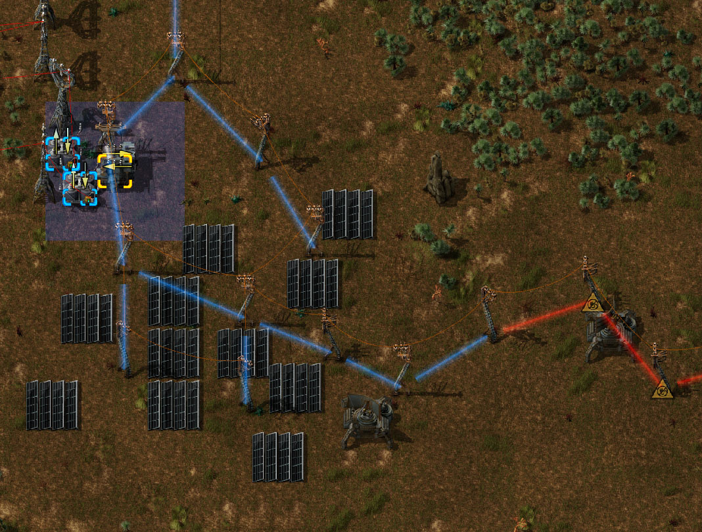
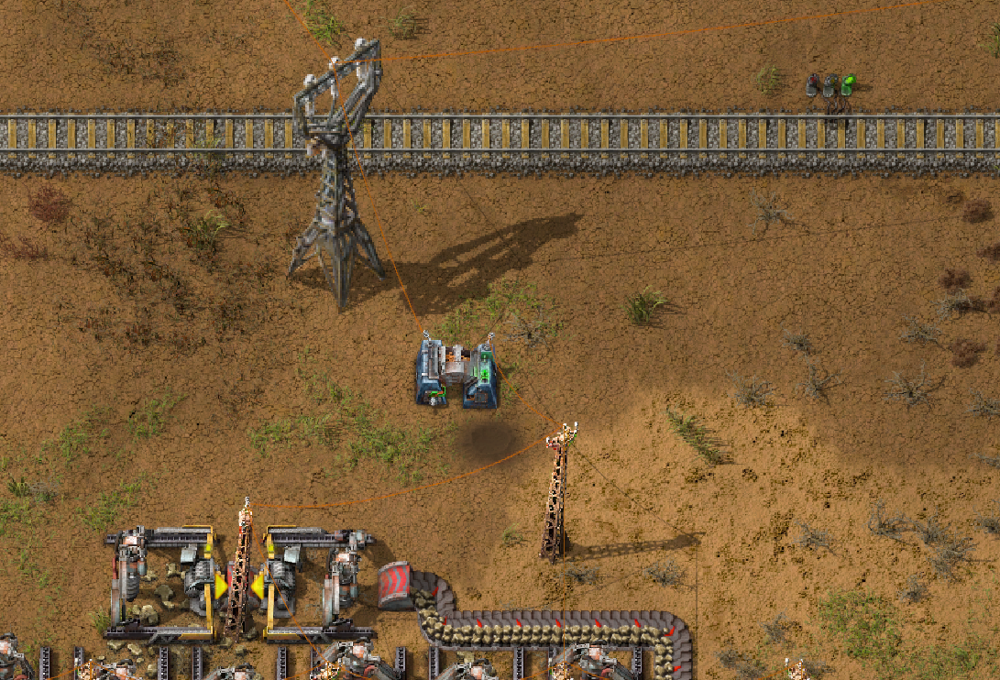
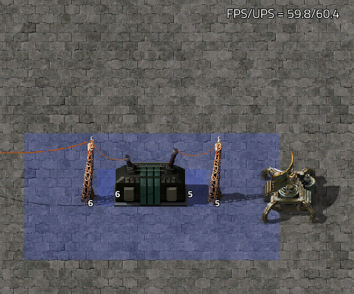

## The [Fluidic Power](https://mods.factorio.com/mod/FluidicPower) Experiment <author>stringweasel</author>

Ever since my education in Electronic Engineering I've seen the flow of electricity in everywhere I look. The backward-travelling wave of cars inching forward in traffic is the movement of electrons. Even more interesting is how close the flow of electricity is to the movement of fluids. When I flush the toilet and it creates a whirlpool I see an inductor being charged up by a capacitor. When I suddenly close a tap and I hear the water hammering in the pipes I see a inductor's voltage spike that's used for [Boost Converters](https://en.wikipedia.org/wiki/Boost_converter). Wouldn't it be cool to have this realistic behaviour of electricty in Factorio?

### Why is it hard?

Firstly, in vanilla Factorio the electricity is ideal - meaning there no resistance in the wires. Your electrical grid can transmit infite power over infinite distances indefinitely. It's almost like they strung cryogenically cooled [super-conductors](https://en.wikipedia.org/wiki/Superconductivity) to the cheap small wooden power poles. This works very well for the goals and constraints of the game and fits most play-styles perfectly. However, there's always been a few players looking for more of a challange who wondered if electricity could be made [more realistic](https://forums.factorio.com/viewtopic.php?t=68761). Players who want to have the need of using transformers to avoid some kind of voltage drop over distance.

However, recreating more realistic electricity in (arguably) out of scope for vanilla Factorio and will [likely never happen](https://forums.factorio.com/viewtopic.php?p=301132#p301132) - so it's up to mods to fill this slightly sadistic niche. In Factorio mods can only modify [predetermined aspects](https://lua-api.factorio.com/next/) of the game and the options available for electricity are very limited. Therefore modders have come up with some interesting workarounds. One of the main problems are that once power poles are connected by copper wire the game will automatically transfer electricity internally, and it cannot be manipulated. The only real access to the power network is then to artificially supply or drain electricity by using an [Electric Energy Interface](https://wiki.factorio.com/Prototype/ElectricEnergyInterface) (henceforth called EEI), but that doesn't change _how_ the power is transferred.

Another possibly is to manually remove the copper cables from the power poles to manually handle electricity flow, but that will always also remove the visual copper connection which looks odd. And that can still leave you to calculate the the transfer of power yourself in the mod and artifically manage the power network, just like the game would do behind the scenes normally. The problem is that calculations done in the mod itself will always be orders of magnitude slower than the game engine calculating it. This is why the Factorio developer Rseding91 had the following to say a few years ago after someone asked for a mod to implement [voltage drop](https://en.wikipedia.org/wiki/Voltage_drop).

{
    quote:

    "[Voltage is] not the only thing you're going to be worrying about dropping. Your UPS will TANK once you build more than a few of anything if you used such a mod :P"

    - Rseding91, Factorio Developer
    - link: https://www.reddit.com/r/factorio/comments/6wwkhx/comment/dmcea1c/
}

This does not of course not mean it's impossible, even if it's not as performant as vanilla Factorio. Mods have found beautiful ways around all kinds of obstacles, including these limitations, and have created all kinds great gameplay mechanics not thought plausable. 

### A Short History of Electricity Overhauls

One of the first ones power overhaul mods was probably [Flow Network](https://mods.factorio.com/mods/Simdezimon/flownetwork) - made in the time of Factorio 0.13. In a nutshell, a custom invisible accumulator was placed underneath every power pole, and thus creating a composite entity very commonly used in mods. The copper wire is then removed and replaced with red circuit wire to stop the vanilla electricity transfer, but still visualizing the connection. Energy is then distributed manually between these hidden accumulators with a custom script. Unfortunately, as previously mentioned, this is very slow, as _all_ electricity calculations are done in the mod and not handled by Factorio itself. It does have the advantage of being very customizable.



Another attempt came around in Factorio 0.15 which was called [High Voltage](https://mods.factorio.com/mod/highvoltage). This is quite an interesting mod with a lot of moving parts. Electricity is distributed at either high or regular voltage, where the transformers and other equipment are either accumulators or EEIs. The high voltage power distribution is then calculated manually with custom forumalas - very similar to what Flow Network did. This allowed the author to introduce interesting mechanics like transformers requiring time to "spin up". Regular votlage on the other hand simply power your machines and is distributed using copper wire, just like in vanilla and no modding calculations are required. However, the author did introduce a type of voltage drop over distance which only required an calculation when a power pole is placed. If the placed power pole is too far away from the transformer then it won't be able to power any machines. What happens is that the power pole is silently replaced with a pole with a [supply distance](https://wiki.factorio.com/Prototype/ElectricPole#supply_area_distance) of zero, which means the pole will still be connected to power, but it cannot transmit that power to any machines. Quite a brilliant sollution.



Both of these mentioned mods was very performance heavy and would very likely not scale with big factories - and they were also never updated to newer Factorio versions. In my opinion the best modern solution is likely [Power Overload](https://mods.factorio.com/mod/PowerOverload) by Xorimuth. Here the goal is to the differentiate power grid into seperate sub-networks using transformers. There is no real difference to power before and after the transformer, and the transfer of power through the transformer is calculated by the mod itself. However, the goal here is slightly different. If a given sub-network has a power pole drawing more power than it can handle it has a chance to explode! What makes this mod amazing is how clean it looks and feels with all the copper connections still showing. This is because the most of the required components like EEIs that the author requires for power manipulation is on a completely different surface - all connected by transdimentional copper wires!



A final honourable mention would be [Electric Transformators](https://mods.factorio.com/mod/Electric_Transformators) that I stumbled across a month or so after Fluidic Power's release. This has a similar approach to Power Overload, but without the exploding power poles which means does not punish _not_ using the transformers. It did however find an interesting way to way build transformers where no mod power calculations are required. Each transformer is an composite entity with a boiler that creates a fluid from electricity, and then a generator that turns it back into electricity. This means the electric networks are disconnected, but calculations between the network are still done by the much faster game engine.



These mods are all brilliant in their own way and can create amazing gameplay. However, I was wondering if electricity can be even more realistic? Can it mimic fluids even more closely? And most importantly - can we create some mechanic which will inherently punish certain power networks by limiting throughput, and thus incentivice the use of transformers. All because of the fundamentally way power is distributed?

### What did I do different?

Luckily, Factorio does have a built-in fluid simulation that is very well optimized and runs on the game engine. This simulation manages the oil in your storage tanks and the steam in your nuclear power plants. It's [not perfect](https://factorio.com/blog/post/fff-260) and can cause many headaches, but it works well enough. This fluid simulation is exactly what's required to mimic electricity that flows like a fluid - so I set about trying to implement it.

After many hours of mucking about in the Factorio [datastage](https://lua-api.factorio.com/latest/Data-Lifecycle.html), and struggling with fluidboxes and composite entities for way too long, I finally stumbled onto a working solution. I successfully converted electricity into a fluid - which I call the power fluid - and essentially turned all poles into pipes. Below is an example of a steam engine powering a radar using Fluidic Power, both what you will see using the mod (left) and what happens behind the scenes (right).

{
    juxtapose
    
    

    caption: Example power distribution using Fluidic Power (left side of slider) and what is actually built by built (right side of slider). On the image from the left it shows power generation, stepping-up voltage, stepping-down voltage, and power usage.
}

The power fluid will flow to other poles like a fluid, just like water or any other fluid, and from there it will power your entities. The unit of this power fluid is in Joule (for example `10kJ`), which means it's _energy_ that's distributed through the poles. The unit could likely have been Volt or even Coulomb (as in [Electric Charge](https://en.wikipedia.org/wiki/Electric_charge)), but using energy integrates easily with Factorio's [mechanics](link to generator or something). 

This implementation does however require two types of poles, namely normal poles and source poles. The source poles is placed next to you power generators, and they create the power fluid. This is achieved by placing a tiny assembler underneath the pole that creates the fluid at the correct rate with a very specific power consumption. To power your machines you need the normal poles. They have a tiny generators (like the [Steam Engine](https://wiki.factorio.com/Steam_engine)) underneath that turns the fluid back into electricity. This also allows the power fluid to flow through multiple poles to where it's required, just like how you can chain Steam Engines together. It also means that I can [limit](link to generator stat) how much power each power pole can deliver to it's surrounding machines!

Below is the psuedo code to ensure the power poles have the correct characteristics.
```
// Power production dictates the source pole's assembler power consumption
power_production = (fluid_fuel_value * units_per_craft) / crafting_time

// Power consumption dictates the normal pole's generator fluid usage rate
power_consumption = fluid_fuel_value * fluid_usage_per_tick * 60
```

Next up is transformers, which has a fital part to play in a mod like this, because as we all know, fluids [don't travel very far](https://wiki.factorio.com/Fluid_system#Pipelines) at high throughput. In the real world a transformer steps up the voltage for more efficient (read _easier_) power distribution, or more simply. Fluidic Power does not have voltage to step up, but the required throughput can be reduced by simply converting the fluid energy to a larger unit. For example, "high voltage" can be emulated with the power fluid's unit being `1MJ` instead of `1kJ`. This means that for the same amount of fluid flow more _energy_ will flow. What I really enjoy about this implimitation is how brutally simple these transformers are then. All the mods I mentioned had to manually calculate the power transfer over a transformer or create complex composite entities, whereas I simply had to create an assembling machine with specific recipe. In recipe is the total input and output energy should be the same, but in different units. The time to craft of this recipe, or how much fluid units it can transform, then only dictates the power input/output rating of the transformer!

```
// Example Transformer Step-Up Recipe
1000 units of 1kJ fluid --> 1 unit of 1MJ fluid

// Transformer Power Rating
power_rating = fluid_output_amount * fluid_output_unit / time_per_craft
```

With a little fiddling this resulted in some intuitive and fun gameplay. It's designed so that only the lowest voltage can power your machines or accept generated power. Then, once the voltage is increased to aid distribution, the high voltage fluid can _only_ travel through big power poles. These big power poles are also limited and cannot power any machines or accept any generated power. This is likely my *favourite* part of this implementation. It means that there is an inherent incentive to create a high voltage backbone throughout your base, and everywhere you want to use power you need to use transformers.


Finally, having a power simulated as a fluid the design for accumulators changed. It's no longer an smart entity that only accepts surplus power, which only releases all it's energy when it's requried. No, now it's a simple storage tank which acts like a big dumb capacitor. It only accepts the low voltage power which means your battery-banks need plenty of transformers. It's possible to create the same behaviour as vanilla accumulators with fun circuitry, but without circuitry they still function good enough albeit a little inefficiently.

All-in-all I was suprised and excited that I found an implemetation that furfilled most of my goals and inherently created the challenges and obstacles that I visioned it to have. I didn't have to artifically create any limitations to the player, which is a great bonus. I only created the fundamental system and it regulates itself - for better or for worse!
