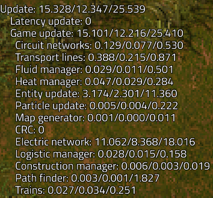
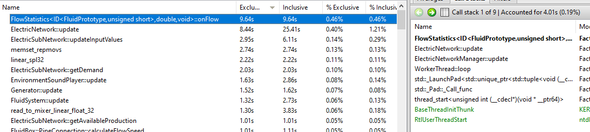

## The [Fluidic Power](https://mods.factorio.com/mod/FluidicPower) Experiment: Part 2 <author>stringweasel</author>

### What is it again?

In [last week's article](https://alt-f4.blog/ALTF4-51/) I talked about the history of Factorio Power Network overhaul mods and how they worked, and then explained more my own take on it called Fluidic Power. It's recommended that you read that article first, but in a nutshel, I made Factorio's power distribution more realistic by simulating it as a fluid - by using the already built-in fluid simulation. This means you need to use transformers to minimize voltage drop over distance. It also means that, for example, that it is more complex keeping your laser turrets firing at 100% or building highly beaconed builds.

These new limitations means that Fluidic Power achieved its goal of creating a new game mechanic that more closely resembles realistic electricity. However, it does introduce significantly more performance overhead with all the new fluid calculations requried. I didn't want to put a mod on the mod portal that will bring your PC to a halt if you build a decently sized factory. So therefore I set out to do some research. Does the extra fluid calculations really have such a big impact?

### Is the performance playable?

Firstly, there is a reason why electricity is implemented in Factorio the way it is. It allows us to build [absolutely gigantic factories](https://forums.factorio.com/viewtopic.php?f=204&t=60816) at such a scale that that you can get lost in your factories. And adding more realistic power might inhibit performance so significantly that we will have to build smaller factories, and nobody wants to do that. So the questions is what will Factorio's performance actually be if there's fluid flowing through each and every power pole. We required some benchmark map so I set out to build pure Fluidic Power base with the help of my friend JanKrater. 

My goal for this benchmarking base was to think of the most performance efficient way to build a base, and then do the exact opposite (or well mostly). This resulted in a spaghetti base with way too many power poles, very convoluted belts, and way too many power hungry laser turrets. Very importantly though, it manages to produce science at an steady 45 SPM, draws about 600MW, and doesn't have an efficiency module in sight.

{ 
    Map view to save file (it's in the media folder)
    caption: The benchmark Spaghetti Base running at 45 SPM
}

Normally Factorio runs at about 60 updates per second (referred to as UPS), and this benchmark map I could push to run at 70 UPS on my old PC (i7-4770k 3.5GHz CPU, DDR3-1600MHz RAM). This means that it takes about `~14ms` to update the whole base once, called one tick, where for 60 UPS the maximum time can be `1/60 = ~16.6ms`. This number is also shown below in the "show-time-usage" debug output. Interestingly it also shows that my mod script (`mod-FluidicPower`) has a neglible effect on the performance (`~0.05ms`). This is because the calculations my mod actually do is minimal, because it offloads the all the hard calculations to the game engine which then do more fluid and power calculations. The main timing information to look at is `Fluid Manager` and `Electric Network`.

In the output above the game can tell you where most of the updating time is spent, and it initially confused me that game seemingly spends most of the it's time in the `Electric Network`. My expectation was that the `Fluid Manager` would take be the biggest calculation hit, but instead the output shows that the `Electric Network` (`~10ms`) is using over 70% of the update time (`~13.7ms`), and the `Fluid Manager` (`~0.03ms`) seems not to be doing anything at all. This doesn't make any sense, because I expected the amount of fluid calculations should be a massive performance drain. So I headed to the [Technical Factorio](reddit.com/r/technicalfactorio) community who are experts in the field of optimization - where they squeeze Factorio's performance to it's absolute limits. Here the brilliant mathematician SteveTrov explained to me why the in-game time usage can be misleading if you don't know how it's actually implemented. He described it as:

{
    quote

    "Firstly the time usage stats are confusing because the fluid and electric network update are run in parallel threads. This is roughly what happens most of the time:

    1. The electric network thread is started and the electric network update timer is started. 
    2. The heat update thread is stated
    3. Multiple fluid update threads are started. 
    4. When the electric update thread finishes the time used is recorded under electric network update. The fluid update timer is effectively started now
    5. When the fluid threads have all finished (they normally do before step 4) the fluid update timer is stopped. 

    So the effect of this is that the fluid update time is nealy always very low."

    - SteveTrov 
    - [source](https://discord.com/channels/579345487371567105/579346716243787782/855875612274851881)
}

This essentially means that the Fluid Manager's time usage information is entangled in the Electric Network's and Heat Manager's time usage. It's [not possible](https://discord.com/channels/579345487371567105/579345487837003836/784493971824312340) to calculate an accurate metric as to which part takes the most processing time without a changing the Factorio game engine itself. I need another approach to know if the `Electric Network` really is taking more processing time than the `Fluid Manager`, and if so, by how much?

An UPS expert called [flame_Sla](https://www.reddit.com/r/technicalfactorio/comments/ks2xtk/20k_spm_201000spm_belts_v30/) then suggested that I download the [Very Sleepy Profiler](http://www.codersnotes.com/sleepy/) to see detailed information about which of the Factorio engine's C++ functions are called most often. Their community often use this tool optimize the worlds most largest and most UPS efficient megabases. In the output of the tool below you can see the C++ functions that take the most time listed in descending order. flame_Sla did also mention not to focus on the absolute time shown, but rather use it as an metric to see the biggest culprits.

This showed something that I did not really expect. The fluid system (`FluidSystem::update`) was only part of the top 10 worst timed functions and the Electric Network was _still_ taking more processing time! It turns out the main problem is `FlowStatistics<ID<...>...>::onFlow` which is called mostly by the electric network. These [flow statistics](https://lua-api.factorio.com/latest/LuaFlowStatistics.htm) are simply used to collect statistics so that you can view it on in the graphs, eg. for power production. This means that that the game is not only slowing down because of all the new fluid calculations, but also because all the new graphs to draw!

It's very likely that Electric Network statistics collection could take a significant amount of processing time in Fluidic Power. The Factorio engine is built to only have a handful of electric networks, normally even only one. The game needs to collect and update information for every power network you have, which will be only a few of datasets. So instead of having a handful of networks Fluidic Power is designed so that _each and every_ power pole is a single electric network. The Factorio engine will then attempt to collect statistics for each of these electric networks - which in my benchmark save is about 3000! That's at least 100 times more networks to collect statistics on than Factorio is designed for (or usually). This has been a known limitation for some other mods, but Fluidic Power takes this to a new extreme. However, we still don't know the impact of these calculations _relative_ to the fluid calculations. Does the collecting of statistics really take that much more time than fluid calculations?

Then flame_Sla mentioned that he once measured the Fluid Manager's time usage accurately on the world's biggest megabase, and saw that it only used `~0.4ms` for a [40KSPM 60UPS megabase](https://www.reddit.com/r/factorio/comments/nmxayx/new_ups_record_40k_spm_60_ups_no_mods_details_in/)! That means only 2.5% of the update time was spent on fluid calculations! The way he achieved this is by completely _eliminating_ the Electric Network from the time usage, which he achieved by changing all machines to [run on wood as fuel](https://discord.com/channels/579345487371567105/579346716243787782/825170120162148383). Due to how Fluidic Power works I cannot easily eliminate the effect of the Electric Network the same way without the Fluid Manager's load reducing, but I can do it the other way around! I can remove all the _fluid_ components, and replace them with EEIs to supply or drain the power. This will cleanly elimiate all added fluid computations without removing the strenuous load on the Electric Network - which is very important! In order to record an accurate and comparable time usage metric I also attempted to force Factorio to [run on a single core](https://www.reddit.com/r/technicalfactorio/comments/mead38/how_to_turn_off_multithreading_to_get_more_useful/). So I ran I quick script to replace the hidden fluid components in the power poles and the result are as follows:

caption: Table showing timing results of unmodified baseline benchmark compared to the modified benchmark where all fluid components are removed.

|                  	| Baseline 	| Modified 	| Difference 	|
|------------------	|:--------:	|:--------: |:-----------:|
| Electric Network 	| 9.3ms    	| 9.2ms     | 0.1ms      	|
| Heat Manager     	| 0.03ms   	| 0.03ms    | 0ms        	|
| Fluid Manager    	| 0.13ms   	| 0.08ms    | 0.05ms     	|
| **Total**         | **9.46ms**|**9.31ms** | **0.15ms**    |

This shows that the effect that _all_ the extra fluid computations added by Fluidic Power in this benchmark is roughly `~0.15ms`! This number is probably still not very accurate because it's within the noise margins of the spaghetti base, the test is not ideal, and measuring time in parallel threads is innacurate. However, it does give us a good indication of where most processing time is going. This proves that the Electric Networks does have the biggest impact in on performance by far, and that the extra fluid calculations are almost neglible! It makes one wonder what performance we could achieve with the Electric Network not unnecesarily collecting statistics - perhaps enormeous Fluidic Power megabases with gigantic transformer substations next to your nuclear reactors.

All-in-all Fluidic Power performs much better than I expected. And any slowdowns perceived will mainly be caused by the many Electric Networks collecting statistics, and not the fluid computations itself. You will still likely be able to launch a rocket without having your UPS dropping below 60 UPS. You could probably even build quite a bit bigger if you build more efficiently (I've achieved 90SPM at 220UPS!), and the mod won't neccesarily TANK your UPS as Rseding predicted. Factorio is luckily really well designed and optimized, even when not running as it was intended. This proves that Fluidic Power is definitely playable performance wise, but that's notthe only aspect that counts.

### Should you play it?

Personally, I think [Fluidic Power](https://mods.factorio.com/mod/FluidicPower) creates a really fun challenge. It's maybe not a good fit you're planning on building a long duration megabase at the moment. However, if you're looking for an interesting [adventure playthrough](https://www.reddit.com/r/factorio/comments/qna0s7/comment/hjinkhd/?utm_source=share&utm_medium=web2x&context=3) with new challenges then this mod might be for you. I really enjoyed all the new obstacles to overcome. For example, the machines furthest away from your steam engines shuts down first, which is usually your coal patch which _feeds your boilers_. I've not experienced such a dangerous coal death spiral. Or if you defend with laser turrets you need to ensure there's enough transformers to supply power at the correct voltage.

However, my favourite part of this mod by far is knowing that there is actual electricity flowing through the power poles. You can even see the movement of intermittent brownouts when you're base is pulling a lot of power, like many laser turrets firing at once. It's similar to the feeling I get seeing a circuit I designed and knowing it's working because of the fluid-like motion of electrons through the copper and silicon. It builds on the feeling of seeing your complex networks of belts working together to build a rocket. It makes the factory feel more alive. You can basically see it's steady heartbeat, and it's really satisfying.