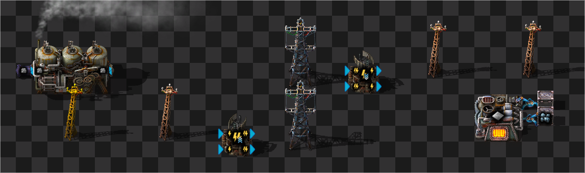
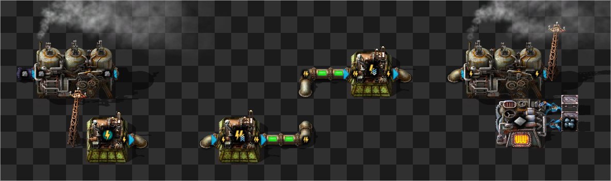
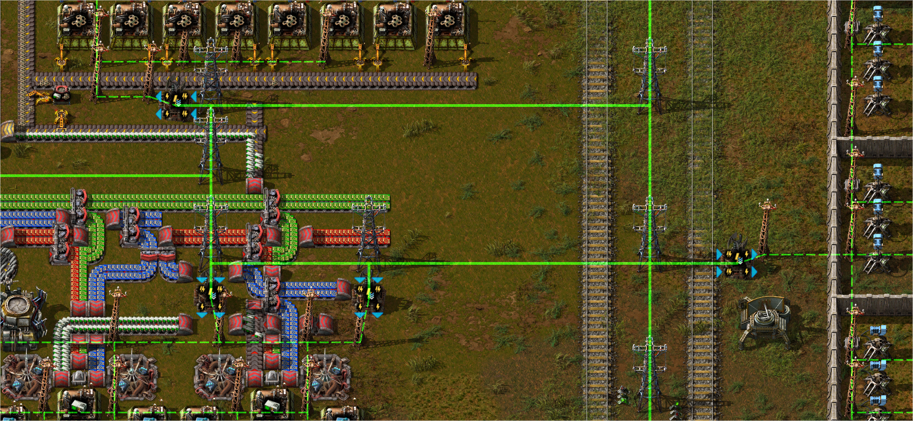
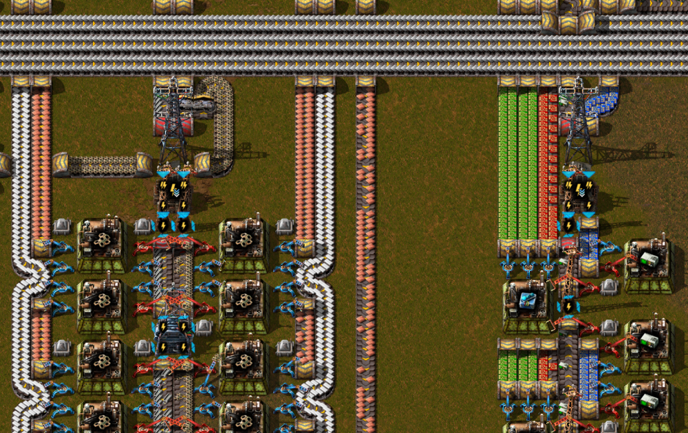

## The [Fluidic Power](https://mods.factorio.com/mod/FluidicPower) Experiment <author>stringweasel</author>

Ever since my education in Electronic Engineering I've seen the flow of electricity in everywhere I look, especially. For example the backward-travelling wave of cars (read *electrons*) inching forward in traffic is an the flow of electricity. Even more interresting is how close the flow of electricity is to the flow of fluids. When I flush the toilet and it creates a whirlpool I see an inductor being charged up through a capacitor. When I suddenly close a tap and I hear the water hammering in the pipes I see a inductor's voltage spike that's used for [Boost Converters](https://en.wikipedia.org/wiki/Boost_converter). Wouldn't it be cool to have this behaviour of electricty in Factorio?

### Why is it hard?

Vanilla Factorio's electricity is ideal - meaning there no resistance in the wires. Your electrical grid can transmit infite power over infinite distances indefinitely. It's almost like they strung cryogenically cooled [super-conductors](https://en.wikipedia.org/wiki/Superconductivity) to the cheap small wooden power poles. This works very well for the goals and constraints of the game and fits most play-styles perfectly. However, there's always been a few players looking for more of a challange who wondered if electricity could be made [more realistic](https://forums.factorio.com/viewtopic.php?t=68761). Players who want use transformers to avoid some kind of voltage drop over distance.

Recreating realistic electricity in (arguably) out of scope for vanilla Factorio - so it's up to mods to fill this slightly sadistic niche. Factorio mods can only modify [certain aspects](https://lua-api.factorio.com/next/) of the game and these options on how to mod electricity is very limited. Therefore modders have come up with some interesting workarounds. One of the main problems that once power poles are connected by copper wire the game will automatically transfer electricity internally, and it cannot be changed. The only real access to the power network is to artificially supply or drain electricity by using an [Electric Energy Interface](https://wiki.factorio.com/Prototype/ElectricEnergyInterface) - which is an modding tool.

It's possible to manually remove the copper cables from the power poles to manually handle electricity flow, but it will always also remove the visual copper connection which looks odd. And that can still leave you to calculate the the transfer of power yourself in the mod and artifically manage the power network, but calculations done in the mod will always be orders of magnitude slower than the game calculating it itself. Which is why the Factorio developer Rseding91 had the following to say a few years ago after someone asked for [voltage drop](https://en.wikipedia.org/wiki/Voltage_drop) to be implemented.

{
    quote:
    [Voltage is] not the only thing you're going to be worrying about dropping. Your UPS will TANK once you build more than a few of anything if you used such a mod :P

    - Rseding91, Factorio Developer
    - link: https://www.reddit.com/r/factorio/comments/6wwkhx/comment/dmcea1c/
}

This does not of course not mean it's impossible. Mods have found beautiful ways over these limitations, or even sometimes created the same gameplay without the requirements of heavy calculations. 

### A Short History of Electricity Overhauls

One of the first ones power overhaul mods was probably [Flow Network](https://mods.factorio.com/mods/Simdezimon/flownetwork) - made in the time of Factorio 0.13. How it works in a nutshell is that a custom accumulator is placed on each power pole, and the copper wire is replaced with red circuit wire to stop the vanilla electricity transfer. Energy is then distributed manually between these accumulators with a custom formula - very similar to the vanilla fluid simulation (?? GET FFF). Unfortunately, this is very slow, as _all_ electricity calculations are done in the mod (in Lua), which is way slower than when the game executed the calculations internally (in C++).

// Download this image and host it on our server


Another try was mod that came around in Factorio 0.15 called [High Voltage](https://mods.factorio.com/mod/highvoltage). This is quite an interesting mod with a lot of moving parts. Electricity is distributed at either high or regular voltage, where the transformers and other equipment are either accumulators or Electric Energy Interfaces. The high voltage power distribution is then calculated manually with custom forumalas - very similar to what Flow Network did. This allowed the author to introduce interesting mechanics like transformers requiring time to "spin up". Regular votlage electricity - that powers your machines - is distributed using copper wire, just like in vanilla. This means the amount amount Lua calculations is much lower. However, to introduce voltage drop over distance the author added a mechanic when the power pole is too far away from the transformer. When this happens the power pole is silently replaced with a pole with a supply distance of zero, which means the pole will still be connected to power, but it cannot transmit that power to any machines. Quite an brilliant sollution.

// Download this image and host it on our server


Both of these mentioned mods was very performance heavy and would very likely not scale with big factories - and they were also never updated. In my opinion the best modern solution is likely [Power Overload](https://mods.factorio.com/mod/PowerOverload) by Xorimuth. Here the goal is to differentiate power grid into subnetworks using transformers. There is no real difference to power before and after the transformer, but the transfer of power is also calculated in the mod itself. However, the goal here is slightly different. If a given sub-network has a power pole drawing more power than it can handle it has a chance to explode! What makes this mod amazing is how clean it looks and feels with all the copper connections still showing. This is because the bulky machines like Electric Energy Interfaces that he requires for power manipulation is on a completely different surface - all connected by a trans dimentional copper cable!

// Download this image and host it on our server


TODO Mention transformators?

These mods are all brilliant in their own way and can create amazing gameplay. However, I was wondering if electricity can be even more realistic? Can it mimic fluids even more which will inherently drop off over distance, limit throughput, and thus require higher votlages?

### What did I do different?

Luckily, Factorio does have a built-in fluid simulation that is very well optimized and runs in C++. This simulation manages the oil in your storage tanks and the steam in your nuclear power plants. It's not perfect, and can cause many headaches, but it works. This simulation is exactly what's required to mimic electricity flow as a fluid - so I set about trying to implement it.

After many hours of mucking about in the Factorio [datastage](https://lua-api.factorio.com/latest/Data-Lifecycle.html) and struggling with fluidboxes and composite entities for way too long I finally stumbled onto a working solution. 

{
    juxtapose
    
    

    caption: Example power distribution using Fluidic Power (left side of slider) and what is actually built by built (right side of slider). On the image from the left it shows power generation, stepping-up voltage, stepping-down voltage, opower usage.
}

In essence I converted electricity into a fluid - which I call the power fluid - and then I turn all poles into pipes. This means the power fluid will flow to other poles like a fluid, just like water or any other fluid, and from there power your entities. The unit of this power fluid is in Joule (for example `10kJ`), which means it's _energy_ that's distributed through the poles. The unit could likely have been Coulomb (as in [Electric Charge](https://en.wikipedia.org/wiki/Electric_charge)), but using energy integrates easily with Factorio's mechanics. 

To generate the power fluid I simply run an assembler that creates the fluid at the correct pace relative to it's power consumption wiTo turn the fluid back into electricity.

```
// Power production dictates the assembler power consumption
power_production = (fluid_fuel_value * units_per_craft) / crafting_time

// Power consumption dictates the generator fluid usage rate
power_consumption = fluid_fuel_value * fluid_usage_per_tick * 60
```

Next up is transformers, which should a part to play in a mod like this. In the real world a transformer steps up the voltage for more efficient (read _easier_) power distribution, or more simply. Fluidic Power does not have voltage to step up, but the throughput can be made easier by simply making the fluid energy unit higher. For example, "high voltage" can be emulated with the power fluid's unit being `1MJ` instead of `10kJ`. What I really enjoy about this implimitation is how brutally simple these transformers are to create. All the mods I mentioned had to manually calculate the power transfer over a transformer, whereas I simply had to create an assembling machine. The recipe is then the total input and output fluid energy should be the same, but in different units. The time to craft of this recipe, or how much fluid units it can transform, is then the power input/output of the transformer!

```
// Transformer Step-Up Recipe
1000 units of 1kJ fluid = 1 unit of 1MJ fluid

// Transformer Power Rating
power_rating = fluid_output_amount * fluid_output_unit / time_per_craft
```

With a little fiddling this resulted in some intuitive and fun gameplay - or well for most of the time. It's designed so that only the lowest voltage can power your machines or accept generated power. Then, once the voltage is increased to aid distribution the high voltage fluid can _only_ flow through big power poles. And these big power poles cannot power any machines or accept any generated power. This is likely my *favourite* part of this implementation. It means that there is an inherent incentive to create a high voltage backbone throughout your base, and everywhere you want to use power you would need transformers.



Finally, having a power simulated as a fluid the design for accumulators changed. It's no longer an smart entity that only accepts surplus power, and releases all it's energy when it's requried. No, now it's a simple storage tank which acts like a big capacitor. It's possible to create the same behaviour with fun circuitry, but without circuitry still works fairly well.

{PICTURE OF MY OVERLAY?}

All-in-all I was suprised that I found an implemetation that furfilled most of my goals and inherently created the challenges and obstacles that I visioned it to have. However, the Factorio engine isn't designed for this, and I faced quite a few obstacles to get it to work. And some of them are still quite prevalent.

### What obstacles are there?

Is this neccesary?

### Is the performance playable?

There is a reason why electricity is implemented in Factorio as it is. It allows us to build factories at size scales that still blows my mind. 

Therefore I built a pure Fluidic Power base to benchmark with - with the help of my friend JanKrater. My goal was to think of the most performance efficient way to build a base, and then do the exact opposite. This resulted in a spaghetti base with way too many power poles, belts and way too many lasers. Importantly, it manages to produce science at an steady 45 SPM, and draws about 600MW.

{ 
    Map view to save file 
    caption: The benchmark Spaghetti Base running at 45 SPM (download here)
}

This base still runs at around 70 UPS on my old PC (i7-4770k 3.5GHz) - which means it takes `~13.7ms` to update the whole base once. This number is also shown below in the "show-time-usage" debug output. Interestingly it also shows that my mod script (`mod-FluidicPower`) has a neglible effect on the performance (`~0.05ms`) because it uses the in-game fluid simulation. This is because the calculations my mod does is minimal, but it does induce many more fluid and power calculations that the game calculates, which has a much larger effect.


However, it initially confused me that game seemingly spends most of the it's time in the `Electric Network`. My expectation was that the `Fluid Manager` would take be the biggest calculation hit, but instead the output shows that the `Electric Network` (`~10ms`) is using over 70% of the update time (`~13.7ms`), and the `Fluid Manager` (`~0.03ms`) seems not to be doing anything at all. This doesn't make any sense, because the amount of fluid calculations should be a massive performance drain. I definitely needed to consult some expects so I headed to the Technical Factorio community - where they squeeze Factorio's performance to it's [absolute limits](https://www.reddit.com/r/factorio/comments/nmxayx/new_ups_record_40k_spm_60_ups_no_mods_details_in/).

Here the brilliant mathematician SteveTrov explained to me why the in-game time usage can be misleading if don't know how it works behind the scenes.

{
    quote

    "Firstly the time usage stats are confusing because the fluid and electric network update are run in parallel threads. This is roughly what happens most of the time:

    1. The electric network thread is started and the electric network update timer is started. 
    2. The heat update thread is stated
    3. Multiple fluid update threads are started. 
    4. When the electric update thread finishes the time used is recorded under electric network update. The fluid update timer is effectively started now
    5. When the fluid threads have all finished (they normally do before step 4) the fluid update timer is stopped. 

    So the effect of this is that the fluid update time is nealy always very low."

    - SteveTrov 
    - [source](https://discord.com/channels/579345487371567105/579346716243787782/855875612274851881)
}

This essentially means that the Fluid Manager's time usage is more related to the Electric Network's time usage. It's not possible to decern between the two using only the in-game information. I had to dig further. This is where [flame_Sla](https://www.reddit.com/user/flame_Sla/posts/) helped me out and said I had to download [Very Sleepy CS](http://www.codersnotes.com/sleepy/) to see detailed information about which C++ functions are called most often. Their community often uses this tool optimize the worlds most largest and most UPS efficient megabases. The output of the tool shown below, with the C++ functions that take the most time listed in descending order. flame_Sla did mention not to focus on the absolute time shown, but rather use it as an metric to see the biggest culprits.


This showed something that I did not really expect. The fluid system (`FluidSystem::update`) was one of the main culprits as expected, but the electric network was _still_ taking even more processing time! It turns out the main problem is `FlowStatistics<ID<...>...>::onFlow`, which is called mostly by the electric network. These [flow statistics](https://lua-api.factorio.com/latest/LuaFlowStatistics.htm) are simply used to store statistics so that you can view it on a graph, eg. for power or production or biter kills. This means that that the game is not only slowing down because of all the new fluid calculations, but also because all the new graphs to draw!

Unfortunately, this is probably the fundamental drawback in this mod, and it doesn't currently have a workaround. The Factorio engine is built to have only a handful of electric networks, typically even only one. The game needs to store and update that information for every power network you have, which will be only a few of datasets. On the other hand, Fluidic Power is designed so that _each and every_ power pole is a single electric network. The Factorio engine will then attempt to store and update information each of these electric networks - which in my benchmark is about 2800! That's at 100 times more graphs to store information on (usually). This has been a known issue for some other mods, for example the [Ruins mod](https://github.com/Bilka2/AbandonedRuins/issues/20), but Fluidic Power takes this to a new extreme. It's almost impossible to say how much faster it would run if the statistics was disabled, but it is definitely the current bottleneck.



That said, I was suprized that the game didn't slow down even after I continued expanding after an initial rocket launch while building a super spaghetti and inefficient base. It still ran at a smooth 60UPS. And this is a worst case! For a best-case scerario - my first benchmarking save I built in the editor to be as UPS efficient as possible. It could run a 90 SPM base at more than 220 UPS! Funnily enough, in Fluidic Power solar farms are way worse for UPS, and I could only get around 140 UPS on a solar base.

Therefore, I can confidently say that you will be able to easily launch a rocket without having your UPS drop below 60 UPS - assuming you don't have a really-bad-potato PC or you're deliberately trying to break the mod. Megabases are likely not possible, but a normal game will not neccesarily TANK your UPS as Rseding predicted. This is because Factorio is really well optimized, even when not running as it was intended.

### Should you play it?

Love the feeling that there is actually electricity flowing in those poles