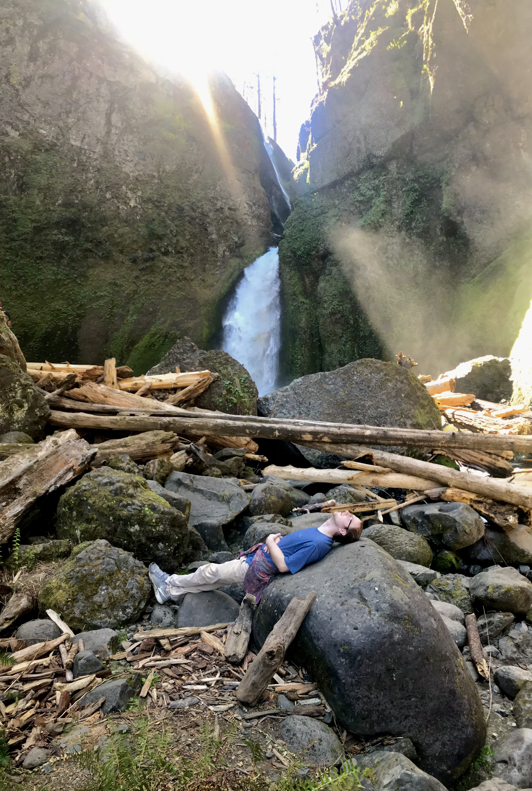

# Nauvian Perspective: Franqly <author>stringweasel</author>

The fastest speedrunner in the world - at time of writing this - is a newish player called Franqly. He joined the Factorio speedrunner community recently with his first entry on [speedrun.com](https://www.speedrun.com/user/Franqly) only in October last year. However, today he is out-running legends like AntiElitz and Nefrums, and is the only player alive that has single-handedly finished Factorio in [90 minutes flat](https://www.speedrun.com/factorio/run/y2xelq5m). In the time it takes you to watch the Bee Movie he can complete everything from crash landing on Nauvis to launching the rocket.

It's no suprise then that Franqly was recently accepted to take part in the [Summer Games Done Quick](https://gamesdonequick.com/), or SGDQ for short, which is happening from 4 to 11 July 2021. This event is an enormous yearly speedrunning marathon which showcases over [140 different runs](https://gamesdonequick.com/tracker/runs/SGDQ2021). It even sports various big names such as [TheMexicanRunner](https://www.speedrun.com/user/themexicanrunner) and [mitchflowerpower](https://www.speedrun.com/user/mitchflowerpower). And it's for a great and noble cause too! The goal of this marathon to raise funds for [Doctors Without Borders](https://www.doctorswithoutborders.org/), for which it's **the largest fundraising event in the world!** Being accepted into SGDQ is no small feat either - this year the event received almost [2000 submissions](https://gamesdonequick.com/submission/all) of which only about 150 is accepted to take part. Talented Factorio players have submitted their runs in the hope to join this prestigeous event in the past, but was denied because Factorio was not "officially released".

{map franqly.zip caption = "The base that Franqly launched a rocket from in under 90 mintues. A part of this base can also be seen in the unofficial Factorio [Hall of Fame](https://mods.factorio.com/mod/HallOfFame)."}

## Speeding Through Factorio

Currently, Franqly is king of the `Any%` speedrunning category. The rules for this category is simple. The run is completed by launching the rocket by yourself. You are free to change the map generator settings, including enabling Peaceful Mode and using a specific Map Seed. And the importing of blueprints is not allowed, but you may use blueprints created in the run. The rest is up to you.

Finishing Factorio in 90 minutes is no trivial task. There's a reason the `There's no Spoon` achievement is finishing Factorio in under only _8 hours_! It's also one of the few games that has no bugs that can be exploited during speedruns! Rather, the factory needs to be designed and built perfectly to research as fast as possible while still expanding production as fast as possible to then research _even_ faster - all to launch the rocket in the shortest time. Runners will easily spend hundreds of hours designing and fine-tuning their factories to maintain this fine balance of research and expansion. Luckily the legendary runner Nefrums created a [helpful beginner's guide](https://www.speedrun.com/factorio/guide/jg8lg) for the community on how to design such a base. Nefrums really plays a big role in the community and a few top speedrunners even use Nefrums' personal base design for their own runs.

{
    twitch embed
    <iframe src="https://clips.twitch.tv/embed?clip=SoftPreciousVampireOSfrog-qkzdCpz4HTV3kH5X&parent=localhost" frameborder="0" allowfullscreen="true" scrolling="no" height="378" width="620"></iframe>
    caption = "Rain9441 pole dancing during one of his practice runs in preperation for a much anticipated 100% Speedrun."
}

However, even if the factory design is perfect, it will take even more time to practice and perfect the actual building of the factory. There are many different approaches and strategies to speedrunning, but they all require runners to perfectly balance many different aspects of the game all while racing against the clock. One example is hand-crafting where some runners have pre-calculated lists with exact amounts of what they need to craft at specific times to always be ready for the next build. Some also need to be able to build the most of the factory from memory, sometimes having only pictures on hand as reference, all while already being under time pressure. And because a factory is such a complex mechanism one wrong placement can easily cost you the title. 

{ twitch embed
    <iframe src="https://clips.twitch.tv/embed?clip=GeniusStrongPeachMVGame-FoTU1sHX3_UzpcSk&parent=localhost" frameborder="0" allowfullscreen="true" scrolling="no" height="378" width="620"></iframe>
    caption = "Legendary speedrunner [Nefrums](https://www.twitch.tv/nefrums/) makes a tiny mistake that clogs a belt and ultimately cost him the run. Did you catch it?"
}

## Who is Franqly
{*conor please change code blocks into quotes. I have them as code to make it easier to read for now*}

Now, who is Franqly? The speedrunning scene was dominated for a long time by names like AntiElitz, Nefrums, and Phoenix27833 - to name only a few. However, Franqly soon came around, and through practice and dedication he became one of the best. I reached out to him to ask him a few questions about his time in Factorio and how he managed to reach the top so fast after only speedrunning `The Legend of Zelda: Ocarina of Time` a few times. He was very gracious and gave us a glimpse into his Factorio career.

*Is there someone specific that got you into Factorio, and how much time have you spent in Factorio?*

`No one specific.  I can't quite remember how i found it, but I probably saw someone playing on twitch.  I thought it looked like s**t tbh, but was interested in the concept.  Then a few months after, i saw it on steam.  It looked much better with .12, and decided to pick it up.  I had about 1500 hours before starting to speedrun. [I am at] about 2200 [hours] now.`

*When did you start speedrunning, and is there someone who inspired you to start? Is there someone now that you see as a type of mentor?*

`I started relatively recently, about August last year.  I had contemplated it in the past, as I had watched Anti's streams off and on for a while.  Nefrums created an introduction to soeedrunning guide, and that gave me the push to try it.  I'd recommend that guide to anyone thinking about trying out factorio speedrunning.  I would consider Nef the most mentor like person in the community for me, but everyone in the discord and on twitch chat chimes in with advice and strategy ideas, and that help me come to speed very quickly.`

*Speedruns tend to look very similar between different players to the untrained eye. What sets your run apart from the others?*

`I think what sets me apart from anti, nef, and other talented runners and planners is having never designed a base myself, I'm not tied to any initial concept of what the run is suppose to be, what it specifically was designed for.  Unfortunately, I don't have the creative or intellectual ability to design a run like i can perform.  But i can analyze well, and i can figure out micro optimizations, at least for my own play-style.  I also practice all the details in short segments, in a very grindy fashion, and that let's me have very consistent runs with little to no mistakes.`

*Do you think a large part of your success is that you practice more? Not so much optimizing the factory, but rather your play-style? As you said, but choosing optimal routes to run for example. Do you think you practice these techniques more that other top runners?*

`I can't say for sure.  I know i do all my practicing offstream, as i think most speedrunners do.  If i had to guess, yes that would be the case.  I've been in between work this last year and it gave me a lot of time.  Now I'm at 56hr/week. Most others in the community have full time jobs.`

*What it the hardest part of speedrunning Factorio? How does this compare to speedrunning other games*

`The hardest part is the part i avoid, the design of the build from beginning to end.  I absolutely have stood and the shoulders of giants, in particular Nefrums for the current design we both run.  I was pretty hesitant to approach speedrunning the game in this way, but I haven't really received backlash from others in the community, and Nefrums has been completely on board and very helpful, and of course I didn't want a one-way street, so I've tried contributing in ways that use my strengths.  Compared to other games, what really stands factorio apart is that every single action has a ripple effect to the rest of the run.  It is basically impossible to launch the rocket under the same conditions as any other run.  In level based games, generally each segment will play the same everytime.  I can think of rpg speedruns being kind of on the level of early actions having effects throughout, but even then generally strategies are made to resync progress or adapt to a limited number of alternatives.`

*I see you also did Zelda Speedruns in the past. How do you compare Zelda speedrunning with Factorio speedrunning?*

`Completely different to Zelda!  Pretty much on every level.  I will say, i learned how to grind practice effectively, and that translated well.  I was never all that good at Ocarina of Time, but I really enjoyed it all the same.  I've dabbled in a few other games less seriously, including SM64, super metroid, SM sunshine, hollow knight, and celeste.`

*What is your favourite part about speedrunning? And the part you dislike the most?*

`My favorite part is the progression of skill, feelings of getting better at something.  Speedrunning becomes very difficult to maintain motivation for after "hitting a wall" with improving your skills, and much less enjoyable.  I've found taking regular 1-2week breaks has been very beneficial to not reach a level of burnout, so it continues to be enjoyable longterm.`

*How often do you practice/plan for you runs? And how long did you do speedruns before you were competing with the top runners?*

`I pretty much live, eat, breathe, sleep with Factorio when I've learned a plan and practice it.  I do segmented practice in 2-3 minute chunks, over and over, trying out different movement routes or building placement order until i arrive at something I'm comfortable with and can consistently do fast.  While doing runs, i make mental note of segments that didn't go well, and later grind those again.  I began improving my times rapidly with this approach.  With the right amount of free time, determination, familiarity with the game, and general gaming skill, i was able to achieve the wr in about 5-6 months.`

*Why did you decide to send a submission to SGDQ? And were you excited when you received the "letter" saying that you're in?*

`I've been watching gdqs for years.  I wasn't really expecting to get in, so it was quite a surprise!  I'm very happy to be able to showcase factorio to a larger audience. just thought, what the hell, may as well apply`

*Do you still play Factorio "normally"? And if you do, is it hard to "slow down" and play it in a more relaxed fashion?*

`Not recently, no.  I tried Pyandons suite a few months ago, got overwhelmed and shelved it.  The base game is definitely "tainted" for me at this point, but I think that is true for most players that have 2k+ hours in the game.  We can never get that first play-through experience again.  I play other games to relax.`

*What other games do you enjoy playing? I saw you're currently into Satisfactory?*

`Yeah, Dyson currently, and satisfactory are both great and i highly recommend both for those that enjoy factorio.  I have played a very wide range of genres in the past, too many to list.  In recent years I've really narrowed my focus to strategy games.  Eu4, slay the spire, sc2, and dominion are also recent games I've played.  They address different itches.  I played copious amounts of WoW and later LoL.  Too much time, lol.`

*How do you find the Factorio speedrunning community? It seems that AntiElitz and Nefrums has created a community with great sportmanship, where runners are competivive but still celebrates others achievements.*

`As i mentioned before, i had watched anti stream off and on for a fews years before joining. I think our community is great!  Good mix of personality and backgrounds with a spirit of cooperation.  It's not overly competitive, but enough so it encourage growth.  I'm not personally super intwined in goings on, but i do enjoy popping in for some discussion once in a while.`

*Do you like watching other streamers/lets-players? If so, who are you following most at the moment? How about anyone else participating in the SGDQ?*

`I used to watch on Twitch a lot more than i do now.  When I do, I've been watching Arumba, Zoast, Cheese, and a few others.  I'm most excited for super metroid at GDQ, oldie but a goodie.`

*Do you have any other hobbies/activities/profession that you like doing outside of the videogame world?*

`I enjoy spending time with my wife.  We watch shows, go on local walks or drive out to scenic hiking spots.  Nothing too crazy, my life is pretty chill atm.  Looking forward to having kids, which we're delaying until we have a house.  Saving as much as we can.  Housing market is ridiculous though.`

{conor please constrain this picture, it's quite big and shouldn't fill the entire screen}

## The Event with a Good Cause

We are all very excited to see Franqly take part in this great event where he will be representing Factorio! He has worked very hard and spent ~~countless~~ many hours achieving this amazing goal. And hopefully this will be the first inclusion of many of our favourite factory building game in mainstream events! 

We ask you all join and support Franqly with us! His will be joined in his stream by [AntiElitz](https://www.twitch.tv/antielitz) and [Thue](https://www.speedrun.com/user/Thue), and also [XenoCyber](https://www.twitch.tv/xenocyber) who will guide us through what Franqly is doing. His run will happen on the [GDQ Twitch Channel](https://www.twitch.tv/gamesdonequick) on Friday, 9 July, at 2:18 PM UTC time. 

{ countdown timer to 9 July 2021 : 2:18PM UTC }

There will likely be people hanging out watching the run in our [Alt-F4 Discord](https://discord.gg/ceKebbY) and the [Factorio Discord](https://discord.com/invite/factorio). So dust off your Twitch emotes, warm up your witty remarks, and mute your zoom meetings. We're going to watch Franqly show the world how Factorio is speedrun!
 
