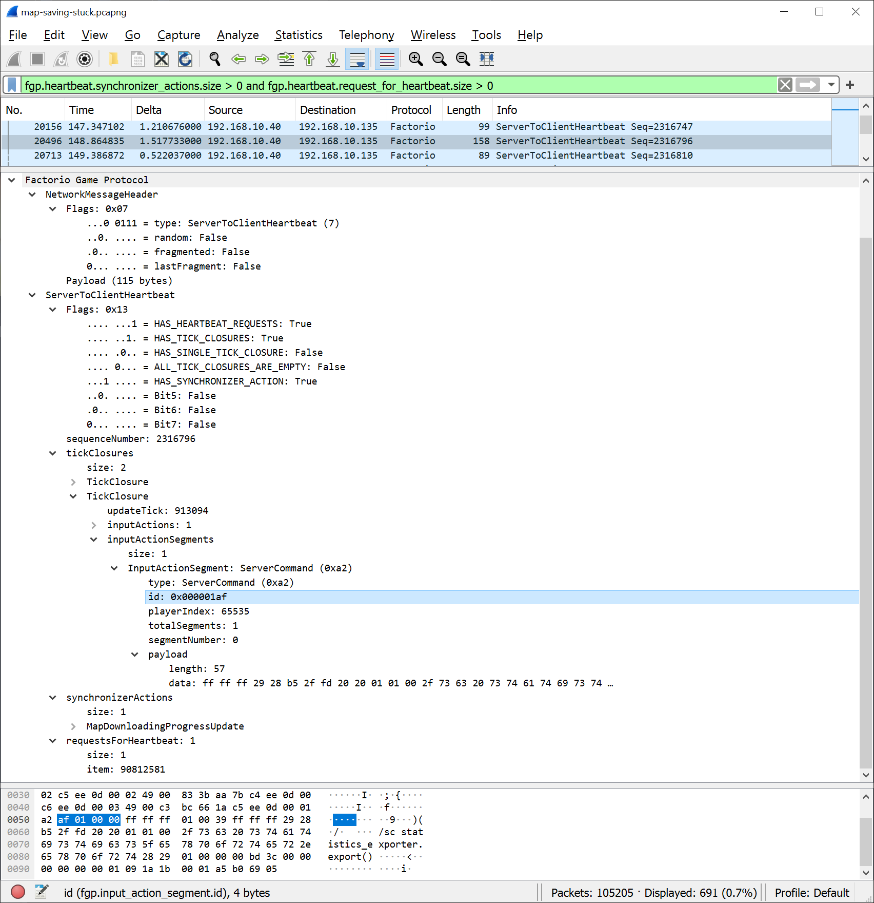

## Wireshark Dissector for Factorio <author>Hornwitser</author>

This is a project that started around the time of the [Gridlock Cluster](https://www.reddit.com/r/factorio/comments/c98wui/the_gridlock_cluster_a_clusterio_based_event/) event.
I was investigating some issues with clients randomly dropping from the game, which brought me into examining packet traces using Wireshark.
These packet traces are basically binary logs of packets that are sent and received by the network card of the computer that captured it.
To understand what this binary data means, Wireshark decodes it with protocol dissectors, something it has for protocols spanning all facets of networking.
But it doesn't come with a dissector for Factorio, so when I used Wireshark on Factorio traffic, all I could see was hexadecimal goobelygook being sent between the server and the client.

After looking at bytes going back and forth between the server and the client, I wondered: How difficult would it be to write a dissector for Wireshark to decode this data?
I looked into it and found out that the easiest way to write it would be in Lua, which can then be loaded as a plugin by Wireshark, in a system not too dissimilar to Factorio's mods.
And so it was that I started staring at bytes in hexadecimal and figuring out the structure to it all.
It became a bit of a personal challenge to figure out what each of the bytes meant and have them decoded into Wireshark.
I think I worked on the dissector for around two weeks before I sort of gave up on it.

It wasn't that I couldn't do it.
It just wasn't worth all the effort I put in.
You see, the output of my dissector wasn't all that useful in telling what's going on.
It looked something like this:

Sure, it would decode the framing and reassemble fragmented packets, but unless you happen to know what weird, odd, strange or coloured data means, it just wouldn't be of much use.
This is also one of the reasons I haven't released this dissector: It's better than looking at hex data, but not by much.
It doesn't give you the sort of deep insights into the inner workings of the Factorio protocol that you'd expect from any of the other protocol dissectors Wireshark has.
And so it became that this project was put on the shelf, not to be looked at again.

In the past, Factorio developer _Twinsen_ has talked about making a dissector for Wireshark in [FFF #196](https://factorio.com/blog/post/fff-196).
The post contains quite a lot of internal information about the protocol which I could have used when I made my dissector, but I chose not to look at it as I wanted to make mine without relying on internal information from the game source code.
An obvious question poses itself though: Why _not_ use _Twinsen_'s dissector instead of writing my own?
Well, for a start, it's not publicly available, but more importantly, it _can't_ be made publicly available.
The way _Twinsen's_ dissector worked was to build Factorio as a shared library, then build a custom version of Wireshark that linked to that shared library.
Now, Wireshark is licensed under the GPL and you are not allowed to distribute GPL code that links with proprietary code, so to distribute the dissector Wube would have to release Factorio under the GPL which is obviously not going to happen.

A few weeks ago though, I realized something.
The Windows version of Factorio ships with a `.pdb` file that contains debug symbols.
The developers use it to generate symbolized stack traces when the game crashes so that they can see where in the source code the crash happened.
Luckily for me though, it's stuffed with other kinds of debug data too, like the kind needed to attach a debugger to Factorio and inspect the values of variables stored in memory.
That means it contains type information, which is the structure of the data as defined in the code along with the names of fields and enums.
The name of fields are very useful as it's the label developers put on a piece of data in order to reference it in the code.
Likewise, the enums contain mappings of logical names to numeric values.

I was able to dump this type of information from the `.pdb` file into something readable using the 'cvdump.exe' tool.
Once I had that, it was pretty easy to find the names of the structures from the `.pdb` file and rename all of the fields in my dissector to use them.
I could also get the enum definitions to translate numeric values to logical names for the fields that use them.
After some tidying up of my code and data presentation, I was able to make the dissector output look like this:

No longer does one have to guess what an "Odd Blue" value is: It's clearly the `id` of an `InputActionSegment`.
Now, the type is translated from the machine code looking `0xa2` into the much more friendly name `ServerCommand`.
The only issue with creating the dissector by using data that ships with the game is that it's no longer clearly my original work, which puts the legality of distributing it in question.
Rather than trying to figure out whether I had copyright law on my side, I asked the Factorio developers and they said they were fine with me releasing this to the public.
So if you want to try it out yourself or add it to your toolbox, you can find it in my repository on [GitHub](https://github.com/Hornwitser/factorio_dissector).

Personally, I've used it to investigate networking issues with Factorio, from clients getting disconnected to NAT punching not working. I've also written up some bug reports based on my findings that have lead to bugfixes in the game.
With the move to using names from the Factorio debug symbols, the data it shows has become really clear and informative, at least compared to what it used to show.
It's still more of a tool for people experienced with computer networking and Factorio internals though, so don't expect to understand what all of this means if you're not familiar with these things.
