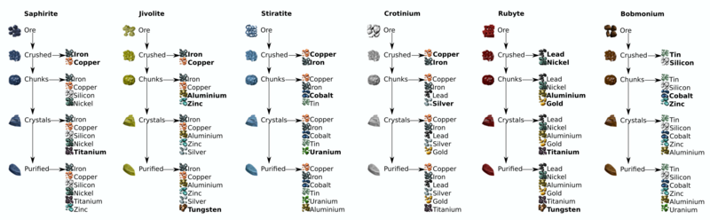
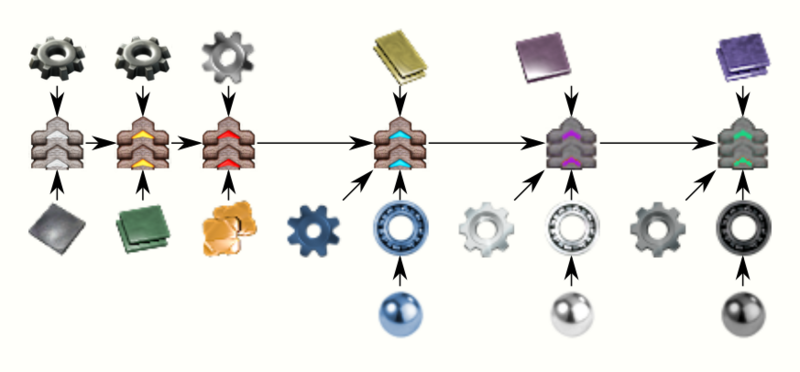
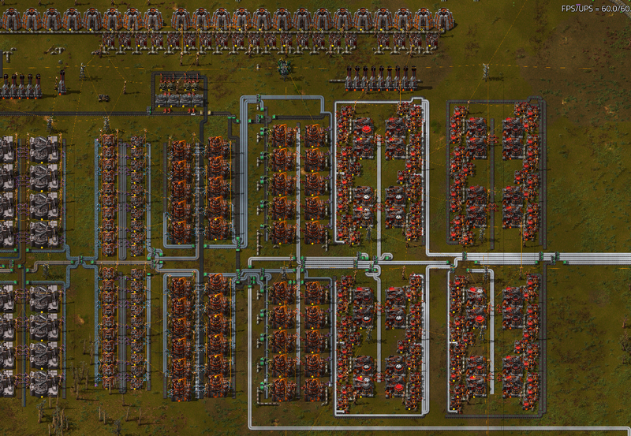
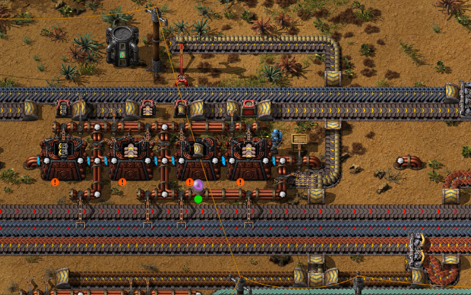
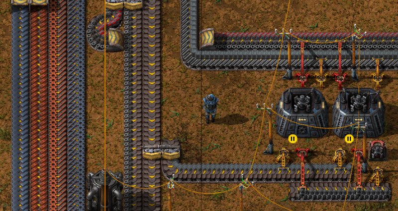
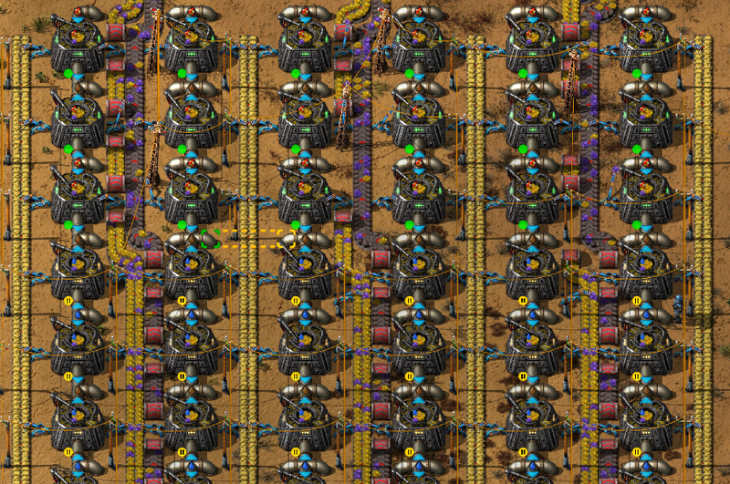
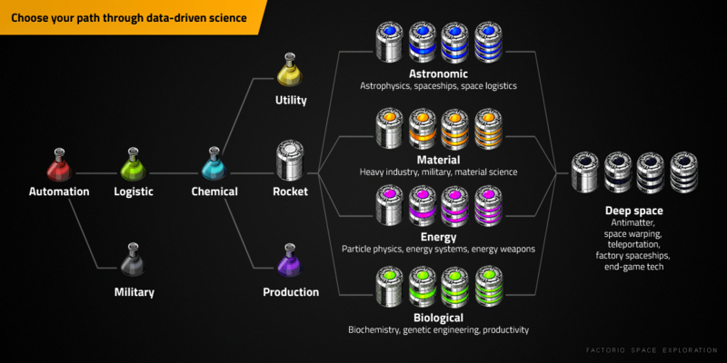
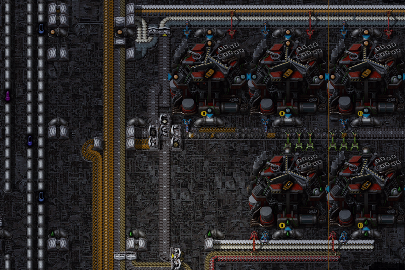
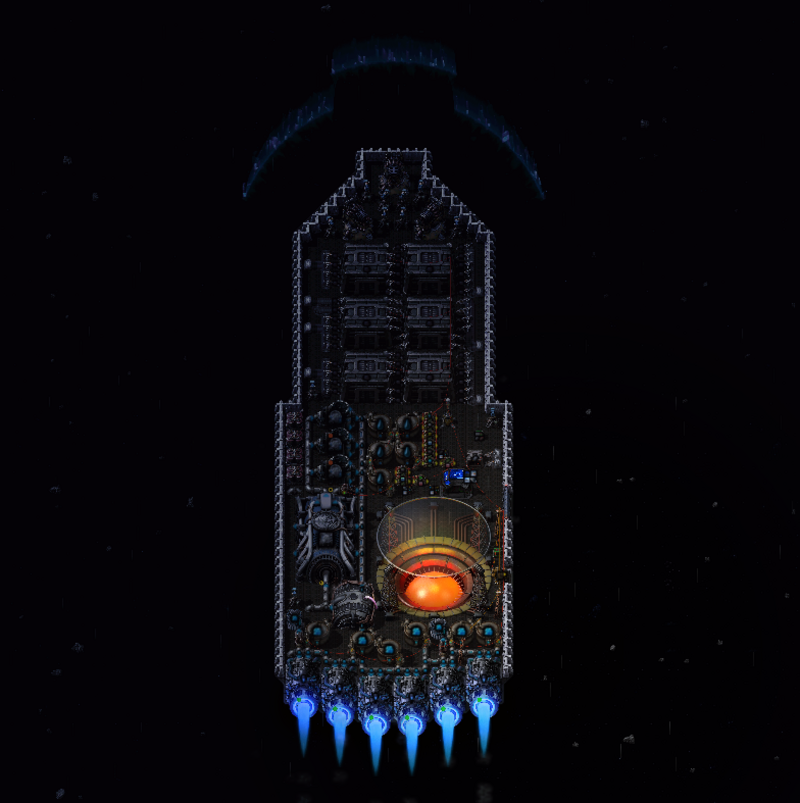
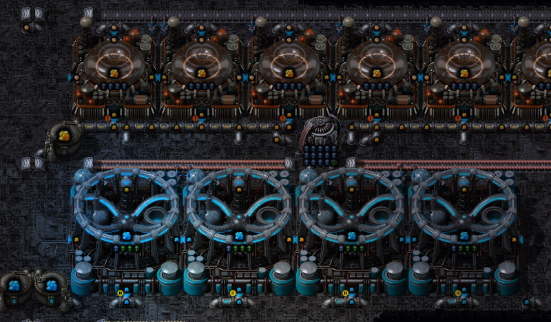

## Factorio Mod Comparison: <author>Laurence? OneCruelBagel?</author>

A lot of the appeal of Factorio for me comes from the many different ways it can be approached – you can concentrate on launching rockets as quickly as possible or you can work on secure defences to hold back ever increasing waves of biters. You could build your base around a gigantic maze of belt spaghetti or maybe you prefer to run clouds upon clouds of bots. You can create a world with massive, dense ore patches to allow you to concentrate on building, or you can set up massive train networks to bring in resources from far across the planet.

And then on the smaller scale, even a simple smelting system can be made in many different ways, perhaps using modules and beacons. The whole game is about solving problems in your own way. This feeling of freedom and variety is only added to by the vibrant mod culture that has been so enthusiastically supported by the developers, from the little quality of life tweaks like long reach or squeak through, up to the massive modpacks that completely change the feel of the game, such as Space Exploration or Angel Bobs. 

According to Steam, I’ve played almost 2000 hours of Factorio in the last 5 years. I know that to a lot of people, those are rookie numbers, but it’s been long enough for me to get a good idea of how the game works and to work through a number of mod-packs. I started off with completely vanilla runs, restarting a few times when I realised I’d made some kind of hideous abomination, until I finally launched my first rocket. I then messed around with railworlds and various megabase attempts before starting my first big [Youtube](https://www.youtube.com/c/LaurencePlays) series back in July 2019 with an [AngelBobs plus Space Expansion](https://www.youtube.com/watch?v=bQvCHSRVcqg&list=PLALTzJaRcgW9qOavYQJ15M0pSoiVedG18) run. This took me slightly more than a year, but eventually I managed to finish the faster than light research and called that game done.

My next modpack was [Space Exploration](https://www.youtube.com/watch?v=oOHkLsSk1wo&list=PLALTzJaRcgW9iPN4iYNTBlz03XpAvkIlD). I started this run pretty soon after finishing AngelBobs and am now about a year and a half in, and I think I’m mostly done, but it will probably take a good few months longer to actually finish it. Finally, in parallel to Space Exploration, I played through [Industrial Revolution 2](https://www.youtube.com/watch?v=LWrAZkapDTU&list=PLALTzJaRcgW8HveofZ0iPpg0u3g6llmNc) with some friends during the second half of 2021. 

So, now I’ve given you a quick history of my Factorio experience, I can start on the main topic of this article – comparing the different mod packs, what they give you and how they differ in feel. I have also made a video version of this article, which you can watch [here](link to follow).

### Vanilla

The original game is, of course, the baseline. It’s where we (probably!) all started and where everything else has grown from. Most of the recipes are quite simple, in that they generally only have a single output – no byproducts to worry about – and there’s usually only one way to make anything you might need. The game starts off very simple with red science packs taking a mere 4 steps – smelting the iron, smelting the copper, making gears and making the pack – but gradually building up. Blue science has traditionally been the great filter – the point at which a number of players find the game has become difficult, due to having to deal with oil, and then it gets significantly harder again with yellow science, largely due to the complexities of making blue circuits. Or rather, the challenge of making green circuits fast enough to keep up with the requirements for blue!

Of course, I’m sure that anyone reading this blog is well past seeing those things as challenges, but I remember back in the olden days when I first started playing, these things certainly seemed difficult!

To the more experienced player, launching the first rocket is merely the early game. Once all the tech is unlocked, it’s time to start building up massive rail networks for moving resources, towns and city blocks for making intermediate components and ranks of rocket silos for getting the space science flowing in. At this point, the challenge of the game is largely in throughput. You need to deal with enormous quantities of the raw materials, processing them en masse to keep the ravenous factory satisfied and compacting them all down into those oh-so-valuable research packs to feed into the science labs. There is no absolute win condition here, it’s just making your factory work faster and faster. 

The biggest challenges in this sort of factory are in the logistics - making sure your rail networks don’t clog, that your smelteries don’t run out of ore, that your design is kind enough to your computer that the game doesn’t grind to a halt. And these are certainly valid challenges and a lot of thought has been put into making this sort of factory run effectively, however I wanted something a bit different, so I started looking at mods. 

### AngelBobs

AngelBobs refers to all of the mods released by a pair of authors – [Arch666Angel](https://mods.factorio.com/user/Arch666Angel) and [Bobingabout](https://mods.factorio.com/user/Bobingabout). In a nutshell, Angel’s mods add extra complexities to recipes, requiring extra steps like crushing ores, or adding to chemical processing systems, whereas Bob’s mods tend to add in extra equipment to help you deal with it, such as faster belts or inserters, or more dangerous biters and bigger guns to help you deal with them. This isn’t 100% accurate, of course, but was the impression I got. 

AngelBobs has a reputation for being enormously complicated – second only to Pyanodon’s - and I can definitely say that the reputation is well deserved. Making iron plates, for example, can be made simply by smelting crushed saphirite ore, but if you perform more steps on it first, such as sorting it, processing it, making it into pellets, then ingots then molten iron and then plates, you can multiply the amount of plates produced per ore by at least 2, or far more if you use modules. 

However, this doesn’t touch on one of the biggest headaches caused by the complications – byproducts. A lot of the mid-game ore refining methods will produce multiple different types of ore – saphirite gives you mostly iron, but also some copper. But if you wash it, you can also get silicon and nickel. Or if you process it again with acid, you get titanium as well. And so on. This means that it’s a careful balancing act to produce the right amount of the ores that you want, without producing far too much of the ores that you don’t need. Now sure, you can store the overflow in warehouses – the mod is kind enough to give you massive buildings to store your products – but they will fill up eventually and cause you problems.

Speaking of byproducts, Angels Petrochem has a very well deserved reputation for complexity. Even finding a chain of recipes that will allow you to make plastic from resources you have is a challenge, but then you realise that you’ve followed the chain through, but you have about 10 different tanks filling up with random gasses. And whilst you can vent gasses to atmosphere, because you’re throwing so much of it away, it takes enormous amounts of crude oil or natural gas input to make a very slow trickle of plastic. Oh, but if you put in another massive processing system, then you can take a couple of those byproducts and squeeze a bit more useful stuff out of them… Except that makes yet more byproducts! 

It has a very different feel to vanilla, and whilst sometimes it feels like things are being made complex for the sake of complexity, and often feels overwhelming, I did enjoy the challenge. The enhanced builds are very nice too – the belts show an excellent example of this. In this modpack, there are six tiers of belts, instead of the 3 from vanilla, each requiring the one from the tier before, plus an additional piece which gets more advanced with each level. For example, a tier three belt requires a tier two belt, plus bronze and steel, a tier six belt requires a tier five belt plus 3 types of nitinol, which only comes from very advanced metal processing, but runs 2.5 times faster than the tier 3. 

You also get the same sort of tiers with trains, inserters, assembling machines, bots, exoskeletons and so on – compensating for the added complexity and throughput required with massively overpowered facilities to help you deal with it all. 

I think this mod probably has the most basic art of the three with different tiers of buildings generally just being distinguished by a palette swap, however it definitely works and looks more than good enough, it never bothered me while I was playing.

All in all, I found the modpack generally well balanced. There were definitely some difficulty spikes, especially when I first tried to make plastic, and I struggled with biters until I discovered how good the plasma cannon is, but generally I enjoyed my playthrough, and found it decently challenging. As is always the case, I definitely have some ideas for what I would do differently if I played again!

### Industrial Revolution 2

The next mod on my list is [Industrial Revolution 2](https://mods.factorio.com/mod/IndustrialRevolution). The intent behind this mod is that you work through a series of different tech levels as you progress – starting off with burner and steam power initially, then moving on to normal electrical systems, then unlocking more advanced machines that operate using lasers. We got off to a good start with this mod, having to run steam pipes to all the assembly machines and inserters was an interesting challenge and something that made a nice change to how we were used to thinking about things. Once we moved to the electrical age, deciding when it was worth pulling up the old, steam powered machines to replace them with electrical ones was also interesting, and provided us with an interesting upgrade path that was a bit more involved than the normal “drag an upgrade planner over everything” method from vanilla. However, unfortunately, whilst it was interesting thinking about the upgrades in a few areas, needing to do them across large areas of the factory did get rather repetitive.

Another interesting addition was the larger number of forms each type of metal could take. Unlike vanilla, which basically just has two (plates and either gears or wire), in IR2 most metals can be in ingot, plate, rod, gear, rivet, beam or piston, which means either a lot more rows on your bus, or a lot more processing when you need to make something. We did get used to this system eventually, but I have to admit that I felt like a lot of it was complications for the sake of making the game harder, and making it take longer. 

Metal processing is done in quite an interesting way – much like AngelBobs, there are various extra steps you can add in to make the process more efficient, but some of the later ones produce byproducts. In this case though, these byproducts are actually vital in some areas, and can’t be made in any other way so you need to balance it quite carefully. Fortunately, this was much less painful than in AngelBobs, making it an interesting puzzle, rather than a major frustration. I think this was well designed. 

The additional graphics for this mod are excellently done. Each of the tiers has its own feel, yet it all hangs together very nicely. It really helps to emphasise the progression from steam to laser. 

Over all, I feel that there are some very interesting ideas in this pack – moving through different stages of technology is a fascinating idea with a lot of potential, however unfortunately the fiddliness of organising a lot of the forms of the metals made some of the builds feel like a bit of a chore. Whilst I enjoyed the Industrial Revolution run, I was quite glad to move on once it was finished, and don’t think I’ll be playing it again. 

### Space Exploration

This brings me on to the third of the mods I wanted to cover – [Space Exploration](https://mods.factorio.com/mod/space-exploration). This mod adds additional late game content after launching your first rocket, allowing you to go off and explore the rest of the solar system and the galaxy, finding new resources and new types of science to go with them. It achieves this very nicely, to the extent that a Space Exploration run feels very much like a vanilla run until you launch your first rocket. 

One of my favourite parts of Space Exploration is how smooth the difficulty curve is. I mentioned earlier how Vanilla starts off with very easy red science packs, there’s a climb to blue and then to yellow. With Space Exploration, the first space based science pack is fairly straightfoward, but made more tricky by having to learn about doing things in space. You then get a choice of 4 different branches of science – astronomic, material, energy and biological, each with 4 levels. You can progress these branches in any order you want, based on what technology you would like to research, but any one of them is a decent step up from the first rocket science, and they get gradually harder as you progress. Finally, once all the space sciences are done, you can start on the final set – the Deep Space Science packs. These are the ultimate challenge in the game, and are the ones I’m currently working on. 

Each of the branches of science have a very different feel and type of challenge. Energy is based around creating different types of particle beam, all of which is very energy hungry. Material typically involves building test packs and smashing them together in various ways, producing mountains of scrap which have to then be dealt with. Astro involves passing huge numbers of slides between telescopes and analysis machines and biological requires growing test samples and analysing them. 

Now, most of this feels like the sort of thing that’s just in the descriptions and it’s just going to be “put ingredient A and B in machine C to get output D”, and whilst it’s true, a lot of the flavour comes from your imagination and the descriptions of how the machines work, the different types of science do come together in very different ways and all have their own unique challenges, so it definitely feels varied, and not just the same procedure repeated in 4 different colours. 

Having your factory spread out across an entire solar system also adds to the logistic challenges. To help out here, Space Exploration gives you a range of transport options from delivery cannons (railguns that can fire a stack of raw materials from one planet to another), rockets (single use devices that are more expensive than delivery cannons, but can transport 500 stacks of anything) and eventually spaceships (custom designed craft that you can configure to do whatever you want, and can carry anything you want – including trains!). Spaceships are very challenging to make and program, but extremely satisfying to use well. 

As you can probably tell, I’m very impressed with Space Exploration, both as a continuation of a standard vanilla game, but also as a mod with its own look and feel. There are a few things here and there that feel a little annoying, or just added to make it harder (such as the very low stack size for naquium products) but it doesn’t have the eye watering complexity of AngelBobs, or the slightly artificial feeling difficulty of Industrial Revolution. The art is great too, all of the new machines are big, chunky, well animated and satisfying to watch (even if the genetics factory looks like a Christmas tree). Overall, this mod is easily my favourite of the three and I wouldn’t hesitate to recommend it as a good starting place for anyone who’s finished Vanilla Factorio and wants to try something that will stretch them a bit further. 

And if you do want to make things a bit more complicated for yourself, I hear it integrates very nicely with Krastorio 2, by the same author. I intend to find that out for myself in the future and will, of course, be streaming it on my [Youtube](https://www.youtube.com/c/LaurencePlays) and [Twitch](https://twitch.tv/laurencestreams) channels. I also plan to take a look at Dyson Sphere Program at some point in the future.

Thanks for reading – I hope you’ve enjoyed this article. Have you tried any of the other big mod packs? How did they compare? 

