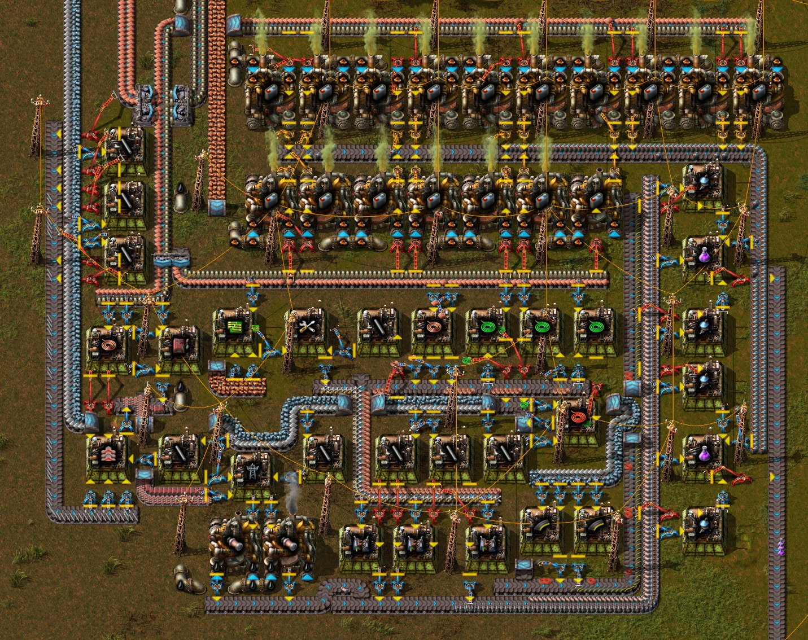
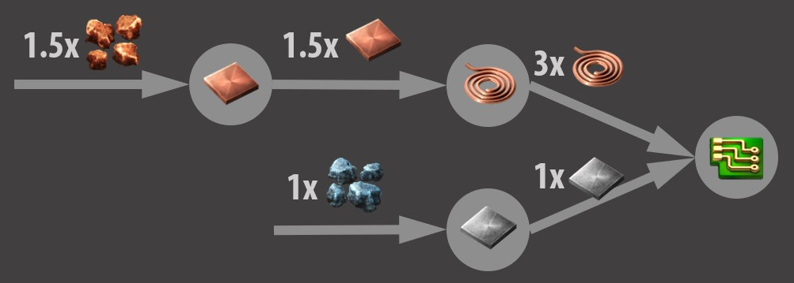
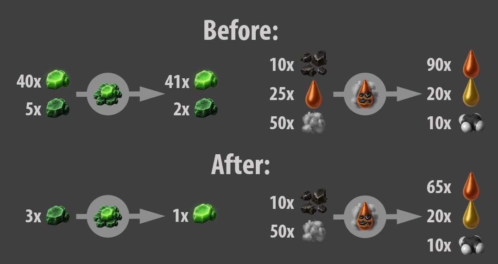

## Vanilla. Shaken, not stirred.

*Vill’s Recipe Randomizer* does exactly what the name suggests - randomizes recipes. On the first sight, this can seem like a very stupid and a very simple idea. However, once you try to make it less stupid, it gets very complicated pretty quickly.

I first started working on this project in September 2020. At that time I was trying to make a mod that’s both simple and unique. It wasn’t supposed to be playable, or even good, just something fun to make. After running into some issues, knowing well I’m making a mod nobody would play anyway, I gave up ~~and never touched programming again~~.

After two other failed projects I came back to Factorio, this time, as a player. I played vanilla, then Industrial Revolution 2, and then I tried Space Exploration. I love playing overhaul mods, because it lets me learn new recipes, discover new factory layouts and solve new logistic problems. But most overhaul mods are very grindy and I get bored quickly. And that’s when I realized that a randomizer mod has in fact a purpose: It’s like an unlimited supply of overhaul mods, but it keeps the vanilla feel! And the biggest bonus for me was that I don’t have to make any new machines and graphics, it’s just messing with letters and numbers.

The mod could simply take each recipe and make it take random items as ingredients. But then it would be pretty useless, because for example red science could take nuclear fuel as an ingredient, but you don’t have it researched yet. So I decided to make it crawl through the tech tree, and for each recipe unlocked, take only the items unlocked before it as potential ingredients. There are of course exceptions in some mods, where you can unlock a recipe before you can even craft it, so I have to be a bit more careful.

You probably wouldn’t want to make an underground belt from steam engines and labs. That would be way too expensive. I needed a way to make the recipes more balanced. So I decided to implement an algorithm that calculates the value of each item based on the resources you need to make it. Let’s say both copper and iron have a value of 1, that means electronic circuits would have a value of 2.5.

Now the randomizer knows it can use for example 1 transport belt (1.5) and 1 copper ore (1) as a new recipe for electronic circuits. There is some variance in the final value. It makes the recipes a bit more unique, but most importantly, it’s easier to find a valid combination, speeding up the randomization process.

At this point I published the mod and from feedback and some testing it became very apparent there were many bugs (of course) and two "big" issues. The word *big* is in quotes, because the mod was still more playable than you’d expect even from a randomizer. However I wanted the players to enjoy it, not just experience it.

The first issue was wood. The default settings made sure wood was not randomized, but many recipes used wooden power poles as an ingredient! As you can imagine, the fix ~~should have been~~ was pretty simple and boring. I added a flag for non-randomizable resources, like wood, and any item that strictly needs an item with this flag as its ingredient inherites it.

The second one was that even though recipes needed the right amount of resources, they often were too complex and felt unfair. A great example is the automation science pack. It is very cheap, having a value of only 3, but it takes 5 seconds to craft. It was used in many recipes like a basic component similarly to iron gears, but it takes 10 times longer to craft. Another example is that an iron gear could require many steps like making them from stone bricks, which could be made from iron sticks, which could be made from pipes, etc. So I made the mod calculate a second value, called complexity, for each item. It takes into account the amount of crafting steps required, the amount of various ingredients (and results) and also the crafting times.

It seemed that I’ve arrived at the perfect randomizer, but again, some issues (and bugs) revealed themselves. Often, many recipes used primarily one resource (often iron or stone) which was kind of bland and you had to scout for far away ore patches, because you needed just so much of the chosen resource. Also, oil was often not needed for launching the rocket. For a given recipe, all valid items were equally likely to be picked, so the items without oil massively outnumbered the few oil products. I tried some strategies to push the algorithm in the right direction but none of them really worked. I could just tell it to use more plastic or solid fuel and such, but what if you want to play with mods and there are even more items to be prioritized? I wanted a universal solution.

And I already knew it, but I was afraid to implement it, because it makes everything way more complicated. This means more development time, more bugs and a potentially way slower algorithm. After trying to come up with a simpler solution I finally decided to go with it.

The solution was to use the amounts of raw resources instead of just the total value. Pretty simple yeah? Well, now instead of doing maths with one number I have to do maths with several and the logic is a lot more complicated. Oh, and also I needed to calculate two sets of values for each item — the original one and the one after randomizing — because for some reason I was not doing that. Similarly to the total value, the raw resource amounts for each recipe may vary a bit, or they can be completely random based on the mod settings. On the default settings, the recipes are pretty random, but the overall cost of the raw resources is similar to vanilla.

And that’s the history of Recipe Randomizer!

Except I left out some BIG issues (notice the missing quotes and the capital letters). Loops contained within one recipe are simple. Before evaluating the recipe, I cut out the ingredients that appear both as an ingredient and as a result. In vanilla, this applies to kovarex enrichment process and coal liquefaction:

Loops with more than one recipe are somewhat problematic. There are no loops in vanilla with more than one recipe (except for barreling and unbarrelling, which is not randomized by default anyway), so they’re pretty easy to miss, but in mods, they are everywhere, also the randomizer might accidentally create a loop in certain conditions. To illustrate the problem we’ll need an example. Let’s take synthetic sapphires in Industrial Revolution 2: Here you can crush a sapphire and then make another one from some of the dust, silica and pure nickel.

(sapphire loop)

The way I resolved this issue is that when a loop is detected, it gets cut open in one point and then the recipes are merged into one. The new recipe is then used instead of the one it started and ended with.

(sapphire unlooped)

And we end up with a recipe to make sapphires while leaving out the confusing details! But what happens when there’s branching loops or loops within loops?

(insert loopy diagram)

Let's just say that things get loopy. I think I somewhat solved it but I won’t go into details here, this is not a graph theory course :D (and I’m not sure the solution works reliably).

And now, time for the biggest issue of them all: recipes with multiple outputs. Let’s take for example advanced oil processing.

(advanced oil processing)

By default, crude oil has a value of 0.4 and we’ll ignore water for now. That means the recipe has a total value of 40. So we know that 25 heavy oil + 45 light oil + 55 petroleum gas should have a total value of 40, but how much of that value is each part? There are many ways to approach this and tackling this issue took the most time and it caused many headaches. Let’s go through the two most different options.

The simplest: Just make each of the results worth an equal part of the total value. This is mostly reasonable, but it breaks when you introduce waste products. For example, the kovarex enrichment process makes 41 u-235 and 2 u-238, the algorithm would assume they both have the same value, but you probably know that u-235 is much more valuable. So this approach is not really usable.

The “best”: Just make each part worth the full value, but keep track of the byproducts which you can subtract later. For example, heavy oil has light oil and petroleum gas as its byproducts in advanced oil processing. That means lubricant has them as byproducts too. If we want to make an express splitter, we need, among some other ingredients, lubricant and advanced circuits. Advanced circuits need petroleum, but we have some as a byproduct of the lubricant so we can subtract it. The only byproduct that’s left is light oil. What do we do with the light oil? We can of course crack it to save even more petroleum. But that takes some water. Is it cheaper to use more water or more petroleum? Well, let’s calculate both options just in case.

As you can tell, this approach is insanely complicated. There are many edge-cases and questions to be answered. Like what do I do with excess byproducts when other ingredients recipe don’t want them? I tried to implement this and I must say, I was pretty successful. It took me only about 100 hours and I had to fix about a million bugs. And what was the reward? Well, this solution is still not perfect, although it comes very close. I also could no longer make sense of my own code. Everything broke every time I tried to adjust something. And most importantly, loading the mod with vanilla Factorio took anywhere from 10 seconds to 10 minutes. Since I want the mod to be compatible with as many other mods (and it working with vanilla Factorio would be nice too), I decided this is not the way to go.

Finally, I arrived at the one I use now. It is basically a compromise between the two approaches described above. It works well enough and is pretty simple. Though not simple enough for me to explain, because I’d need to explain the many other quirks of the evaluation algorithm. It does not perform incredibly well in all cases, but it also does not break in edge cases (I hope).

And that concludes our peek into the inner workings of the Recipe Randomizer. If you have any questions or suggestions, you can message me on [my discord server](https://discord.gg/jn4nRrrB6d). Speaking of which, I’d like to thank all the people who joined it and posted bugs, ideas, tested things or otherwise supported me during the development. The mod couldn’t come this far without you!
