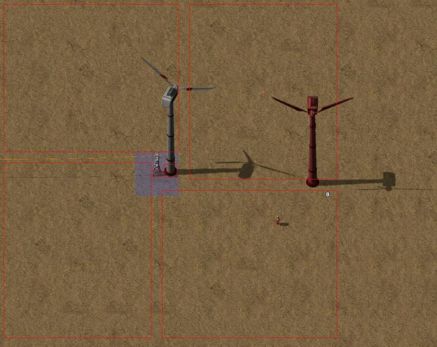
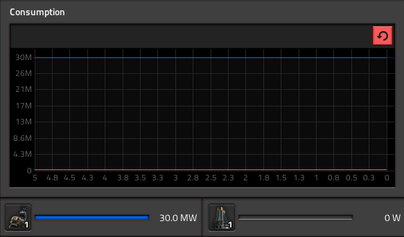
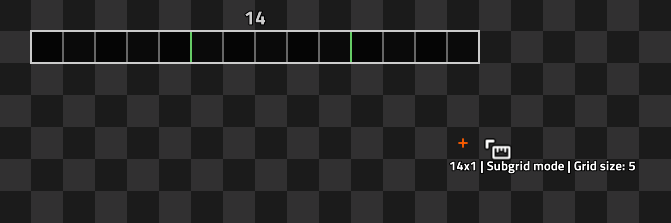
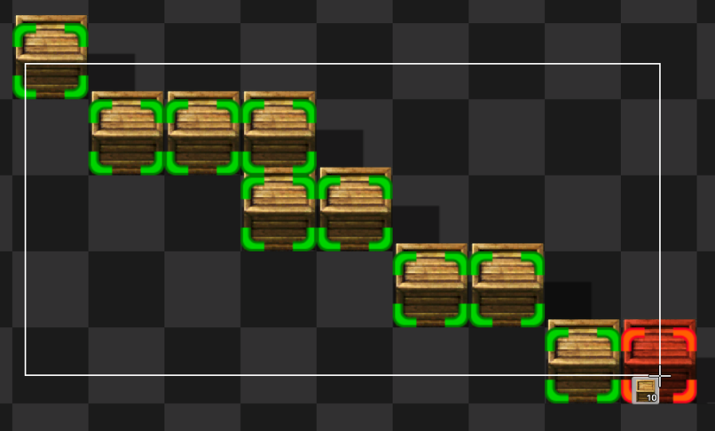

## Modding Behind The Scenes <author>stringweasel</author>

### [Industrial Revolution 2](https://mods.factorio.com/mod/IndustrialRevolution): The Transmat <author>Deadlock989</author>

The problem to solve was that players (and their attached character) can be teleported between surfaces, and vehicles can be teleported between surfaces, but characters without an attached player cannot be teleported between surfaces, and during a cutscene the player isn't attached to a character. The sequence I wanted needed the character to be invisible some but not all of the time, and the least troublesome way of achieving it turned out to be making an invisible non-colliding car and putting them inside it and then teleporting that to a "limbo" surface temporarily while the cutscene POV is moving from site to site. There are various other hacky options that don't involve a custom spriteless vehicle but some of them had very nasty side effects (e.g. temporarily teleporting the character to a very distant location on the same surface can play absolute OS-killing havoc with the biter pathfinder if the teleported character happens to be under attack) and it also had to be robust against people disconnecting during the sequence in multiplayer which made destructive cloning too much of a puzzle (you can't teleport a disconnected character to another surface but you can clone the character on another surface and then destroy the original, which is [philosophically interesting](https://en.wikipedia.org/wiki/Teletransportation_paradox) but turned out to be very annoying to "clean up" if the cutscene sequence was interrupted by a disconnection or interference from some other mod). There are probably better ways of tackling it but like a lot of Factorio modding it's a case of fumbling in the dark until you find something that works.

### Biter Drivers for your Vehicles <author>Earendel</author>

The vehicles in [AAI Programmable Vehicles](https://mods.factorio.com/mod/aai-programmable-vehicles) would need to go from A to B, but they can't always go in a straight line. They need to find a path around obstacles. Writing a pathfinding algorithm is not that hard, but for Factorio modding the problem for a pathfinder is giving the algorithm an accurate representation of the map. Querying the map state in a way that would be useful would be unrealistically slow, and access to Factorio's C++ pathfinder wasn't accessible (at that time) so I needed something a bit more... creative.  The game does have a built in "unit" type that is used for biters, and they can be told to go to a destination and will use the built in pathfinder to do that. The problem is that units are not vehicles, they can't hold passengers, they don't have an inventory, and they can't use ammo.

My slightly crazy workaround is to put an invisible unit in front of the vehicle, the navigator, with the same size and collision settings as the vehicle. I'd tell it to go somewhere, track the movement, and use it's path as the path for the vehicle. So you could say the vehicle was driven by an invisible biter. It worked pretty well, but had a lot of weird side effects. For example, sometimes the navigator would catch on fire, so as the player not being aware of the navigator's existence, you'd suddenly see detached fire speeding around the map for no apparent reason. Sometimes the navigator would not find a path or get distracted and start walking in circles, but as it wasn't possible to tell if that was a proper path or just the navigator being glitchy the vehicle just had to follow it for a while until it detected it had gone in a circle.
Eventually Wube implemented my request to expose the C++ pathfinder to modders, so the whole biter driver thing is in the past, but for ne it does stand out is the wackiest and funniest mod hack.

### [Nullius](https://mods.factorio.com/mod/nullius) Wind Turbines <author>Anachrony</author>

Nullius wind turbines are intended to be spaced 32 tiles apart.  They are low tech, cheap, and effective, but the downsides are that their output swings unpredictably and that they require a lot of land due to this spacing requirement.  Crucially, they don't prevent building anything else nearby, only other wind turbines.  The game engine doesn't make this type of nuance in placement rules easy to implement.  Initially when the turbine was built a script added a large, invisible square centered on the turbine which prevented building other turbines too close, but didn't collide with anything else.  However, a major flaw was that this invisible airspace square also collided with the location of the original turbine, preventing it from being fast replaced or upgraded with a higher tech turbine.  Unlike upgrading other structures, you would have to first tear down the original turbine before rebuilding as a separate step, which was awkward and confusing.  The solution was to break up the large single square into 4 rectangles, 2 horizontal and 2 vertical, which interlock to create a pattern where the only valid places to build a new turbine are 32 tiles away OR directly on top of the old turbine, allowing it to be fast replaced/upgraded.  In this picture you can see debug mode outlining the collision rectangles that prevent a second turbine from being placed too close.

### [Satisfactorio](https://mods.factorio.com/mod/Satisfactorio): Awesome Sink <author>PFQNiet</author>

Plenty of overhaul mods have some kind of "void machine" to automatically delete items that you may not want. Angel's/Bob's has the Flare Stack to get rid of unwanted gases, Krastorio has the Crusher, and Industrial Revolution uses an Incinerator to get rid of unwanted items.

Satisfactory has the Awesome Sink, which I needed to re-create in my Satisfactorio mod. The Sink takes (almost) any item as input, and produces points to earn Coupons, which can then be spent in the Awesome Shop. It consumes items as quickly as you can feed it, and consumes 30MW of power.

All "void machines" follow the same principle in Factorio: make a Furnace entity, and create a "recipe" for each item that consumes the item and produces nothing. The game engine handles the rest. In my case, I set the recipe to be fast enough that it could consume items from a Mk.5 Conveyor Belt (the fastest in the mod). However, this led to the machine spending most of its time idle if a slower belt was used, making its power consumption much less than it should have been.

It took a while to find a solution, but what I eventually came up with was to make the recipe just fast enough for a Mk.1 Conveyor Belt (the slowest!) and then make use of a hidden, invisible Beacon. This special Beacon has 100% efficiency (vanilla Beacons only transmit 50% of their effect) and accepts a special type of module that provides +100% speed at no cost.

Then the script checks what speed of belt is connected to the machine, and adds or removes modules as necessary to/from the hidden Beacon. Mk.2 Belts carry twice as much as Mk.1, so they get 1 module for +100% sink speed. This applies to each belt. Mk.5 carries seven times as many items, so six modules are added to the Beacon.

)

This setup means that no matter what tier of belt you feed into the Awesome Sink, it will adjust its speed to consume the items at exactly that rate, resulting in a perfectly smooth power graph with no spikes, and no nasty blackout surprises!

### [Tapeline](https://mods.factorio.com/mod/Tapeline) <author>raiguard</author>

The original version of Tapeline was pretty simple: you selected an area with a selection tool, and it would draw a ruler on the ground of what you just selected. However, I wanted to be able to draw tapes as you dragged your mouse. There are no straightforward ways to do this, so I had to get creative.

The first implementation of this used invisible grenades with a two-tick cooldown. Holding your mouse down would continually throw these grenades, and the mod would pick up that event to update the position. The mod would detect a finished drag when you stopped throwing these grenades at two-tick intervals.

However, this had problems. First, you couldn't use it in the map view at all, which severely limited the utility of the mod. It also had issues with multiplayer latency, where the timing between throws of the grenade wouldn't be 100% consistent like in singleplayer. You also couldn't use the mod at all when time was paused in the map editor. In essence, it was a half-baked implementation.

After a long time, I had an idea: what if I used a selection tool, but placed entities along the way to tell where the mouse currently is? This would let me update the tape as you drag, and tell when you finish dragging by reading for the regular selection tool event. This would also allow me to tell when you were holding shift while dragging.

I did a test by simply assigning a selection tool a place result, and by some miracle, it just worked! The mod is 100% usable in multiplayer now, and it even works on the map view. There are still a few kinks here and there - for instance, shift+dragging assaults your ears with the ghost placement noise - but using a selection tool allowed me to completely eliminate the mod's GUI and make using the mod a lot more intuitive. I am constantly impressed at how much you can do with the Factorio engine, even when the engine did not intend for said thing to be possible.

### Factorissimo <author>MagmaMcFry</author>

Back in 0.13, Factorio didn't support item metadata as well as it does now, so the only way I saw it possible to store data in items, and read this data upon placing the item as a machine, was using their damage value. So in Factorissimo1, the moment you pick up a factory building, the entity's damage value instantly gets changed to a unique number that is associated to the building interior. When you place the building back, the damage value is read to figure out which interior to connect to it, then the entity's damage value is reset back to before you picked it up.

When I was writing Factorissimo2, the Factorio devs were hinting at making damaged items stackable (this wasn't the case before, and it would break my system), and item metadata handling in the API was still not fleshed out enough in 0.14, so in Factorissimo2 the mechanism used is even more hacky: Instead of storing a building's data in the damage value, it's stored in the item type. That's right: whenever you pick up a factory building, you actually pick up an item with a new unique internal type that just happens to have the same name and sprite as a regular factory building. Because of a different, related lack of API features, the type of a factory building entity is also changed as soon as you mark a factory building for deconstruction, not just once a robot actually deconstructs it. Since you can't generate new item types on the fly, there's a fixed number of item prototypes per factory size (which I arbitrarily chose to be 90), so if you're very inconsistent at reusing factory buildings, or worse, delete old buildings in item form (which isn't trackable), you might have run into an error message saying "Can't pick up more than 90 factory buildings of one size at once". This is also the reason the factory building requester chest exists: as the special entities are hidden from logistics filters, you have no other way to request your used factory buildings from a logistics system.

Some other honorable mentions for current and previous hacks: Detecting fluid connections to factory buildings via dummy pipe entities, transporting signals across surfaces by populating constant combinators, transporting energy across surfaces by moving it between accumulators (this is why energy connections are one-way), auxiliary entities you could interact with by literally rotating them, placing invisible mining drills to provide connection indicator arrows in alt-mode, invisible chests with actual items in them for the item icon overlay.

By now, most of these hacks are no longer necessary, since the API supports the desired features properly (or at least it provides cleaner hacks). Some of them have been successfully removed, others are deeply entangled with the old code. Maybe I'll clean it all up and write Factorissimo3 one day.