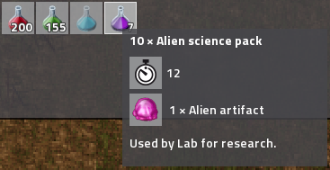
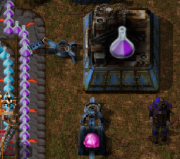
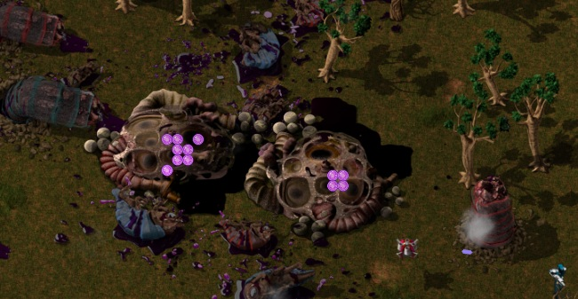
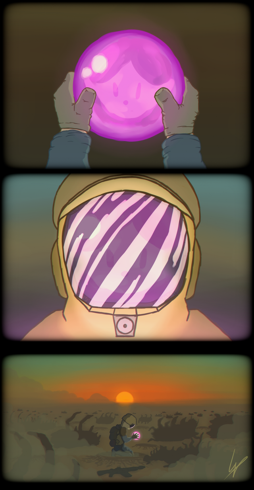

## Nauvis Archives: How Far We've Come <author>stringweasel</author>

Factorio was not always the well-oiled machine that players love today for its complexity in game-play, simplicity in use, and life-stealing addictiveness. No. It took years of hard work, dedication, and communication of the developers to deliver this gem to the world. But - most importantly - is all the lessons that were learned from when they started in 2012. 

I hope to - as a community - document some of the journey that this game has taken over these years. To show new players the dedication that's required to create a game like this. And to tickle the nostalgia-bone of some of the veterans among us.

There are various things that I would love to write (or read) about this game. Things like ancient priority splitters, short underneathies, belt corner compression loss... I can talk for hours. But there is one thing that always stand out in my 6 years of playing Factorio.

### Alien Artefacts: A Primitive Technology

I believe one thing that people remember with fondness, but would never want back, is the [Alien Artifacts](https://wiki.factorio.com/Alien_artifact). The veterans-of-old called it purple goop or purple orbs. Remembering these artefacts makes you smile with nostalgia, but then you close you're eyes - happy that you don't have to experience it ever again.

Back before the Research Revolution of 0.15 there were only four science packs. Red, Green and Blue Science were close to what we know them as today, but Purple Science was called [Alien Science](https://wiki.factorio.com/Alien_science_pack). This devious science was made from alien artefacts, which was obtained by destroying biter nests. 

However, in older versions of the game, this artefact looked slightly different. You might recognise it as the developers' tags on [r/factorio](https://www.reddit.com/r/factorio). Some said this artefact looked familiar. Some said it was taken from a different [universe](https://www.reddit.com/r/factorio/comments/526zwk/i_found_the_source_of_the_alien_artifact/). Some said it looked sort of... alive.

Anyway, this means everyone had big production lines for the three the science packs, and then this (usually lonely) assembler slowly turning alien remains into science. Most people enjoy killing the natives of Nauvis to build yet another iron outpost, which means *typically* there was goop lying around. But, when you urgently  needed to unlock the next technology and were enjoying struggling with oil refineries, then you ran out of purple science. Then you quickly realized that there is no way to automate it! This means every time you want to advance the research tree, you need to go outside and create mayhem.

Day-in-and-day-out you hunted down biters, destroying  their homes and taking their remains, for the sake of progress. Throwing poison and destroyer capsules wildly with each wave of enemies charging at you (while smartly leaving the laser defence at home). It became an endless and unforgiving battle, but you have to push on because the factory must grow. You began to feel sorry for the biters. Co-existing was not an option. The only way to make progress is to actively destroy everything they love and cherish. 

Then [r/theLV2](https://www.reddit.com/user/theLV2/) graced us with [art](https://www.reddit.com/r/factorio/comments/674kkq/a_tribute_to_the_purple_orb_fanart/) that spoke to our hearts. A thought so harsh and sweet that it still keeps me awake at night.

