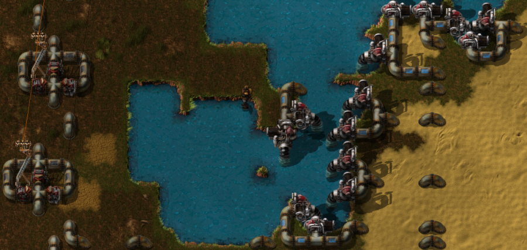
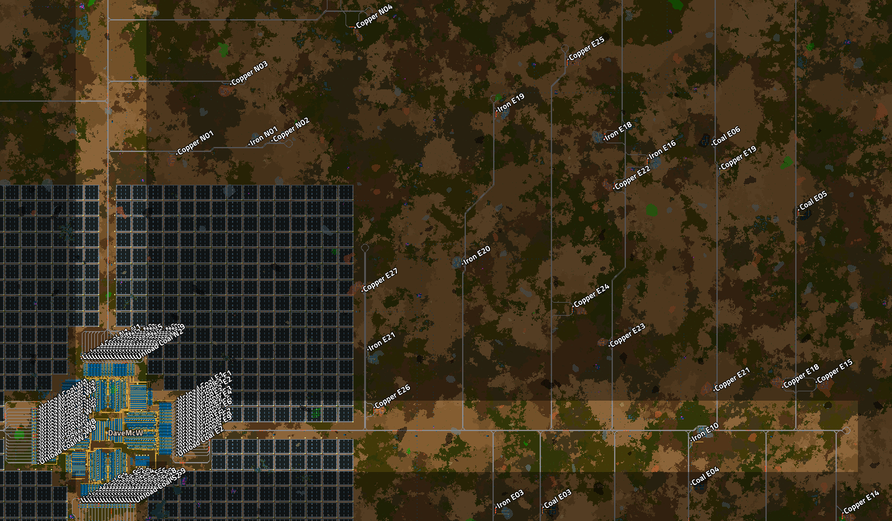

## Nauvis Archives: One Rocket Defense Per Minue <author>stringweasel</author>

Since the beginning players have been pushing the limits of Factorio. Seeing how absolutely massive they can build their factories before the game starts to grind to a halt and succumb to a slow UPS death. And over the years these limits has been broken time and time again, each time reaching a new record. Today it's typically done by attempting to continuously consume as much science as possible, which is typically measured in `science-per-minute` or `spm`. Currently the record seems to be [u/swolar](https://www.reddit.com/user/swolar/)'s [60UPS 20kspm base](https://www.reddit.com/r/factorio/comments/gely3v/20000_science_per_minute_hybrid_modular_megabase/). This incredible base runs in vanilla, but it was built using some [console commands](https://wiki.factorio.com/Console) to generate ore, etc. Almost four years ago this record was likely held by [u/AccidentalChef](https://www.reddit.com/user/AccidentalChef/) with his vanilla-ish [10rpm base](https://www.reddit.com/r/factorio/comments/5osdaa/my_first_gigafactory_10_rockets_per_minute/?utm_source=share&utm_medium=web2x&context=3) base running at `10 UPS` (notice the metric being `rpm`, or `rocket-per-minute`, since it was before [infinite science](https://factorio.com/blog/post/fff-187)). Then there's a breed of players that build true vanilla megabases, without using the editor or console commands, and sometimes even keeping biters, which makes it much harder to build big. This record is likely held by [Gh0stP1rate](https://www.reddit.com/user/Gh0stP1rate/) and Hamiebarmund's [10kspm base](https://www.reddit.com/r/factorio/comments/jpwydq/10k_spm_100_vanilla_megabase/) running at `15 UPS`, which was published very recently. The previous record of this kind was likely from [u/SteveTrov](https://www.reddit.com/user/Stevetrov/posts/), who had a [5.8kspm base](https://www.reddit.com/r/factorio/comments/i3smnr/58k_megabase_built_the_old_school_way_wo_editor/) in August 2020 running at `90 UPS`, that he built in - as he calls it - *The Old School Way*™. But how did the biggest megabase look **5 years ago** - before we even had rocket launches? Back in the days of `Factorio 0.11`. Well, there is one base that completely stood out from the rest, and I had a chat with the creator, [DaveMcW](https://www.reddit.com/user/DaveMcW/posts/), about his design.

### The Story

Back then, pre-[0.12](https://wiki.factorio.com/Roadmap/History#Factorio_0.12_.28July_17th_2015.29), bases were measured in `rocket-defense-per-hour`, or `rdph`. [Rocket Defense](https://wiki.factorio.com/Rocket_defense) was the final end-game item that triggered the victory condition, but it was *very* expensive hence the `per-hour`. The idea was to `"protect the landing of the rescue fleet"` - although no rescue fleet ever really arrived. But, bases rarely even reached `1 rdph`, not to even mention `60 rdph`. It simply wasn’t easy building a base at such a scale at the time, and it was [debated](https://forums.factorio.com/viewtopic.php?f=8&t=7140&start=400) if the game could even handle such large factories. For example, the [largest factory](https://www.reddit.com/r/factorio/comments/2wdqvi/colonel_wills_megabase/) at the time was likely by [ColonelWill](https://www.twitch.tv/colonelwill), which could do `15 rdph`, but not consistently since it ran out of raw resources. And it was built with the help of some mods like [FARL](https://mods.factorio.com/mods/Choumiko/FARL). But, on the day of 29 June 2015, [DaveMcW](https://www.reddit.com/user/DaveMcW/) showed the world that it was indeed possible with his record-breaking *old school* `60 rdph` (or `1 rdpm`) [megabase](https://www.reddit.com/r/factorio/comments/3biwcf/one_minute_rocket_defense/).

MEDIA(media/base_old_overview.mp4)

*One Rocket Defense Per Minute Base by DaveMcW (Posted on [Reddit](https://www.reddit.com/r/factorio/comments/3biwcf/one_minute_rocket_defense/) and the [Factorio Forums](https://forums.factorio.com/viewtopic.php?t=13269))*

This 6km-by-6km base shook the community, as clearly expressed by the top [comment](https://www.reddit.com/r/factorio/comments/3biwcf/one_minute_rocket_defense/csmijcz?utm_source=share&utm_medium=web2x&context=3) by u/TheWrongCat. It suprised some of Factorio's biggest builders, including [u/Zistau](https://www.reddit.com/r/factorio/comments/3biwcf/one_minute_rocket_defense/csmk0he?utm_source=share&utm_medium=web2x&context=3), [u/rootnegative](https://www.reddit.com/r/factorio/comments/3biwcf/one_minute_rocket_defense/csmw6iv?utm_source=share&utm_medium=web2x&context=3) and [u/Xterminator5](https://www.reddit.com/r/factorio/comments/3biwcf/one_minute_rocket_defense/csn0pk8?utm_source=share&utm_medium=web2x&context=3). Even Wube's lead developer, [u/kovarex](https://www.reddit.com/user/kovarex/), [commented](https://www.reddit.com/r/factorio/comments/3biwcf/one_minute_rocket_defense/csnfvg8?utm_source=share&utm_medium=web2x&context=3) on how hard it would be to optimise Factorio to run this base at 60 FPS/UPS (spoiler: *it does now!*). This base was even referenced in [FFF-93](https://www.factorio.com/blog/post/fff-93) as `"the biggest factory ever built"`, and was used by the developers as an optimization benchmark for quite some time. [DaveMcW](https://www.youtube.com/user/DaveMcW2/featured) shattered the beliefs of what was thought possible in Factorio.

It should be noted that to a few it came as no suprise that [DaveMcW](https://forums.factorio.com/memberlist.php?mode=viewprofile&u=1868) designed this record breaking base. He has always been on the cutting edge of technical Factorio. For example, he was the original creator of the [Blueprint String](https://forums.factorio.com/viewtopic.php?f=190&t=6742) which was later added into vanilla. He built the first [large scale colour display](https://forums.factorio.com/viewtopic.php?t=37490), famously showcasing [Darude Sandstrom](https://youtu.be/mgfwwqwxdxY). He created the mod called [Recursive Blueprints](https://mods.factorio.com/mod/recursive-blueprints) to automate blueprint placing, and then built a fully functioning factory using the mod that was *only* [9x14 tiles big](https://www.reddit.com/r/factorio/comments/6j48q7/9x14_micro_factory_recursive_blueprints/). He was even the one who found the [origin](https://www.reddit.com/r/factorio/comments/526zwk/i_found_the_source_of_the_alien_artifact/) of the original [Alient Artefact](https://alt-f4.blog/ALTF4-6/#alien-artifacts-a-primitive-technology) graphic!

### Why The Big Deal?
The size and throughput of this base is staggering, even for today's standards. But Factorio wasn't nearly as optimized back then, and with the base running at full pelt it only reached `2 FPS / 7 UPS`! To compare the size to what we know today we can look at the insane amount of circuits it consumed, which was the main ingredients for Rocket Defense, and it roughly compares to today's [full-productivity-bonus `2kspm` factory](https://kirkmcdonald.github.io/calc.html#zip=fZLLbgMhDEX/ZlZBmiS7SHyMY9ypVTDImL6+vozSTVMnG0v4XK4fkMAgHsMa1gVbPC+FZcYrZYv02ZR6D6YgvVW1sKeXVGI7L+ka+x4xHk8LG5UeYVgtYFwldGQSpNAA3y56Oa3resh1426MLiyc2UC/XIivVBghu7BpTQMfVh22O/u+fR7II0uZnpnmSIijjAxW9SIj57twoExoOmd6GSrTzBW9sBJoCQU2+GbxRZuSQPIZSyc18ltoTIosW9A6JPXnVRq3B+B3i+/7rm7TuzqFBH4fCnyfu4EORnm+gW/Yawaduxd6cLsRpWcddatC4QP+kRv++3k9yQ8=). But what he built was completely new, and it was done *fully* vanilla, with biters, without [copy-paste-undo](https://www.factorio.com/blog/post/fff-255), no [blueprint books](https://wiki.factorio.com/Blueprint_book), no [personal roboports](https://wiki.factorio.com/Personal_roboport), without a [live map view](https://www.reddit.com/r/factorio/comments/76r746/the_ability_to_zoom_in_on_map_view_and_blueprint/), or any existing [calculators](https://kirkmcdonald.github.io/), all while likely playing at `5 FPS / 15 UPS` (idling factory). A true *Old School*™ base.

At the time, simply achieving the throughput was non-trivial. For example, belts always [lost compression around corners](https://alt-f4.blog/ALTF4-11/#corner-compression-loss). Then there's beacons that's used in all megabases, which decrease your base size and increase your `UPS`, but it creates high throughput. Today it's trivial to place [12 beacons](https://www.reddit.com/r/factorio/comments/bgf7er/green_circuits_blueprint_uses_12beacon_and_level/) around an assembler with enough inserters and belts to feed/unload it. But in `0.11`, there were no [stack inserters](https://wiki.factorio.com/Stack_inserter) and the only [stack size bonus](https://wiki.factorio.com/index.php?title=Inserter_capacity_bonus_(research)&oldid=113231) was with container-to-container transfers where it could stack 5 items. This meant only placing enough inserters next to an assembler was an issue. For example, notice how the plastic chemical plants have *four* output inserters in the picture below, even though it's affected by *only* four beacons.

MEDIA (media/base_old_circuits.mp4)

*A section of circuit manufacturing that's mirrored throughout the base. Notice the amount of inserters around the Plastic Chemical Plant. And how, on a compressed belt like the right copper line, the items does not seem compressed but [further apart](https://factorio.com/blog/post/fff-276). (Sped up `10x`)* 

Even more impressive is the importing of enough raw resources to feed this base. It requires logistics that's still considered massive today. A big reason for this is that in `0.11` there was no [mining productivity](https://wiki.factorio.com/Mining_productivity_(research)). This meant that resource patches would deplete rapidly, and maintaining a megabase would unfortunately consist of [constantly rebuilding outposts](https://www.reddit.com/r/factorio/comments/3biwcf/one_minute_rocket_defense/csmk0he?utm_source=share&utm_medium=web2x&context=3) (hence the addition of mining productivity in [0.15](https://wiki.factorio.com/Version_history/0.15.0)). DaveMcW ~~solved~~ delayed this problem by building an absolutely gigantic outpost network using trains. Using 72 unloading stations across 4 seperate rail networks, he had 216 trains importing ore from **216** resource outposts. (No, that's not a typo). That's what he needed to feed his factory without running out of ore, or at least for [20 hours](https://www.reddit.com/r/factorio/comments/3biwcf/one_minute_rocket_defense/csmkcqq?utm_source=share&utm_medium=web2x&context=3). Additionally, he had **1091** speed-beaconed pumpjacks on depleted oil patches, that was all *piped* to the main base.

This sprawling rail network itself, which is DaveMcW's favourite aspect of his base, is also fascinating. As mentioned, it was enormous, with 216 trains ~~speeding~~ moving (they were coal powered) between the 216 outposts. But in `0.11` there were no [chain signals](https://wiki.factorio.com/Rail_chain_signal). This meant large intersections were t[rick](https://youtu.be/dQw4w9WgXcQ)y to design for high throughput, while preventing [train deadlocks](https://www.reddit.com/r/factorio/comments/jnhvzc/roundabouts_keep_locking_up/). His solution for this was to simply eliminate the need for intersections. Instead, each of his four mirrored rail networks consisted of a single large loop, meaning there was never traffic crossing from opposing sides! Also, in `0.11` [train schedules](https://wiki.factorio.com/Railway#Train_schedule) could only handle a `"time passed at station"` condition. So to also ensure all outposts were drawn from evenly, each of the 216 trains had a *custom* wait time. It should be noted that just building rails in `0.11` wasn't as easy as it is today with the easy [click-and-drag](https://www.factorio.com/blog/post/fff-113) building mechanic. Before `0.13`, rails had to be built [one-by-one](https://youtu.be/qNKrcir7kHY?t=3189) using straight and curved pieces. For reference, this gigantic rail network had almost 77000 pieces of rail. Most of these pieces were likely placed by hand since it could only be built by robots if covered by a roboport (no personal roboports were available). 

MEDIA (base_old_rail.mp4)

*Main railway (left-to-right) showing branch to outposts (down), and showing an iron outpost. Notice the old trains. (Sped up `10x`)*

Finally, and in my opinion the most impressive, is the elegant and simple layout of the base, even though it had more than four times the throughput than any base before it. It took him 11 months to design and build this base, and you can see it in the precision of this build. A belt is only as fast as it needs to be, and never placed unnecessarily. All ratios are perfect within a few percent. This also causes the belts to rarely back-up, which makes the base look more alive. And everything is beautifully mirrored in four dirctions, expanding from a single point, spotlighting the Rocket Defense. And the fact that this was all built in vanilla and without a personal roboport is mind boggling.

### Running The Factory in 1.0
I was curious how this megabase would run in Factorio `1.0` with all the optimizations the developers applied over the past 5 years. So I migrated it. It took longer than I expected, but it works! For reference, on my PC using `0.11.22` the base runs at `2 FPS / 6 UPS`, but in `1.0` it reaches about `65 FPS / 65 UPS` with high quality graphics! *(Disclaimer: the migration to `1.0` is not by any means perfect. The goal was simply for all the machines to run similar to `0.11`. There's likely something I missed or simply ignored, for example the negligible power generation.)*

MEDIA (base_new_busy.gif)

*One of the four mirrored circuit builds. Notice the layout: it's mirrored left to right with four similar sections, and it shows three repeating row sections.*

There were quite a few changes applied to run this old base in `1.0`. It started with adding items and changing recipes to mimic `0.11`, which includes the fluid amounts being [multiplied by 10](https://wiki.factorio.com/Version_history/0.15.0#0.15.0), the Advanced Circuit to Copper Cable ratio being `8:1`, and not `6:1`. Then there were more straight-forward changes like replacing small-pump setups (of which DaveMcW was also the [expert](https://forums.factorio.com/viewtopic.php?f=134&t=6066)) with a single [pump](https://wiki.factorio.com/Pump). The small pumps of `0.11` were much weaker than today's pumps so you had to have multiple in parallel to maintain full flow. Another change that had to be made was the manual adding of a [belt directly in front of inserters](https://www.reddit.com/r/factorio/comments/48v5qo/inserters_not_picking_up_from_end_of_conveyor/) where it was not previously needed, which had to be fixed for most of the outposts! And, as earlier mentioned, the inserter stack size was always `1`, except when moving from container-to-container, then the bonus was `5`. This was fixed individually for each inserter using a script.



*Difference between the old small pump setups and new pumps (left), including the new Offshore Pump (right) and addition of polluted water. Notice the change in how [tile transitions](https://factorio.com/blog/post/fff-199) are handled.*

There were a few other changes that was not initially apparent and quite interesting. For example, in `0.11` a splitter's throughput was limited by it's output speed, whereas today it's limited by it's *input* speed. For example, a yellow splitter could output two yellow belts with only input one red belt. I also had to ensure the biters don't penetrate the perimeter with outdated defenses. This is partly because in `0.11` there was no [behemoth biters](https://wiki.factorio.com/Enemies). But, the main issue was that DaveMcW used an [old belt trick](https://forums.factorio.com/viewtopic.php?f=8&t=10151) that interrupted a spitter's attack animation, and so prevented the spitter from dealing any damage. This meant that laser turrets only had to focus on the biters. This belt trick no longer works, meaning the perimeter needs to handle spitters as well. To completely circumvent this problem for `1.0`, without losing the CPU load, I made his ≈24000 laser-turrets [50 times more powerful](https://youtu.be/xxtxn3H1g60). 

*Perimeter wall in the `0.11` base showing the belt that interrupts the spitter's attack animation. Notice the old 1x1 laser turret graphics. (Image from [here](https://imgur.com/a/xcYxk))*

Finally I had to modify *all* vertical train stations manually, which were the most time consuming, since there are over 100(!) of them. This is because before [`0.13`](https://wiki.factorio.com/Roadmap/History#Factorio_0.13_.28June_27th_2016.29), vertical and horizontal train stations had [different lengths](https://www.factorio.com/blog/post/fff-133) due to Factorio's [`2.5D` world projection](https://en.wikipedia.org/wiki/2.5D)! All-in-all, it was a very interesting and exciting challenge to find and fix bottlenecks/problems by changing and fixing the game, rather than the base itself.

*Map view of rail network, showing only 27 of the 216 of the outposts.*

### Experience This Base Yourself

This base is remarkable and will always be remembered as one of the first true megabases. And you can explore this base yourself by simply downloading the [`1.0` save]() and the necessary small modpack [here](). Or, if you like being retro and have patience, you can simply download [Factorio 0.11](https://factorio.com/download/archive) and download the `0.11` save from DaveMcW's [Reddit comment](https://www.reddit.com/r/factorio/comments/3biwcf/one_minute_rocket_defense/csmjtof?utm_source=share&utm_medium=web2x&context=3). Or, if you're lazy today, and only want a quick look around, you can even view it in a Google Map format below (or [here](http://twinsen.info/Web/Map(197,205)1024/)), which was created by Twinsen. However, there will be internet points awarded to the first player who finds the Robotport that DaveMcW dropped 5 years ago.

***INTERACTIVE MAP NEEDS IMPROVEMENT BY CONOR_***

<iframe width="1000" height="700" id="gmap_canvas" src="http://twinsen.info/Web/Map(197,205)1024&t=&z=13&ie=UTF8&iwloc=&output=embed" frameborder="0" scrolling="no" marginheight="0" marginwidth="0"></iframe>

In closing I would like to request that one of the four mirrored circuit builds be placed in Factorio's upcoming [Main Menu Simulations](https://www.factorio.com/blog/post/fff-362). The build is chaotic, but still highly optimized and implemented with precision, which is very pleasing to look at. But more importantly, this base laid megabase foundations for years in a time where the art of highly optimized builds were only just starting. It's a base that could be remembered forever (or - at least - until the rescue fleet finally comes).

