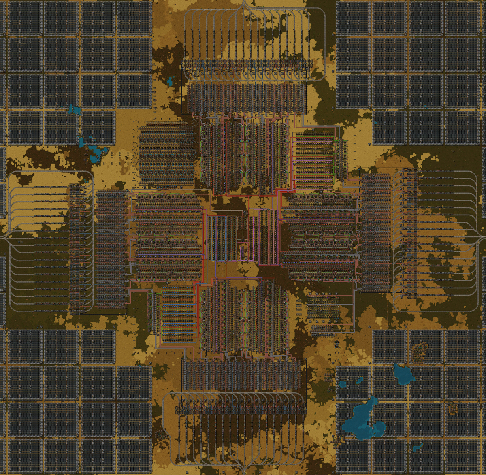

## Nauvis Archives: Ancient Megabase <author>stringweasel</author>

Since the beginning players have been pushing the limits of Factorio. Seeing how absolutely massive they can build their factories before the game starts grind to a halt and succumb to a slow UPS death. And over the years these limits has been broken time and time again, each time reaching a new record. Currently the record seems to be [u/swolar](https://www.reddit.com/user/swolar/)'s [60UPS 20kspm base](https://www.reddit.com/r/technicalfactorio/comments/gels6c/20k_spm_hybrid_megabase/). Three years ago the largest base was roughly half of swolar's size, which was likely [u/AccidentalChef](https://www.reddit.com/user/AccidentalChef/)'s which ran at [10 rpm](https://www.reddit.com/r/factorio/comments/5osdaa/my_first_gigafactory_10_rockets_per_minute/?utm_source=share&utm_medium=web2x&context=3). And a *month* before that the record was likely AccidentalChef's [3rpm base](https://www.reddit.com/r/factorio/comments/5jntq4/train_based_3_rocket_per_minute_factory/), where he even predicted a 10rpm base would [not be playable](https://www.reddit.com/r/factorio/comments/5jntq4/train_based_3_rocket_per_minute_factory/dbihbkr?utm_source=share&utm_medium=web2x&context=3). (You will notice the metric being `rpm`, or `rocket-per-minute`, since it was before the [Research Revolution](https://www.factorio.com/blog/post/fff-159)™). But how did the biggest megabase look **5 years ago** - before we had rocket launches? How does it compare to modern megabases? And what did it take to build such monstrosities?

### The 1 Rocket Defence Per Minute Factory

Back pre-0.12, in 2015, bases was not measured in `science-per-minute`, or in `rocket-per-minute`. Rather, it was measured in `rocket-defense-per-minute`. At the time [rocket defense](https://wiki.factorio.com/Rocket_defense) was the final end-game item for which the idea was to `"protect the landing of the rescue fleet"` - even though there was no rescueing fleet. But, bases actually never really even approached `1 rocket-defence-per-minute`. It wasn’t easy building a base at that scale at the time, the reasons of which I will discuss soon. It was widely assumed that nobody is crazy enough to even attempt reaching 1 rpm. But then on the day of 29 June 2015 the legendary [DaveMcW](https://www.reddit.com/user/DaveMcW/) showed the world that it is indeed possible with this [gigantic base](https://www.reddit.com/r/factorio/comments/3biwcf/one_minute_rocket_defense/).

This base shook the community, as clearly expressed by the top [comment](https://www.reddit.com/r/factorio/comments/3biwcf/one_minute_rocket_defense/csmijcz?utm_source=share&utm_medium=web2x&context=3) by u/TheWrongCat. It suprised some of Factorio's biggest builders, including [u/Zistau](https://www.reddit.com/r/factorio/comments/3biwcf/one_minute_rocket_defense/csmk0he?utm_source=share&utm_medium=web2x&context=3), [u/rootnegative](https://www.reddit.com/r/factorio/comments/3biwcf/one_minute_rocket_defense/csmw6iv?utm_source=share&utm_medium=web2x&context=3), [u/Xterminator5](https://www.reddit.com/r/factorio/comments/3biwcf/one_minute_rocket_defense/csn0pk8?utm_source=share&utm_medium=web2x&context=3). Even Wube's lead developer, [u/kovarex](https://www.reddit.com/user/kovarex/), [commented](https://www.reddit.com/r/factorio/comments/3biwcf/one_minute_rocket_defense/csnfvg8?utm_source=share&utm_medium=web2x&context=3) on how hard it would be to optimise Factorio run this base at 60 FPS/UPS (spoiler: *it still doesn't*). DaveMcW truly shattered the limits of what was thought possible in Factorio.

To a few it came as no suprise since DaveMcW has always been on the cutting edge of Factorio. He was the original creator of the [Blueprint String](https://forums.factorio.com/viewtopic.php?f=190&t=6742) which was later added into vanilla. He built the first [large scale colour display](https://www.reddit.com/r/factorio/comments/5dxi3a/factorio_sandstorm/), famously showcasing [Darude Sandstrom](https://youtu.be/mgfwwqwxdxY). He created a mod called [Recursive Blueprints](https://mods.factorio.com/mod/recursive-blueprints) to automate blueprint placing, and then built a fully functioning factory using the mod that's *only* [9x14 tiles big](https://www.reddit.com/r/factorio/comments/6j48q7/9x14_micro_factory_recursive_blueprints/). He was even the one who found the [origin](https://www.reddit.com/r/factorio/comments/526zwk/i_found_the_source_of_the_alien_artifact/) of the original [Alient Artefact](https://alt-f4.blog/ALTF4-6/#alien-artifacts-a-primitive-technology) sprite. Needless to say, if any player was able to pull this of, it was DaveMcW.

#

[the base](https://www.reddit.com/r/factorio/comments/3biwcf/one_minute_rocket_defense/)

The transport belts interrupt the spitter attack animation, making them do zero damage. The laser turrets focus fire the biters, making them do zero damage. It never needs repairs.

[1rpm googlemap](https://www.reddit.com/r/factorio/comments/3bp4hx/one_minute_rocket_defense_google_map/)

[this base by ColWill reached 5k iron / min](https://www.youtube.com/watch?v=IuRdFCvwzJE&ab_channel=ColonelWill)

[Proper timing is required for all station designs, it is a function of mining outpost distance.](https://www.reddit.com/r/factorio/comments/3biwcf/one_minute_rocket_defense/cso0nwl?utm_source=share&utm_medium=web2x&context=3)