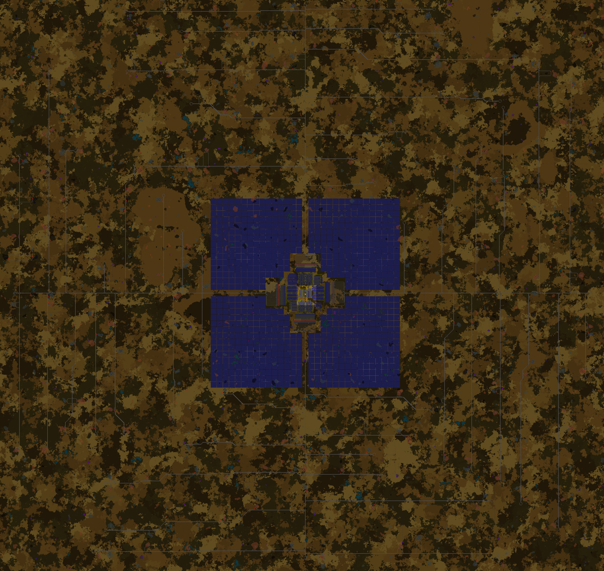
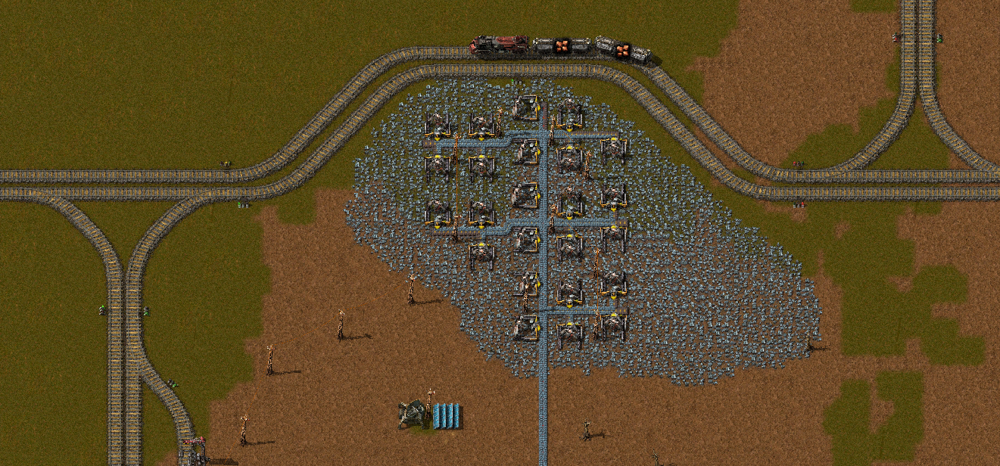
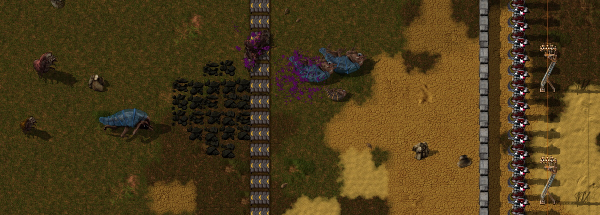

## Nauvis Archives: Ancient Megabase <author>stringweasel</author>

Since the beginning players have been pushing the limits of Factorio. Seeing how absolutely massive they can build their factories before the game starts grind to a halt and succumb to a slow UPS death. And over the years these limits has been broken time and time again, each time reaching a new record. Currently the record seems to be [u/swolar](https://www.reddit.com/user/swolar/)'s [60UPS 20kspm base](https://www.reddit.com/r/technicalfactorio/comments/gels6c/20k_spm_hybrid_megabase/). Three years ago the largest base was roughly half of swolar's size, which was likely [u/AccidentalChef](https://www.reddit.com/user/AccidentalChef/)'s which ran at [10 rpm](https://www.reddit.com/r/factorio/comments/5osdaa/my_first_gigafactory_10_rockets_per_minute/?utm_source=share&utm_medium=web2x&context=3). And a *month* before that the record was likely AccidentalChef's [3rpm base](https://www.reddit.com/r/factorio/comments/5jntq4/train_based_3_rocket_per_minute_factory/), where he even predicted a 10rpm base would [not be playable](https://www.reddit.com/r/factorio/comments/5jntq4/train_based_3_rocket_per_minute_factory/dbihbkr?utm_source=share&utm_medium=web2x&context=3). (You will notice the metric being `rpm`, or `rocket-per-minute`, since it was before the [Research Revolution](https://www.factorio.com/blog/post/fff-159)™). But how did the biggest megabase look **5 years ago** - before we even had rocket launches? There is one base, that truly stands out from the rest, and I had a chat with the creator, [DaveMcW](https://www.reddit.com/user/DaveMcW/posts/), about his design.

### The 1 Rocket Defence Per Minute Factory

Back pre-[0.12](https://wiki.factorio.com/Roadmap/History#Factorio_0.12_.28July_17th_2015.29) bases were measured in `rocket-defense-per-hour`, or `rdph`. [Rocket Defense](https://wiki.factorio.com/Rocket_defense) was the final end-game item that triggered the victory condition, and it was *very* expensive, hence the `per-hour`. The idea was to `"protect the landing of the rescue fleet"`. But, bases rarely even reached `1 rdph`, not to even mention `60 rdph`. It simply wasn’t easy building a base at such a scale at the time, and it was [debated](https://forums.factorio.com/viewtopic.php?f=8&t=7140&start=400) if the game could even handle such large factories. For example, the [largest factory](https://www.reddit.com/r/factorio/comments/2wdqvi/colonel_wills_megabase/) at the time was likely by [ColonelWill](https://www.twitch.tv/colonelwill), which could do `15 rdph`, but not consistently since it ran out of raw resources. But, on the day of 29 June 2015, the legendary [DaveMcW](https://www.reddit.com/user/DaveMcW/) showed the world that it is indeed possible with his record-breaking `60 rdph` (or `1 rdpm`) [monstrosity](https://www.reddit.com/r/factorio/comments/3biwcf/one_minute_rocket_defense/).

*1 Rocket Defense Per Minute Base by DaveMcW (Posted on [Reddit](https://www.reddit.com/r/factorio/comments/3biwcf/one_minute_rocket_defense/) and [Factorio Forums](https://forums.factorio.com/viewtopic.php?t=13269))*

This 6km-by-6km base shook the community, as clearly expressed by the top [comment](https://www.reddit.com/r/factorio/comments/3biwcf/one_minute_rocket_defense/csmijcz?utm_source=share&utm_medium=web2x&context=3) by u/TheWrongCat. It suprised some of Factorio's biggest builders, including [u/Zistau](https://www.reddit.com/r/factorio/comments/3biwcf/one_minute_rocket_defense/csmk0he?utm_source=share&utm_medium=web2x&context=3), [u/rootnegative](https://www.reddit.com/r/factorio/comments/3biwcf/one_minute_rocket_defense/csmw6iv?utm_source=share&utm_medium=web2x&context=3) and [u/Xterminator5](https://www.reddit.com/r/factorio/comments/3biwcf/one_minute_rocket_defense/csn0pk8?utm_source=share&utm_medium=web2x&context=3). Even Wube's lead developer, [u/kovarex](https://www.reddit.com/user/kovarex/), [commented](https://www.reddit.com/r/factorio/comments/3biwcf/one_minute_rocket_defense/csnfvg8?utm_source=share&utm_medium=web2x&context=3) on how hard it would be to optimise Factorio run this base at 60 FPS/UPS (spoiler: *it does now!*). This base was even referenced in [FFF-93](https://www.factorio.com/blog/post/fff-93) as `"the biggest factory ever built"`, and was used by the developers as an optimization benchmark for quite some time. [DaveMcW](https://www.youtube.com/user/DaveMcW2/featured) truly shattered the beliefs of what was thought possible in Factorio.

It should be noted that to a few it came as no suprise that [DaveMcW](https://forums.factorio.com/memberlist.php?mode=viewprofile&u=1868) designed this record breaking base. He has always been on the cutting edge of technical Factorio. For example, he was the original creator of the [Blueprint String](https://forums.factorio.com/viewtopic.php?f=190&t=6742) which was later added into vanilla. He built the first [large scale colour display](https://forums.factorio.com/viewtopic.php?t=37490), famously showcasing [Darude Sandstrom](https://youtu.be/mgfwwqwxdxY). He created the mod called [Recursive Blueprints](https://mods.factorio.com/mod/recursive-blueprints) to automate blueprint placing, and then built a fully functioning factory using the mod that's *only* [9x14 tiles big](https://www.reddit.com/r/factorio/comments/6j48q7/9x14_micro_factory_recursive_blueprints/). He was even the one who found the [origin](https://www.reddit.com/r/factorio/comments/526zwk/i_found_the_source_of_the_alien_artifact/) of the original [Alient Artefact](https://alt-f4.blog/ALTF4-6/#alien-artifacts-a-primitive-technology) sprite. Needless to say, if any player was able to pull this of, it was DaveMcW. 

### Why The Big Deal?
The size and throughput of this base is staggering, even in today's standards. But the game wasn't nearly as optimized back then, and when running at full pelt, the base only reached `2 FPS / 7 UPS`! To compare the size to what we know today we can look at the insane amount of circuits it consumed, which is the main ingredients for Rocket Defense, and is roughly enough for a modern [full-productivity-bonus 2kspm factory](https://kirkmcdonald.github.io/calc.html#zip=fZLLbgMhDEX/ZlZBmiS7SHyMY9ypVTDImL6+vozSTVMnG0v4XK4fkMAgHsMa1gVbPC+FZcYrZYv02ZR6D6YgvVW1sKeXVGI7L+ka+x4xHk8LG5UeYVgtYFwldGQSpNAA3y56Oa3resh1426MLiyc2UC/XIivVBghu7BpTQMfVh22O/u+fR7II0uZnpnmSIijjAxW9SIj57twoExoOmd6GSrTzBW9sBJoCQU2+GbxRZuSQPIZSyc18ltoTIosW9A6JPXnVRq3B+B3i+/7rm7TuzqFBH4fCnyfu4EORnm+gW/Yawaduxd6cLsRpWcddatC4QP+kRv++3k9yQ8=). But what he built was completely new, and it was done *fully* vanilla, with biters, without [copy-paste-undo](https://www.factorio.com/blog/post/fff-255), no [blueprint books](https://wiki.factorio.com/Blueprint_book), no [personal roboports](https://wiki.factorio.com/Personal_roboport), without a [live map view](https://www.reddit.com/r/factorio/comments/76r746/the_ability_to_zoom_in_on_map_view_and_blueprint/), or any existing [calculators](https://kirkmcdonald.github.io/), all while likely playing at `5 FPS / 15 UPS` (idling factory).

At the time imply achieving the throughput is non-trivial in 0.11. Belts always [lost compression around corners](https://alt-f4.blog/ALTF4-11/#corner-compression-loss) for example. Then there's beacon that's used in all megabases, it decreases your base size and increase your UPS, but has a very high throughput. Today it's trivial to place [12 beacons](https://www.reddit.com/r/factorio/comments/bgf7er/green_circuits_blueprint_uses_12beacon_and_level/) around an assembler with enough inserters and belts. But, in 0.11, there were no [stack inserters](https://wiki.factorio.com/Stack_inserter), and the only [stack size bonus](https://wiki.factorio.com/index.php?title=Inserter_capacity_bonus_(research)&oldid=113231) was with container-to-container transfers where it could stack 5 items. This meant simply placing enough inserters next to an assembler was an issue. For example, notice how the plastic chemical plants has *4* output inserters in the picture below, even though it's affected by *only* 4 beacons.

**THIS PICTURE SHOULD SHOW THE PLASTIC BUILD**

*One section of circuit manufacturing that's mirrored in the main base around.* 

Even more impressive is the importing of enough raw resources to feed this base. It requires logistics that's still mind boggling today. A big aspect is that in 0.11 there was no [mining productivity](https://wiki.factorio.com/Mining_productivity_(research)). This means that resource patches depleted rapidly, and maintaining a megabase would unfortunately consist of [constantly rebuilding outposts](https://www.reddit.com/r/factorio/comments/3biwcf/one_minute_rocket_defense/csmk0he?utm_source=share&utm_medium=web2x&context=3) (hence the addition of mining productivity in [0.15](https://wiki.factorio.com/Version_history/0.15.0)). DaveMcW ~~solved~~ delayed this problem by building an absolutely gigantic outpost network using trains. Using 72 unloading stations, across 4 seperate rail networks, he had 216 trains importing ore from **216** resource outposts. (No, that's not a typo). That's what he needed to feed his factory without running out of ore, or at least for [20 hours](https://www.reddit.com/r/factorio/comments/3biwcf/one_minute_rocket_defense/csmkcqq?utm_source=share&utm_medium=web2x&context=3). Additionally, he had **1091** speed-beaconed pumpjacks, on depleted oil patches, that was all *piped* to the main base.

This sprawling rail network itself, which is DaveMcW's favourite aspect of his base, is also fascinating. As mentioned, it's enormous, with 216 trains ~~speeding~~ moving (they were coal powered) between the 216 outposts. But, in 0.11, there were no [chain signals](https://wiki.factorio.com/Rail_chain_signal). This meant large intersections were tricky to design for high throughput while preventing train grid lock. His solution for this was to simply eliminate the need for intersections. Instead, each of his four mirrored rail networks consists of a large single loop, meaning there is never traffic crossing from oposing sides! Also, in 0.11 [train schedules](https://wiki.factorio.com/Railway#Train_schedule) could only handle a `"time passed at station"` condition. So, to also ensure all outposts are drawn from evenly, each of the 216 trains has a *custom* wait time. 

**TAKE A 0.11 SCREEN SHOT**

Finally, and in my opinion the most impresive, is elegant and simple layout of the base, even though has more than 4 times the throughput than any base before it. It took him 11 months to design and build this base, and you can see it in the precision of this build. A belt is only as fast as it needs to be, and never placed unnecessarily. All ratios are perfect within a few percent. This also causes the belts to rarely back-up, which makes the base look more alive. And everything is beautifully mirrored in four dirctions from a single point, spotlighting the Rocket Defense. And the fact that this was all built in vanilla and without a personal robobort is truley mind blowing.

### Running The Factory in 1.0
I was curious how this ancient and massive base would run in Factorio 1.0 with the all the optimizations the developers have applied over the past 5 years. So I migrated it. It took longer than I expected, but it works! For reference, on my PC using `0.11.22` the base runs at `2 FPS / 6 UPS`, but in `1.0` it reaches `60 FPS / 60 UPS` with high quality sprites! *(Disclaimer: the migration to `1.0` is not by any means perfect. The goal was simply to get the all machines running similar to 0.11. There's likely something I missed or simply ignored, for example power generation.)*

**GET BUSIER GIF**
NICE VIDEO OF SOMETHING RUNNING

There were quite a few changes apply to run this old base in `1.0`. It started with adding items and changing recipes to reflect `0.11`, which includes incorporating the fluid amounts being [multplied by 10](https://wiki.factorio.com/Version_history/0.15.0#0.15.0). Then there were more straight-forward changes like replacing small-pump setups (of which DaveMcW was also the [expert](https://forums.factorio.com/viewtopic.php?f=134&t=6066)) with normal [pumps](https://wiki.factorio.com/Pump). Or manually adding belts
 where inserters now need a [belt directly in front of it](https://www.reddit.com/r/factorio/comments/48v5qo/inserters_not_picking_up_from_end_of_conveyor/), which had to be fixed for most of the outposts! And, as earlier mentioned, the inserter stack size was always `1`, except when moving from container-to-container, then the bonus is `5`, which was changed using a script.

 PICTURE OF OLD/NEW PUMP SETUP WITH SLIDER

But, there were few a other changes that was not initially apparent and quite interesting. For example, in `0.11` a splitter's throughput was limited by it's output speed, whereas today it's limited by it's *input* speed. I also had to ensure the biters don't penetrate the perimeter with insufficient defenses. This is partly because in 0.11 there was no [behemoth biters](https://wiki.factorio.com/Enemies), but the main issue was that DaveMcW used an [old belt trick](https://forums.factorio.com/viewtopic.php?f=8&t=10151) that interrupts  a spitter's attack animation indefinitely, which means the laser turrets only had to focus on biters. To completely circumvent this problem for `1.0`, without losing the CPU load, I simply the damage output of his ≈24000 laser-turrets [50-fold](https://youtu.be/xxtxn3H1g60). 

*Perimeter wall in the `0.11` base showing the belt that interrupts te spitter's attack animation. Notice the old 1x1 laser turret graphics. (Image from [here](https://imgur.com/a/xcYxk))*

Finally I had to modify *all* vertical train stations manually, which was the most time consuming, since there are over 100(!) of them. This is because before [`0.13`](https://wiki.factorio.com/Roadmap/History#Factorio_0.13_.28June_27th_2016.29) vertical and horizontal train stations had [different lengths](https://www.factorio.com/blog/post/fff-133)! It was a very interesting and exciting challenge to find and fix bottlenecks/problems by changing and fixing the game rather than the base itself.

### Explore This Base Yourself

This base is truley remarkable and will always be remembered as one of the first true megabases. But, you can explore this base yourself by downloading the [`1.0` save]() and the necessary modpack [here](). Or you can simply download [Factorio 0.11](https://factorio.com/download/archive) and download the `0.11` save from DaveMcW's [Reddit comment](https://www.reddit.com/r/factorio/comments/3biwcf/one_minute_rocket_defense/csmjtof?utm_source=share&utm_medium=web2x&context=3). Or if you're lazy today, and only want a quick look around, you can even view in a Google Map format [here](http://twinsen.info/Web/Map(197,205)1024/) (as created by Twinsen). However, there will be internet points awarded to the player who finds the RobotPort first that DaveMcW dropped 5 years ago.