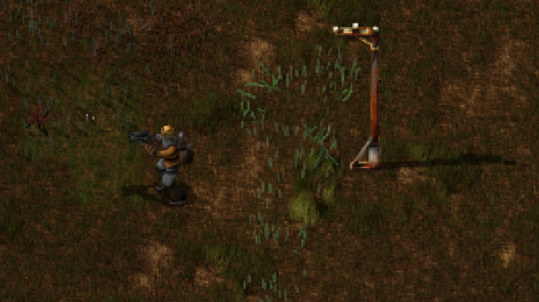
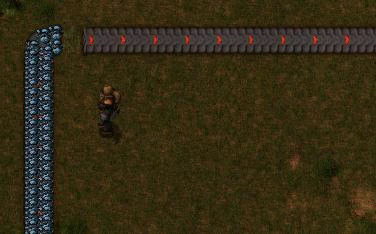
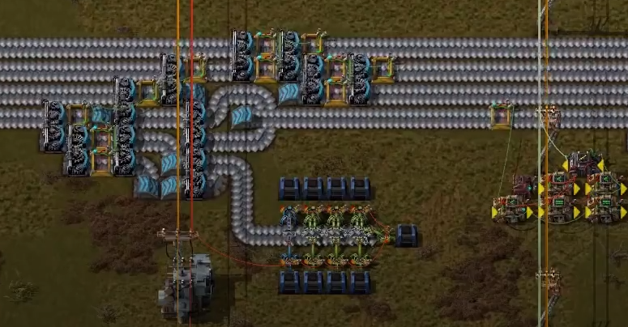

## Nauvis Archives: Outdated Techniques <author>stringweasel</author>

Over the years Factorio has changed significantly. New players, new mechanics, new developers, new metas, etc. And as things change some ways of doing things always get left behind to make way for new and improved ways. Like humans not required to walk everywhere anymore, or check their ~~MySpace~~ Facebook regularly. The same has happened in Factorio. There are old rituals and techniques that we no longer use in the modern age. I always find it interesting to look back and see what was done in the past.

### Victory Poles

In the old days from before 0.13, biters were very scared of any built structures. They did not even attempt to expand and create new nests near an item placed down by a devious engineer. This resulted in a ritual being created by the community, namely: the placing of Victory Poles. It simply required you to place down any item after clearing a native nest, typically something cheap like a wooden chest or electric pole, and that would keep the biters off your rightfully conquered land. Here is a [great video](https://youtu.be/WFEKQq3r7YY?t=265) by [NegativeRoot](https://www.youtube.com/negativeroot) where he explained this ritual. Ironically, after 0.13 when biters were no longer afraid of our structures, it resulted in a few unsuspecting engineers finding biter nests [inside their undefended bases](https://forums.factorio.com/viewtopic.php?f=23&t=27249)!

### Corner Compression Loss

Most won't realize it, but the transport belt is the [most complex](https://wiki.factorio.com/Transport_belts/Physics) entity in Factorio . Today it "just works" but it took years to smooth out all the bugs and [headaches](https://i.imgur.com/uvKgnYV.gifv). Things like items getting [stuck](https://forums.factorio.com/viewtopic.php?f=23&t=4114), inserters not picking up the [last item on the belt](https://youtu.be/VGtmC2gNczw?t=750) and requiring underneathies (source to Alt-F4) to [increase your UPS](https://forums.factorio.com/viewtopic.php?t=17782). More infamous, but long forgotten, is the corner compression loss from before 0.12 and the techniques used to maintain 100% throughput.

Example of corner compression loss in 0.11. Originally [posted](https://forums.factorio.com/viewtopic.php?t=24964) by [daniel34](https://forums.factorio.com/memberlist.php?mode=viewprofile&u=5208).

Back then belts would [lose](https://forums.factorio.com/viewtopic.php?f=66&t=1589&hilit=corner+compression) [compression](https://www.youtube.com/watch?v=_pTsp2Bs-HQ&feature=youtu.be&t=9m28s&ab_channel=spacesloth) around corners because of how [collisions were handled](https://factorio.com/blog/post/fff-82). At the time, items on belts were individual entities with collision boxes which caused unintended collisions around corners, while today these items don't have collision boxes at all. But, players still wanted to build big and had to circumvent this compression loss. For smaller builds, ≈100% compression was achieved by replacing the corner with a [higher tier belt](https://forums.factorio.com/viewtopic.php?f=66&t=1589&hilit=corner+compression) or using [two splitters](https://youtu.be/_pTsp2Bs-HQ?t=654). But for bigger factories with large busses - where the belts were already the highest tier - more complex designs were required. Typically these [designs](https://forums.factorio.com/viewtopic.php?f=202&t=9071&hilit=corner+compression&start=20 ) were made by the legendary belt wizard [MadZuri](https://forums.factorio.com/memberlist.php?mode=viewprofile&u=5452) to be implemented in [ColonelWill](https://www.twitch.tv/colonelwill)’s crazy factories. 

Long [debates](https://forums.factorio.com/viewtopic.php?t=24964) were had on what the behaviour around corners *should* be, even after compression loss was fixed in 0.12. Should the items move at a constant speed, as it does currently, meaning the inner items will exit the corner first? Or should the inner lane move slower so that the inner and outer lanes stay synchronized around corners? This essentially came down to discussing realism vs. gameplay, and sometimes inadvertently, latency vs. throughput. But some just enjoyed [all](https://youtu.be/7CGNVI5DSjY?t=42) [the](https://www.youtube.com/watch?v=sh20T7bWlXQ&ab_channel=TrieuLeTan) [videos](https://www.youtube.com/watch?v=pUdZI3MLcWQ&ab_channel=JongePoerinkConveyors) that were posted of real-life production lines going around corners.

Transport belt mechanics is one of those things that - if it's not perfect - everyone will notice something is off. But as soon as it works, it will almost go by unnoticed because of its intuitiveness and simplicity. This is because a good implementation needs to feel intuitive and hide the enormous complexity behind it with a simple interface. And as you know, today our engineers don't often comment on belt mechanics. Transports belts are easy to use and it just makes sense. This means that the Factorio has truly succeeded in the ultimate transport belt implementation.

### Manual Priority Splitters

Splitters only received the ability to do priority input/output in [0.16.17](https://wiki.factorio.com/Splitter) (and filtering for that matter). Before this, priority splitters had to be built using only wits, spaghetti and a whole lot of circuits. This resulted in a period in 2016 when these designs were the hot-topic in the community. Players like [Steejo](https://www.youtube.com/channel/UCeuyjX6ayprafiDlRxxrzNQ),  [raspi](https://forums.factorio.com/memberlist.php?mode=viewprofile&u=28709),  [canidae](https://mods.factorio.com/user/canidae), [CaptainKonzept](https://forums.factorio.com/memberlist.php?mode=viewprofile&u=41867), to name a few, quickly started in-depth research and thorough testing for the sake of the factory.

Snapshot showing priority splitting from a 4-lane bus. Originally from a [video](https://youtu.be/Ta6PnPC7MOI) by [Captain Konzept](https://youtu.be/HkR3pDTNUv8) showing his design.

Building a priority splitter using the circuit network was not easy, especially at the time, but this did not stop our highly skilled community. They overcame numerous obstacles with vigour. For example, when reading a fully compressed belt it showed either [6 or 8 items](https://factorio.com/blog/post/fff-276) randomly. Even worse, there is no way to know if a belt is flowing fully-compressed or if it's backed-up. In either, case the circuit network would still read 8 (or 6!) items on the belt. This resulted in various [complicated designs](https://forums.factorio.com/viewtopic.php?f=193&t=32793), each with its own expertly implemented tricks and hacks to make it work. [Captain Konzept](https://www.youtube.com/channel/UCrQKqtZ4Iu0tMnf8RG5l_yw) made a great [video](https://youtu.be/Ta6PnPC7MOI) explaining the different approaches of different players (and another [video](https://youtu.be/HkR3pDTNUv8) later comparing these designs to the new splitters with internal priority settings).

However, after a while, people realized that in *most* cases a complex priority splitter is not *really* required, and adequate balancing is arguably *good enough*. This mindset [changed again](https://www.reddit.com/r/factorio/comments/9ug0w0/why_are_people_still_using_large_balancers/) after 0.16.17. But the point is, for a little while in 2016, the entire community was obsessed with priority splitting. And instead of complaining to the developers to add priority splitting as a feature, they worked together to solve this common problem by simply playing the game. It's a testament of how great the Factorio community can be and how dedicated and skilled some of our players are. 

