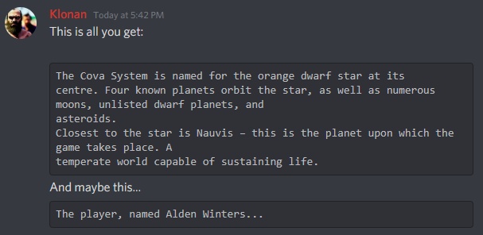

### Nauvis Archives Update: Nauvis Backstory

In [Alt-F4 #9](https://alt-f4.blog/ALTF4-9/) we investigated the name of our planet, Nauvis. Especially based on the fact that this name is never mentioned in the game (well, almost, thanks [IronCartographer](https://discordapp.com/channels/139677590393716737/603392474458882065/766621041454874626)). However, soon afterwards, the Wube Community Manager, [u/Klonan](https://www.reddit.com/user/Klonan/), [graced](https://discordapp.com/channels/139677590393716737/603392474458882065/766687476198539264) us with information never heard before.

It seems like there was plans for an official Factorio story long ago, and in typical Wube fashion, it seems to be very detailed. However, this idea was scrapped and never implemented. Wube likely decided to rather focus on gameplay mechanics, instead of diluting the game with a story and character background. And although many players have created their own [stories](https://www.reddit.com/r/factorio/comments/4pr8z6/im_writing_a_free_live_factorio_fanfic/?utm_source=share&utm_medium=web2x&context=3), Factorio does not need a story. It's the clean automation that keeps us playing day after day.