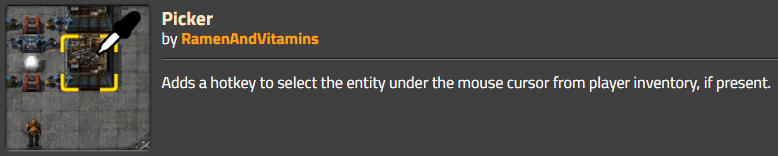
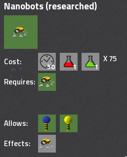
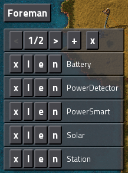

## Nauvis Archives: From Mod to Vanilla <author>stringweasel</author>

Other:
 - Upgrade Planner
 - Auto-Trash
 - Nuclear Power (https://mods.factorio.com/mod/Reactors)
 - Research queue

 Looked up to 0.15


Factorio has a very rich modding communnity. There's mods for almost anything you can think of. From complete overhaul mods like Space Exploration or Krastorio, to small quality of life mods like Far Reach, or even to listen to [KnighRider music while you're driving](https://mods.factorio.com/mod/JKIL-KnightRider). There are even mods with over 1 million downloads. However, the greatest honor a modder can likely achieve is to have his mod incorporated into the vanilla game. 

The developers can focus on making sure the game engine is perfect and optimized, while the modders can freely explore different ideas. SovietWomble has a [great series](https://www.youtube.com/watch?v=ZtNtbPuUdFc&ab_channel=SovietWomble) on this idea, but unlike ARMA, Wube adds the mods that the players really enjoy or need, as long as it fits in their vision.

THIS DOESN'T WORK.

~~There are various instances of where mods was incorporated into vanilla that most of you will know about. For example: [train fluid tankers](https://mods.factorio.com/mod/RailTanker), the [ability to barrel any liquid](https://mods.factorio.com/mod/Omnibarrels) (initially you could only barrel crude oil), [Landfill](https://forums.factorio.com/viewtopic.php?p=27982#p27982), to name only a few.~~ There is even a case where an active modder was incorporated into vanilla when [Rseding joined the Wube team](https://factorio.com/blog/post/fff-300).

Oldest version in Roadmap is 0.4, 3 May 2013

I downloaded these mods and tried to use them. You might notice that some of the referenced mod pages link to the [Factorio Forums](https://forums.factorio.com/viewforum.php?f=190) and not the [Mod Portal](https://mods.factorio.com/). This is because before Factorio 0.13 (6 June 2014) all mods were hosted on the Factorio Forums. It was only with the [launch of Factorio 0.13](https://www.factorio.com/blog/post/fff-141) that the Mod Portal was available.

### Transporting Fluids

Today fluids are very easy to transport. You can use trains with fluid wagons, maybe simple pipes, or even barrels to transport any fluid to any location. However, it wasn't always this easy. Fluid Wagons wasn't added to vanilla until 24 April 2017 with Factorio 0.15. Before that you had to barrel your crude-oil at the outpost and unbarrel it again at your base - which requries very careful empty barrel management. Or, you could download the [Rail Tanker mod](https://mods.factorio.com/mod/RailTanker) which was originally made by JamesOFarrell and released on 27 May 2014 as an extension of his [Wagons mod](https://forums.factorio.com/viewtopic.php?f=190&t=3926). The modder Choumiko took over maintaining the mod around Factorio 0.14, and it was moved to the [mod portal](https://mods.factorio.com/mod/RailTanker).

RAIL TANKER VIDEO EXAMPLE


*Caption: The Railtanker mod as seen in Factorio 0.12 (although released in Factorio 0.11 originally). Notice the old train graphics, and how there is [no one-tile-gap](https://www.factorio.com/blog/post/fff-133) between the wagons.*

This mod had a few limitations. For example, you could not place any inserters next to this rail tanker, because it would remove the *fake items* inside the tanker and corrupt it. The only way to fill up the tanker was using a maximum of two of the very weak small pumps - there was no regular pump yet. And the placement of the pump was icky (?), especially after train sizes changed in Factorio 0.13, but the rail tanker's size remained mostly the same. As an interesting side note, when the vanilla fluid wagon was finally added in Factorio 0.15, you could originally store store *three* different liquids inside one fluid wagon. Ever wondered why the fluid wagon has three tanks?

The other main way of transporting fluids long distance was using barrels. Barrels was part of Factorio from relatively early on, but initially the player was limited to *only* barreling crude-oil. The first person to mitigate this problem was *btw* with his [Liquid Station mod](https://forums.factorio.com/viewtopic.php?f=14&t=2797) which was released on 15 March 2014 for Factorio 0.9. In this mod you could to barrel any fluid, but you had to use a special machine - called a Liquid Station - to do so. 

LIQUID STATION EXAMPLE


*Caption: The Liquid Station mod as seen in Factorio 0.10. In the example sulpheric acid is moved between two storage tanks*

This mod was not maintained for long. However, it prompted a new mod which is much closer to what we know today. This mod was called [Fluid Barrels](https://forums.factorio.com/viewtopic.php?f=94&t=7887&hilit=fluid+barrel#p62260), as was created by firegrenade and published on 8 January 2015 for Factorio 0.11 (and later transfered to the [mod portal](https://mods.factorio.com/mods/jockeril/fluid-barrel)). In this mod any assembler could be used for barreling/unbarreling, as it is today. It was only in April 2017 with Factorio 0.15 - three years after the Liquid Station Mod - that any fluid could be barrelled in vanilla Factorio.

### The Picker Tool (The Q-key)

In the old days of Factorio you could not simply press `Q` while hovering over a building and have it magically appear in your cursor. No, you had manually to find it in your inventory or in you quick bar. And if you used your quickbar you also had to search through unwanted items, since in those days it was a [seperate inventory](https://www.factorio.com/blog/post/fff-191) and not simply shorcuts. A modder named Tinyboss saw this constant struggle and made the original [Picker](https://forums.factorio.com/viewtopic.php?f=93&t=14695) [mod](https://mods.factorio.com/mods/Tinyboss/picker). After a while Tinyboss [allowed](https://www.reddit.com/r/factorio/comments/67hsjj/the_new_pipette_tool/dgs9aa3?utm_source=share&utm_medium=web2x&context=3) the renown modder [Nexela](https://mods.factorio.com/user/Nexela) take over the mod's maintenance, who then created the [Picker Extended Mod](https://mods.factorio.com/mod/PickerExtended). 



*Caption: The mod page of the original Picker after it was moved to the Mod Portal. (Tinyboss goes by many aliases)*

In Factorio 0.15 some of this mod's functionality was [included](https://forums.factorio.com/viewtopic.php?t=50827) in the vanilla game. It should be noted that only a small part of the mod's functionality was added to vanilla. The mod is still available, and has an extensive set of extra useful features. 

### Personal Roboport

A very useful feature is the personal roboport. It's so integral to expanding your base I personally would not play Factorio without it. You only need to imagine building your entire rail network by hand ([see this base that likely did](https://alt-f4.blog/ALTF4-13)), or by first covering the entire area with roboports. Not to even think about the outposts. This amazing tool was only added to vanilla Factorio in 17 July 2015 with Factorio 0.12. Before that this feature was known only as Pocket Bots, and it was only available as a mod.


*Caption: The Pocket Bots technology screen as shown in Factorio 0.12*

Pocket Bots was released on 21 June 2014 by JamesOFarrell on a Factorio Forums thread called: [*Pocket Bots: Construction bots for your pocket*](https://forums.factorio.com/viewtopic.php?f=190&t=4441&p=33858&hilit=pocket+bots#p33858). Of course this mod became very popular and was used by many. However, JamesOFarrell had to be clever to mod it into the game. It seems like he had to create a temporary logistic chest at the players feet for the robots to be able to pick up (or drop) the items. There was no other way to pick it up directly from the players inventory. It had other quirks as well, like only working outside your roboport coverage, but that is where it typically was most used.

POCKET BOTS IN USE VIDEO


*Caption: An example of the pocket bots in use. Notice the temporary creation of a logistic chest at the players feet.*

The developers noticed how popular and useful this mod was, and almost exactly a year later the vanilla [Personal Roboport](https://wiki.factorio.com/Personal_roboport) was teased in [Factorio Friday Facts #92](https://factorio.com/blog/post/fff-92) in preperation for Factorio 0.12. It should be noted that in Factorio 0.12 there was only one personal roboport type, and no upgraded MK2 version. This meant to have 100 personal construction robots you had to have 10(!) personal roboports. It wasn't until Factorio 0.17, released on February 2019, that we received the [Personal Roboport MK2](https://wiki.factorio.com/Personal_roboport_MK2), which allowed you to fit 100 bots in your pocket using only 4 Personal Roboport MK2s.

### Blueprints

Blueprints is a very important feature on Factorio. Without it it would be frustratingly tedious to expand your factory, build another outpost, do train networks, etc. This feature has been on the wishlist a long time for Factorio's creator, kovarex. This can be seen in his [forum post](https://forums.factorio.com/viewtopic.php?f=9&t=6&p=7&hilit=blueprint#p7) from 2013 - when Factorio was still in infancy - where they were still deciding in what direction to take the game. But, it was not the developers who got to implement it first. No, the original creator was a modder named *drs9999*. And it was a technology that you had to unlock.



*Caption: The Blueprints technology screen as shown in Factorio 0.7. The little yellow robot is the old Robotics Technology icon. It's also used as the mod's nanobots - more on that later.*

This mod was first posted on the Factorio Forums on 13 March 2013 - just over a month after kovarex mentioned blueprints in the aforementioned forum and before Factorio 0.4. These blueprints did not work nearly as intuitively as they do today. This is simply because the game was just over a year old at the time. There wasn't construction bots back then, not to even mention a roboport. The lonely logistic bots just hovered around when not in use. But most importantly, mod functionality were not nearly as extensive as it is today. 

To circumvent these limitations the creator created markers that you can place down. These markers was used to designate an area to either save as blueprint or where to place down a saved blueprint. There was even an option to select an area to upgrade. You then required nanobots (the little yellow bots in the picture above) in your inventory that was then expended to build the blueprint in the designated area. The creator made a [YouTube tutorial](https://youtu.be/jpekc8DchQg) for more information. Below you can see a quick demonstration that I put together:

BLUEPRINT DEMO VIDEO


*Caption: Example use of the first blueprints. Clicking on the GUI was removed from the clip. Notice the old graphics, and which ones are still used today.*

Blueprints were added to vanilla on 14 February 2014 with Factorio 0.9, which means this mod was the only way to duplicate any part of your factory for over a year. And although it was deprecated quite quickly, it *most likely* influenced other massive mods to be created, like [Nanobots by Nexela](https://mods.factorio.com/mod/Nanobots) and [Upgrade Planner](https://forums.factorio.com/viewtopic.php?f=92&t=14781). It can also be noted that more blueprint features were modded before vanilla, like [blueprinting trains](https://mods.factorio.com/mod/blueprint-train) by DaveMcW and [mirroring blueprints](https://mods.factorio.com/mod/blueprint_flip_and_turn) by NovaM. But there are one more Blueprinting feature that I would like to highlight.


### The Blueprint String

A blueprint string is used to [import and export blueprints](https://wiki.factorio.com/Blueprint#Importing.2FExporting_blueprints) to and from you game. This can be anything from nuclear builds, rail network, or perfect-ratio solar blueprints. And as you might guess, this was also a mod before it was native to vanilla. We know that blueprints were added to vanilla in Factorio 0.9, but soon after that people wanted to start [sharing](https://forums.factorio.com/viewtopic.php?f=66&t=2697&p=19833&hilit=blueprint#p19833) their blueprints. And as always, a modder came to the rescue. This time it was JamesOFarrell again, the guy that brought us PocketBots, who then created a famous mod called [Foreman](https://forums.factorio.com/viewtopic.php?f=190&t=6516) on 6 November 2014.



*Caption: The Foreman GUI as seen in game (taken from the [forum post](https://forums.factorio.com/viewtopic.php?f=190&t=6516)).*

However, *technically* JamesOFarrell was not the first to implement the blueprint *string*, even though this mod was most likely its predecessor. Rather, the main feature of the Foreman mod was only the managing of blueprints. There was no blueprint books at that point - it was only added in Factorio 0.13, two years later. This meant each blueprint was saved seperately in your inventory, and would quikly clog it up. Therfore, besides managing blueprints, one of Foreman's features was a way to import/export these blueprints. But still, it didn't create blueprint strings originally. It instead created small snippets of Lua code! Below is an reduced piece of the `*.blueprint` file that it created - that could be read with any text editor - as example.

```
do local blueprintData={icons={[1]="fast-transport-belt",[2]="boiler"},entities={[1]={type="transport-belt",position={x=-8.5,y=-3.5},name="fast-transport-belt",orientation=0,direction=4,entitynumber=1},[2]={type="transport-belt",position={x=-8.5,y=-4.5},name="fast-transport-belt",orientation=0,direction=4,entitynumber=2},[3]={type="pipe-to-ground",position={x=-7.5,y=-4.5},name="pipe-to-ground",orientation=0,direction=2,entitynumber=3},[4]={type="inserter",direction=4,filters={[1]={index=1},[2]={index=2},[3]={index=3},[4]={index=4},[5]={index=5}},conditions={red={count=5,operator=">",name="raw-wood"},logistics={operator=">",count=1},green={operator=">",count=1}},entitynumber=4,orientation=0,connections={red={[1]=74},green={}},name="smart-inserter",position={x=-6.5,y=-3.5}},[5]={type="boiler",position={x=-6.5,y=-4.5},name="boiler",orientation=0,direction=0,entitynumber=5}, ... name="PowerSmart"};return blueprintData;end
```

And as you might imagine, this resulted in very large blueprint files and it became quite unwieldly. There was discussions about how reduce the blueprint's footprint, for example by using zip files, but nothing resulted in a robust implementation while maintaining ease-of-use. However, less than two weeks after Foreman was released, a famous modder called DaveMcW solved this problem. (If you don't know this name yet, see this [article](https://alt-f4.blog/ALTF4-13/)). He solved the blueprint size problem by compressing the mentioned code snippet using a `gzip + base64` format, and thus created the famous [Blueprint String](https://forums.factorio.com/viewtopic.php?f=14&t=6742).


*Caption: The easy to use Blueprint String GUI as seen in game (taken from the [forum post](https://forums.factorio.com/viewtopic.php?f=14&t=6742)).

Soon after this mod was released DaveMcW helped JamesOFarrell to support blueprint strings in Foreman as well. These two mods rules the blueprint gameplay. If you wanted to share blueprints you used Blueprint Strings, and if you wanted a better blueprint management tool you used Foreman. At some point the modder Choumiko took over maintaining of [Foreman](https://forums.factorio.com/viewtopic.php?f=92&t=14243). It wasn't until Factorio 0.15 - released 24 April 2017, more than two years later - that it was [supported in Vanilla](https://wiki.factorio.com/Blueprint). When it was added to vanilla the required code snippet changed slightly (which resulted in [this mod](https://mods.factorio.com/mods/DaveMcW/blueprint-string)), but the [compression method was still the same](https://github.com/tzwaan/python-factorio-blueprints/blob/062f34b34356bfd5820ab488746fe6dd0bccc4b4/py_factorio_blueprints/util.py#L19-L23) as first created by DaveMcW.