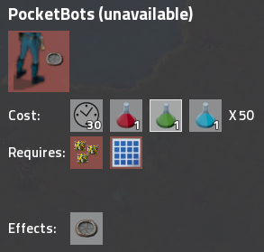

## Nauvis Archives: From Mod to Vanilla <author>stringweasel</author>

Factorio has a very rich modding communnity. There's mods for almost anything you can think of. From complete overhaul mods like Space Exploration or Krastorio, to small quality of life mods like Far Reach, or even to listen to [KnighRider music while you're driving](https://mods.factorio.com/mod/JKIL-KnightRider). There are even mods with over 1 million downloads. However, the greatest honor a modder can likely achieve is to have the mod incorporated into the vanilla game. 

The developers can focus on making sure the game engine is perfect and optimized, while the modders can freely explore different ideas. SovietWomble has a [great series](https://www.youtube.com/watch?v=ZtNtbPuUdFc&ab_channel=SovietWomble) on this idea, but unlike ARMA, Wube adds the mods that the players really enjoy or need, as long as it fits in their vision.

THIS DOESN'T WORK.

There are various instances of where mods was incorporated into vanilla that most of you will know about. For example: [train fluid tankers](https://mods.factorio.com/mod/RailTanker), the [ability to barrel any liquid](https://mods.factorio.com/mod/Omnibarrels) (initially you could only barrel crude oil), [Landfill](https://forums.factorio.com/viewtopic.php?p=27982#p27982), to name only a few. There is even a case where an active modder was incorporated into vanilla when [Rseding joined the Wube team](https://factorio.com/blog/post/fff-300).

Oldest version in Roadmap is 0.4, 3 May 2013

### The Picker Tool (The Q-key)
[*by Nexela*](https://mods.factorio.com/mod/PickerExtended)

https://www.reddit.com/r/factorio/comments/67hsjj/the_new_pipette_tool/

In the old days of Factorio you could not simply press `Q` while hovering over a building and have it magically appear in your cursor. No, you had to find it in your inventory or in you quick bar. And if you used your quickbar you also had to search through unwanted items, since in those days it was a [seperate inventory](https://www.factorio.com/blog/post/fff-191) and not simply shorcuts. A modder named Tinyboss saw this constant struggle and made the original [Picker](https://forums.factorio.com/viewtopic.php?f=93&t=14695) [mod](https://mods.factorio.com/mods/Tinyboss/picker). After a while Tinyboss [allowed](https://www.reddit.com/r/factorio/comments/67hsjj/the_new_pipette_tool/dgs9aa3?utm_source=share&utm_medium=web2x&context=3) the renown modder [Nexela](https://mods.factorio.com/user/Nexela) take over maintaining it, who then created the [Picker Extended Mod](https://mods.factorio.com/mod/PickerExtended).

### Personal Roboport
[*Originall called Pocket Bots. By JamesOFarrell*](https://forums.factorio.com/viewtopic.php?f=190&t=4441&p=33858&hilit=pocket+bots#p33858)

A very useful feature is the personal roboport. It's so integral to expanding your base I personally would not play Factorio without it. You only need to imagine building your entire rail network by hand ([see this base that likely did](https://alt-f4.blog/ALTF4-13)), or by first covering the entire area with roboports. Not to even think about the outposts. This amazing tool was only added to vanilla starting in Factorio 0.12, which was released in 17 July 2015. Before that it was known only as Pocket Bots, and it was only available as a mod.

*Caption: The Pocket Bots technology screen*

Pocket Bots was released on 21 June 2014 by JamesOFarrell on a Factorio Forums thread called: [*Pocket Bots: Construction bots for your pocket*](https://forums.factorio.com/viewtopic.php?f=190&t=4441&p=33858&hilit=pocket+bots#p33858). Of course this mod became very popular and was by many. However, JamesOFarrell had to be clever to mod it into the game. It seems like he had to create a temporary logistic chest at the players feet for the robots to be able to pick up (or drop) the items. There was no other way to pick it up directly from the players inventory. It had other quirks as well, like only working outside your roboport coverage, but that is where it typically was most used.

POCKET BOTS IN USE VIDEO

*Caption: An example of the pocket bots in use. Notice the temporary creation of a logistic chest at the players feet.*

The developers noticed how popular and useful this mod was, and almost exactly a year later the vanilla [Personal Roboport](https://wiki.factorio.com/Personal_roboport) was teased in [Factorio Friday Facts #92](https://factorio.com/blog/post/fff-92) in preperation for Factorio 0.12. It should be noted that in Factorio 0.12 there was only one personal roboport type, and no upgraded MK2 version. This meant to have 100 personal construction robots you had to have 10(!) personal roboports. It wasn't until Factorio 0.17, released on February 2019, that we received the [Personal Roboport MK2](https://wiki.factorio.com/Personal_roboport_MK2), which allowed you to fit 100 bots in your pocket using only 4 Personal Roboport MK2s.

But what use would a personal roboport be, or even a construction robot for that matter, without the use of blueprints?

### Blueprints

Blueprints is a very important feature on Factorio. Without it it would be frustratingly tedious to expand your factory, build another outpost, do train networks, etc. I would not want to play Factorio today without blueprints. But, this was also a mod before it was accesable to everyone.

