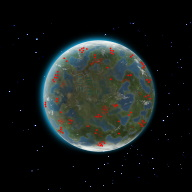

# Nauvis Archives: Our Own Jargon

In any established community a form of [jargon](https://en.wikipedia.org/wiki/Jargon) is created over time. A selection of words that only people from that community will understand the true meaning of. For example, for Satisfactory engineers these are words could be “lizard doggo” or “I-wish-this-was-Factorio”. For our native biters, these are words could be "Rooarre", "Wrrii", or "Chrokk" (see [ssilk](https://forums.factorio.com/memberlist.php?mode=viewprofile&u=507)’s  explanation [here](https://forums.factorio.com/viewtopic.php?t=63040&start=40)). And - just as any thriving community - we also have a few words that only we understand.

## Underneathies

Underneathies. This word we’ve all heard big players (such as the legendary [KatherenOfSky](https://www.youtube.com/channel/UCTIV3KbAvaGEyNjoMoNaGtQ) or [Nilaus](https://www.youtube.com/channel/UCD80bzqJh1N7lOqn7n0vKTg/featured)) [use](https://www.youtube.com/watch?v=PXmwJ5Dq_sA&ab_channel=KatherineOfSky) when talking about [underground belts](https://wiki.factorio.com/Underground_belt). Or even on Reddit, like when [u/excessionoz](https://www.reddit.com/user/excessionoz/) accidentally [destroyed his mall](https://www.reddit.com/r/factorio/comments/9s7x30/tip_be_very_sure_of_your_circumstances_when/) (another example of jargon) when he used Upgrade Planner when it only existed as a [mod](https://mods.factorio.com/mod/upgrade-planner). But, where is this odd word from?

Well, on it all started on 9 March 2017. On this fateful day [u/Dynamic_Gravity](https://www.reddit.com/user/Dynamic_Gravity/) had an ~~argument~~ debate with his girlfriend about what an underground belt was really called. They couldn't come to an agreement, so they turned to the experts on reddit and sent out a [poll](https://www.reddit.com/r/factorio/comments/5yi071/need_your_help_in_settling_a_debate_with_gf/). And in *that* poll - which his girlfriend so avidly defended - was the word: "underneathies".

The rest - as they say -  is history. The community adopted this word into its jargon like hot cake. It took only three days for a [mod](https://mods.factorio.com/mod/Underneathies) to change the in-game name to “underneathies” (created by [/u/Suprcheese](https://www.reddit.com/user/Suprcheese/) who brought us other legendary mods like [Squeak Through](https://mods.factorio.com/mod/Squeak%20Through) and [Orbital Ion Cannon](https://mods.factorio.com/mod/Orbital%20Ion%20Cannon)). And, after more than three years this word is still widely used and loved by all. 

It's fascinating how naturally *this* particular word was incorporated into our community. I mean, it could just as easily have been nicknamed ["undie-grundies"](https://www.reddit.com/r/factorio/comments/5yi071/need_your_help_in_settling_a_debate_with_gf/deqgd0x?utm_medium=android_app&utm_source=share&context=3).

## Nauvis: Our Home

Stretching grass planes, dangerous red deserts, and infinitely deep lakes. A land rich in resources, but inhabited by a local biter menace. This is a place we all know and love after brutally crashlanding on it. It's our home, and we call it Nauvis. 

(credit to the mod [Nauvis Day](https://mods.factorio.com/mod/NauvisDay) with some extra editing)

But, nowhere does the game call our planet "Nauvis" - the campaign simply calls it a “strange place”. Even in the ancient days of 0.13 the mission [First Steps](https://forums.factorio.com/viewtopic.php?t=51100) simply called it “an unknown planet”. But yet, we all know the planet we’re all viciously polluting is called Nauvis. Why?

Well, the game itself has various dimensions of existence - or as the creators call them - different *surfaces*. And the *surface* we all live on is called [Nauvis](https://lua-api.factorio.com/latest/LuaSurface.html). However, this does not necessarily mean that it's our planet's name. A surface is used to create a variety of constructs, including [space platforms](https://mods.factorio.com/mod/space-exploration) and [factory floors](https://mods.factorio.com/mod/Factorissimo2). But, modders realized what our *surface* is called, and at some point, this knowledge was transferred to the general public, and that is what we call our planet now.

But why *Nauvis*? What does it mean? There is no direct translation that we know of - but there are many legends. [Some](https://www.reddit.com/r/factorio/comments/7erfs8/whats_the_origin_of_the_planets_name_nauvis/dq7faa4?utm_medium=android_app&utm_source=share&context=3) say it’s from the Latin word [“novus”](https://en.wiktionary.org/wiki/novus) which means “new”. Or, depending on how it’s pronounced, it could be from Latin word [“nāvis”](https://en.wiktionary.org/wiki/navis) which means “ship”. What else would an engineer be used to calling his home when he has travelled through space for long periods of time in a *ship*?

Alas, we might never know what our planet was originally called - by our people or the natives. Or what the true meaning is behind the beautiful name. But, we will always call our home, that we're all stranded on, Nauvis.
