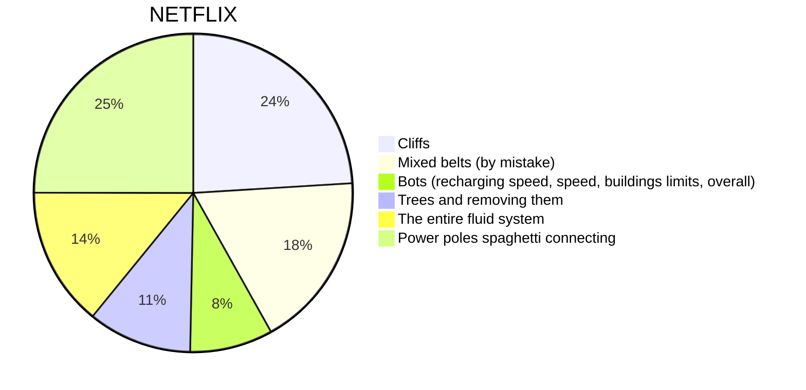

## Is factorio a annoying game?
It depends on player what annoys them the most in factorio, for me cliffs are devilish idea, xterminator will scream at trains and somebody else will say that missplaced landfill is the worse. So I've ask our community on reddit "What is the most annoying thing in factorio" and answers was divided.

Thanks to every 1.6k people who took part in the survey and expressed their opinion. Results shows that the most annoying things for players is "Power poles spaghetti connecting". I don't think anyone was surprised that power poles will be one of the most annoying thing, because everyone try to keep their factory in perfect by using good ratios, proper trains names or by building a "main bus" design.

Blueprints however don't save connected cables and no matter how pretty they look when you creating a blueprint, this one little detail will not be saved. It's getting more noticeable, when you're entering megabase stadium and most of your buildings are made out of blueprints.

We have to look also at most upvoted comments, because they might have less votes then answers from pool, but less people look into comments section. Putting first one aside, second one is a proper submission with big amount of upvotes.

Power armors give player additional 10-30 inventory size bonus depending on tier. This space is very useful to keep more machines and build bigger buildings, but keeping whole inventory full sometimes leads to unpleased situations. There is not much to say because [u/Mr_Shteeveey](https://www.reddit.com/user/Mr_Shteeveey/) described it very well in his comment.

### Painful things that got removed

Every game developer tries to make their game the best on the market. Factorio devs put a lot of effort to make their game very intuitive and fun to play without taking advanced mechanics from the game. I think many people would agree that factorio is "easy to play, hard to master" type of game, because you can start playing it without any knowledge and know what you are doing and what you need to do next, but it wasn't always like that.

Factorio had a lot of annoying mechanics, that every player hated. I don't know if many of you remember killing biter bases to get some [Alien artifact](https://wiki.factorio.com/Alien_artifact), because that feature was deleted in 0.15 (24.04.2017). For those who don't remember, alien artifacts was used to craft advance materials like modules tier 3 or power armors and also you could craft [purple science](https://wiki.factorio.com/Alien_science_pack), that was the highest tier of science packs in Factorio version 0.15. Constant expansion for more purple orbs wasn't in "Factorio style" where idea is to automate everything, so they got removed and very well.

In Minecraft you need iron pickaxe to dig diamonds, but you need stone and wood first. Factorio was inspired by this idea and also had 4 difference types of pickaxes (wooden and stone was deleted in ancient times) used to mine better "tiers" of resources, but this type of gathering resources in early game was just a distraction from core gameplay.

However iron and steel axes was left in the game for a long time and both tools provided difference problems.
[Iron axe](https://wiki.factorio.com/Iron_axe) was an unnecessary step towards your factory, crafted only once or twice to provide you first iron. What's more new players had problems to find, craft or use this tool what created difficulties and frustration in first few minutes with game.
[Steel axe](https://wiki.factorio.com/Steel_axe) on the other hand was with us throughout the whole game, crafted from time to time in a bulk amount.

There is more things like: old toolbar, old blueprints management, not upgrade planner, old oil processing, fluids system, no auto replacing belts or homing biters shots. All of this and many more was removed/upgraded during factorio early access. Many games in alpha/beta stage gets a lot of new buildings, mechanics or enemies, but factorio chose difference path and instead of adding more they improved what is already there. People who feel lack of content in factorio can always finds something in huge [library of mods](https://mods.factorio.com/), because stable core makes modding easier.

If you want to read more about removed mechanics there is old fff [Cleanup of mechanics](https://factorio.com/blog/post/fff-266), that will explain in detail decisions behind: pickaxes, furnace heating, burner efficiency and ore hardness.

### All your factorio pain in one video...
You might already saw this video, because it was quite popular on reddit and now is going viral on YouTube, but if not then this video collected (almost) all painful things from factorio like <s>xterminator</s> being killed by a train or looking at your stuck spidertrone, into fast paced compilation.

To make this kind of "cinematic" videos is good to know [factorio console](https://wiki.factorio.com/Console) and [map editor](https://wiki.factorio.com/Map_editor). Because it gives you ability to build big factory in no time, modify researches and for example speed up time. There are many great commands what you can use and whole list is on [factorio wiki](https://wiki.factorio.com/Console). It is also interesting, that Factorio trailers used special prepared [Lua scripts](https://www.lua.org/about.html), like we can read in description: "All the actions, movement and logic in general in the trailer are controlled by the game native modding system (Lua scripting)".

Whole necessary [factorio API](https://lua-api.factorio.com/latest/) needed to work with Lua is well described on official website.

With the help of the above-mentioned technics, I've build very interesting machines that are useless in every aspect and their only purpose was to deal maximum amount of pain. There is a small list with explanation.
I wanted to show cumulative "Train out of fuel" alert and to do this, I simply stopped time in editor and make 10 pointless rails circles. In every circle, I've placed one locomotive and setup schedule for infinite repetitions. As time was stopped, there was no problem to put one more wood to each subsequent locomotive. When everything was ready, I exited editor mode to start time and recorded appearing pop-ups.

Second machine was used to make yt thumbnail and it's just four locomotives connected to one circuit condition and set up to travel straight no matter what. You can also see simple self-timer made out of belts to have time for taking best position.

### No pain, No gain
Factorio has come a long way (8.5 years) to be right where it is. Mistakes were made, but devs didn't pretend that everything is fine and they work hard to make factorio a wonderful games for casual players and veterans. From this submission you can think than I'm tormenting this game and looking for everything I can attach to, but truth is I respect work that Wube software [team](https://factorio.com/game/about) put into this masterpiece.

In my next submission I'll try to explain why factorio is such a perfect game instead of saying what is wrong I'll say what is good. I'm not a member of Wubue software, but my knowledge and experience is enough to revers-engineer the best parts of the game. It will only be the beginning of the iceberg, because 8.5 years of development can't be shrink to one little post.
