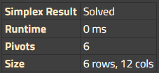
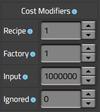
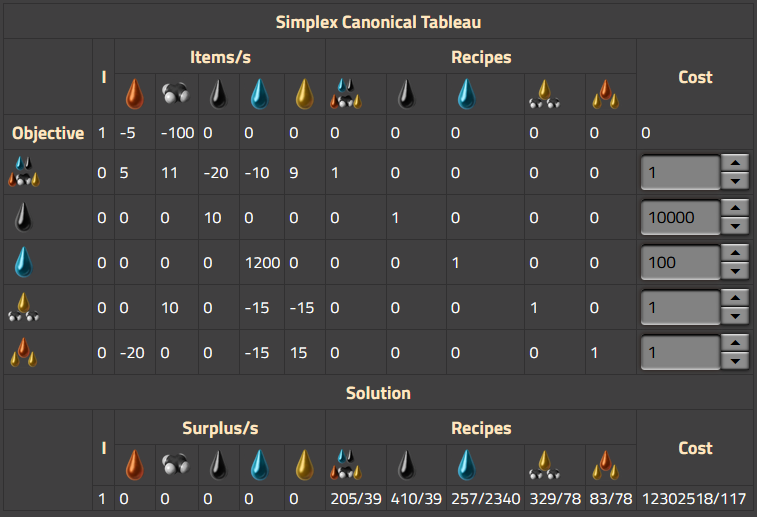

# Optimizing the Solution

Hi! As a long time user of the [Kirk McDonald Factorio Calculator](https://kirkmcdonald.github.io) and an Angular developer, in 2020 I decided to build my own web-based calculator for factory games called [FactorioLab](https://factoriolab.github.io). Kirk McDonald published an [essay](http://kirkmcdonald.github.io/posts/calculation.html) on his solution approach that helped me to get started, but it stops short of explaining the algorithm it uses to find a solution. After struggling through the math for some time and building two iterations of non-simplex solvers in FactorioLab, I wanted to share with the community what I learned when implementing a true simplex algorithm solver.

## Why use a calculator?

Let's start from the beginning. In factory games like [Factorio](https://factorio.com/), [Dyson Sphere Program](https://store.steampowered.com/app/1366540/Dyson_Sphere_Program/), and [Satisfactory](https://www.satisfactorygame.com/), the objective is to mine raw resources, use those resources to craft items following a recipe, and use those items to discover more advanced items and recipes. Early in these games, the recipes and items involved are simple and do not require extensive planning, but as more items and recipes are unlocked, the production chain can become incredibly complicated. Factory calculators like [FactorioLab](https://factoriolab.github.io) and the [Kirk McDonald Factorio Calculator](https://kirkmcdonald.github.io) are intended to help determine how many raw resources and factories are required to sustainably produce items at a certain rate.

## Concepts

There are two important concepts in factory games that are important to understanding the math behind calculations: **items** and **recipes**.

1. **Items** are the products and ingredients in factory games. Some items only exist as intermediates, and cannot do anything on their own, such as most raw resources. Some items can also serve a purpose in the game, such as fuel, transport belts, furnaces, assemblers, power generation, power distribution, etc.
1. **Recipes** are the ways in which players craft new, more advanced items in the game. Some items can be crafted by hand using a recipe, and other recipes can only be performed by specific factory buildings, like assemblers or furnaces. Recipes usually take a specific set of items as inputs, take a specific amount of time to perform, and produce a specific set of items as products. Recipes are often represented as a list of ingredients and an amount of time to craft to the left of an arrow, which points to the list of products on the right.

For example, in Factorio, a basic item is iron ore. Iron ore is a raw resource, meaning it is produced via a recipe that takes no items as inputs:

 (1 second) →  (1 iron ore)

This recipe can be crafted on an iron ore patch, by hand or by a mining drill. Iron ore is primarily used as an ingredient to produce iron plates, which use their own recipe:

 (3.2 seconds) +  (1 iron ore) →  (1 iron plate)

Iron plates cannot be crafted by hand, and must be produced in a furnace. Recipes can also include many inputs and outputs, such as one of the more complicated recipes in Factorio, advanced oil processing:

 (5 seconds) +  (100 crude oil) +  (50 water) →  (25 heavy oil) +  (45 light oil) +  (55 petroleum gas)

This recipe can only be crafted using a refinery.

## Recipe equations

You may notice that if you substitute the arrow for an equals sign, a recipe can easily be interpreted as an equation. Since time itself is not an actual item, to make this equation meaningful, we need to divide both sides by the amount of time and thus treat the numbers in equation as rates instead of a simple number of items. Hence, the iron ore recipe becomes:

0 =  (1 iron ore / second)

In this case, the left side is zero since the recipe takes no inputs. Likewise, the iron plate recipe becomes:

 (5/16 iron ore / second) =  (5/16 iron plate / second)

Up to a certain point, these equations are relatively simple to solve. Many items can only be produced by a single recipe, and thus it only requires simple algebra to determine the number of items and recipes involved to produce items at a certain rate. In FactorioLab, if the products specified can only be produced by one recipe, these equations are solved directly as far down the production chain as possible. However, some items can be produced via multiple different recipes, and then it becomes more complex to determine which recipe, or often how many of each recipe, is optimal to produce the desired items while consuming less input.

## Recipe matrices

The canonical problem in Factorio is advanced oil processing and cracking, and will be used as the primary example of finding a solution. This problem usually involves at least five recipes and five items. The recipes are:

 **Crude oil (raw resource)**  
Crude oil production speed varies based on the resource on the map, but can be treated in a simplified form.  
 (1 second) →  (10 crude oil)

 **Water (raw resource)**  
 (1 second) →  (1200 water)

 **Advanced oil processing**  
 (5 seconds) +  (100 crude oil) +  (50 water) →  (25 heavy oil) +  (45 light oil) +  (55 petroleum gas)

 **Heavy oil cracking**  
 (2 seconds) +  (40 heavy oil) +  (30 water) →  (30 light oil)

 **Light oil cracking**  
 (2 seconds) +  (30 light oil) +  (30 water) →  (20 petroleum gas)

Note that other recipes may also be involved, such as basic oil processing and coal liquefaction, but these will be ignored at this time.

Dividing these recipes by their recipe time yields an equation based on rates, which is the form the calculator needs to calculate production requirements.

 **Crude oil (raw resource)**  
 (10 crude oil/second)

 **Water (raw resource)**  
 (1200 water/second)

 **Advanced oil processing**  
 (20 crude oil/second) +  (10 water/second) →  (5 heavy oil/second) +  (9 light oil/second) +  (11 petroleum gas/second)

 **Heavy oil cracking**  
 (20 heavy oil/second) +  (15 water/second) →  (15 light oil/second)

 **Light oil cracking**  
 (15 light oil/second) +  (15 water/second) →  (10 petroleum gas/second)

These recipes can be organized into a matrix. This matrix should have columns for recipes, and rows for items. This creates a different set of equations, one equation for each item. For example, for crude oil:  
10  - 20  = # output 

Dividing the item amounts by their recipe time, the full matrix looks like:

|                                                                                                   |  |  |  |  |  |
| ------------------------------------------------------------------------------------------------- | ---------------------------------------------------------------------------------- | ------------------------------------------------------------------------------------------------- | ------------------------------------------------------------------------------------------------------------------------------- | ---------------------------------------------------------------------------------------------------------------- | ---------------------------------------------------------------------------------------------------------------- |
|              | 10                                                                                 | 0                                                                                                 | -20                                                                                                                             | 0                                                                                                                | 0                                                                                                                |
|                          | 0                                                                                  | 1200                                                                                              | -10                                                                                                                             | -15                                                                                                              | -15                                                                                                              |
|              | 0                                                                                  | 0                                                                                                 | 5                                                                                                                               | -20                                                                                                              | 0                                                                                                                |
|              | 0                                                                                  | 0                                                                                                 | 9                                                                                                                               | 15                                                                                                               | -15                                                                                                              |
|  | 0                                                                                  | 0                                                                                                 | 11                                                                                                                              | 0                                                                                                                | 10                                                                                                               |

Next, we need to account for what we want to actually produce from our factory. To handle this, we can add a column to represent the final outputs of our factory. As an example, let's say that we want to produce  (5 heavy oil/second) and  (100 petroleum gas/second). In order to represent this idea in the matrix, we need to make these values negative, because we're indicating that we're taking that amount out of the system.

|                                                                                                   |  |  |  |  |  | Out  |
| ------------------------------------------------------------------------------------------------- | ---------------------------------------------------------------------------------- | ------------------------------------------------------------------------------------------------- | ------------------------------------------------------------------------------------------------------------------------------- | ---------------------------------------------------------------------------------------------------------------- | ---------------------------------------------------------------------------------------------------------------- | ---- |
|              | 10                                                                                 | 0                                                                                                 | -20                                                                                                                             | 0                                                                                                                | 0                                                                                                                | 0    |
|                          | 0                                                                                  | 1200                                                                                              | -10                                                                                                                             | -15                                                                                                              | -15                                                                                                              | 0    |
|              | 0                                                                                  | 0                                                                                                 | 5                                                                                                                               | -20                                                                                                              | 0                                                                                                                | -5   |
|              | 0                                                                                  | 0                                                                                                 | 9                                                                                                                               | 15                                                                                                               | -15                                                                                                              | 0    |
|  | 0                                                                                  | 0                                                                                                 | 11                                                                                                                              | 0                                                                                                                | 10                                                                                                               | -100 |

## Linear programming

A matrix of this nature is called a linear program in mathematics, and can be solved using linear programming techniques. The most common method for solving a linear program is the [Simplex algorithm](https://en.wikipedia.org/wiki/Simplex_algorithm), and it is the method used by both FactorioLab and the [Kirk McDonald Factorio Calculator](https://kirkmcdonald.github.io). Since there are multiple possible solutions to this linear program, the Simplex algorithm takes the approach of maximizing an objective function, which is essentially another row in the matrix.

While we do not necessarily have anything we want to maximize in our linear program, we do want to minimize the amount of resources and factories required to produce our output items. So, instead of adding an objective we want to maximize, we can first add a "Cost" function to our linear program so that we can describe how we want to minimize the number of resources and factories in our solution.

The cost function can be rather abstract and arbitrary, as there is no specific cost of resources and factories in games like Factorio and Dyson Sphere Program. Instead, we have to rely on intuition of what is most difficult to obtain and set up in a factory. In FactorioLab, this comes down to a few specific variables that define the cost function:

- A single factory running a recipe costs **1**.
- One unit of water costs **100**, since water is generally cheap to obtain (note, this only applies to Factorio).
- One unit of any 'mined' resource costs **10,000**. In Factorio, this applies to coal, uranium ore, stone, iron ore, and copper ore. Generally, these are the resources we want to minimize.
- One unit of any 'manually collected' resource costs **100,000**. In Factorio, this applies to wood, for example. While wood is generally not part of any important recipes in vanilla Factorio, we want to minimize any use of resources we cannot collect automatically.

We can represent this cost function as an additional row in our matrix. In order to accurately account for the cost of mined resources, we will simplify those recipes so that the cost is based on the number of items, rather than the number of factories mining the resource. Thus the  (pumpjack) and  (offshore pump) recipes are simplified into a recipe that has higher cost and only produces 1 item per second. Once we calculate an amount of  (crude oil) and  (water) for the solution, it is trivial to convert this production number back into a number of factories.

|                                                                                                   |  |  |  |  |  | Out  |
| ------------------------------------------------------------------------------------------------- | ------------------------------------------------------------------------------------- | ------------------------------------------------------------------------- | ------------------------------------------------------------------------------------------------------------------------------- | ---------------------------------------------------------------------------------------------------------------- | ---------------------------------------------------------------------------------------------------------------- | ---- |
|              | 1                                                                                     | 0                                                                         | -20                                                                                                                             | 0                                                                                                                | 0                                                                                                                | 0    |
|                          | 0                                                                                     | 1                                                                         | -10                                                                                                                             | -15                                                                                                              | -15                                                                                                              | 0    |
|              | 0                                                                                     | 0                                                                         | 5                                                                                                                               | -20                                                                                                              | 0                                                                                                                | -5   |
|              | 0                                                                                     | 0                                                                         | 9                                                                                                                               | 15                                                                                                               | -15                                                                                                              | 0    |
|  | 0                                                                                     | 0                                                                         | 11                                                                                                                              | 0                                                                                                                | 10                                                                                                               | -100 |
| Cost                                                                                              | 10000                                                                                 | 100                                                                       | 1                                                                                                                               | 1                                                                                                                | 1                                                                                                                | 0    |

## Dual minimization problem

Now, the issue with this linear program is that we want to minimize the cost of our solution, while the Simplex algorithm is designed to maximize an objective. Fortunately, there is a simple way to convert a minimization problem into a maximization problem that can be solved using the Simplex algorithm. This is accomplished by converting the minimization problem into its "dual maximization problem." Once a minimization problem is converted into its dual maximization problem, it is feasible to solve the dual problem using the Simplex algorithm. The solution to the maximization of the dual problem is the same as the solution to the minimization of the original problem, so we can accept this as our solution.

The dual problem is simply a transpose of the original problem, or swapping the rows and columns. This results in:
| |  |  |  |  |  | Cost |
| -- | -- | -- | -- | -- | -- | -- |
|  | 1 | 0 | 0 | 0 | 0 | 10000 |
|  | 0 | 1 | 0 | 0 | 0 | 100 |
|  | -20 | -10 | 5 | 9 | 11 | 1 |
|  | 0 | -15 | -20 | 15 | 0 | 1 |
|  | 0 | -15 | 0 | -15 | 10 | 1 |
| Out | 0 | 0 | -5 | 0 | -100 | 0 |

In order to handle potential surplus values, linear programming generally adds 'surplus' or 'slack' variables to the program. For instance, for a factory to produce only  (heavy oil), there is no solution that does not involve some surplus amount of  (light oil) and  (petroleum gas). These are represented by additional columns in the matrix where each column has a '1' value in the row matching its item.

|                                                                                                                                 |  |  |  |  |  | + | + | + | + |  | Cost  |
| ------------------------------------------------------------------------------------------------------------------------------- | ------------------------------------------------------------------------------------- | ------------------------------------------------------------------------- | ------------------------------------------------------------------------------------- | ------------------------------------------------------------------------------------- | ------------------------------------------------------------------------------------------------- | -------------------------------------------------------------------------------------- | -------------------------------------------------------------------------- | -------------------------------------------------------------------------------------- | -------------------------------------------------------------------------------------- | ------------------------------------------------------------------------------------------------- | ----- |
|                                            | 1                                                                                     | 0                                                                         | 0                                                                                     | 0                                                                                     | 0                                                                                                 | 1                                                                                      | 0                                                                          | 0                                                                                      | 0                                                                                      | 0                                                                                                 | 10000 |
|                                                        | 0                                                                                     | 1                                                                         | 0                                                                                     | 0                                                                                     | 0                                                                                                 | 0                                                                                      | 1                                                                          | 0                                                                                      | 0                                                                                      | 0                                                                                                 | 100   |
|  | -20                                                                                   | -10                                                                       | 5                                                                                     | 9                                                                                     | 11                                                                                                | 0                                                                                      | 0                                                                          | 1                                                                                      | 0                                                                                      | 0                                                                                                 | 1     |
|                 | 0                                                                                     | -15                                                                       | -20                                                                                   | 15                                                                                    | 0                                                                                                 | 0                                                                                      | 0                                                                          | 0                                                                                      | 1                                                                                      | 0                                                                                                 | 1     |
|                 | 0                                                                                     | -15                                                                       | 0                                                                                     | -15                                                                                   | 10                                                                                                | 0                                                                                      | 0                                                                          | 0                                                                                      | 0                                                                                      | 1                                                                                                 | 1     |
| Out                                                                                                                             | 0                                                                                     | 0                                                                         | -5                                                                                    | 0                                                                                     | -100                                                                                              | 0                                                                                      | 0                                                                          | 0                                                                                      | 0                                                                                      | 0                                                                                                 | 0     |

Now, we finally have a canonical matrix that can be solved using the Simplex algorithm.

## Solving with simplex

The end goal of the Simplex algorithm is to arrive at a matrix where the objective function (in this case, the last row of the matrix) contains no negative numbers. In our initial matrix, note that our objective row has two columns with negative values, representing the two items we want to produce. In order to reach our solution, we simply need to apply 'pivot' operations until our objective row no longer has any negative values.

### Pivot 1

A Simplex pivot operation involves four steps.

1. Choose a column to pivot. This must be a negative column, and is usually chosen as the largest negative number. In our matrix, this would be the  (petroleum gas) column.
1. Choose a row to pivot. Check each row where the chosen column has a value greater than zero, and calculate the ratio of the cost column in that row to the value of the chosen column in that row. The pivot row is the row with the lowest ratio. In our matrix, we can check each row:
   1. :  column is 0, ignore this row.
   1. :  column is 0, ignore this row.
   1. :  column is 11, cost column is 1, so the ratio is 1/11.
   1. :  column is 0, ignore this row.
   1. :  column is 10, cost column is 1, so the ratio is 1/10.
   1. The lowest ratio is the  row at 1/11, so we will pivot this row.
1. Divide the pivot row by the reciprocal of the pivot element. In our pivot row, this yields -20/11, -10/11, 5/11, 9/11, 1, 0, 0, 1/11, 0, 0, 1/11
1. Add multiples of the pivot row to other rows to change the pivot column to 0. The final result is:

| + | + | + | + | + |  |  |  |  |  | Cost   |
| -------------------------------------------------------------------------------------- | -------------------------------------------------------------------------- | -------------------------------------------------------------------------------------- | -------------------------------------------------------------------------------------- | -------------------------------------------------------------------------------------------------- | ------------------------------------------------------------------------------------- | ------------------------------------------------------------------------- | ------------------------------------------------------------------------------------------------------------------------------- | ---------------------------------------------------------------------------------------------------------------- | ---------------------------------------------------------------------------------------------------------------- | ------ |
| 1                                                                                      | 0                                                                          | 0                                                                                      | 0                                                                                      | 0                                                                                                  | 1                                                                                     | 0                                                                         | 0                                                                                                                               | 0                                                                                                                | 0                                                                                                                | 10000  |
| 0                                                                                      | 1                                                                          | 0                                                                                      | 0                                                                                      | 0                                                                                                  | 0                                                                                     | 1                                                                         | 0                                                                                                                               | 0                                                                                                                | 0                                                                                                                | 100    |
| -1 9/11                                                                                | -10/11                                                                     | 5/11                                                                                   | 9/11                                                                                   | 1                                                                                                  | 0                                                                                     | 0                                                                         | 1/11                                                                                                                            | 0                                                                                                                | 0                                                                                                                | 1/11   |
| 0                                                                                      | -15                                                                        | -20                                                                                    | -20                                                                                    | 15                                                                                                 | 0                                                                                     | 0                                                                         | 0                                                                                                                               | 1                                                                                                                | 0                                                                                                                | 1      |
| 18 2/11                                                                                | -5 10/11                                                                   | -4 6/11                                                                                | -23 2/11                                                                               | 0                                                                                                  | 0                                                                                     | 0                                                                         | -10/11                                                                                                                          | 0                                                                                                                | 1                                                                                                                | 1/11   |
| -181 + 9/11                                                                            | -90 10/11                                                                  | 40 5/11                                                                                | 81 9/11                                                                                | 0                                                                                                  | 0                                                                                     | 0                                                                         | 9 1/11                                                                                                                          | 0                                                                                                                | 0                                                                                                                | 9 1/11 |

Now, let's continue with the next pivot.

### Pivot 2

Column 1 (-181 9/11), Row 5 (Ratio 1/200)

| + | + | + | + | + |  |  |  |  |  | Cost           |
| -------------------------------------------------------------------------------------- | -------------------------------------------------------------------------- | -------------------------------------------------------------------------------------- | -------------------------------------------------------------------------------------- | -------------------------------------------------------------------------------------------------- | ------------------------------------------------------------------------------------- | ------------------------------------------------------------------------- | ------------------------------------------------------------------------------------------------------------------------------- | ---------------------------------------------------------------------------------------------------------------- | ---------------------------------------------------------------------------------------------------------------- | -------------- |
| 0                                                                                      | 13/40                                                                      | 1/4                                                                                    | 1 + 11/40                                                                              | 0                                                                                                  | 1                                                                                     | 0                                                                         | 1/20                                                                                                                            | 0                                                                                                                | -11/200                                                                                                          | 9999 + 199/200 |
| 0                                                                                      | 1                                                                          | 0                                                                                      | 0                                                                                      | 0                                                                                                  | 0                                                                                     | 1                                                                         | 0                                                                                                                               | 0                                                                                                                | 0                                                                                                                | 100            |
| 0                                                                                      | -1 1/2                                                                     | 0                                                                                      | -1 1/2                                                                                 | 1                                                                                                  | 0                                                                                     | 0                                                                         | 0                                                                                                                               | 0                                                                                                                | 1/10                                                                                                             | 1/10           |
| 0                                                                                      | -15                                                                        | -20                                                                                    | 15                                                                                     | 0                                                                                                  | 0                                                                                     | 0                                                                         | 0                                                                                                                               | 1                                                                                                                | 0                                                                                                                | 1              |
| 1                                                                                      | -13/40                                                                     | -1/4                                                                                   | -1 11/40                                                                               | 0                                                                                                  | 0                                                                                     | 0                                                                         | -1/20                                                                                                                           | 0                                                                                                                | 11/200                                                                                                           | 1/200          |
| 0                                                                                      | -150                                                                       | -5                                                                                     | -150                                                                                   | 0                                                                                                  | 0                                                                                     | 0                                                                         | 0                                                                                                                               | 0                                                                                                                | 10                                                                                                               | 10             |

### Pivot 3

Column 2 (-150), Row 2 (Ratio 100)

| + | + | + | + | + |  |  |  |  |  | Cost          |
| -------------------------------------------------------------------------------------- | -------------------------------------------------------------------------- | -------------------------------------------------------------------------------------- | -------------------------------------------------------------------------------------- | -------------------------------------------------------------------------------------------------- | ------------------------------------------------------------------------------------- | ------------------------------------------------------------------------- | ------------------------------------------------------------------------------------------------------------------------------- | ---------------------------------------------------------------------------------------------------------------- | ---------------------------------------------------------------------------------------------------------------- | ------------- |
| 0                                                                                      | 0                                                                          | 1/4                                                                                    | 1 + 11/40                                                                              | 0                                                                                                  | 1                                                                                     | -13/40                                                                    | 1/20                                                                                                                            | 0                                                                                                                | -11/200                                                                                                          | 9967 + 99/200 |
| 0                                                                                      | 1                                                                          | 0                                                                                      | 0                                                                                      | 0                                                                                                  | 0                                                                                     | 1                                                                         | 0                                                                                                                               | 0                                                                                                                | 0                                                                                                                | 100           |
| 0                                                                                      | 0                                                                          | 0                                                                                      | -1 1/2                                                                                 | 1                                                                                                  | 0                                                                                     | 1 1/2                                                                     | 0                                                                                                                               | 0                                                                                                                | 1/10                                                                                                             | 150 + 1/10    |
| 0                                                                                      | 0                                                                          | -20                                                                                    | 15                                                                                     | 0                                                                                                  | 0                                                                                     | 15                                                                        | 0                                                                                                                               | 1                                                                                                                | 0                                                                                                                | 1501          |
| 1                                                                                      | 0                                                                          | -1/4                                                                                   | -1 11/40                                                                               | 0                                                                                                  | 0                                                                                     | 13/40                                                                     | -1/20                                                                                                                           | 0                                                                                                                | 11/200                                                                                                           | 32 + 101/200  |
| 0                                                                                      | 0                                                                          | -5                                                                                     | -150                                                                                   | 0                                                                                                  | 0                                                                                     | 150                                                                       | 0                                                                                                                               | 0                                                                                                                | 10                                                                                                               | 15010         |

### Pivot 4

Column 4 (-150), Row 4 (Ratio 133 2/5)

| + | + | + | + | + |  |  |  |  |  | Cost        |
| -------------------------------------------------------------------------------------- | -------------------------------------------------------------------------- | -------------------------------------------------------------------------------------- | -------------------------------------------------------------------------------------- | -------------------------------------------------------------------------------------------------- | ------------------------------------------------------------------------------------- | ------------------------------------------------------------------------- | ------------------------------------------------------------------------------------------------------------------------------- | ---------------------------------------------------------------------------------------------------------------- | ---------------------------------------------------------------------------------------------------------------- | ----------- |
| 0                                                                                      | 0                                                                          | 1 19/20                                                                                | 0                                                                                      | 0                                                                                                  | 1                                                                                     | -1 3/5                                                                    | 1/20                                                                                                                            | -17/200                                                                                                          | -11/200                                                                                                          | 9839 91/100 |
| 0                                                                                      | 1                                                                          | 0                                                                                      | 0                                                                                      | 0                                                                                                  | 0                                                                                     | 1                                                                         | 0                                                                                                                               | 0                                                                                                                | 0                                                                                                                | 100         |
| 0                                                                                      | 0                                                                          | -2                                                                                     | 0                                                                                      | 1                                                                                                  | 0                                                                                     | 3                                                                         | 0                                                                                                                               | 1/10                                                                                                             | 1/10                                                                                                             | 300 + 1/5   |
| 0                                                                                      | 0                                                                          | -1 1/3                                                                                 | 1                                                                                      | 0                                                                                                  | 0                                                                                     | 1                                                                         | 0                                                                                                                               | 1/15                                                                                                             | 0                                                                                                                | 100 1/15    |
| 1                                                                                      | 0                                                                          | -1 19/20                                                                               | 0                                                                                      | 0                                                                                                  | 0                                                                                     | 1 3/5                                                                     | -1/20                                                                                                                           | 17/200                                                                                                           | 11/200                                                                                                           | 160 9/100   |
| 0                                                                                      | 0                                                                          | -205                                                                                   | 0                                                                                      | 0                                                                                                  | 0                                                                                     | 300                                                                       | 0                                                                                                                               | 10                                                                                                               | 10                                                                                                               | 30020       |

### Pivot 5

Column 3 (-205), Row 1 (Ratio 5046 7/65)

| + | + | + | + | + |  |  |  |  |  | Cost         |
| -------------------------------------------------------------------------------------- | -------------------------------------------------------------------------- | -------------------------------------------------------------------------------------- | -------------------------------------------------------------------------------------- | -------------------------------------------------------------------------------------------------- | ------------------------------------------------------------------------------------- | ------------------------------------------------------------------------- | ------------------------------------------------------------------------------------------------------------------------------- | ---------------------------------------------------------------------------------------------------------------- | ---------------------------------------------------------------------------------------------------------------- | ------------ |
| 0                                                                                      | 0                                                                          | 1                                                                                      | 0                                                                                      | 0                                                                                                  | 20/39                                                                                 | -32/39                                                                    | 1/39                                                                                                                            | -17/390                                                                                                          | -11/390                                                                                                          | 5046 7/65    |
| 0                                                                                      | 1                                                                          | 0                                                                                      | 0                                                                                      | 0                                                                                                  | 0                                                                                     | 1                                                                         | 0                                                                                                                               | 0                                                                                                                | 0                                                                                                                | 100          |
| 0                                                                                      | 0                                                                          | 0                                                                                      | 0                                                                                      | 1                                                                                                  | 1 1/39                                                                                | 1 14/39                                                                   | 2/39                                                                                                                            | 1/78                                                                                                             | 17/390                                                                                                           | 10392 27/65  |
| 0                                                                                      | 0                                                                          | 0                                                                                      | 1                                                                                      | 0                                                                                                  | 80/117                                                                                | -11/117                                                                   | 4/117                                                                                                                           | 1/117                                                                                                            | -22/585                                                                                                          | 6828 41/195  |
| 1                                                                                      | 0                                                                          | 0                                                                                      | 0                                                                                      | 0                                                                                                  | 1                                                                                     | 0                                                                         | 0                                                                                                                               | 0                                                                                                                | 0                                                                                                                | 10000        |
| 0                                                                                      | 0                                                                          | 0                                                                                      | 0                                                                                      | 0                                                                                                  | 105 5/39                                                                              | 131 31/39                                                                 | 5 10/39                                                                                                                         | 1 5/78                                                                                                           | 4 17/78                                                                                                          | 1064472 1/13 |

The final row in the matrix now has no negative values, so this is recognized as the solution. The solution can be extracted from the last row, where the first five rows represent surplus values (in this case, all zero), the next two values represent the input  (crude oil) and  (water), the next three values represent the number of factories running  (advanced oil processing),  (heavy oil cracking), and  (light oil cracking), and the last value represents the 'cost' of this solution.

Thus, our solution requires 105 5/39 , 131 31/39 , 5 10/39  , 1 5/78  , and 4 17/78  .

This solution can be compared to the [result](https://factoriolab.github.io/list?p=heavy-oil*5_petroleum-gas*100&s=*0&v=1) in FactorioLab.

## Matrix tab

The [Matrix](https://factoriolab.github.io/matrix) tab of FactorioLab, a relatively new feature, allows you to peek under the hood of the simplex solver. For recipe chains that can be solved without simplex, this tab is mostly empty, but when simplex is used, the tab exposes many details and even allows you to customize the cost function used by the solver.

### Result information

The first table exposes details on the current simplex solver result.

- The **Simplex Result** from the solver
  - Skipped: The simplex solver was not used, either because it is disabled or because it was not required to solve the recipe chain.
  - Failed: The simplex solver encountered an error, usually due to a recipe loop that cannot be solved (e.g. if iron plates require two iron gears and iron gears require two iron plates)
  - Cancelled: The user cancelled the solver manually when prompted after running for at least five seconds.
  - Solved: A valid solution was found.
- The **Runtime** of the simplex solver, in ms
- The total number of **Pivots** performed by the solver
- The **Size** of the canonical matrix

### Cost modifiers

The second table allows the user to tweak the cost function used in the canonical matrix.

- **Recipe** is a factor that multiplies the cost of recipes with a defined cost, usually mining recipes representing raw inputs
- **Factory** is a factor that multiplies the cost of the number of factories themselves, which is usually only a secondary consideration
- **Input** defines the cost of items that cannot be produced by any recipe, such as Wood in Factorio
- **Ignored** defines the cost of items which have been explicitly ignored, which defaults to zero

### Simplex canonical tableau and solution

The third table shows both the canonical matrix generated by the calculator and the solution row with the final cost. Note that this is displayed as the dual minimization problem, which is how the calculator minimizes cost using the simplex method. In each recipe row, the cost of the recipe is displayed and can also be overridden using the cost input field to the right. Values are represented as items / second in this table regardless of the user's display rate selection, since this is how calculations are always performed internally.

## Alternate algorithms

The Simplex algorithm using dual maximization has proven to be a very effective method of solving factory calculations. However, simplex is not the only algorithm to solve a linear program. There are other methods such as [revised simplex](https://en.wikipedia.org/wiki/Revised_simplex_method), [criss-cross algorithm](https://en.wikipedia.org/wiki/Criss-cross_algorithm), [ellipsoid method](https://en.wikipedia.org/wiki/Ellipsoid_method), [Karmarkar's algorithm](https://en.wikipedia.org/wiki/Karmarkar%27s_algorithm), and the [interior-point method](https://en.wikipedia.org/wiki/Interior-point_method). In fact, in just 2019 the running time was improved by a new [matrix multiplication time algorithm](https://arxiv.org/abs/1810.07896). As linear programs grow large, especially in modded Factorio, the simplex algorithm used by FactorioLab can take a very long time to find a solution, especially when mods introduce 'recycling' recipes that introduce large numbers of loops. With further research, it is possible that a better algorithm for solving factory linear programs could be developed.
