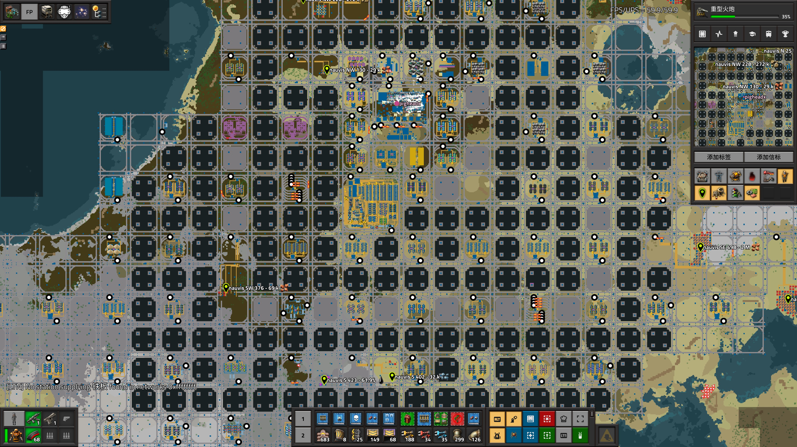

## Recipe-Oriented Factorio Life <author>Ph.X</author>

This paper proposes a universal factorio design philosophy. To better implement, Logistic Train Network, AAI Containers & Warehouses, and Miniloader mods are being used.

### What is ROFL

People with programming experience should have heard of ~~[Object-Oriented Programming](https://en.wikipedia.org/wiki/Object-oriented_programming)~~ [Modular Programming](https://en.wikipedia.org/wiki/Modular_programming), and it is the theory which Recipe-Oriented Factorio Life (ROFL) mimics.

Like most philosophies, ROFL tries to find one eternal object as the base of everything, in this case, it is the recipe in Factorio. Red circuits can be crafted by an assembly machine of any tier, which may be affected by different modules, and the required raw materials may come from a belt, a logistics chest, or even an adjacent copper wire assembly machine, but no matter how other conditions may change, the recipe itself keeps being copper wires, electronic circuits with plastic bars to the advanced circuit.

Based on a certain recipe, a dedicated subfactory is packaged into a module. Such a module contains everything necessary to process only one recipe of the desired factory. A universal logistics system is used between modules as the interface to obtain raw materials and supply products. The purpose of this division is to achieve high cohesion inside the modules and low coupling between the modules.

### Module design

Let's start with the simplest example, the iron gear wheel, a recipe with a single ingredient and a single product.

_To briefly explain to players who have not been exposed to LTN, the train station below is requesting 8000 iron plates from LTN to the warehouse, similar to a requester chest. And the station above is supplying items (i.e. gears) from the warehouse to other stations in the LTN, similar to a passive provider chest._

Since the inputs and outputs within this module are fulfilled by trains, our modification and upgrade of the production line within the module will not affect other modules.

_You can also reserve space for upgrades within the module._

Next, let‘s look at an advanced circuit module with three types of raw materials, but with the help of warehouses and filter loaders, we were able to unload all the raw materials in one station.

The feedstock of recipes that produce/consume fluids can also be transported in a fluid wagon, such as oil processing.

_Note that by controlling the pump via the LTN signal allows different fluids to be loaded and unloaded at the same station without mixing._

There are also some unconventional recipes, such as thermal power plant, research, and rocket silo.

### Rail network design

Although bus and logistic robots can be implemented as a universal logistics system to some extent, a city-block rail grid far exceeds other solutions in terms of throughput, reusability, and coolness. The chosen rail grid is two-way left-hand traffic in order to place the rail signals between the two rails. Junctions are straight and left turn only for space-saving. Most stations have a train stop limit of 2 to ensure that a maximum of one train waits outside the station. Sections occupied by a handful of trains waiting outside the stations can be detoured through the fully interconnected grid.

The smallest 2 car trains with 1 locomotive and 1 cargo/fluid wagon were chosen to reduce the size and eliminate the need to balance loading and unloading between wagons. Fuel replenishment for the locomotives set in the LTN's railyard stations, which is the standby stations where trains return after each delivery.

### Pros and cons of ROFL

ROFL is optimized towards engineers, making it easy for players to divide and conquer production problems. When you need to implement a certain recipe, simply set up input and output stations in the grid that match the types of raw materials and products, and then design production lines between the stations. When the capacity of a recipe is insufficient, you can directly copy and paste the corresponding factory module and integrate it into the whole factory production without [plumbing up the inputs and outputs](https://alt-f4.blog/ALTF4-22/#the-goal-of-factorio).

ROFL is not optimized towards production, it is not a perfect-ratio production line, so it's common that structures stop working because of insufficient raw materials or product overflow. Each item has to be loaded to and unloaded from a wagon, adding a lot of input and output bottlenecks, most typically in copper wire, where the number of products exceeds the number of raw materials and the number of stacks is high while the demand is huge. There is a very significant cache with the warehouses, which is not conducive to identify the items with insufficient production in time (definitely iron ore though). The rail network used for inter-module logistics in the factory is expensive to build and also poses a large number of traffic accident hazards (praise the spidertron).

[Ph.X]: <> (TODO: add more links)
[Ph.X]: <> (TODO: img edit)