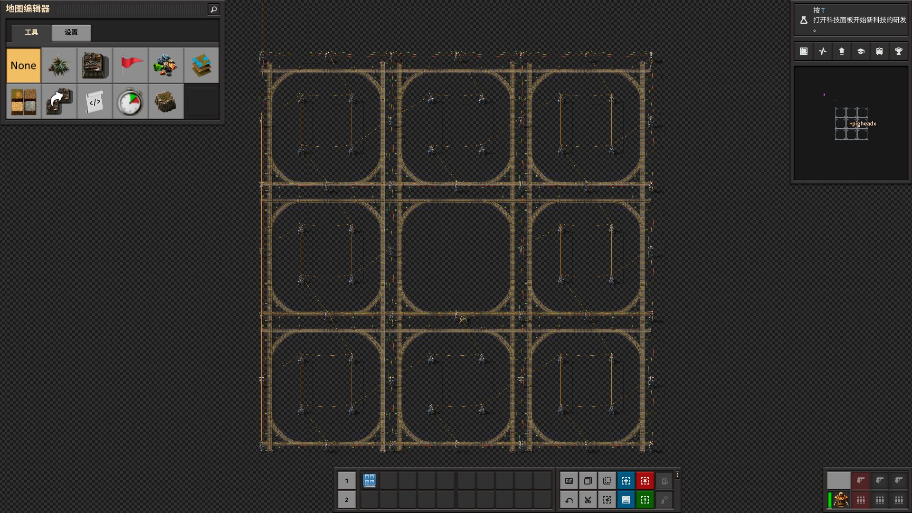
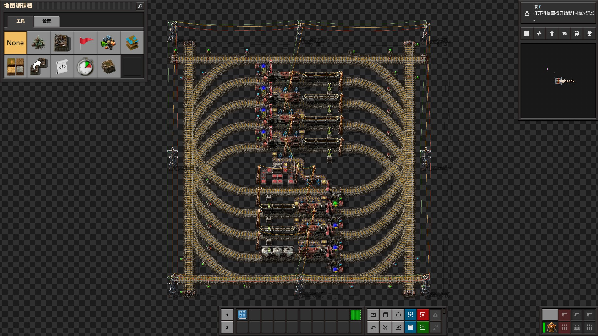
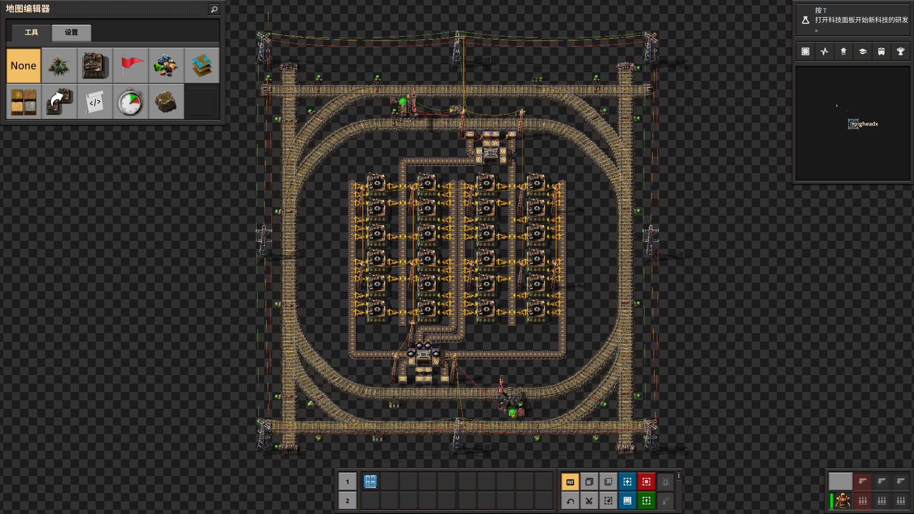
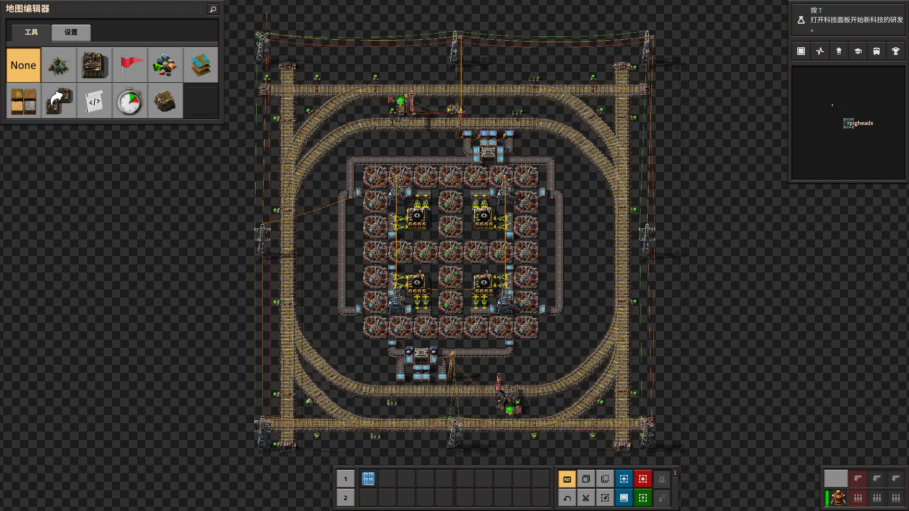
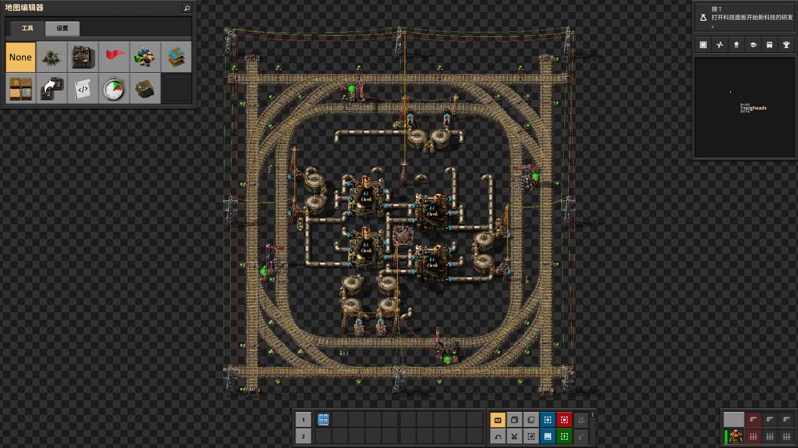
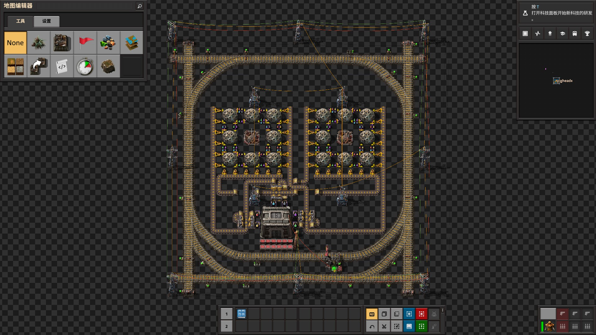
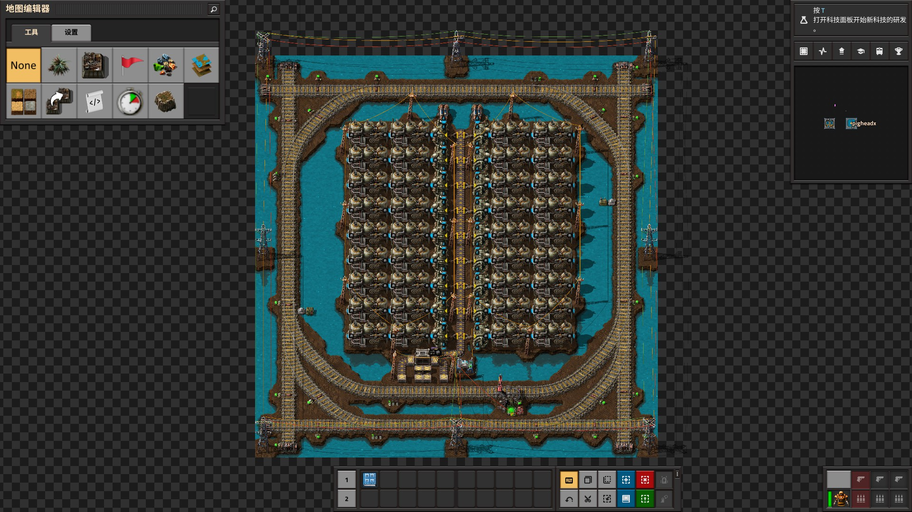
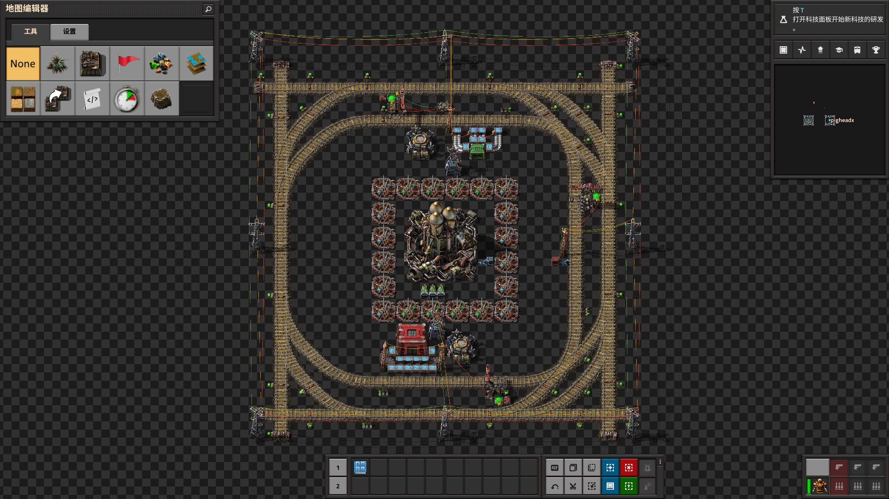

## Recipe-Oriented Factorio Life <author>Ph.X</author>

This paper proposes a universal factorio design philosophy. To better implement, [LTN - Logistic Train Network](https://mods.factorio.com/mods/Optera/LogisticTrainNetwork), [AAI Containers & Warehouses](https://mods.factorio.com/mod/aai-containers), and [Miniloader](https://mods.factorio.com/mod/miniloader) mods are being used.

### What is ROFL

People with programming experience should have heard of ~~[Object-Oriented Programming](https://en.wikipedia.org/wiki/Object-oriented_programming)~~ [Modular Programming](https://en.wikipedia.org/wiki/Modular_programming), and it is the theory which Recipe-Oriented Factorio Life (ROFL) mimics.

Like most philosophies, ROFL tries to find one eternal object as the base of everything, in this case, it is the recipe in Factorio. Red circuits can be crafted by an assembly machine of any tier, which may be affected by different modules, and the required raw materials may come from a belt, a logistics chest, or even an adjacent copper wire assembly machine, but no matter how other conditions may change, the recipe itself keeps being copper wires, electronic circuits with plastic bars to the advanced circuit.

Based on a certain recipe, a dedicated subfactory is packaged into a module. Such a module contains everything necessary to process only one recipe of the desired factory. A separate logistics system is used to obtain raw materials and supply products for the modules. The purpose of this division is to achieve high cohesion inside the modules and low coupling between the modules.

### Interface design

Before actually bulid any subfactory modules, we need to design a universal logistics network as the interface between the modules. Although a main bus or logistic robots can be implemented as such logistics system to some extent, a city-block rail grid far exceeds other solutions in terms of throughput, reusability, and coolness.

In vanilla trains can only run on a predetermined schedule, which is not flexible and "logistical". This is where LTN comes in handy. In LTN, trains are parked in the depot stations when they are idle, just like logistic robots are placed in the roboports. Logistic train stop can acts like a requester chest or a provider chest depending on the signal they received. When there is a logistic demand, LTN will find a suitable train at the depots and generate a schedule for it to fetch the specified items at provider station, then go to the requester station for unloading, then return to a depot station, similar to the behavior of a logistic robot. But unlike logistic robots, the trains do not load or unload themselves, so inserters or loaders at the stations are needed. The LTN is powerful than the logistic robot network because of the huge cargo capacity, high speed, and fluid support.

The chosen rail grid in my practice is a two-way left-hand traffic railroad in order to place the rail signals between the rails. Junctions are straight and left turn only for space-saving. Most stations have a train stop limit of 2 to ensure that a maximum of one train waits outside the station. Sections occupied by a handful of trains waiting outside the stations can be detoured through the fully interconnected grid.

_Only the center grid will build a module, the rest grids are used for traffic and solar paving_

The smallest 2 car trains with 1 locomotive and 1 cargo/fluid wagon were chosen to reduce the size and eliminate the need to balance loading and unloading between wagons. Fuel replenishment for the locomotives set in the LTN's depot stations where trains return to after each delivery.

_Fuel used for locomotives replenishment are also acquired via LTN._

### Module design

Let's start with the simplest example, the iron gear wheel, a recipe with a single ingredient and a single product. A logistic train stop at the bottom of the grid is requesting 8000 iron plates, and a logistic train stop at the top of the grid is providing items (i.e. gears) from the connected warehouse.

_Simply gear module. Raw material station is below, product station is above_

Since the inputs and outputs within this module are fulfilled by trains, our modification and upgrade of the production line within the module will not affect other modules.

_Gear module with beacons. No change of stations, only the production line between stations._

Next, let‘s look at an advanced circuit module with three types of raw materials. By setting the logistic train stop requesting multiple ingredients, we were able to unload all of our raw materials at a single station. At this point all the raw materials are mixed in one warehouse， we then use filter miniloaders (similar to filter inserters) to separate each material onto a separate belt to supply the assembly machine.

_Advanced circuit module. Use a single station to obtain raw materials._

The feedstock of recipes that produce/consume fluids can also be transported in a fluid wagon, such as oil processing.

_Oil refinery module. Note that by controlling the pump via the LTN signal allows different fluids to be loaded or unloaded at the same station without mixing._

There are also some unconventional recipes, such as research, thermal power plant, and rocket silo.

_Research center module, which doesn't need an output station_

_Thermal power plant with landfill to place on water._

_Rocket silo module. Independent logistics robot network can be used within the module. The bottom station is for materials needed to build rockets, and the station on right is for payloads of the rocket, usually satellites._

### Pros and cons of ROFL

ROFL is optimized towards engineers, making it easy for players to divide and conquer production problems. When you need to implement a certain recipe, simply set up input and output stations in the grid that match the types of raw materials and products, and then design production lines between the stations. When the capacity of a recipe is insufficient, you can directly copy and paste the corresponding factory module and integrate it into the whole factory production without [plumbing up the inputs and outputs](https://alt-f4.blog/ALTF4-22/#the-goal-of-factorio).

ROFL is not optimized towards production, it is not a perfect-ratio production line, so it's common that structures stop working because of insufficient raw materials or product overflow. Each item has to be loaded to and unloaded from a wagon, adding a lot of input and output bottlenecks, most typically in copper wire, where the number of products exceeds the number of raw materials and the number of stacks is high while the demand is huge. There is a very significant cache with the warehouses, which is not conducive to identify the items with insufficient production in time (definitely iron ore though). The rail network used for inter-module logistics in the factory is expensive to build and also poses a large number of traffic accident hazards (praise the spidertron).

### Conclusion

ROFL is more of a way of thinking that tries to simplify complex problems rather than a blueprint book. The demonstrates above is just one solution that uses ROFL as a guide. Using LTN to build a rail grid may be considered a cheat beyond the vanilla, but this idea can also be used for main bus gameplay and more. There will never be one "correct" way to play Factorio, the variety is what makes it awesome.

[Ph.X]: <> (TODO: add map view from save file)
_A space exploration mod game using the ROFL scheme above._

[Ph.X]: <> (TODO: img edit)