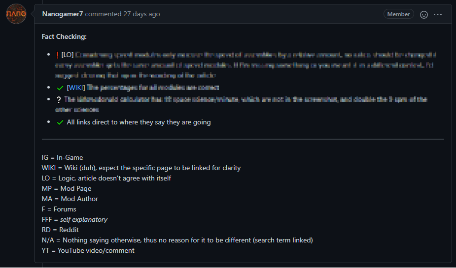

## Retrospective <author>The Alt-F4 Team</author>

This is an intro.

### Initial Setup <author>Therenas</author>

### First Few Weeks <author>Conor_</author>

When I first heard about Alt-F4 being started, I immediately loved the idea and knew I had to get involved. For context, at the time I had very little to do to, due to a/the pandemic and was desperate for a long term project to work on. I was searching high and low for anything that I could spend my time on when I found Alt-F4, I knew immediately it was the project for me. There was just the minor issue that I had no idea what I could contribute to the project. For me writing has always been a bit of a slog and I couldn’t think of any particularly good ideas for things to write about anyway so I threw my hat into the Techie ring. 

Unfortunately at the beginning, it was quite unorganized (as most projects are in the early days) so I wasn’t particularly sure what to work on. I knew very little about the website setup itself so in true Factorio spirit I decided my best option was to try and automate something. With the help of lovely_santa, I created a few github actions to automate some basic tasks such as posting new github submissions to the discord as well as the creme de la creme of github actions, the automated release. This is the only action that's survived from that first wave and has been built on since then, allowing the posting to reddit and discord entirely automagically. It also allows me the opportunity to say “Starting automation” during each release, which makes me chuckle every time. I even managed to escaped the age old issue with automation, (see [xkcd #1319](https://xkcd.com/1319/)) which is always a positive.

After a few weeks of running Alt-F4 largely single handedly, the almighty Therenas recognized his limitations and decided he needed someone to help manage the discord and github so he could focus on editing and content. Ever since that day, I have had absolutely no idea what my role in Alt-F4 is but I've had a lot of fun doing it. I went from “Techie” to “Moderator” to “Technical Editor” with the final goal of one day reaching my full potential as ~~”Lord high overload of Alt-F4”~~ “Therenas’s personal manservant”. Part of this stems from the community around Alt-F4 constantly wanting to improve and innovate, causing regular shifts in what Alt-F4 actually is. Translation was a great example of this where a single person translating a single release has led to a large translation effort headed up by Firerazer, making Alt-F4 more accessible to as many people as possible.

I really love working on this project and I knew that neither myself, nor Therenas could run it single handedly. I’ve seen amazing community projects like this one peter out after a few weeks by relying too heavily on key people who couldn’t sustain their involvement levels. This led me to push to bring on more and more people, especially in the editing process. We are first and foremost a written publication and that means that content is always and should always be our number 1 priority. My first effort to improve the quality of Alt-F4 releases was to formalise the “content editing” phase for submissions. During this, we try our darndest to bring the best out of the contributors with focused feedback about what we want more of in the submission. I believe this is one of the most important parts of Alt-F4 which sets up apart from a simple reddit post and I hope is the reason people keep coming back every week. 

After accidentally creating this role for myself, I looked for who could help with it, and luckily found stringweasel, Alt-F4’s most frequent contributor. Since coming aboard, he has worked amazingly well with the contributors to make the content as good as it can be. This is all to say, if you ever have an idea for a possible Alt-F4 submissions, no matter how big or small, join the discord and we'll be happy to discuss it and help refine your ideas. 

We also brought Nanogamer onboard to help with the accuracy after he repeatedly spotted issues during translations that all the editors missed. We chose to embody the “as many eyes as possible” philosophy with our editing process to make it as collaborative as possible.

### A New Submission's Journey <author>stringweasel</author>

Alt-F4 will not be possible without the creative Factorio community continiously submitting great articles that we we can publish. Each of these submissions go through quite a journey to reach your screen every Friday. What does that journey look like? And how hard is it to create a submission? Here I will give you a quick glimpse of what goes on behind the scenes, and what you might expect if you want to submit an article.

When you submit an article it will most likely arrive on my (stringweasel) doorstep first. This can be a simple textfile or a Pull Request on our [Alt-F4 Github Repo](https://github.com/AlternativeFFFF/Alt-F4), because that is where it will ultimately end up. I'll read through it and see how it can fit into our structure and content. I'll give you some feedback on how it reads and where you could possibly expand. Next Nanogamer7 - our thorough fact checker - will read through your submission. He will make sure there's no accidental factual mistakes, if all the links point where you expect them to point, etc. He's like your guardian angel, and has saved my submissions a few times already from stupid mistakes. And don't worry, we ignore spelling and grammar initially to focus on the content.

*An example of Nanogamer's thorough fact checking report on an article. (It's pixelated because few will see the review - unless they go search through the repository)*

However, since it will be published online, someone needs to have a look at your grammer and spelling at some point. Here Therenas, our editor in chief, is the local expert. He will improve your sentence structures and spelling, and make you sound almost as smart as he is. He has detangled many of my terrible tongue twisters into smooth phrases without changing what I said. And if that's not enough, our other expert Nic Garner will do a final review to make sure Therenas didn't miss anything. And after your piece is silky smooth Firerazor and his capable team will take over. They will translate your article into a variety of different languages. This team deserves a lot of praise for all the rushed  translations which they dedicatedly completed when there were last-minute changes. And remember, it will likely be the first time anything you wrote will be readable in more than 3 languages!

Finally Conor will do the fateful merge-to-master, after which it will dissapear into the Git void. This final step is a mysterious and chaotic place, full of CSS and HTML (and spidertrons), but it's a place that has been tamed Conor, Dr. MagPie and their tenacious techie team. Then at some point on Friday afternoon, like a butterfly emerges from it's cocoon, it will emerge again on our beautiful website to be enjoyed by thousands. And this is usually when Klonan does his duty as Wube Community Manager and find some mistake in your article, after which we will jump in with a ninja-edit before anyone else notices.

Now you are a published author - or at least in our eyes. And you get to have the `Contributor` tag on our [Discord server](https://discord.com/invite/ceKebbY) which comes with a nice orange colour. And we will hope that you might send us a submission again in the future!

### Translating Adventures  <author>Nanogamer7</author>

The beginnings were small. One man, one issue, one language. But with the next issue there were already a dozen people eager to help. Looking desperately for something to do, that wasn't already someone else' job, the suggestion of translations came. With a multinational community there were quickly a few interested translators for some major and minor languages, like german, which I will focus on today. A single person has quite obvious limitations, for example the workload can't be split up, and while reviewing your translation definitely helps with quality, having more eyes look at it provides a far greater value. But multiple people pose interesting challenges of their own. First though I'd like to give you an idea of how much translation we actually do.

[graph, x=*week*, y=*translated text (total characters)*; I'd like to get time of translation publish from GitHub PRs, not week of associated issue; Graph as lines, with either one line for english and one for total translated content, or one for english and one for every other language, or both]

*Description [better one will follow with actual data]: As we started later with the translation, than the blog itself, there was a sudden increase of total translations in most languages at some point. We can see this as a baseline on how much we could comfortably translate in a full week. We'll get back to that later*

[graph, x=issue, y=translators, For this one I think it would be interesting to see how many translators are listed if a translation is published with the release]

*Description: What might sound obvious is actually not true: a single translator **can** translate a full issue by himself, and multiple translators don't always guarantee a translation at release*

[Transition to next section, dunno am uncreative]

### German inefficiency

I want to go into more detail with translating into German, as I think it's a great example for some of the benefits of having multiple people, but also highlights some challenges, that come up with organising the process or translating itself, and, let's be real, I just don't know that much about the other languages.

We started as three, and after ironing out some initial technical hiccups, we were already going with the backlog of the first few issues. But then the first new issue came. For older issues it was fine for a single translator to work on it for however long it took him, but when the deadline is in 24 hours, we need to parallelise the work. Luckily it got apparent pretty soon that individual articles could be provided earlier than the whole issue, and with the added benefit of more available time we already got a split workload. But what do we do with our finished articles? Just sending them into our discord channel without any versioning proved pretty chaotic early on, and our own GitHub repo was on the table, but proved to big of a hassle for those without experience with git. So `_v1` version suffixes it was. with a (mostly) consistent naming scheme, and an [online difference checking tool](https://www.diffchecker.com/), we had everything we wanted from GitHub, but in our Discord channel.

"Great, they know sorted everything, and that's it, no more problems, right?", you might think. Wrong! You might be right with technical issues, those mostly were sorted out indeed. But language isn't just 'right' or 'false', there are way more nuances[?] to it. You might have encountered different spellings in the english language between American, and British (and some others), those often only have one letter changed though, and even if they are to completely different words, a Brit will still understand what a [insert something american here] is. In German, however, there are some many words an Austrian uses everyday, but someone from northern Germany might never have heard them.

Even though regional differences might seem like the biggest troublemaker, what kills us are actually the more subtle quirks, like the fact that we have a formal and a more informal version for 'you', and those sometimes completely change the structure of a sentence. In some settings, it's unambiguous on which form you should use, but especially for a blog, there are great arguments for both sides. (This is also the reason why I don't like dubbing, even big budget films get it wrong all the time, and it just feels soo unnatural when someone "Siezt" a close friend.)

One thing where it pays off to have different people working on the same thing though is synonyms. Or technically 'not-synonyms', because even though some words might have a similar meaning to most people, especially in tech some words sound a bit off, even though they translate to the same english word as the correct one. For scenarios like this it really pays off to have your translation proofread by up to 4 more people, all with other areas of expertise. However this is also were our biggest weekly challenge comes in:

### Heading

Translating takes time. We don't have that. Currently, articles come in at Thursday morning, we start translating at noon or in the afternoon, and have a first translation in the evening. But then someone wants to proofread it. And I can't remember the last time, we didn't have corrections after someone went through a translation. Corrections might not always be better though, even though they were well-meant[?] (we have a German word for that, "verschlimmbessern", *to worsen something by trying to improve it*); thus we now always have the original translator read through the corrections. But you guessed it, that takes time too. If we have a good day, and everyone is available, we are sometimes less than half an hour before release still busy ironing out some hiccups, correcting errors, and fiddling with non-synonyms.

Sometimes these problems, especially the more technical ones, result in in changes for all languages, sometimes even english [maybe reference if touched upon]. For example quotes are where they are now, because we couldn't figure out how to incorporate translations while still keeping the original quote. [I feel like there should be something more, but I don't know what]

### Heading

The beginnings were small. One man, one issue, one language. But with the next issue there were already a dozen people eager to help. Looking desperately for something to do, that wasn't already someone else' job, the suggestion of translations came. With a multinational community there were quickly a few interested translators for some major and minor languages, like german, which I will focus on today. A single person has quite obvious limitations, for example the workload can't be split up, and while reviewing your translation definitely helps with quality, having more eyes look at it provides a far greater value. But multiple people pose interesting challenges of their own. First though I'd like to give you an idea of how much translation we actually do.

[graph, x=*week*, y=*translated text (total characters)*; I'd like to get time of translation publish from GitHub PRs, not week of associated issue; Graph as lines, with either one line for english and one for total translated content, or one for english and one for every other language, or both]

*Description [better one will follow with actual data]: As we started later with the translation, than the blog itself, there was a sudden increase of total translations in most languages at some point. We can see this as a baseline on how much we could comfortably translate in a full week. We'll get back to that later*

[graph, x=issue, y=translators, For this one I think it would be interesting to see how many translators are listed if a translation is published with the release]

*Description: What might sound obvious is actually not true: a single translator **can** translate a full issue by himself, and multiple translators don't always guarantee a translation at release*

[Transition to next section, dunno am uncreative]

### German inefficiency

I want to go into more detail with translating into German, as I think it's a great example for some of the benefits of having multiple people, but also highlights some challenges, that come up with organising the process or translating itself, and, let's be real, I just don't know that much about the other languages.

We started as three, and after ironing out some initial technical hiccups, we were already going with the backlog of the first few issues. But then the first new issue came. For older issues it was fine for a single translator to work on it for however long it took him, but when the deadline is in 24 hours, we need to parallelise the work. Luckily it got apparent pretty soon that individual articles could be provided earlier than the whole issue, and with the added benefit of more available time we already got a split workload. But what do we do with our finished articles? Just sending them into our discord channel without any versioning proved pretty chaotic early on, and our own GitHub repo was on the table, but proved to big of a hassle for those without experience with git. So `_v1` version suffixes it was. with a (mostly) consistent naming scheme, and an [online difference checking tool](https://www.diffchecker.com/), we had everything we wanted from GitHub, but in our Discord channel.

"Great, they know sorted everything, and that's it, no more problems, right?", you might think. Wrong! You might be right with technical issues, those mostly were sorted out indeed. But language isn't just 'right' or 'false', there are way more nuances[?] to it. You might have encountered different spellings in the english language between American, and British (and some others), those often only have one letter changed though, and even if they are to completely different words, a Brit will still understand what a [insert something american here] is. In German, however, there are some many words an Austrian uses everyday, but someone from northern Germany might never have heard them.

Even though regional differences might seem like the biggest troublemaker, what kills us are actually the more subtle quirks, like the fact that we have a formal and a more informal version for 'you', and those sometimes completely change the structure of a sentence. In some settings, it's unambiguous on which form you should use, but especially for a blog, there are great arguments for both sides. (This is also the reason why I don't like dubbing, even big budget films get it wrong all the time, and it just feels soo unnatural when someone "Siezt" a close friend.)

One thing where it pays off to have different people working on the same thing though is synonyms. Or technically 'not-synonyms', because even though some words might have a similar meaning to most people, especially in tech some words sound a bit off, even though they translate to the same english word as the correct one. For scenarios like this it really pays off to have your translation proofread by up to 4 more people, all with other areas of expertise. However this is also were our biggest weekly challenge comes in:

### Heading

Translating takes time. We don't have that. Currently, articles come in at Thursday morning, we start translating at noon or in the afternoon, and have a first translation in the evening. But then someone wants to proofread it. And I can't remember the last time, we didn't have corrections after someone went through a translation. Corrections might not always be better though, even though they were well-meant[?] (we have a German word for that, "verschlimmbessern", *to worsen something by trying to improve it*); thus we now always have the original translator read through the corrections. But you guessed it, that takes time too. If we have a good day, and everyone is available, we are sometimes less than half an hour before release still busy ironing out some hiccups, correcting errors, and fiddling with non-synonyms.

Sometimes these problems, especially the more technical ones, result in in changes for all languages, sometimes even english [maybe reference if touched upon]. For example quotes are where they are now, because we couldn't figure out how to incorporate translations while still keeping the original quote. [I feel like there should be something more, but I don't know what]

### Heading

I want to briefly talk about translating continuous text versus individual strings; in *TheEnemy42* touched upon [translating the game](https://alt-f4.blog/ALTF4-9/#a-story-about-translating-factorio-theenemy42) itself, and while keeping translations as close to the original as possible, while staying within a reasonable length, is an art form of itself, translating alt-f4 in a way that conveys all content, while still being enjoyable to read, is on a completely different level. Both suffer from a similar problem though, which *stringweasel* mentioned [in the very same issue](https://alt-f4.blog/ALTF4-9/#nauvis-archives-factorio-jargon-stringweasel): jargon. A large part of a games jargon is composed of contractions and abbreviations of in-game terms and specific already technical jargon from the real world, which often doesn't translate to other language, or even make sense in them.

[still bad with transitions :/ ]

With how much I've complained about, you might wonder, "Why do we even translate? Is it for the readers?". And while I do translate with hopes of reaching more people, the reality is, we don't:

[graph, maybe a bar chart for readers]

The reality is, at least I translate, because I enjoy it. It's sort of like programming, but instead of confusing flowcharts or messy thoughts in your head, we have an English text, and instead of translating to programming languages, we translate into real ones, which can be frustrating, as coding can be too, but all in all, is a fun puzzle.

But you, dear reader, are one of those people we do reach, and if you want to help us out, it would be great of you could tell your local factorio community about alt-f4, be it translated or not ;)