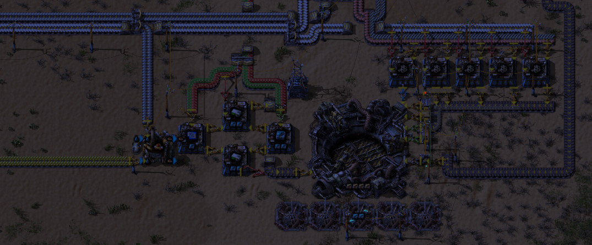
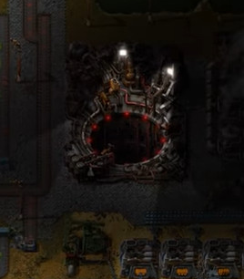
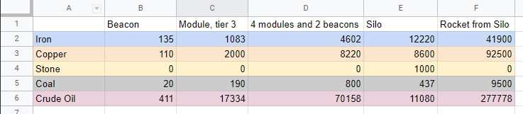

## The Rocket Silo: Mysteries in Full

Ah, the rocket silo. It is the largest in-game entity outside of the crashed spaceship. It is also one of the most expensive craftable entities. However, when its placed it has wierd effects on the electric grid, stranger still if modules are at play. We also mostly know that using productivity modules inside of it pays off. What about around the silo? All of that in this week's Alt-F4!

### Power Usage

To start, lets look at its power usage. It claims it uses at most 4MW (which is true), but it only uses 0.25MW when just manufacturing rocket parts, or a bit more than 3 assembling machine 1s (0.225MW). When does it require 4MW, or a bit more than 51 assembling machine 1s? When the silo doors are moving, or a rocket is being pushed up. Those things must be heavy! Up until 1.1.42, it used an additional 10 kW idly when its nighttime, but there were no surface lights to indicate this. Back in 0.16, however, there were lights on the silo, as shown below.

### Power Usage, Continued

Stranger still, when modules are applied they increase the energy usage of the silo by more than expected. 4 speed modules inside a silo should make the total energy usage of rocket part making to about 700kW, according to the mathematics behind it. If we were doing the math on the full 4MW, 4 speed module 3s crank up the power requirement by 280% of the original, or 15.2MW. When it consumes this much power, however, is limited. But that scaling factor of 280% should remain if you factor in its 250kW power requirement. But when observed, its closer to 960kW, or 2 beacons' worth of power. I guess manufacturing a rocket is more power-consuming than you think when sped up. Speaking of modules and beacons...

### Modules and the Silo

You can fit 12 beacons around 3x3 entities, and 16 around oil refineries. You can fit 20 around a silo. 2 beacons with 2 speed module 3s in each is the same thing throughput-wise as adding a second machine. So one silo can do the work of 13 silos, side-by-side.

When I mention costs, they are the relevant ores in vanilla without productivity modules in the crafting chain, and I am also using advanced oil processing. You can also see the relevant factoriolab calculation. Each beacon costs quite a bit for an early-game player but nothing if tier 3 modules are automated (https://factoriolab.github.io/list?p=beacon*1&v=1). That's because any tier 3 module is roughly 10x more. (https://factoriolab.github.io/list?p=speed-module-3*1&v=1). While the calculator mentions speed modules specifically, the other modules of the same tier are equivalent. So 4 tier 3 modules and 2 beacons uses a lot of raw materials. With certain optimizations, like the standard 8-beacon array and those shown here https://factorio.com/blog/post/fff-351, its possible to get more out of your module, but the cost still stands. Normally, this cost greatly outmatches the machine. However, there is 1 exception to this rule, and that's the silo. The silo costs a whopping 12,220 iron, 8,600 copper, 437 coal, 11,080 crude oil and 1,000 stone (https://factoriolab.github.io/list?p=rocket-silo*1&v=1). So, its cheaper than making another silo to place down. Less spaghetti involved, too!

### Productivity Bonus Interlude

If you're a long-time reader of Alt-F4, the 12th post of the blog is dedicated to productivity and its effects. But for first-time readers or for those needing a refresher, I'll offer an abridged version of what it is. What is productivity? It is basically a multiplier on your output for your given input. When I say crafting operation, I refer to the main bar within the assembling-machine or furnace UI filling up to completion. The way this works is by taking 100 inputs and multiplying that by the percentage bonus from the modules within the machine. So, for example, take 4 productivity module 3s inside some copper cable assembling machine 3. The total bonus from the modules is 40%, so 10 copper plates becomes 20*(1+0.4)=28 copper cables. We can calculate the required input for a given output by the reverse of the process. So if we wanted 140 copper cables made with the influence of 4 productivity module 3s, we first divide by the amount per craft (2) to obtain we need 70 crafting operations we need including those from productivity. Then we divide 70 by the productivity multiplier of 1.4, which will sort out the 20 free operations and leave us with 50 crafting operations.

### The Rocket-Making Process

The space rocket itself is the main reason why you place the silo down. Each rocket costs 49,100 iron, 92,500 copper, 9,500 coal, and 277,778 crude oil (https://factoriolab.github.io/list?p=rocket-part*100&v=1). This is added onto whatever you throw into the payload slot, but that can vary greatly depending on what you feed it. For most recipes, productivity modules pay off extremely slowly. For recipes involving a lot of raw materials, it pays off fast. Especially when used with the silo. Note that productivity doesn't apply to the rocket itself. In other words, you can't get 2 rockets simultaneously. It applies to each rocket part, giving you free parts which count to your total. 1 productivity module 3 in the silo itself drops the cost of each rocket to 10/11 or 90.91% of its original cost. This is not from the rocket itself, but rather of the 100 parts you need, since you only need 90.91 on average instead of 100 per rocket. Even a 9.09% drop of cost grants 4,463.6 iron, 8,409.1 copper, 863.6 coal, and 25,252.5 crude oil on average (https://factoriolab.github.io/list?z=eJwrcM7SMjQwUCtyLtDScqvzAkG1MmMAUBsG5Q__). That's a bit over 4 modules' worth of raw materials. What about all 4 modules being productivity module 3s? After the last step, you have that much material leftover! That yields a 28.57% drop of input needed. Same routine as before, take the input and multiply it by the drop of input factor gives us that we save just under 13 modules' worth of material saved (https://factoriolab.github.io/list?z=eJwrcA7UMjQxMLLQ0nJKUStyLtDScqsDQ7UyYwBzOAgo). In other words, 4 productivity module 3s literally pay for themselves three times over per rocket!

### Rocket Launch Results

As we all should know, launching a satellite gets us 1000 space science packs in vanilla. But that's not the only thing you can launch. As for the payloads that do interesting things when thrown in, there's the rocket part parts which must be inserted manually. There's also space science packs, which yield 1 fish per pack. Another fact: This is the only way to truly automate fish. Anything else just delete the items used and does not return with items. However, there is an achievement for launching some specific thing that does not return with items. Inserting a car, tank, or the thing at the bottom center of this page into it lets you literally ride the rocket. When you press launch, it will wait for you to enter the silo as you would a car then launch you up into space!