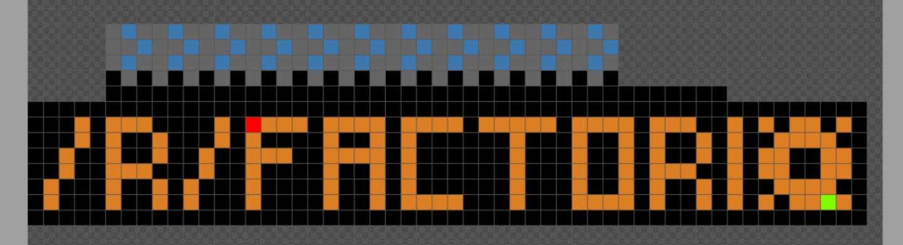

# r/place: A Factorio lapse of time

Over the past weekend most avid redditors had a momentary lapse of time as the world was caught up in r/place. Hundreds of thousands of people were avidly sitting behind their screen. Masses and masses were excitely waiting for their 5 minute timer to run out so that they could place their next little pixel. They weren't neccesarily excited about the pixel itself though. No, it was about being part of the bigger image. Contributing to the common goal of your community. It was about together achieving something great, and leaving something beautiful behind on the r/place canvas.

## What is r/place?

The annoucement was at ??.  Here is a [nice visualization](https://draemm.li/various/place-atlas/) about all the different artworks placed in the first event.

And here is what we created now!

## The Journey

It started with a [thread](https://discord.com/channels/139677590393716737/959132842787487814) in the Factorio Discord on 31 March in preperation for r/place to start. However, nothing happened initially, except showing what Factorio did at the previous event. It was only after a brief discussion in our own Alt-F4 Discord server that the first pixel was placed at `{271,555}` by stringweasel. This was then forwarded to the main Discord, and it all started! The reference image was simply the picture of what was used in 2017, but soon ivanjermakov stepped up became our dedicated blueprint designer by creating the first blueprint seen below:

The canvas was still empty when the initial spot was chosen, but of course, there were always threats for a community to draw over us. The first such threat was the only real other art in the vicinity, the Belgium flag coming up from the South. So peace treaties were sent by (??). It was in this time that the next blueprints were being created to include belts. However, there was a problem with getting the last `O` in Factorio to be a _gear_, because misguided troops were trying to create a normal `O`. This led to some very [strange looking](https://media.discordapp.net/attachments/959132842787487814/959481710414815232/unknown.png) hoops. It was only after some time that the gear was redesigned and successfully drawn. As soon as the basic idea for the gear was visible (and many DMs sent) the troops finished and defended the gear.

Then work began on the Northen belt. It started fairly sparked controversy: should the belt have alternating grey-black pixels (similar to 2017) at the bottom or a solid grey line? However, the bigger issue was again that misguided Factorians removed any attempt to bring in the line below the arrows. It was only much later that the belt finally became vertically symmetrical - well after the decision to do a solid-grey line because it's easier.

The time of the great belt-controversy was luckily also the time of new friends. Our Northern belt was on it's way to cover the green boat named Benchy, [r/3Dprinting/](r/3Dprinting/)'s infamous mascot. A user named SevenAndAHalf to ask for peace, because they already had to move once already. It was excitely decided that we will become friends with them, and have Benchy riding on our belt! However, again, it took some time to convince the isolated troops that the belt should go _behind_ the green boat. Regardless, good relations were established with r/3Dprinting, and many r/Factorio pixels were placed in aid of Chile destroying Benchy's roof. Benchy's bottom even became part of our official blueprint!

Soon Benchy was on the belt, and our belt was making it's way around the bottom of our logo. By this time there was three gears ("Factoriooo"?) and it was decided that two of these gears should be replaced by circuit. Yet again, the unamed reddit troops were veciously defendending the gears, making it impossible to draw ivanjermakov's beautiful circuits over it. Here is were our own Nano stepped in and created a Google Sheet, where everybody chose a pixel (or few) they could place at the signal. As one voice he and SpeckledFleebeedoo screamed charge, and we all placed our loaded pixels simultaniously. And suddenly a fresh green circuit materialized. Success! This method was used quite often from that point forward, for inserters, science packs, even nukes.

TODO had to replace two gears with circuits where Nano really helped! This method was used a lot...

## Double or Nothing!

At ?? the canvas unexpectedly doubled. In our community there were suddenly many voices with where to build our next design, and what that design must be.

Mr_George built an aliance with Romania, etc.

DNA attacked our right stronghold from below. The Romanian flag agreed to the DNA being drawn on it, but nobody expected the DNA to reach through our belts. [The Nut](). There were numerous times when Ecuador our ground, as we became the "[Those with the Nut](https://www.reddit.com/r/ecuador/comments/tw2iam/conquistemos_esa_parte_de_ah%C3%AD_hagan_una_nueva/".

As most of you know, this was not the last time the canvas got bigger. On Sunday, it doubled yet again! Meaning now there were 4 times as much space as there were on Friday. And this time the community was ready with plans. ..... This time around we did end up temporary having quite a salacious neighbour, but it was luckily later replaced by Apex Legends and Mindustry.

## Final Thoughts

The Factorio community performed valiantly during the r/place insident. There were many foes around that threatened our well-established area. Trolls, rainbows, hordes of amungus, and even a deady void. But the community stood strong, and importantly built strong alliances with our neighbours by incorporating them into our master blueprint. This allowed us to withstand the test of time, and thus have our monument carved into the halls of time, never to be forgotten. Or at least, until the next r/place or amungos inevitably take over.