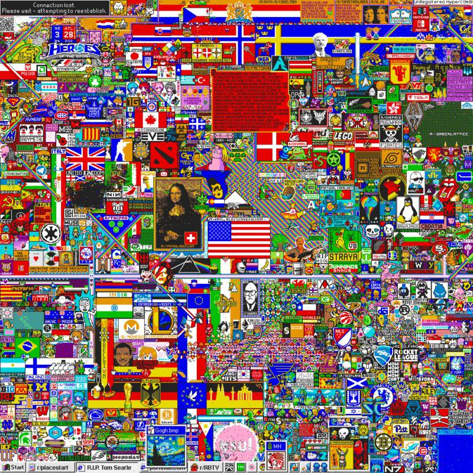
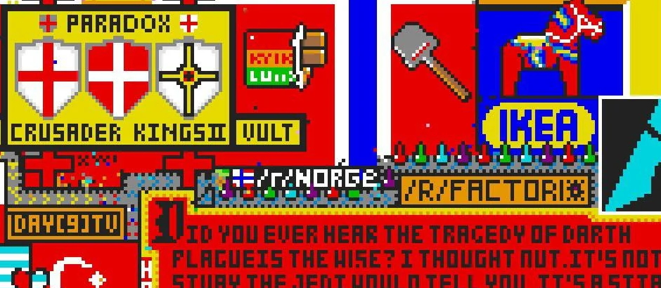
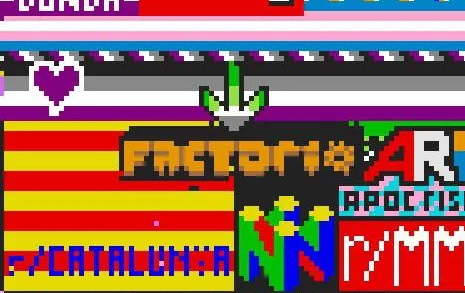
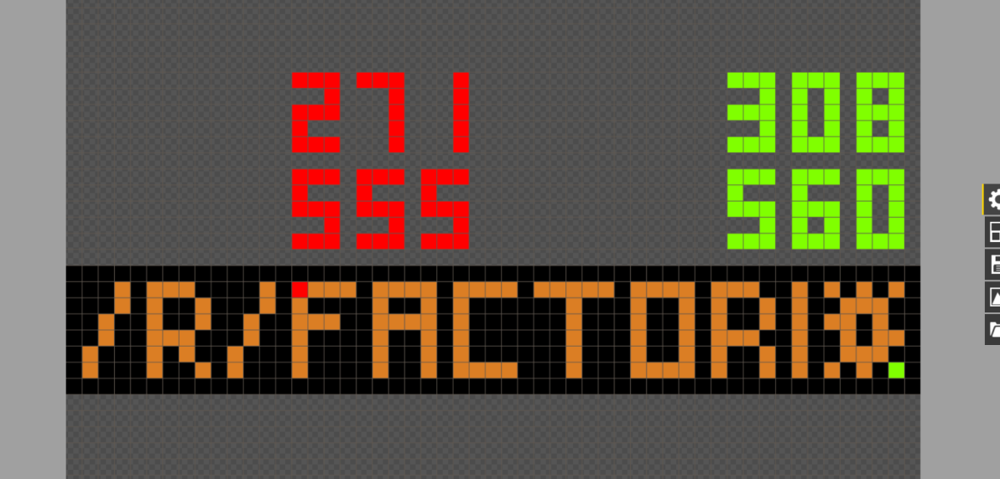
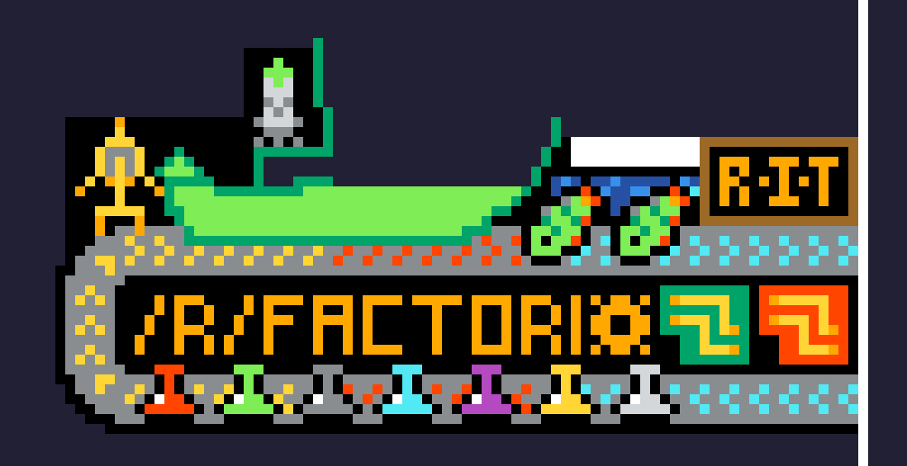
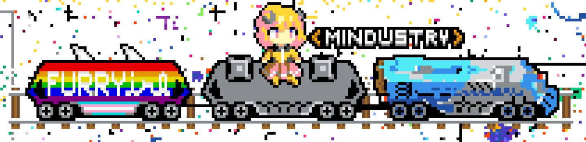
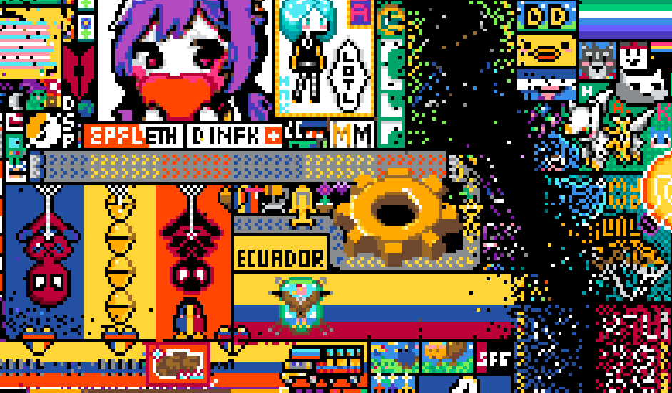
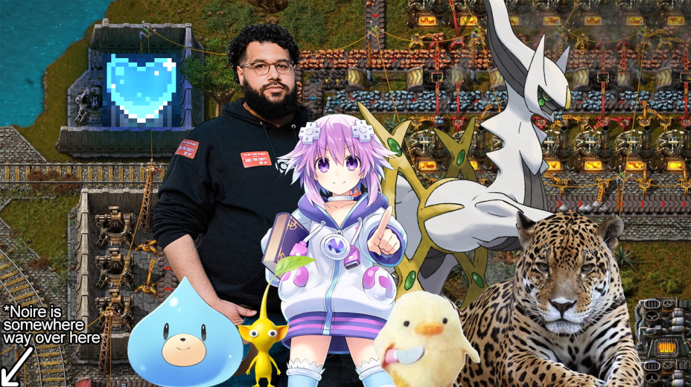

# r/place: A Monetary Lapse of Time <author>stringweasel, Mr_George</author>

Over the past weekend most avid redditors had a momentary lapse of time as the world was caught up in r/place. Hundreds of thousands of people were avidly sitting behind their screen. Masses and masses were excitely waiting for their 5 minute timer to run out so that they could place their next little pixel. They weren't neccesarily excited about the pixel itself though. No, it was about being part of the bigger image. Contributing to the common goal of your community. It was about together achieving something great, and leaving something beautiful behind on the r/place canvas.

## What is r/place?

r/place was first seen as a Reddit social experiment for [April Fools](https://www.reddit.com/r/announcements/comments/62mesr/place/) in 2017. It was created by the creator of [Wordle](https://www.nytimes.com/games/wordle/index.html), [Josh Wardle](https://www.powerlanguage.co.uk/). It's consisted of a single 1000x1000 global canvas which users can the individuak change pixel colours off, but only once every 5 to 20 minutes. It was a massive hit, with over 1 million users interacting with it and about 16 million tiles placed! Communities worked together to create beautiful artwork, and sending the most of Reddit into a frenzy. After three days the canvas was frozen, solidifying all the art created.

As most communities, the [r/Factorio](https://www.reddit.com/r/factorio/) community also fought for space on the canvas to show our passion. And our community was strong, even though the game would only be officially released three years later! In the end, one that single canvas, we managed to secure not one, but two locations! One of which was above one of the most famous areas of [The Tragedy of Darth Plagueis The Wise](https://starwars.fandom.com/wiki/The_Tragedy_of_Darth_Plagueis_the_Wise). Most Factorians massively enjoyed this event. Here is a [nice visualization](https://draemm.li/various/place-atlas/) about all the different artworks placed in the first event.

// Conor, this should be a two-piece gallery

On 28 March 2022, a reboot of r/place was [announced](https://www.reddit.com/r/reddit/comments/tqbf9w/bringing_back_rplace/) for April Fools. What follows is an epic period of excitement, dread, coorporation and defeat. This article is an attempt to capture most of what happened. It was quite a adventure!

## The Journey

It started with a [thread](https://discord.com/channels/139677590393716737/959132842787487814) by the moderator *SpeckledFleebeedoo* in the Factorio Discord on 31 March in preperation for r/place to start the next day. It was rather quiet, except showing what Factorio did at the previous event. The next, just like 2017, it started with a 1000x1000 canvas and 16 colours. It was time for Factorio to show what it's capable of again! After a brief discussion in our own Alt-F4 Discord server that the first pixel was placed at `{271,555}` by yours truley (*stringweasel* - hi!). The location was forwarded to the Official Discord, and then it all started! There was no official plan yet, so it was decided to write "r/FACTORIO", just like in 2017, except we (I) accidentally inverted the colours. It started to grow steadily as word was spread to start placing pixels, but our reference image was simply a screenshot of 2017. Luckily *ivanjermakov* stepped up became our first blueprint designer by creating the first blueprint.

The canvas was still empty when the initial spot was chosen, but of course, there were always threats for a community to draw over us. The first such threat was the only real other art in the vicinity, the Belgium flag coming up from the South. So peace treaties were sent by (??). It was in this time that the next blueprints were being created to include belts. However, there was a problem with getting the last `O` in Factorio to be a _gear_, because misguided troops were trying to create a normal `O`. This led to some very [strange looking](https://media.discordapp.net/attachments/959132842787487814/959481710414815232/unknown.png) hoops. It was only after some time that the gear was redesigned and successfully drawn. As soon as the basic idea for the gear was visible (and many DMs sent) the troops finished and defended the gear. Work began on the Northen belt. It started fairly sparked controversy: should the belt have alternating grey-black pixels (similar to 2017) at the bottom or a solid grey line? However, the bigger issue was again that misguided Factorians removed any attempt to bring in the line below the arrows. It was only much later that the belt finally became vertically symmetrical - well after the decision to do a solid-grey line because it's easier.

Juxtapose: The first official blueprint (left) used on the r/place in 2022, as made by *ivanjermakov*. On the right is one of the last iterations of this blueprint. At the end it had some [underneathies](https://alt-f4.blog/ALTF4-9/#underneathies) and another blue circuit.

The time of the great belt-controversy was luckily also the time of new friends. Our Northern belt was on it's way to cover the merry green little boat named Benchy - [r/3Dprinting/](r/3Dprinting/)'s infamous mascot. A user named SevenAndAHalf came to ask for peace, because they had to move their beloved Benchy once already. It was excitely decided that we will become friends with them, and have Benchy riding on our belt! However, again, it took some time to convince the isolated troops that the belt should go _behind_ the green boat. Regardless, good relations were established with r/3Dprinting, and many r/Factorio pixels were placed in aid of Chile destroying Benchy's roof. Benchy's bottom even became part of our official blueprint, and SevenAndAHalf became a honourable ally!

Soon Benchy was on the belt, and our belt was making it's way around the bottom of our logo. By this time there was three gears ("Factoriooo"?) and it was decided that two of these gears should be replaced by circuit. Yet again, the unamed reddit troops were veciously defendending the gears, making it impossible to draw *ivanjermakov*'s beautiful circuits over it. Here is were our own *Nano* stepped in and created a Google Sheet, where everybody chose a pixel (or few) they could place at the signal. As one voice he and SpeckledFleebeedoo screamed charge, and we all placed our loaded pixels simultaniously. And suddenly a fresh green circuit materialized. Success! This method was used quite often from that point forward, for inserters, science packs, even fish! However, everything wasn't sunshine and roses.

)](media/xqc-threat.png) 

At around 38 hours some streamer name xQcOW released a powerful Purple Void. Big streamers caused a lot of trouble and controversy over the course of r/place, because with tens of thousands (sometimes hundreds of thousands!) of viewers they could direct it was too easy for them to completely obliterate smaller communities. And this wasn't the last time we would be under threat of an streamer. Luckily this time the void didn't reach us being defended by our strong neighbours like r/onepiece. It was making friends, strong alliances, with our neighbours that kept our artworks lasting so long. We were also lucky that the streamers were often distracted by the strong communities, like Osu, Star Wars and France, to name a few. Otherwise this location was fairly safe, except for the continual attacks on the US Flag North of us, with Chile ultimately defeating them. There were many concers that over-zealous attackers would barge through our neighbours Besiege and RIT and attack our belts, but this luckily never realized.

## Double or Nothing

At around 27 hours the canvas size unexpectedly doubled, the number of colours doubled, and so did the tension. Many communities were scrambling for space while trying to determine what to draw after the initial inrush of trolls and flags. Even in our community tensions were high because there were suddenly many excited voices with design ideas and attack plans on what to do in this new space. After some floudering we ended up securing `{1600,550}`, because as *Stuckey* suggested, this would allow the possibility of connecting an underground belt to our previous location which is at the same y-level! Thus, a plan was put kicked into action. We will secure the area with belts initially, as laid out by *pg*'s blueprints, while we wait for *ivanjermakov* pixelated intepretation of the Factorio gear. This gear blueprint was later improved by *apatton* which used only 5 colours, which looked nicer and was easier to defend.

As you might know, the area was secured successfully. Allies were made, battles were faught, and pixels were lost, as told later. However, first doubling of the size wasn't the last of the tricks up Reddit's sleeve. No, after around 54 hours the canvas doubled in size yet again, now being 2000x2000 pixels! And there was so much open space, which for a long time was wild with flags and amongus. Luckily, this move was anticipated by the Factorio community, and we had a plan! As *Mr_George* mentioned, in order to build big, we need to build together. A type of artwork shared between different communities. The *Nano* made a great suggestion to build a train. We build our famous locomotive, and then other communities can drive on the wagons! Quickly the [talented](https://mods.factorio.com/mod/bumble-bots) Discord moderator, *Maxreader*, drew up beautiful pixel-art showing this idea. We also reached out to potential partners for this project, including communities like Mindustry, Unturned, Sea of thieves, Germany, Risk of Rain, India and Furry_irl.

 

This time, as the canvas doubled again, we were much quicker in securing location around `{500, 1200}` (location again recommended by *Stuckey*). The problem was that, so were everybody else! Were quickly ran out of room and were tucked in tightly - next to quite salacious neighbour. There was also a potential collision with the Risk of Rain community who was constructing a figure over the nose of our locomotive. They were contacted and in a successful piece deal it was agreed that they would move their figure over pixels lower, and then get a dedicated wagon. That allowed us to finish the locomotive and first wagon, occupied by our friends Mindustry. We tried to build more wagons for more allies. We even contacted the Portal Comunity to build a portal for for the train to drive through, which would allow us to build more wagons. They were too busy though, because the were already doing three big projects at the time. This forced the Furry_irl, Unturned and Risk of Rain communities to unfortunately give up on the wagon project.

Finally, as you might notice in the timelapse above, the train lost it's nose at some point. This was much closer to a stampede than a battle after another unfortunate event. On the right there were a beautiful big Mexican flag, which wasn't threatening our train. This flag was likely kept from expanding further left by our tantalizing Southern neighhbour. However, this Southern neighbour was being vandalized, which at some point triggered a vigilante community to completely remove it. The problem is that this provided space for the Mexican streamer to expand left to it's full size. And in the blink of the eye the locomotive's nose was cut off. There was attempts by us, and even the Mexican Discord who were one of our allies, to keep the train, but it was unsuccessful.

## The War of the Nut

Here is told the story of the War of the Nut. Not a lonely battle, but war, because it was endless battles around the the Factorio Gear on the second canvas expansion. Our gear, or as our enemies mistakenly knew it as: [The Nut](https://www.reddit.com/r/ecuador/comments/tw2iam/conquistemos_esa_parte_de_ah%C3%AD_hagan_una_nueva/).

As mentioned earlier the area was originally secured using belts. This was a good strategy because space was very quickly being clamed by other communities. The improved gear logo was also well liked by the community, and construction started soon after the space was secure. However, construction was only about half-way before the first attack - The Void. It already heavily damaged our neighbour - *#100Devs*. Luckily, we sent spies into The Void's Discord, who discreetly relayed the information to us, so we knew their plan. This is where good allys and deep friendships were created, because as a combined effort between Pikmin, Danidev, #100Devs and even Norway, we were able to fight of The Void! They seem to have accepted defeat, and rather redirected their attacks in a Northern direction. With the help of our new friends, we defended our belts, and soon our Gear was completed.

People around us seemed to really enjoy the gear, because soon our neighbour Romania's ambassador *Ironic_Onion* contacted us. They proposed that we should expand our belts over their flag, but only if we matched their colors with their flag. And so another aliance started with Romania! Construction on our new belts were well underway when a new foe approached. Ecuador. A country with almost 18.6 million people, and they were approaching fast, while our troops started their defending calls. The problem was that the people weren't online - meaning they weren't on a single united Discord server. And on the [r/Ecuador](r/Ecuador) subreddit removed all posts related to r/place. The chances of peace talks looked dismal. So dismal in fact, that our official Ambassador *Mr_George* started a long search to get in touch with the Ecuadorians, even joining six of their Discords. However, negotiations with Ecuador were too difficult to establish. The Discords were occationally agreeing to peace and maybe ally with us, but it did not stop the Ecuadorian Hivemind. Many hours later, it seemed that all peace talks were forgotten, because they attacked again! This time their attack was more powerful. They destroyed DaniDev started removing our belts. Again our ambassodor *Mr_George* jumped between their servers frantically to make achieve piece. There was even a half-cog-half-heart shrine created to show good faith, but to no prevail. We admitted defeat, and after they built their letters into our territory they stopped luckily. 

In the brief moment of peace we decided to focus on polishing our design. We were even able to conneced our first and second artwork with a underground belt! Success! But alas, it was short lived. We were being attacked by Romania! However, the aliance wasn't broken, their troops were simply misdirected. They were constructing the famous Romanian [Infinity Tower](https://en.wikipedia.org/wiki/Sculptural_Ensemble_of_Constantin_Br%C3%A2ncu%C8%99i_at_T%C3%A2rgu_Jiu), but the workers were zealous and building it higher and higher - just like the Babalonians. Again, our ambassador was out and talking to the Romanians to tell them that their tower is breaking our piece treaty. They were unable to stop their hivemind of workers, but they did jump in to help us defend our belts. This approached worked, and soon our belts were safe again. It also helped that we could focus on the Romanian Tower without worrying about a flank by Ecuador, because they were sleeping.

It was at this point that the canvas doubled yet again! This allowed the new train expansion project to start, but greatly reduced the number of defenders at the Gear. Our troops for distracted, and Ecuador took their chance, yet again. This time however, they were led by a Spanish streamer who directed their attack to the innocent Pikmin below us, our trusted ally. Together with our other neighbours, we fought of this attack successfully, helped them rebuilt, and even gained some more canvas. As always though, this victory was short lived, because an even deadlier was awaiting for us while our focus shifted back to the locomotive.

This popular streamer has a gigantic following and was wielding an incredible, corrupting and almost unstoppable force. The used this to deploy a deadly black void, and this time it was very, *very*, close to home. It passed within a few pixels of us, obliterating #100Devs and Nep Nep art in the process. We were relieved that they didn't hit us, but the mood was still somber. We were helping our allies rebuild, knowing how close it was to being us that was left in complete ruins. Luckily the rebuilding went strong, and we even had a few hours of piece.

As you know though, there is no real peace in the War of the Nut. The Ecuadorians attacked *again*, this time expanding towards our gear and cutting of the bottom half of our belts. In their mind our already-faltering alliance was forgotten. They seemed to stop after capturing part of our belts, but this was only the dawn before the dark night. Our troops were tired, and angry that an a Polish streamer arrived, and started attacking our neighbour Romanian Flag, which was defended by a Romanian Streamer. This was a large battle, so large that we started losing belts in the cross fire. Everybody knew the canvas was ending in a few hours, so time was short to leave your mark in history. However, it was the start invasion of our neighbour was only the start of our demise. Why? Not only did we forget our alliance with the Romanians, but the Ecuadorians saw it as an oppertunity to attack the Romanian flag too. This forced the Polish flag to retaliate ten fold - it was all-out warfare. We sent emergency transmissions to our allies: "Hold The Nut!", but due to this unfortunate sequence of events the Polish death machine completely obliterated our entire presense on the Eastern Canvas. With mere minutes left on r/place there was nothing left of us, Nep Nep, Pikmin. With sadness in our hearts with the destruction of our most precious symbol we relished the fact that we still had our Western artwork, who withstood the test of time. As for the gear - it will always be remembered in our hearts.

## Thought Mural of Friends and Allies

// Conor, these are all quotes :P

> One of the most interesting things was fighting against our own hivemind for the belts! Several time I tried to change the colors of the belts to dark blue but the hivemind was in protection-mode and kept reverting it back to cyan! - Telokis

> I missed r/place event in 2017, but really wanted to participate. So I did this year. Factorio is by far my favorite game so without hesitation I checked its Discord for community plans on r/place. Across 4 days I worked on multiple designs, coordinated the work and even coded the basic tool to overlay coordinates over images. It was an incredible experience. - ivanjermakov

> Through r/place, I noticed a massive difference between us and you [Factorio] while collabing - that we used construction bots and you haven't. Funniest thing I've ever seen." - router, Mindustry Moderator and Building Coordinator

> Those with a keen eye may have noticed something not Factorio related in between the rest of the builds - a little purple flower. This addition was a personal request from me to the Factorio community. My wife is currently pregnant with our first child and when she arrives in a few months we want to name her Violet. Thank you to everyone who helped keep the violet safe on
the canvas - agenteightysix

> It's surprising how easy it was to completely construct our designs from scratch, yet how hard it was to maintain them. Pretty on-brand for factorio I'd say - yauz

> I still think we should have covered the canvas in as many belts as possible - SevenAndAHalf, r/3Dprinting

> Risk of Rain wants to give a MASSIVE thank you to the r/place Factorio community for helping us out tremendously as our allies! We really couldn't have done it without you! - Jaco, Risk of Rain Official r/place Server Owner

## The Finality of the Anti-Void

In the last moments of r/place the Anti-Void came. This was Reddit changing the canvas' colour pallette so that only white pixels could be placed. Wlowly we started erasing the the art we spent 3 days building, defending and fighting for. We were undoing every single pixel that we spent hours agonising over, waiting for the timer to reach zero. In a beautiful twist of fate, we cleansed all the battles, stress, and obsession than held us for 83 hours, and left only the memories. It allowed us to release the stress of *who ended up with the perfect art*. Rather it shifted the focus on the journey we - over 6 million people - went on together. Maybe it even shows us that it's not what we leave behind that's important, but rather the relationships we build on our journey. 

Or maybe Reddit simply wanted to do something different than last time, because we can anyway see the final artwork everywhere anyway. .... The Factorio community performed valiantly during the r/place insident. There were many foes around that threatened our well-established area. Trolls, rainbows, hordes of amungus, and even a deady void. But the community stood strong, and importantly built strong alliances with our neighbours by incorporating them into our master blueprint. This allowed us to withstand the test of time, and thus have our monument carved into the halls of time, never to be forgotten. Or at least, until the next r/place or amungos inevitably take over.

## Appendix - Our Allies

Here follows a list of all our allies and their respective ambassadors. We thank all of these people for working with us, building with us, and battling with us. It was an honour!

| Community         | Ambassador(s) |
|------------------ |------------|
| Belgium | redbart, BelgianPixel, AquaBoy |
| 3D Printing | SevenAndAHalf |
| Rotchester Institute of Technology | |
| CSH | HG |
| PlaceEu | Fabi, Jonah, Treehearth |
| One Piece | Cameroon |
| Colombia | Lockrick, Mr_George, Leridon |
| Mindustry | Valoneu, yaryuya, Meep of faith, BasedUser |
| Besiege | milk, Titoino |
| Dwarf fortress | brine909 |
| Montenegro | spiritthefox |
| United Art Factions | envy2000 |
| Peru | Adrian HV |
| Trackmania | Filegzeug, FalameHorus |
| #100devs | 54m4n, Crafty |
| Karlson | cZar Void |
| Pikmin | jfryk, jame, DreamsFox, Mistophant |
| Neptune | BistreeYaSpatHochy |
| Norway | |
| Romania | Mr_George, Ironic_Onion, Toma |
| LOTR | Njorsky |
| Popheads | SevenAndAHalf, mxdanger, Ghostly |
| Red Devils | robbie |
| Chara | Ghostly |
| ACS | EpicExplosivesGuy, OffAndSphere |
| Dyson Sphere Program | Ludus Machinae, Appw |
| DuckFace | Brandino |
| Shapez.io | Burák |
| Satisfactory | AnnO, KronaSamu |
| Furry_irl | dowotdashdotdot |
| Risk of rain | Mr_George, mxdanger, cbhv4321 |
| Unturned | mathyou, P9nda |
| r/196 | SevenAndAHalf |
| Void Spy | hornhonker1, mxdanger, iHouqLF |
| Ecuador | Mr_George |
| RIT | Mr_George, CoderMason |
| DaniDev | CoderMason |    
| Hytaleinfo | BlitzStrike_ | 
