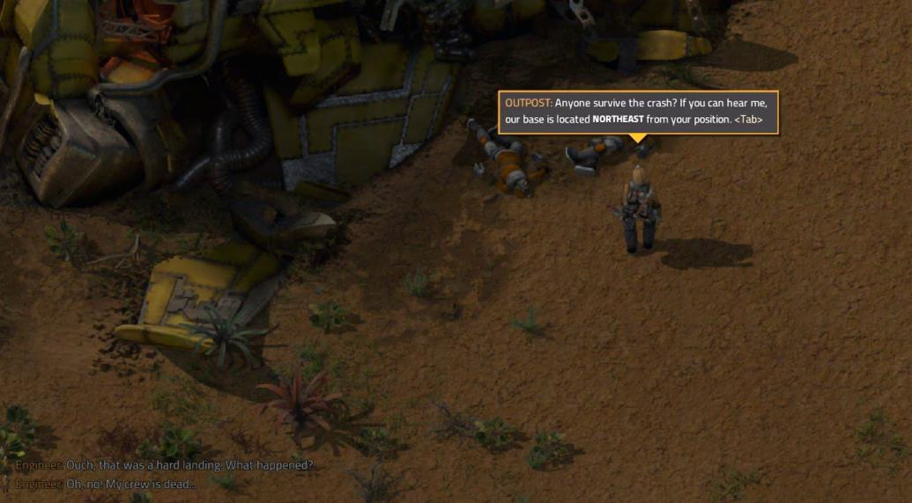
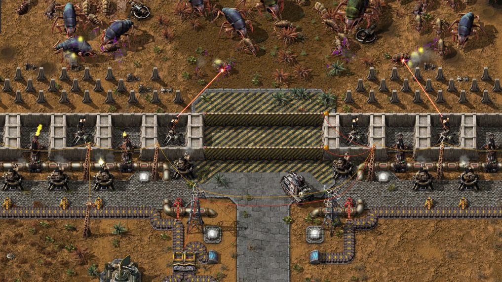
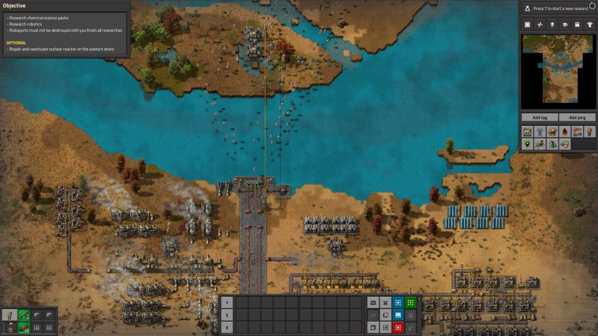
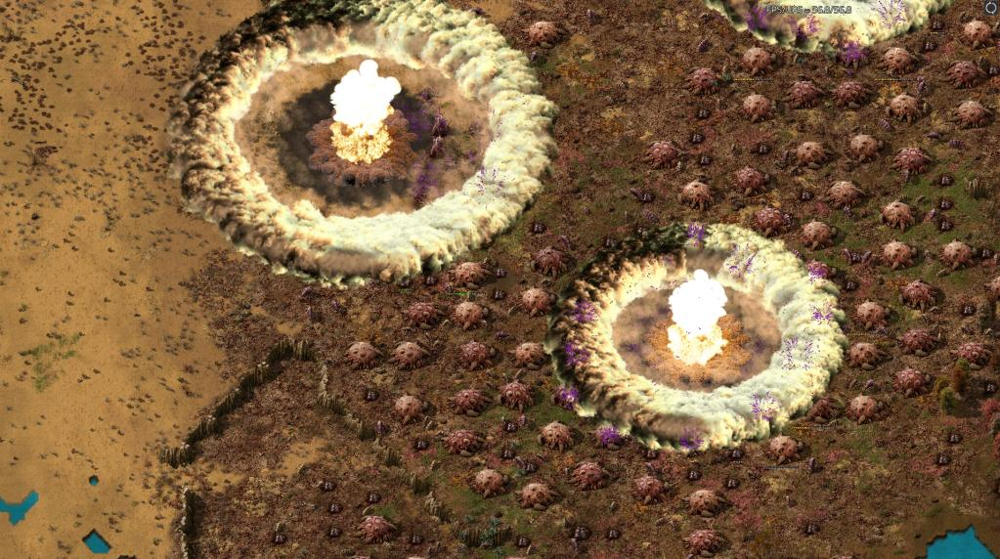
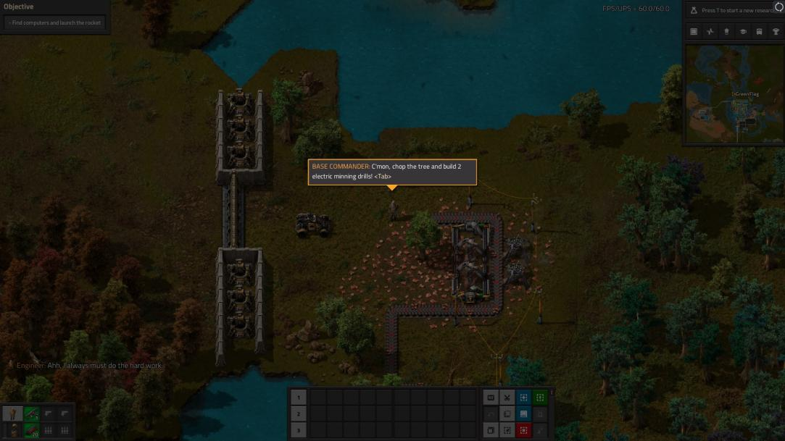

### [Story Missions](https://mods.factorio.com/mod/Story-Missions): The Story <author>GreenFlag</author>

Well about the Story Missions.
It's actually hard to tell you, where to start, because the idea of additional scenario objective campaign was born in my head some time ago (more than a year ago). When I first finished the entire tutorial of the base game and then played the freeplay, after 200 hours I started to feel the slightly repetitive gameplay and was starting to miss the challenge. At the same time, I didn't want to keep starting a new game and building and developing everything from scratch. So I came up with the idea of making my own maps along the theme of the tutorial, only it wouldn't be a tutorial anymore, but a regular missions.

When I first tried the Factorio editor, I was surprised that it was actually quite limited. Since I had a lot of experience with editors like Starcraft, I was sad that all the scripts are not predefined in some interface directly in the game, but everything is pure programming. The basis of all this was control.lua. After discovering this problem, and in fact taking the time to re-learn how to program after 10 years, I shut the game down for good and haven't turned it back on for a few months. :D

{ gallery

}

Yeah, never say never. :D Suddenly from one day to the next I got insanely bored and I turned Faktorio back on in the spring of 2021. I actually originally wanted to delete the game, but instead I turned it on and looked at old saved positions. I also found the old save files from the New Hope Scenario mod (the original fan campaign from the beta testing period, which the game's authors then used as a template for the tutorial, if I'm not mistaken). I looked at the map structure again and started digging through the scenario files. I found it strange that after the patch (I think 1.1) the mod no longer appeared in the main menu section. Since my professional job is to fix everything, I wanted to find out why it wasn't working, and when I found out why and actually looked at the control.lua structure of the scenario, I thought "why not try that too". And that's where it all started.

I went through all the tutorial map files and the New Hope campaign, and through that I learned how to make my own missions. Then all it took was a bit of inspiration (Starship Troopers, Star Wars, Star Trek, Star Gate, Avatar), a bit of experience playing games like StarCraft 1-2, Warcraft 3, Age of Empires 2, Command & Conquer (Generals, Tiberium Wars, Red Alert 2, Dune 2000) and then some heavy self-criticism and voilá (that's French). :D Within 3-4 months, a campaign of 5 missions and an improvised fictional story was created, trying to be as neutral and lore-friendly to the original game as possible. Technically, the whole campaign takes place about 2 years after the engineer first crash-landed on the planet Nauvis. Somehow he survived and sent up a satellite rocket and was rescued a few months later. Subsequently, Earth decided to "colonize" the planet, taking even more resources than the engineer himself had before (RDA from Avatar :D :D ). Add to that the space thugs "i.e. pirates" :D (I always love it when you say "Space Pirate", I always think of Captain Harloc from that anime series/movie) :D, it starts to get pretty cool. I won't tell you the plot of the mod here of course, play it yourself and judge. Admittedly I'm not like J.K. Rowling (Harry Potter) and it's really hand written and also what mood I was in that time. It's safe to say that I'm not entirely happy with the story, as it's not the best I've ever put out, but it does fulfill its purpose.

Well, I guess we're at the end of the "how the Story Missions mod came to be" story. I could go on and on about the creation of each mission, but you'll find that as an Easter egg at the end of the fifth mission (when you hit continue after completing the game). As far as I can tell, the story so far is not finished and I am currently working on 5 more missions to continue. I have to say that if you play mission 9, you will all be very pleasantly surprised (if not cheering with joy), because I am already super excited about it as well. I'll give you a little teaser here. I'll just say to that, it's completely handmade.

{ gallery 

}

I say goodbye and thank you all for your support.

P.S. It’s a pradox that the Factorio is a Czech game and I’m citizen of Czech Republic. Whould be nice to some day meet the autors of the game :D

{ youtube embed of trailer: https://www.youtube.com/watch?v=KEAjcctlJ-8}
